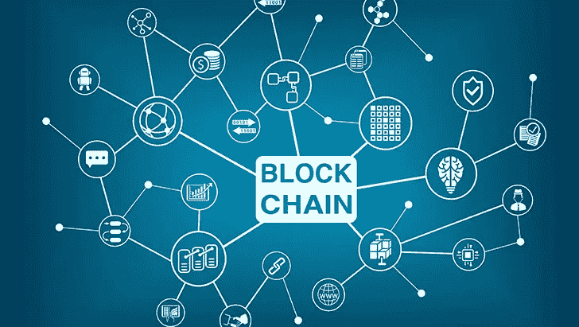
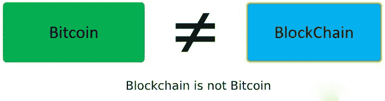
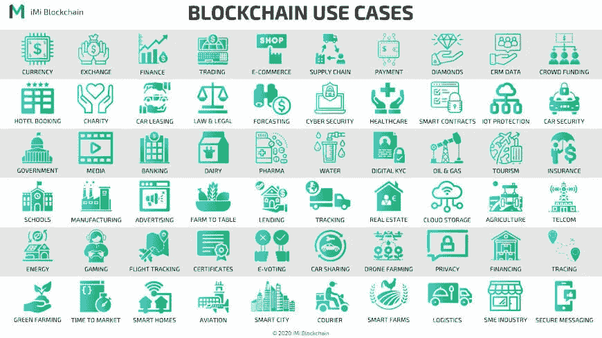

# 揭开区块链的神秘面纱

> 原文：<https://medium.com/coinmonks/demystify-blockchain-23cbad0f2662?source=collection_archive---------28----------------------->

虽然区块链技术越来越受欢迎，其采用率也在增加，但同时，还存在一些神话和误解。这里有一些神话，人们需要不再相信。

# 神话 1:区块链是复杂的技术

*By Ken Mammarella*

区块链技术已经存在好几年了，而且发展很快。然而，大多数人仍然认为区块链是复杂的或技术复杂的。

区块链并不是一项复杂的技术，它只是一个复制多次的数据库或分类账，并具有一些额外的机制来确保共识的不变性。

区块链有两个关键特征:

1.去中心化——区块链是一种去中心化的技术，它在一个点对点的网络中维护账本，其中每台连接的计算机都保留一份账本的更新副本。区块链中的每个节点都有一个完整的分类账，并从一开始就记录资产或余额。该分类帐分布在大量对等节点上，这些对等节点允许每个设备独立地验证每笔交易并声明它是否是真实的。

2.分布式网络—可以在多个位置存储和处理数据的系统称为分布式系统。分类账在整个网络中均匀分布。这使得区块链成为一个强大的系统，很难改变和入侵。

# 神话 2:区块链和比特币是一样的

区块链技术和虚拟货币比特币经常被混淆。区块链本质上是一个分散在网络或节点上的众多计算机上的事务数据库。第一种广泛使用或公认的基于区块链技术的加密货币是比特币。它是分散的数字货币，不需要中间人来购买、出售或交换。

# 神话 3:区块链只与金融或加密货币相关

Multiple use cases Blockchain supports

只有一些加密货币采用区块链技术，但它在各种行业中有许多应用。它经常用于供应链管理，包括但不限于贸易融资、奢侈品和农业。区块链通常在元宇宙使用，包括时尚、分散土地 NFT 和玩赢游戏等用例。

企业已经采用区块链为他们的数据建立更严格的安全措施，因为它的分散性和对篡改的持久性。

# 神话 4:你需要一个高级学位或课程来学习区块链

在互联网上，有大量关于区块链的[(免费)资料](https://101blockchains.com/author/101blockchains/)、文章和书籍。与其他技术不同，区块链需要耗时的研究。但这并不意味着你需要一个研究生学位才能了解区块链；任何人都可以这样做。由于区块链的受欢迎程度，一些教育机构已经设立了学位或课程，但是，它们不是必需的。

# 神话 5:区块链将取代传统数据库。

区块链将与普通数据库共存，它现在不会取代它们。例如，我们在元宇宙有一个 5GB 的游戏，人们可以在区块链上放聪明的合同，但是不能在它上面保持一个 5GB 的娱乐，考虑到现在这是不可能的。聪明的契约是想要不变性的首要方面。类似地，在不同的情况下，例如，分散的土地、金融或时尚、巧妙的合同、交易、档案被放在区块链上，这使得它们不可改变且不可破解。但是，所有不同的统计数据都将保存在数据库中，即 AWS。

> 交易新手？试试[密码交易机器人](/coinmonks/crypto-trading-bot-c2ffce8acb2a)或者[复制交易](/coinmonks/top-10-crypto-copy-trading-platforms-for-beginners-d0c37c7d698c)