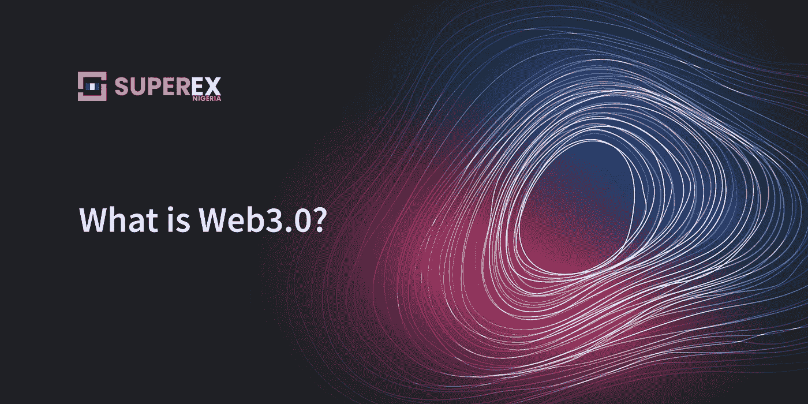
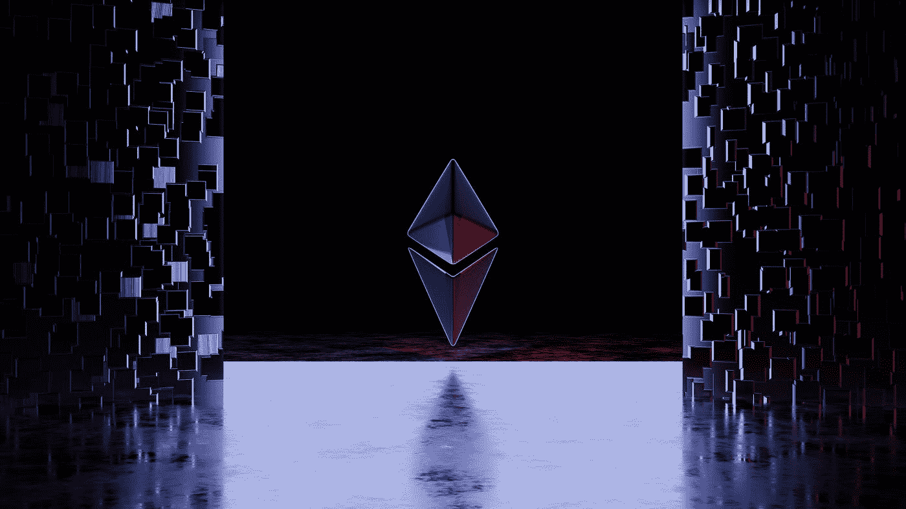

# 揭开 Web 3.0 的神秘面纱

> 原文：<https://medium.com/coinmonks/demystifying-web-3-0-88579c6e22f?source=collection_archive---------25----------------------->

网站第三版的介绍性指南

Follow us on our global page. [SuperEx](https://superex.medium.com/) 丨 Follow us on [Twitter](https://twitter.com/SuperEx_NG?s=20&t=DjE-di_9Hpmzh9B9aRWYQw) 丨 Join our [Telegram](https://t.me/superexngracademy) Academy channel | Follow [Enigma](https://medium.com/u/f6ba587d4662?source=post_page-----968ae7ab6c31--------------------------------)

**web 3.0 简介**

Web 3.0 是互联网发展的下一个阶段，也被称为“语义网”。通过更快的信息访问和使用，它寻求改善我们参与互联网的方式。

语义技术的使用使计算机能够理解和解释数据的含义，这是 Web 3.0 的主要组成部分之一。元数据(关于数据的信息)用于此过程。例如，标题、作者、日期和用于描述文档内容的任何关键字都可以包含在某个主题的文档的元数据中。

> 交易新手？在[最佳加密交易](/coinmonks/crypto-exchange-dd2f9d6f3769)上尝试[加密交易机器人](/coinmonks/crypto-trading-bot-c2ffce8acb2a)或[复制交易](/coinmonks/top-10-crypto-copy-trading-platforms-for-beginners-d0c37c7d698c)

通过使用语义技术，计算机可以利用这些元数据来更好地组织和呈现信息，语义技术可以破译元数据的含义。

这意味着搜索引擎可能会给出更多关于被搜索内容的上下文和知识，而不仅仅是给出一个搜索结果列表。

机器学习和人工智能(AI)的应用是 Web 3.0 的另一个重要组成部分。随着这些技术的使用，计算机现在能够理解和分析大量的数据，并根据分析结果做出预测或提出建议。例如，为了理解搜索查询的上下文并传递更相关的结果，搜索引擎可以应用机器学习。

Web 3.0 还寻求增加互联网的个性化和交互性。这可能需要利用增强现实(AR)和虚拟现实(VR)技术，让消费者有更身临其境的在线体验。

# Web 3.0 是如何工作的？

超文本标记语言(HTML)控制着网页如何使用 Web 1.0 和 Web 2.0 技术进行布局和交付。Web 3.0 的核心层仍然是 HTML，但它与数据源的关系以及这些数据源的位置可能会与过去的几代 Web 有所不同。

在 Web 2.0 时代，几乎所有的应用程序和许多网站都依赖某种集中式数据库来提供数据和促进运营。Web 3.0 应用程序和服务使用分散式区块链来代替集中式数据库。区块链背后的基本概念是一种分布式共识的存在，而不是一个武断的中央权威。

分散自治组织的概念是区块链和 Web 3.0 社区(DAO)中正在发展的一种治理形式。DAO 是由 Web 3.0 技术和社区提供的一种自我治理，旨在分散平台管理。

Web 3.0 使用密码货币的方式与使用法定货币的方式有着本质的不同。在整个网络 3.0 中，密码货币的使用——所有这些都是在区块链技术的基础上建立和实现的——使得融资和分散支付方式的使用成为可能。

IPv4 寻址空间被广泛用于创建 Web 1.0 和 Web 2.0。由于多年来网络的巨大扩张，Web 3.0 中需要额外的互联网地址，这就是 IPv6 提供的。

让我们仔细看看 web1.0 和 web2.0 意味着什么。

Photo by [NASA](https://unsplash.com/@nasa?utm_source=medium&utm_medium=referral) on [Unsplash](https://unsplash.com?utm_source=medium&utm_medium=referral)

# Web 1.0

Web 1.0，也被称为静态 Web，是 20 世纪 90 年代第一个也是最可靠的互联网，尽管它只允许访问有限的内容，并且几乎不需要用户的参与。那时，创建用户页面或者只是在文章上留下评论并不普遍。

由于在 Web 1.0 中没有组织网站的算法，用户发现很难找到相关信息。

当时，大多数互联网用户都对电子邮件和实时新闻检索等新功能着迷。由于内容开发仍处于早期阶段，用户对交互式应用程序的访问有限；然而，随着在线交易和银行业务的日益普及，这种情况已经改变。

# Web 2.0

Web 2.0 描述了人们使用互联网方式的根本性变化。Web 1.0 沉闷的网站已经完全被 Web 2.0 的交互性、社交联系和用户生成的内容所取代。由于用户生成的内容现在可以在瞬间被全世界数百万人观看，这类内容近年来已经爆炸式增长。

多亏了像 Javascript、HTML5、CSS3 等在线技术的发展。，社交网络，也被称为 Web 2.0，使互联网更具互动性，并允许公司创建互动网络平台，如 YouTube、脸书、维基百科等。

社交网络和移动互联网接入等重大创新，以及运行安卓操作系统和苹果手机的智能手机等强大移动设备的普遍可用性，推动了网络 2.0 的指数级增长。在这个千年的第二个十年里，这些发展使得像 Airbnb、脸书、Instagram、抖音、推特、优步、WhatsApp 和 YouTube 这样的项目占据了主导地位，极大地提高了在线参与度和实用性。

# Web3 和 Blockchain

Web 3.0 将允许 Web 应用程序连接到区块链网络。这让用户有机会通过网络浏览器访问和管理他们的密码货币持有量。Web 3.0 应用程序也将能够访问智能合同，这是用于自动执行程序的代码模块。

随着 Web 3.0 的发展，很明显，区块链和加密货币注定会成为世界经济的主要参与者。想想这种技术带来的可能性就令人兴奋，我们只能等着看未来创造出什么惊人的东西。

由于 Web 3.0 是一个允许用户以更无缝的方式与互联网交互的系统，因此它可以更多地用于区块链和加密货币。

区块链是一个数字账本，允许个人和公司之间的安全交易。加密货币是用于在线购买商品和服务的数字代币，也是一种货币形式。Web 3.0 就是利用这些技术来创造更加无缝的网络体验。例如，用户可以使用区块链技术来追踪食品的来源和安全性。他们还可以使用加密货币在线支付商品和服务。

与由控制用户数据和信息的中央机构管理的 web 1.0 和 web 2.0 不同，web3.0 要求在处理用户数据时的不信任和透明，这意味着用户的所有信息仅由用户控制，这使得 web 3.0 在区块链更有用。

Photo by [Shubham's Web3](https://unsplash.com/@shubzweb3?utm_source=medium&utm_medium=referral) on [Unsplash](https://unsplash.com?utm_source=medium&utm_medium=referral)

# Web 3.0 的特性

Web 3.0 最常见的特征是它的去中心化、不信任、不许可、机器学习、人工智能(AI)和连接性。

Web 3.0 的总体目标是让互联网变得更加智能、定制和互动。它标志着我们使用互联网方式的重大转变。尽管它仍处于起步阶段，但它有能力完全改变我们访问和使用在线信息的方式。

# 最后

Web 1.0、Web 2.0 和 Web 3.0 的不同之处在于每个版本的用户交互和定制程度。Web 1.0 主要由静态页面组成，但 Web 2.0 增加了动态、互动的元素，如博客和社交媒体。在语义技术和人工智能等前沿技术的帮助下，Web 3.0 在使互联网更加智能和个性化方面走得更远。

Web3.0 仍处于早期阶段，但它已经对互联网产生了重大影响。它正在改变人们对网络的看法，它有可能彻底改变我们数字化购物、工作和生活的方式，而不需要中央权威机构。

相关链接。

SuperEx 白皮书:[https://bit.ly/3WkFImh](https://bit.ly/3WkFImh)

官方网站:【https://www.superex.com/ 

【business@superex.com SuperEx 邮箱:

**官方推特:**[**【https://twitter.com/SuperExet】**](https://twitter.com/SuperExet)

**SuperEx 公告:** [**公告— SuperEx**](https://support.superex.com/hc/en-001/categories/4410470420249-Announcements-)

**超级官员(电报):**[**https://t.me/SuperExOfficial**](https://t.me/SuperExOfficial)

**官方 insta gram:**[【https://www.instagram.com/superexdex/】T21](https://www.instagram.com/superexdex/)

**SuperEx 尼日利亚(电报):**[**https://t.me/SuperexNGDAO**](https://t.me/SuperexNGDAO)

**SuperEx 新闻(官方电报频道):**[**https://t.me/SuperExcom**](https://t.me/SuperExcom)

> 加入 Coinmonks [电报频道](https://t.me/coincodecap)和 [Youtube 频道](https://www.youtube.com/c/coinmonks/videos)了解加密交易和投资

# 另外，阅读

*   [AscendEx 保证金交易](https://coincodecap.com/ascendex-margin-trading) | [Bitfinex 赌注](https://coincodecap.com/bitfinex-staking) | [bitFlyer 评论](https://coincodecap.com/bitflyer-review)
*   [Bitget 评论](https://coincodecap.com/bitget-review)|[Gemini vs block fi](https://coincodecap.com/gemini-vs-blockfi)cmd |[OKEx 期货交易](https://coincodecap.com/okex-futures-trading)
*   [AscendEx Staking](https://coincodecap.com/ascendex-staking)|[Bot Ocean Review](https://coincodecap.com/bot-ocean-review)|[最佳比特币钱包](https://coincodecap.com/bitcoin-wallets-india)
*   [霍比评论](https://coincodecap.com/huobi-review) | [OKEx 保证金交易](https://coincodecap.com/okex-margin-trading) | [期货交易](https://coincodecap.com/futures-trading)
*   [网格交易机器人](https://coincodecap.com/grid-trading) | [Cryptohopper 审查](/coinmonks/cryptohopper-review-a388ff5bae88) | [Bexplus 审查](https://coincodecap.com/bexplus-review)