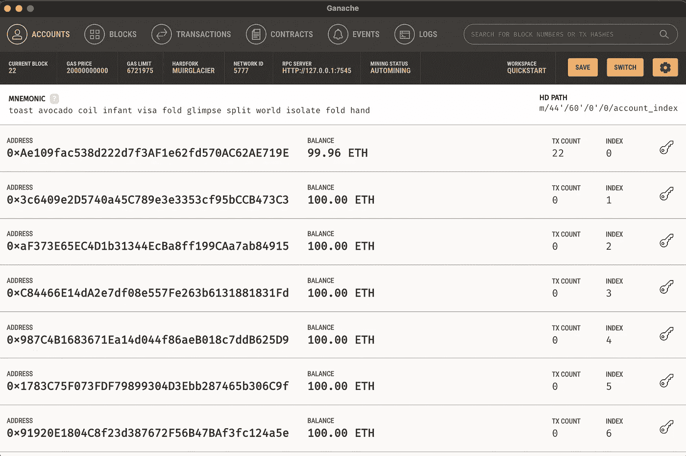
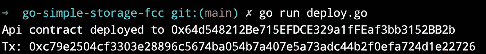
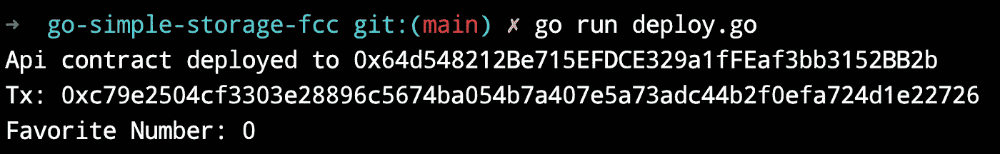

# 使用 GoLang-Go-Simple-Storage-FCC 部署可靠性合同

> 原文：<https://medium.com/coinmonks/deploy-solidity-contract-using-golang-go-simple-storage-fcc-b247b29ffa18?source=collection_archive---------2----------------------->

我最近开始学习区块链是从一个令人惊叹的[教程](https://www.youtube.com/watch?v=gyMwXuJrbJQ)By[freeCodeCamp](https://medium.com/u/8b318225c16a?source=post_page-----b247b29ffa18--------------------------------)&[Patrick Collins](https://medium.com/u/589c510eb216?source=post_page-----b247b29ffa18--------------------------------)。我觉得这是免费提供的关于区块链可靠性的最好的最新教程。它从区块链基础开始，然后解释了 solidity 契约和使用 NodeJS 后端进行部署。

作为一名 golang 开发者，我想用 Golang 而不是 nodeJs 来使用相同的 solidity 契约。猜猜以太坊 golang 客户端有什么强大的支持你可以在这里找到[https://geth.ethereum.org/](https://geth.ethereum.org/)

我将使用[第 5 章 EtherJs 简单存储](https://github.com/smartcontractkit/full-blockchain-solidity-course-js#lesson-5-ethersjs-simple-storage)中的契约。将重用相同的合同&部署在 golang 后端。

# 装置

*   戈朗[https://go.dev/dl/](https://go.dev/dl/)
*   solidity[https://docs . solidity lang . org/en/v 0 . 8 . 2/installing-solidity . html](https://docs.soliditylang.org/en/v0.8.2/installing-solidity.html)
*   Go 以太坊客户端也称为 geth[https://geth . ether eum . org/docs/install-and-build/installing-geth](https://geth.ethereum.org/docs/install-and-build/installing-geth)
*   加纳切要跑 https://trufflesuite.com/ganache/当地的区块链

# **编码**

创建一个项目目录，并将其初始化为 go 模块

```
mkdir go-simple-storage-fcc
cd go-simple-storage-fcc
```

使用 go mod 命令初始化项目

```
go mod github.com/kunalrsagar/go-simple-storage-fcc
```

在你喜欢的 IDE 中打开目录，创建一个新的文件名`SimpleStorage.sol`

这与 Patrick 解释的 Solidity 契约相同，它维护一个人员列表和他们最喜欢的号码，还具有存储和检索单个 favorite Number 的功能。

这里的主要区别是，我们将使用 golang、Solidity & Ethereum，而不是 Node & npm 生态系统。这段代码是在 golang 1.19，solidity 0.8.15 版本上测试的。

# **编译**

一旦安装成功，我们将使用 solc 命令编译 Solidity 文件并生成 bin 和 abi

```
solc --optimize --abi --bin ./SimpleStorage.sol -o build
```

`--optimize`标志是可选的，但有助于编译成高能效的二进制文件。成功完成后，应该会在构建目录中生成 abi 和 bin 文件。

使用 geth client 的主要区别是提供了一个使用 abigen 命令管理合同的接口。

```
mkdir api
```

创建一个目录名 api

```
abigen --abi=./build/SimpleStorage.abi --bin=./build/SimpleStorage.bin --pkg=api --out=./api/SimpleStorage.go
```

上面的命令接收 bin 和 abi 文件，并生成一个 Go 文件`SimpleStorage.go`,其中定义了一个接口来创建、访问和管理契约的功能。这是一个自动生成的文件，不应编辑。

在依赖项下添加

```
go get github.com/ethereum/go-ethereum
```

如果您在相关/间接依赖关系中遇到一些错误，请运行以下命令

```
go get all
```

# **加纳切**

让我们确保 Ganache 正在运行，并从中复制任何钱包的 RPC Url 和私钥。帕特里克对此做了详细解释。



Ganache Desktop app on macOS

# **环境变量**

在使用终端时，将钱包的 RPC_URL & PRIVATE_KEY 设置为环境变量。

```
export RPC_URL=<local_ganache_url:port>export PRIVATE_KEY=<Wallet Private key>
```

点击 Ganache 应用程序中任何钱包地址上的密钥图标，即可找回钱包私钥

# 部署.开始

这里是我们创建一个基于 Go 的后端，我们将创建一个`deploy.go`。该文件将 main 函数作为入口点。

ethclient 使用 RPC_URL 连接到区块链网络。我们将通过从环境变量中传递实际的 PRIVATE_KEY 值来创建 ECDSA 私钥。

将使用`Public()`函数从私钥中提取公钥，我们需要它以 ECSDA 格式用于 geth。

以同样的方式，提取钱包的地址和 chainID。

接下来，我们将需要手动创建一个**事务 Opts，它将拥有一组授权数据(由块的作者签名)来创建一个有效的以太坊事务**。

然后，我们将在 chainID 之后调用主函数中的`GenNextTransaction()`函数，并部署我们的契约。

让我们试着运行`deploy.go`



如果你看到上面👏🏻作品！🥳

接下来，我们将调用 SimpleStorage 契约的检索和存储函数。您可以使用`simpleStorageApi`对象访问所有合同功能以及一些其他功能。

让我们再运行一次，现在你应该看到 0 是你最喜欢的数字。这是围棋中的一种`*big.Int`。



最后，让我们通过调用 SimpleStorage contract 的 Store 函数来设置一个新的 favorite number，因为它**不是一个 Gas-free 函数**，我们将调用`GetNextTransaction`函数来获得一个授权的事务 Ops。

然后我们调用 simpleStorageApi。用`big.NewInt(20)`存储功能

您应该会看到类似这样的输出。恭喜您，您刚刚使用 golang 部署了智能合同


下面是`deploy.go`的完整源代码

Github 回购👇🏻

[](https://github.com/kunalrsagar/go-simple-storage-fcc) [## GitHub-kunalsagar/go-Simple-Storage-FCC:基于 GoLang 的简单存储合同，开发于…

### 此时您不能执行该操作。您已使用另一个标签页或窗口登录。您已在另一个选项卡中注销，或者…

github.com](https://github.com/kunalrsagar/go-simple-storage-fcc) 

参考

*   围棋以太坊书—[https://goethereumbook.org/en/](https://goethereumbook.org/en/)
*   学习区块链、可靠性和使用 JavaScript 的全栈 Web3 开发— 32 小时课程—[https://www.youtube.com/watch?v=gyMwXuJrbJQ](https://www.youtube.com/watch?v=gyMwXuJrbJQ)
*   [https://towardsdev . com/creating-a-simple-ether eum-smart-contract-in-golang-138 b 9439 f 64 e](https://towardsdev.com/creating-a-simple-ethereum-smart-contract-in-golang-138b9439f64e)

> 加入 Coinmonks [电报频道](https://t.me/coincodecap)和 [Youtube 频道](https://www.youtube.com/c/coinmonks/videos)了解加密交易和投资

# 另外，阅读

*   [火币加密交易信号](https://coincodecap.com/huobi-crypto-trading-signals) | [Swapzone 审查](/coinmonks/swapzone-review-crypto-exchange-data-aggregator-e0ad78e55ed7)
*   [最佳加密交易机器人](/coinmonks/crypto-trading-bot-c2ffce8acb2a) | [购买索拉纳](https://coincodecap.com/buy-solana) | [矩阵导出评论](https://coincodecap.com/matrixport-review)
*   [Coldcard 评论](https://coincodecap.com/coldcard-review) | [BOXtradEX 评论](https://coincodecap.com/boxtradex-review)|[uni swap 指南](https://coincodecap.com/uniswap)
*   [比特币基地评论](/coinmonks/coinbase-review-6ef4e0f56064) | [德里比特评论](/coinmonks/deribit-review-options-fees-apis-and-testnet-2ca16c4bbdb2) | [FTX 评论](/coinmonks/ftx-crypto-exchange-review-53664ac1198f)
*   [Coinmetro 评论](https://coincodecap.com/coinmetro-review) | [VirgoCX 评论](https://coincodecap.com/virgocx-review)