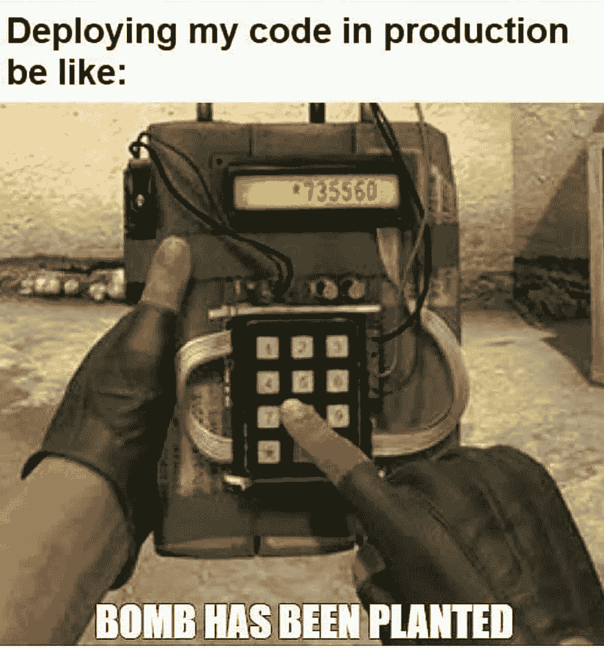
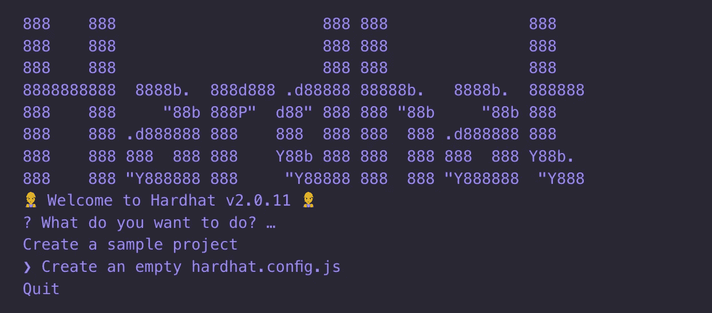
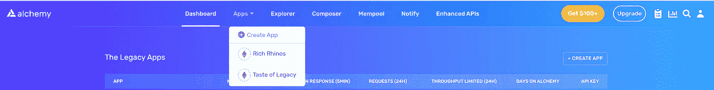
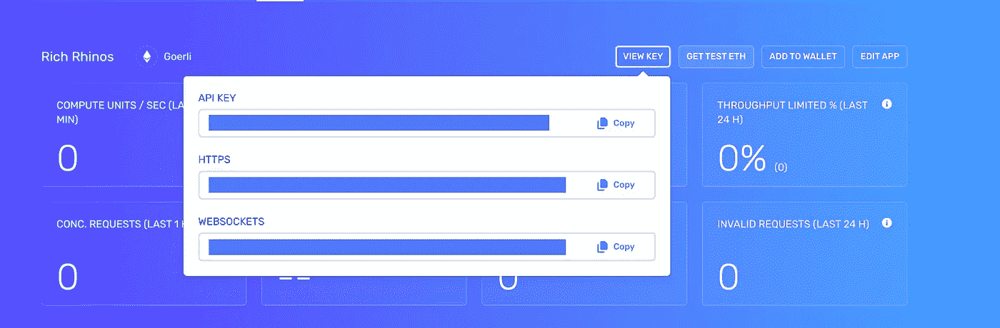
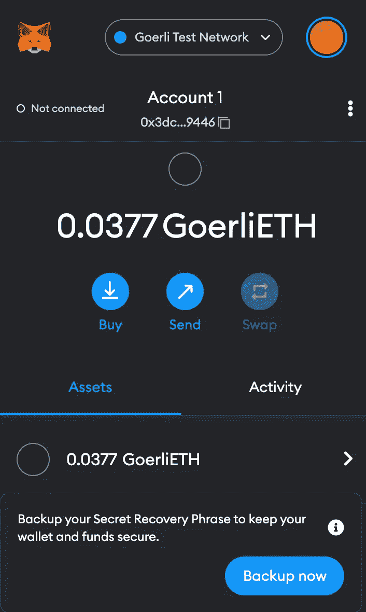
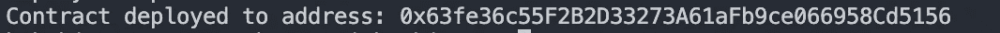
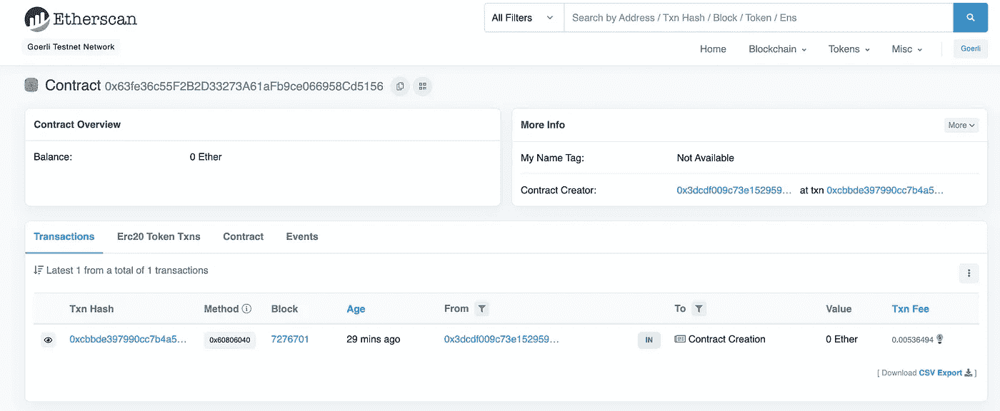

# 将您的 NFT 合同部署到 Goerli Testnet

> 原文：<https://medium.com/coinmonks/deploy-your-nft-contract-to-goerli-testnet-523d4fef731b?source=collection_archive---------1----------------------->



大家好，我又带来了另一篇文章。我希望你们也会喜欢并从中学习。在本文中，我将告诉您如何将契约部署到网络。网络是不同的以太坊环境，您可以访问它们进行开发、测试和生产。由于以太坊是一种协议，因此可能会有多个以太坊网络，以下是一些抽象列表:

> ***公共网络:*** *任何人都可以通过互联网连接访问公共网络。任何人都可以在公共区块链上读取和创建事务，并验证正在执行的事务。*
> 
> ***以太坊主网:*** *主网是以太坊生产区块链的主网，实际交易发生在这里。*
> 
> ***以太坊测试网:*** *区块链开发者在 Mainnet 上部署之前，会使用测试网络来测试他们的智能合约。您可以将测试网络视为舞台环境。*

有一个以太坊测试网的列表，但是我们将选择 Goerli 测试网。那么如何部署呢？它实际上是如何工作的？我会告诉你们的。和我联系。如果你有兴趣学习其他东西，不要犹豫，通过 LinkedIn 和 shahirzain100@gmail.com 联系我

因此，对于部署，您需要一份合同，所以我们从头开始。

我们将通过创建和部署 ERC-721，你应该有
安全帽，坚固，元面具，和炼金术。

# 第一步

制作一个目录`mkdir rich-rhinos`并进入目录`cd rich-rhinos`

使用`-y`运行命令`npm init -y`进行默认配置。确保您的计算机上安装了 Node.js。

然后安装 Hardhat 命令`npm i hardhat`，然后在你的终端运行`npx hardhat`，你应该会看到一个欢迎信息和一些选项，选择*创建一个空的 hardhat.config.js*



# 第二步

为合同和脚本创建一个文件夹。创建文件名 rich_Rhinos.sol 在合同文件夹中写下你的合同，就像我有我的一样

```
*// SPDX-License-Identifier: MIT****pragma*** solidity **>=** *0*.*7*.*0*;
***import*** "@openzeppelin/contracts/token/ERC721/ERC721.sol";
***import*** "@openzeppelin/contracts/utils/Counters.sol";
***import*** "@openzeppelin/contracts/access/Ownable.sol";
***import*** "@openzeppelin/contracts/token/ERC721/extensions/ERC721URIStorage.sol";*contract* RichRhinos *is* ERC721URIStorage, Ownable { using Counters for Counters.Counter;
     Counters.Counter private _tokenIds; **constructor**() *ERC721*("RichRhinos", "NFT"){}

    *function* mintNFT(address recipient, string memory tokenUri)                     public onlyOwner returns (uint256){ _tokenIds.increment();
      uint256 newItemId **=** _tokenIds.current();
      _mint(recipient,newItemId);
      _setTokenURI(newItemId,tokenUri);
      return newItemId;
    }
 }
```

因此，在导入报表后，我们有了自定义的 NFT 合同。这个合同其实很短。如果你关注构造函数，我们传递两个参数，第一个是 NFT 名字，第二个是 NFT 符号。最后，我们有了函数`mintNFT(address recipient, string memory tokenURI)`，它允许我们铸造一个 NFT！

# 步骤 03

进入[炼金术](https://www.alchemy.com/)，如果你没有帐户，就创建你的帐户。一旦你登录，有一个应用程序标签，你必须悬停在上面，然后点击`create App`。



输入你的 NFT 的名字就像我选择了**富有的犀牛**和选择了网络就像我选择了 **Goerli** testnet


从应用程序下拉列表转到您的应用程序，单击查看键



复制 API 键和 HTTPS 到项目并安装 dotenv `npm install dotenv --save`创建`.env`文件并粘贴复制的项目

```
API_URL="your-metamask-https-url"
PRIVATE_KEY="your-metamask-private-key"
```

注意:不要提交您的。请将它添加到 gitignore 文件中。

# 步骤 04

在应用程序中安装 Ether.js

```
npm install --save-dev @nomiclabs/hardhat-ethers ethers@^5.0.0
```

这个库提供了与以太坊区块链更简单的交互。到目前为止，我们已经添加了多个依赖项，所以我们需要更新我们的 hardhat.config.js

```
require("dotenv").config();
require("@nomiclabs/hardhat-ethers");
const { API_URL, PRIVATE_KEY } = process.env;module.exports = {
     solidity: "0.8.1",
     defaultNetwork: "ropsten",
     networks: {
        hardhat: {},
        ropsten: { 
            url: API_URL,
            accounts: [`0x${PRIVATE_KEY}`],
           },
       },
  };
```

# 第五步

现在是编译和编写部署脚本的时候了。为了确保一切都是完美的，我们需要通过在终端中键入以下命令来编译我们的契约

```
npx hardhat compile
```

如果一切正常，那么转到脚本文件夹，创建一个名为`deploy.js`的文件和下面的语句

```
async function main() {const RichRhinos = await ethers.getContractFactory("RichRhinos");
const gasPrice = await RichRhinos.signer.getGasPrice();
console.log(`Current gas price: ${gasPrice}`);const estimatedGas = await RichRhinos.signer.estimateGas(
 RichRhinos.getDeployTransaction()
);console.log(`Estimated gas: ${estimatedGas}`);const deploymentPrice = gasPrice.mul(estimatedGas);
const deployerBalance = await RichRhinos.signer.getBalance();console.log(`Deployer balance:  ${ethers.utils.formatEther(deployerBalance)}`);console.log( `Deployment price:  ${ethers.utils.formatEther(deploymentPrice)}`);if (Number(deployerBalance) < Number(deploymentPrice)) { throw new Error("You dont have enough balance to deploy.");}*// Start deployment, returning a promise that resolves to a contract object*const myNFT = await RichRhinos.deploy();await myNFT.deployed();console.log("Contract deployed to address:", myNFT.address);}main().then(() => process.exit(0)).catch((error) => {console.error("Error:", error);process.exit(1);});
```

但是对于部署，你要有一个类似 metamask 的数字钱包，下载 metamask，选择网络为 goerli。



第一次你有 0 个 goerli Eth，所以部署需要一些气费，所以去这个网站`[https://goerli-faucet.slock.it/](https://goerli-faucet.slock.it/for)` [找](https://goerli-faucet.slock.it/for)水龙头 Eth。

现在是时候在您的终端中运行部署命令了

```
npx hardhat --network ropsten run scripts/deploy.js
```

您应该会看到类似这样的内容。



如果我们去 Goerli etherscan 搜索我们的合同地址，我们应该能够看到它已经成功部署。



呀呀呀呀！您刚刚将您的 NFT 智能合约部署到以太坊链！

就这样，伙计们！希望对你来说是本好书。谢谢大家！✨

👉联系我:shahirzain100@gmail.com

👉关注我:[GitHub](https://github.com/ShahirZain)LinkedIn

> 交易新手？试试[加密交易机器人](/coinmonks/crypto-trading-bot-c2ffce8acb2a)或者[复制交易](/coinmonks/top-10-crypto-copy-trading-platforms-for-beginners-d0c37c7d698c)