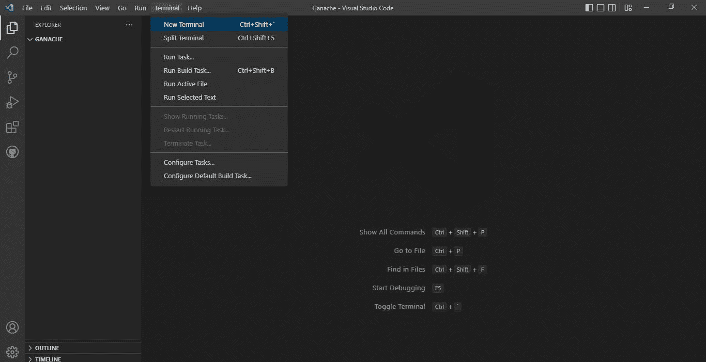
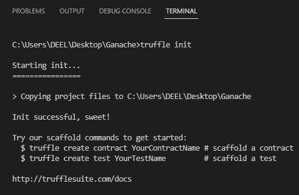
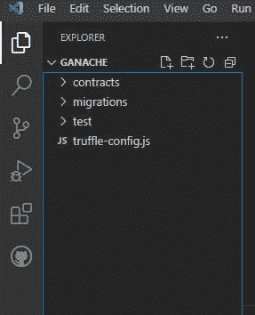
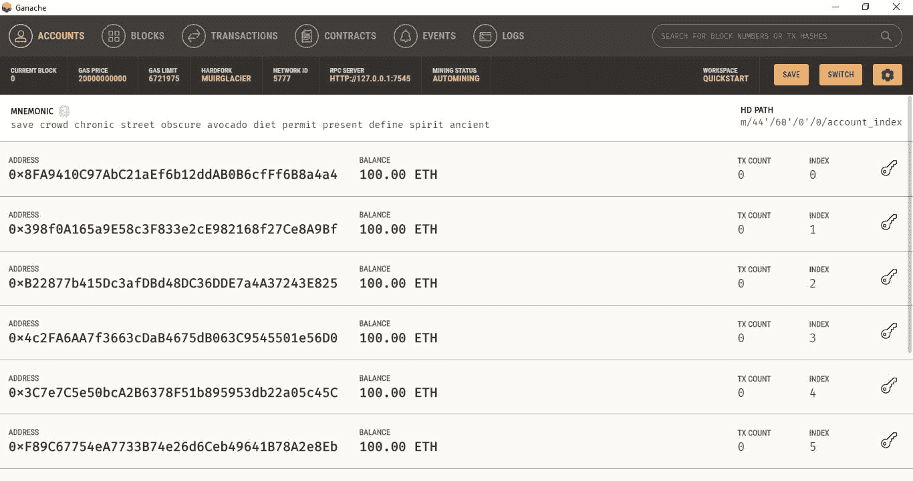
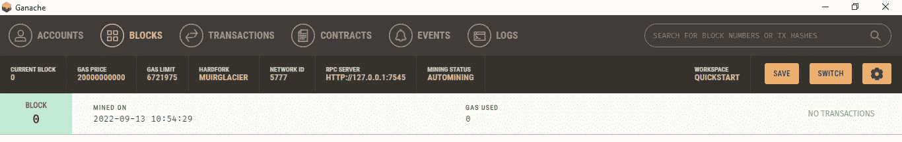
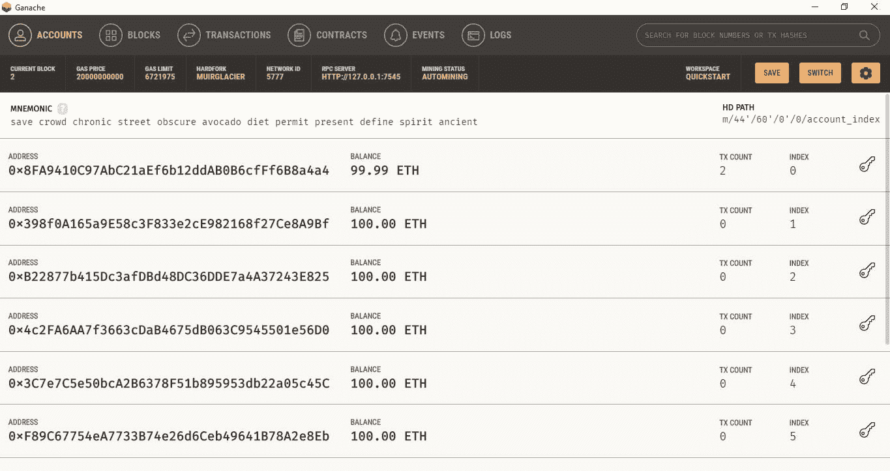
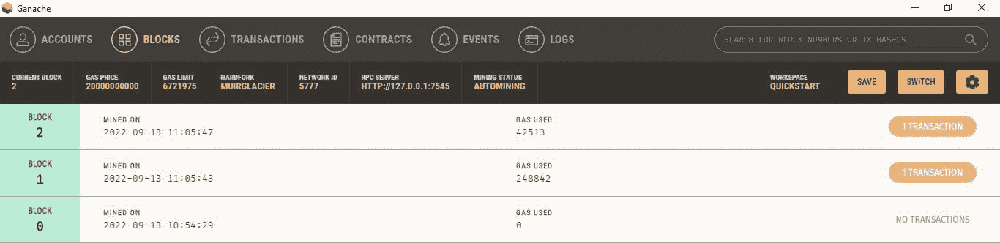
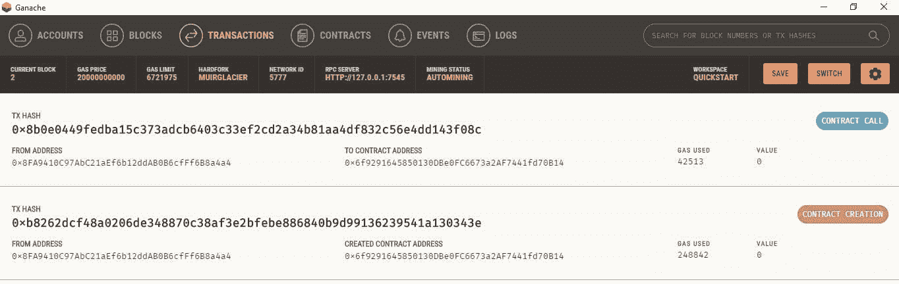
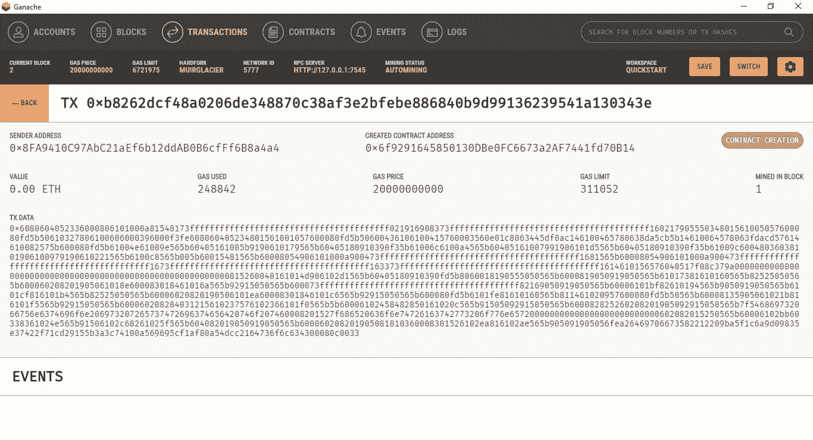

# 部署与 Truffle Ganache 的智能合同

> 原文：<https://medium.com/coinmonks/deploying-a-smart-contract-with-truffle-ganache-fde535318ed5?source=collection_archive---------3----------------------->


Photo by [DrawKit Illustrations](https://unsplash.com/@drawkit?utm_source=medium&utm_medium=referral) on [Unsplash](https://unsplash.com?utm_source=medium&utm_medium=referral)

# 加纳切

今天，我们将看到如何在 truffle ganache 的帮助下部署智能合约。以太坊 Ganache 是一个为开发和测试而设计的本地内存区块链。它模拟了一个真实以太网的特征，包括许多由测试以太网资助的账户的可用性。以太坊 Ganache 有两个版本:带有用户界面的图形应用程序和命令行版本。要在我们的系统中运行 Ganache，首先我们必须使用这个[链接](https://trufflesuite.com/ganache/)下载 GUI，我们还必须为 Ganache CLI 安装 Ganache。要安装，请运行以下命令。打开您的终端，键入以下命令。

```
npm install -g ganache-cli
```

成功安装后，我们可以使用下面的命令检查 truffle ganache 的版本。

```
truffle version
```

如果安装成功，我们可以看到下面的输出。

```
Truffle v5.5.5 (core: 5.5.5)
Ganache v^7.0.3
Solidity v0.5.16 (solc-js)
Node v16.13.0
Web3.js v1.5.3
```

没错。我们已经成功安装了松露和加纳切。现在让我们建立松露项目。

# 创建一个松露项目

我们将使用 VS 代码创建松露项目，如果你没有，请使用这个[链接](https://code.visualstudio.com/download)下载。下载并安装后，打开 VS 代码并在其中创建一个文件夹。并在顶部点击*新建终端*。



它将在 vs 代码中打开一个新的 cmd。然后键入命令创建一个新的 truffle 项目，如下所示。

```
truffle init
```

现在我们可以看到我们的松露项目成功创建。



你可以看到，它还在我们的 vs 代码中创建了一些文件夹。



总共有 3 个名为 *contracts、migrations 和 test* 的文件夹。正如您所猜测的，您必须将我们所有的智能合同写入到*合同*文件夹中，并将我们必须保存的合同按顺序部署到*迁移*文件夹中，*我们很快就会明白我所说的按顺序是什么意思了*。为了测试我们的合同，我们可以使用 *test* 文件夹。另外，还有一个 *truffle-config.json* 文件我们可以看到。在这个文件中，我们必须根据我们的部署需求进行修改。我们将在本文中看到所有细节。

# 加纳切

在部署智能合约之前，让我们看一下我们的 Ganache GUI。打开你安装的 Ganache，启动*以太坊快速入门*。一旦它成功启动，你可以看到一个主屏幕如下。



我希望您已经阅读了我之前的文章，在这篇文章中，我们使用 Remix IDE 部署了一个智能合约，如果您没有阅读这个[链接](/coinmonks/complete-solidity-code-deployment-process-f88be7913990)的话。我们看到了 Remix IDE 如何提供给我们一些地址，比如 Ganache 也提供给我们一些测试以太坊地址，每个地址包含 100 个以太。这种乙醚没有实际价值，这只是为了测试目的。另外，如果您在*块*选项卡中看到，我们可以看到只有块 0 可用。



部署智能合同后，只有我们可以看到新的数据块。我们可以在 Ganache GUI 中探索其余的选项卡。现在，让我们部署智能合约。

# 部署智能合同

如您所见，我们有一个名为 contracts 的文件夹，在该文件夹中，以前有一个智能合同。

```
// SPDX-License-Identifier: MIT
pragma solidity >=0.4.22 <0.9.0;contract Migrations {
  address public owner = msg.sender;
  uint public last_completed_migration; modifier restricted() {
    require(
      msg.sender == owner,
      "This function is restricted to the contract's owner"
    );
    _;
  } function setCompleted(uint completed) public restricted {
    last_completed_migration = completed;
  }
}
```

坚持住！在部署之前，我们必须修改 truffle-config.js 文件，因为我们使用的是 Ganache GUI。正如你在 Ganache 中看到的，服务器是 7545。让我们修改文件。取消对开发代码的注释，并进行如下更改。

```
development: {
     host: "127.0.0.1",     // Localhost (default: none)
     port: 7545,            // Standard Ethereum port (default: none)
     network_id: "*",       // Any network (default: none)
    },
```

**没错！我们都准备好部署了！**

现在，在 vs 代码中打开终端并运行下面的命令。

```
truffle migrate
```

如果一切顺利，您可以看到下面的输出。

```
Compiling your contracts...
===========================
> Compiling .\contracts\Migrations.sol
> Artifacts written to C:\Users\DEEL\Desktop\Ganache\build\contracts
> Compiled successfully using:
   - solc: 0.8.12+commit.f00d7308.Emscripten.clangStarting migrations...
======================
> Network name:    'development'     
> Network id:      5777
> Block gas limit: 6721975 (0x6691b7)1_initial_migration.js
====================== Deploying 'Migrations'
   ----------------------
   > transaction hash:    0xb8262dcf48a0206de348870c38af3e2bfebe886840b9d99136239541a130343e
   > Blocks: 0            Seconds: 0
   > contract address:    0x6f9291645850130DBe0FC6673a2AF7441fd70B14
   > block number:        1
   > block timestamp:     1663047343
   > account:             0x8FA9410C97AbC21aEf6b12ddAB0B6cfFf6B8a4a4
   > balance:             99.99502316
   > gas used:            248842 (0x3cc0a)
   > gas price:           20 gwei
   > value sent:          0 ETH
   > total cost:          0.00497684 ETH > Saving migration to chain.
   > Saving artifacts
   -------------------------------------
   > Total cost:          0.00497684 ETHSummary
=======
> Total deployments:   1
> Final cost:          0.00497684 ETH
```

现在，如果您注意到了，您会看到在 *migrations* 文件夹中创建了一个名为 *1_initial_migration.js* 的新文件。1 用于部署过程的序列化，这意味着它将首先部署。

```
const Migrations = artifacts.require("Migrations");module.exports = function (deployer) {
  deployer.deploy(Migrations);
};
```

此外，我们可以在输出中看到我们的智能合约已部署，我们还可以在 Ganache GUI 中看到所有这些详细信息。可以看到地址 0x8FA 扣除了一些醚。



现在，如果您签入 Blocks 选项卡，将会添加一个新块。



在这里我们可以看到我们交易的细节。



如果您单击其中一个交易，您可以在下面看到该交易的所有详细信息。



Ganache

在这里，我们可以看到发送者地址、创建的合同地址、价值、使用的气体、气体价格、气体限制、区块开采和 TX 数据。在 truffle 和 ganache 的帮助下，我们已经成功部署了我们的智能合约。你自己试试吧，我相信你会喜欢的。

感谢你阅读这篇文章，稍后带着新的话题再见。

> 交易新手？尝试[加密交易机器人](/coinmonks/crypto-trading-bot-c2ffce8acb2a)或[复制交易](/coinmonks/top-10-crypto-copy-trading-platforms-for-beginners-d0c37c7d698c)