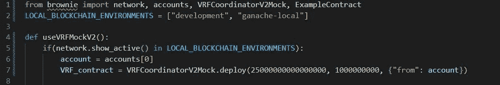
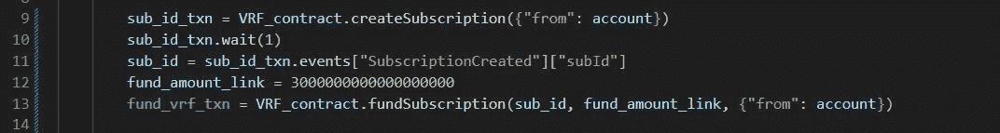
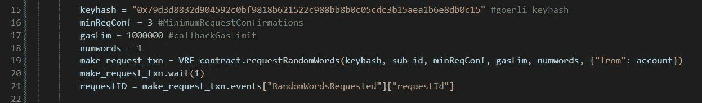
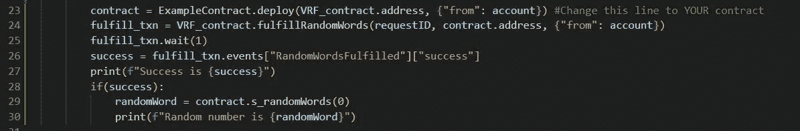
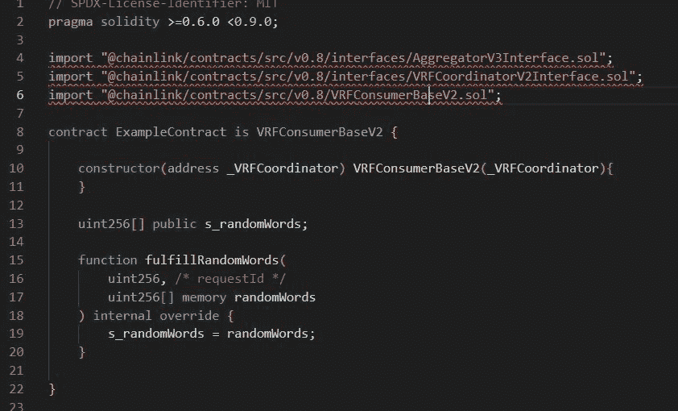

# 为本地区块链环境部署 VRF 协调员 V2·莫克

> 原文：<https://medium.com/coinmonks/deploying-vrf-coordinator-v2-mock-for-local-blockchain-environments-26674903e4c9?source=collection_archive---------2----------------------->

最近我花了几个小时试图使用新版的 Chainlink 非常有用的随机数生成器 VRFCoordinatorV2Mock，它来自 Youtube 上 Patrick Collins 的综合 [**区块链教程**](https://www.youtube.com/watch?v=M576WGiDBdQ) ，不幸的是，它使用的是旧版本。虽然实际的实现很容易，但是要弄清楚到底要做什么不同，可能需要一点脑力和宝贵的时间。

下面是在您的本地区块链环境中实现 VRFCoordinatorV2Mock 的分步指南。

# 先决条件

对于这篇文章，您需要 python 的基础知识和一些扎实的知识，以及用两种语言编写和编译代码的必要工具，比如 VSCode。您还需要安装 ganache 和 python pip 包 solcx 和 brownie，并在 brownie-config.yaml 文件中包含 chainlink 依赖项。在这里 从 Chainlink 的 github 库 [**获取 VRF 协调员 V2 Mock，并将该文件包含在您的合同/测试文件夹中。**](https://github.com/smartcontractkit/chainlink-mix/blob/main/contracts/test/VRFCoordinatorV2Mock.sol)

本质上，本指南假设您已经使用了 Chainlink 的 VRFCoordinator 的早期版本，或者按照 Patrick Collin 的教程学习了智能合约彩票部分。

# 步骤 1:部署 VRF 协调员 V2·莫克

与第一个版本不同，VRFCoordinatorV2Mock 在部署时采用两个参数， *_baseFee* 和 *_gasPriceLink* 。 *_baseFee* 是指为使用合同而向甲骨文支付的费用或溢价，每个区块链都不相同。你可以在这里找到完整的列表。 *_gasPriceLink* 是发送交易的 gas 价格，通常是基于部署交易的层的价格动态设置的某个值。

为了让您的模拟合同生效，将 *_baseFee* 设置为 250000000000000(这对应于 0.25LINK)，将 *_gasPriceLink* 设置为 100000000。但是，如果 mock 拒绝生成随机数(称为 randomWords)，可以随意给 *_gasPriceLink 添加额外的零。这通常取决于合同的大小。*

因此，通过在 deploy.py 脚本(或任何运行代码的 python 脚本)中包含下面的代码，您可以部署并确保无论何时在本地区块链上都将部署 VRF 协调器模拟契约。

# 步骤 2:创建并资助本地 VRF 订阅

接下来，您必须创建 VRF 订阅才能使用该合同。在 mainnet 上，这可以在 [VRF 订阅管理器](http://vrf.chain.link)完成。然而，在我们的本地模拟契约中，您必须自己调用这些方法。createSubscription 方法不带参数，不返回任何内容。创建的订阅的 ID 可以通过访问“subscription created”事件来获取。有了这个 ID，订阅就必须通过调用 fundSubscription 方法用高于先前设置的 *_baseFee，*的任意数量的链接来提供资金。这需要两个参数: *_subID* (订阅 ID)和 *_amount* (基金链接的金额)。我建议资金至少有 300000000000000000(3 链接)。

# 第三步:提出请求

向 VRF 协调员提出请求。这可以通过直接或通过合同调用 requestRandomWords 方法来实现。无论哪种方式，该函数都有五个参数，因此必须注意确保它们的正确性。参数 1 是 *_keyhash* 。在 mainnet 上，这将因网络而异，可在此处 找到 [**。在开发中，任何网络的 keyhash 都可以做得很好。参数 2 是 *_subId* ，我们已经在上面生成了。参数 3 为*_ minimumRequestConfirmations*，可以是任意数字，但建议设置为 3。参数 4 是 *_callbackGasLimit* ，Chainlink 推荐设置为 100000。然而，在下面的例子中，我添加了一个额外的零。这将确保我们不会因气体估计错误而恢复原状。参数 5 是 *_numWords* ，它告诉契约要生成多少个随机数。与第一个版本不同，VRFCoordinatorV2Mock 可以一次生成多个随机数。**](https://docs.chain.link/docs/vrf/v2/supported-networks/)

requestRandomWords 方法发出一个唯一的 requestID，可以从 RandomWordsRequested 事件中访问该 request id。

# 第四步:满足要求

最后一步将需要您部署的合同的地址。这是因为 VRFCoordinatorV2Mock 的工作原理是通过您的契约的 fulfillRandomWords 方法将生成的单词发送到您的契约。**你的合同必须有这个方法来接收随机数。**

通过调用 VRFCoordinatorV2Mock 的 fulfillRandomWords 函数来完成请求。这需要两个参数: *_requestId* ，上面生成的请求的 Id 和 *_consumer* ，您的契约的地址。通过访问发出的事件“RandomWordsFulfilled”的“success”索引，可以知道实现的成功。如果为真，则该词已成功发送到您的合同中。如果错误，你可能需要调整你的天然气和资金数字多一点，或者确认你的合同地址是正确的。

Calling fulfillRandomWords

Solidity code for ExampleContract

记住:生成的单词是一个数组，每个单词都必须使用适当的索引来访问，比如 s_randomwords[0]，s_randomwords[1]等。

# 注意事项:

>模拟合同模仿已经部署在本地开发环境中的区块链 mainnet 上的真实合同。这使得运行本地测试成为可能，而不必总是与 mainnet 交互，这是一个慢得多的过程。

>在上面的示例中，在每个事务之后调用 wait(1 ),以确保在使用事务中的值之前事务已经完成。虽然不是绝对必要的，但建议这样做，尤其是在 mainnet 上。

**欢迎提问！**

*关注我了解更多区块链、Javascript、PHP、Python 或纯编程故事。*

[媒介](/@peterogwara) | [推特](https://twitter.com/petermarie_) | [Github](https://github.com/PeterMarie) | [亚马逊](https://www.amazon.com/author/peterogwara)

> 交易新手？尝试[加密交易机器人](/coinmonks/crypto-trading-bot-c2ffce8acb2a)或[复制交易](/coinmonks/top-10-crypto-copy-trading-platforms-for-beginners-d0c37c7d698c)