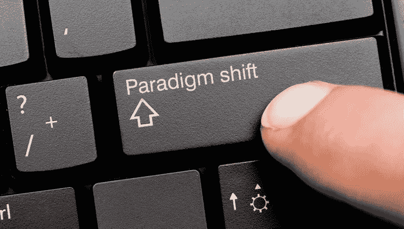
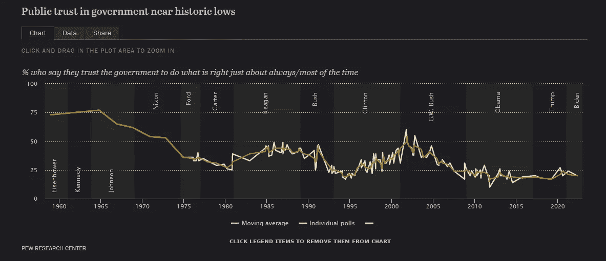

# 鹰派美联储会议显示潜在的加密脱钩迹象

> 原文：<https://medium.com/coinmonks/derivatives-market-provides-glimpse-into-early-crypto-adoption-c23c625ec69c?source=collection_archive---------46----------------------->

## 标准普尔 500 暴跌，而比特币反弹并找到了潜在的底部。

随着 3AC、Voyager Digital、& Celsius 等主要加密贷款公司最近在一系列清算后申请破产，电子中心化加密已经受到监管机构的审查。2022 年“隐秘的冬天”中这些前所未有的清算给新生的、蓬勃发展的行业带来了新的挑战。

## 最近的道破产事件是否值得警惕？

最近的消息让投资者质疑这些有风险的商品到底有多安全？众所周知，做市商一直在密切关注比特币，但由于投资公司盈利所需的流动性较低，他们没有参与进来。

然而，比特币(BTC)已经成为其自身成功的受害者，最初的数字货币在十多年后证明了其弹性。比特币的成功很大程度上是因为它能够在监管机构的视野之下飞行。最近的事件，如 3AC、Voyager Digital 和 Celsius 等所谓“Dao”的破产，给了这三家信用机构和银行调查的理由。

尽管这三个分散的“自治”组织或 Dao 利用了 Web 3.0，但他们一点也没有分散。他们可能与其他 DApps 和项目共享相同的用户界面，但这些组织由于缺乏安全性和基础知识而存在算法缺陷。

为了让一个项目声明它需要独立运行的分散所有权，这意味着任何其他实体或个人都不能访问负责底层代码的管理员密钥。管理员密钥允许对项目进行更改，不仅会给用户，而且会给项目本身带来漏洞。Voyager，Celsius & 3AC 都没有通过这个测试。不幸的是，对用户来说，这并不是公开的知识，直到亚历克斯·麦金斯基拿走了用户的令牌/资产，并乘坐他的私人游艇离开。这些项目虽然在算法上是分散的，但没有防范交易对手的风险。更糟糕的是，Celsius 项目允许用户使用杠杆贷款，增加了未受教育或粗心用户的风险。

## Crypto 的其他部分会出错吗？

削弱了大多数批评的是，比特币已经并且仍然是加密货币的主要标志。被政府监管机构贴上“网络威胁”的标签，被投资公司贴上投机资产的标签，最后是一个隐藏他人非法在线活动的边缘组织。

无论边缘加密看起来如何，其用例的含义至少代表了价值存储方式的变化。更广泛的影响可能会改变商业和银行业。这一点已经可以在一些发展中国家的国家一级看到，例如:

**萨尔瓦多-** 首个采用比特币作为法定货币的国家

**阿根廷-** 首个允许加密货币用于支付税款的国家

此外，美联储最近在怀俄明州杰克逊霍尔召开峰会后。标准普尔 500 见证了 4.5 个基点的下降，标志着趋势的逆转。与此同时，比特币仅下跌 9.1 个基点，迅速从 20，000 美元的低点反弹，这表明该资产的潜在底部价格。尽管对“定价”量化紧缩(QT)有负面反应，但这种加密主食已被证明对传统的市场波动具有弹性。美联储峰会后，其他传统资产尚未反弹。

尽管金融前景不明朗，但这可能会给比特币和其他加密技术带来好消息。因为反向价格行为代表了与传统金融工具的潜在脱钩。

## 电位去耦

这是秘密领域的民间传说，有点类似于《无名之辈》。撇开《哈利·波特》不谈，这里关键的一点是，如果这种趋势继续下去，它可能标志着比特币资产持有者期待已久的范式转变。

即使这个微小的鸿沟不会持续下去，它也很可能成为金融转变的金丝雀，可能会蒙蔽不知情的人，但对那些在这个有争议的数字市场中建仓的人来说，这是一个很好的赚钱机会。

前所未有的量化宽松(QE)不是几个税率的提高就能解决的，尽管 M2 的货币供应可能会放缓，但很难取出已经投入的货币。M1 的货币供应仍然潜力巨大，我们还没有感受到在一年左右的时间里国债几乎翻倍的全部影响。

今年，世界其他地方也发生了类似的事件，比如俄罗斯逃避对其公民的制裁。俄罗斯公民很快转向加密来摆脱现有的法令，从冻结的银行账户到私人保管的数字钱包。你可以在这里阅读更多关于投资公司如何做这件事的信息，E [QONEX 交易所转向托管资产(AUC)](/@dean.colias/eqonex-exchange-pivots-to-assets-under-custody-auc-b2f62660b950) 。

虽然用例不一定相同，但最终结果会是一样的。通胀环境下的潜在低迷不会单独引发衰退。滞胀是房间里的大象，除了雷伊·达里奥和其他分析师，很少有人愿意承认这一点。在消费者价格指数(CPI)不到 10%和房地产几乎前所未有的两位数增长的情况下，政府报告的数字似乎有点脱节，这有什么好奇怪的。不需要远见卓识就能看到类似于尼克松在 70 年代让美元脱离金本位的世界储备货币的金融生态。

报告显示工资增加，失业率降低，供应链负担减少。然而，随着美国政治体系幻灭感的不断减弱，60 天循环新闻周期和无休止的边境战争，难怪政府不信任度处于历史低点？见下表。

Only two-in-ten Americans say they trust the government in Washington to do what is right “just about always” (2%) or “most of the time” (19%).

自上次报告以来，政府信任度已从 1960 年的 75%降至略低于 20 %。也许“不要相信你在网上读到的一切”这句话应该改为“不要相信美国或其“选民”报告的统计数据”。

十有八九，这可能只是未来的隆隆声，但它相当奇怪，并证明显示了脱钩即将到来的标志。站在外面向内看可能不是好兆头。下面的视频提供了一个很好的例子，说明公众舆论通常是如何落后于形势的。

Late night television feature with David Letterman and Bill Gates marveling over new Web 2.0 advances.

历史总是给那些能够预见未来的人带来回报。Web 2.0 允许内容流式传输，并将物联网从静态网页转移到超文本传输协议——更普遍的说法是 HTTP，即几乎每个网页地址之前的文本。

莱特曼嘲笑盖茨先生使用愚蠢的电子设备听棒球比赛。他冷笑着反驳道，“收音机有没有让你想起什么？”除了十倍之外，Web 3.0 将做 Web 2.0 为社交媒体和多媒体内容所做的事情。Web 3.0 通过将数字货币加入其中，为互联网创造了一个新的轴心。这挑战了央行对现有信托体系的垄断主权。数字货币已经在立法层面展开斗争。你可以在这里阅读更多关于 Web 3.0 的信息。我认为有几件事可能需要提醒大卫，而不是纽约证券交易所。

> 交易新手？试试[密码交易机器人](/coinmonks/crypto-trading-bot-c2ffce8acb2a)或者[复制交易](/coinmonks/top-10-crypto-copy-trading-platforms-for-beginners-d0c37c7d698c)