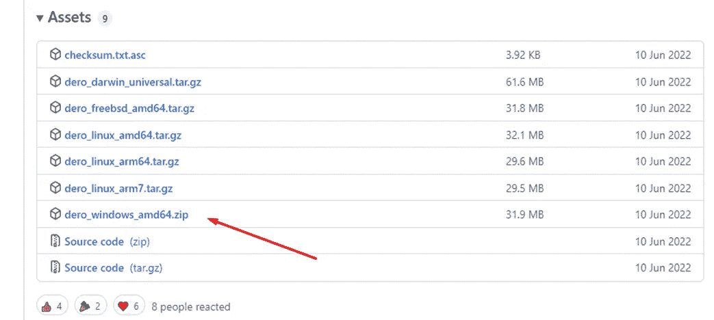
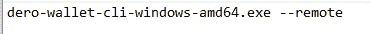
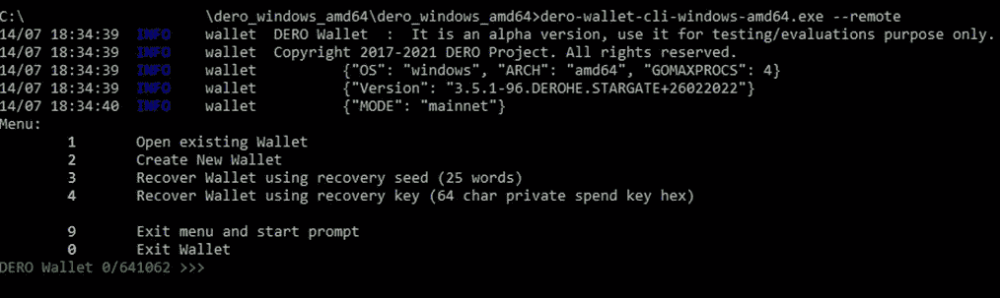
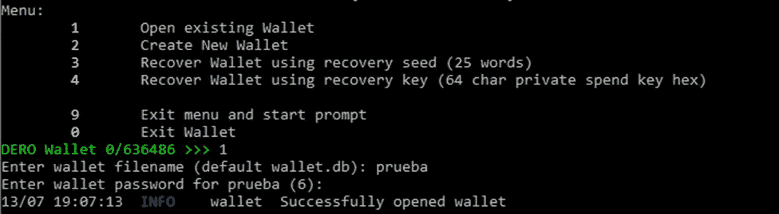
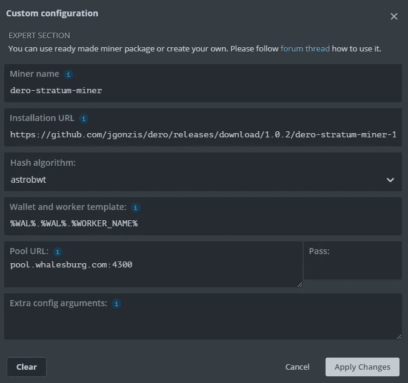
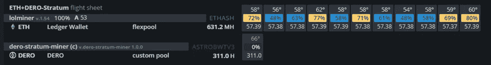
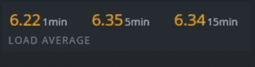

# DERO - CPU 挖掘

> 原文：<https://medium.com/coinmonks/dero-cpu-mining-pool-9d92c9a5806b?source=collection_archive---------0----------------------->

在本指南中，我们将解释如何从 whalesburg.com市场上唯一的迪洛矮人矿坑中开采迪洛矮人，首先我们必须首先创建钱包。

你可以使用兑换处的钱包[库币](https://www.kucoin.com/)或[贸易怪](https://tradeogre.com/)或者创建你的冷钱包

> **创建冷钱包**

*   首先我们从
    [https://github.com/deroproject/derohe/releases](https://github.com/deroproject/derohe/releases)下载这个包。

我们正在下载此文件，因为我们将在 Windows 中配置:

*   下载文件后，我们将其解压缩到一个文件夹中。我们创建一个纯文本文档，我们把格式”。bat "使用我们想要的名称，在文本中我们将写下我们要打开的可执行文件的名称，即:

dero-wallet-cli-windows-amd64.exe — remote
(adding — remote at the end)

*   我们启动创建 bat 文件，我们将拥有:

*   我们选择选项 2:创建新钱包
    完成后，系统会要求我们输入钱包名称和密码，我们必须重复输入。
*   现在它会要求我们选择语言，在我们的例子中是英语。
*   一旦选择了语言，我们将获得种子的 24 个单词，我们必须将它们很好地保存在文档中。

> 我们必须很好地保存在文本文档中，我们可以用鼠标选择单词，并使用命令 Control+C 复制文本和 Control+V 将其粘贴到文本文档中(这将在注册钱包后进行)。

*   要注册我们的钱包，我们将选择选项数字 4，这一行动可能需要几分钟，甚至几个小时，我们必须等待它成功。
*   现在我们保存我们的 24 个种子单词。

> 如何看我们的钱包

选择选项 1:

稍后选择选项 1 显示帐户地址，我们将有我们的 Dero 钱包。

> 如何到迪洛池采矿

我们必须从下载 miner，我们可以从 Linux、Windows 或 Android 版本中选择:

[发布 whalesburg/dero-stratum-miner(github.com)](https://github.com/whalesburg/dero-stratum-miner/releases)

线开始挖掘将非常容易:

***dero-stratum-miner-r pool.whalesburg.com:4300-w wallet . rigname***

如果你想指定线程的数量，你可以加上-m `number of threads to use`

# **HiveOS 配置:**

URL 安装:

> https://github . com/whalesburg/dero-stratum-miner/releases/download/v 1 . 0 . 3/dero-stratum-miner-1 . 0 . 3 . hi veos . tar . gz

钱包:%WAL%。%WORKER_NAME%

游泳池网址:pool.whalesburg.com:4300

额外配置:您可以指定线程的数量，只需添加-m `number of threads to use`

> 交易新手？试试[加密交易机器人](/coinmonks/crypto-trading-bot-c2ffce8acb2a)或者[复制交易](/coinmonks/top-10-crypto-copy-trading-platforms-for-beginners-d0c37c7d698c)