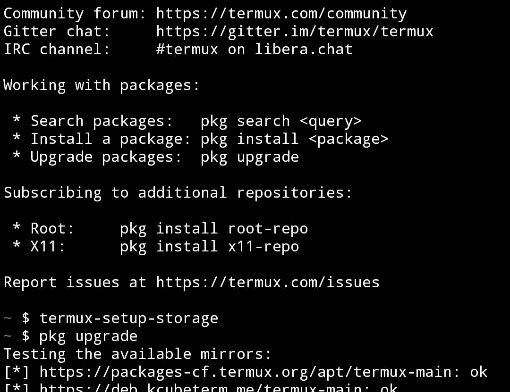
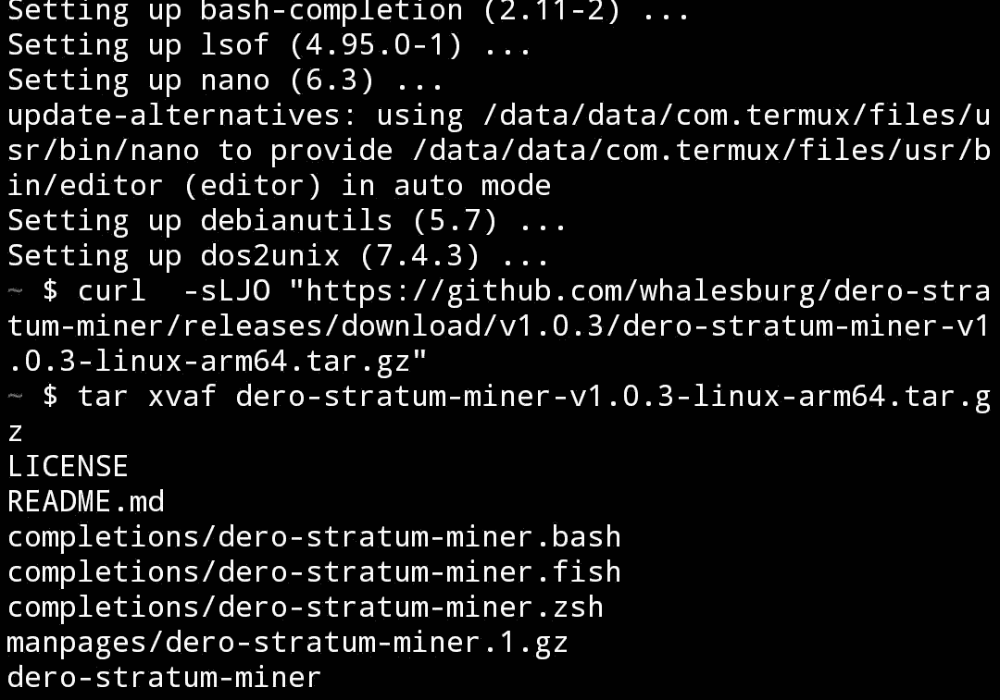
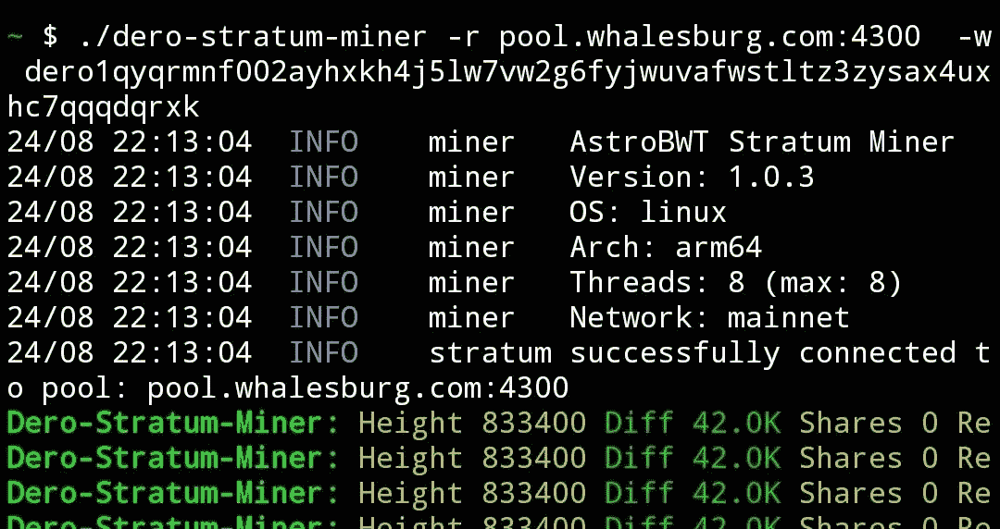

# DERO——移动采矿

> 原文：<https://medium.com/coinmonks/dero-mobile-mining-6673a24afa95?source=collection_archive---------2----------------------->

这是一个指南，如何挖掘你的手机，并从中获利。

请记住，您可以注册您的钱包或使用来自 [Tradeogre](https://tradeogre.com) 的兑换钱包

如何从 whalesburg.com[的池子里开采迪洛矮人](https://whalesburg.com):

从 F-Droid 安装应用程序 Termux:

> 【https://f-droid.org/repo/com.termux_118.apk 

允许访问:

> termux-设置-存储

升级 Termux:

> pkg 升级
> (选择所有 Y，如果不工作，在 termux-change-repo 之前写入并选择)

保存矿工文件:(选项 1)

> curl-sLJO "[https://github . com/whalesburg/dero-stratum-miner/releases/download/dero-stratum-miner-v 1 . 0 . 3-Linux-arm 64 . tar . gz](https://github.com/whalesburg/dero-stratum-miner/releases/download/v1.0.2/dero-stratum-miner-v1.0.2-linux-arm64.tar.gz)"

保存矿工文件:(选项 2)

> pkg 安装 wget
> 
> wget[https://github . com/whalesburg/dero-stratum-miner/releases/download/v 1 . 0 . 3/dero-stratum-miner-v 1 . 0 . 3-Linux-arm 64 . tar . gz](https://github.com/whalesburg/dero-stratum-miner/releases/download/v1.0.3/dero-stratum-miner-v1.0.3-linux-arm64.tar.gz)

打开归档文件

> 塔尔沙夫 dero-stratum-miner-v1.0.3-linux-arm64.tar.gz

可以使用以下命令启动 miner:

> 。/dero-stratum-miner-r pool.whalesburg.com:4300-w 钱包. rigname

# 要保持固定，滑动顶部屏幕并展开 Termux，然后选择“获取唤醒锁”。IP 需要手动编写

> 交易新手？尝试[加密交易机器人](/coinmonks/crypto-trading-bot-c2ffce8acb2a)或[复制交易](/coinmonks/top-10-crypto-copy-trading-platforms-for-beginners-d0c37c7d698c)