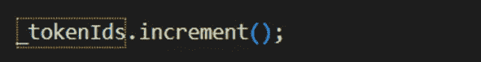
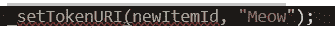
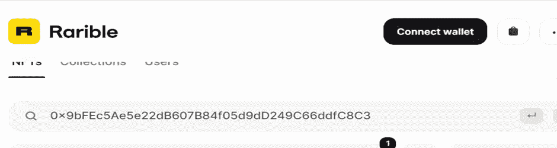

# 设计你的 NFT 版本

> 原文：<https://medium.com/coinmonks/design-your-version-of-nft-7c73f0694728?source=collection_archive---------12----------------------->

众所周知，区块链在人们的谈论中，因交易比特币和开发应用程序而闻名于世。人们也遇到了一个叫做 NFT 的新事物，利用这个开发者开始拥有一个 NFT 市场，开发游戏等等。所以在这篇博客中，我将详细讲述我是如何学会设计我自己版本的 NFT 以及以我自己名字定制的 NFT 的。在那之前，我会从 NFT 到底是什么开始，然后是创建 NFT 的步骤。

NFT 被称为不可替代的象征。它被认为是区块链世界的一项独特资产，由一个独特的数字和元数据组成。它们不可复制，可用作现实世界的有形资产，例如艺术品和房地产，可用于购买、销售和交易，从而避免欺诈的可能性。据说它也是现实世界事物的数字表现，如艺术、音乐、图片等

Step-by-step process to create NFT

1.在这个博客中，我将解释如何根据你的形象或名字来创建你的 NFT。

2.首先，我想谈谈下面的语法，您可以在下面的图像中看到，我们在命令提示符下运行，您将在为项目创建文件夹后运行该命令。

3.因此，对于我们的项目，我们使用的是一个安全帽，这是一个基本上用于进行各种活动的环境，例如使用以太坊区块链开发、测试和调试应用程序。

4.然后，将使用运行区块链应用程序所需的所有配置创建 hardhat 文件。

5.在为区块链应用程序创建配置文件时，它会询问您如何创建 gitgnore 文件，因此我们输入 y

6.gitgnore 文件用于将项目提交到 GitHub。

7.之后，将在文件夹中创建一组文件，如下所示。

8.它甚至可能会要求一些依赖性，正如你在上面的图片中所看到的，来安装 waffle 文件，所以你需要运行下面的命令。

9.此外，运行下面的语法，该语法用于安装 openzepplin 文件，该文件有助于创建安全的智能合约。

**NPM install @ open zeppelin/contracts**

10.安装后，一切都准备好创建 dapp，帮助您创建您选择的图像的 NFT，或者您可以创建您的名字的 NFT，我将在下面的步骤中显示。

11.当您创建一个 hardhat 文件时，它将创建一个带有智能合同的示例项目，该合同名为 Greeter，显示语句“hello hardhat”。

12.为了检查智能合同是否正常工作，我们将运行下面的命令。

13.上面的命令编译 solidity，并在本地环境中部署智能契约。

14.为了运行契约，我们需要一个 JavaScript 文件，即上面命令中的 sample-script.js。

15.正如我们在下图中看到的，示例项目的智能合约已成功部署，否则，如果某些配置或相关文件丢失，它将抛出一个错误。

16.这个安全帽在你的电脑上创建了一个本地区块链，帮助开发者测试 dapp。

现在，让我们创建我们自己的智能契约，我们将在其中定义和开发创建我们自己的 NFT 的逻辑。

17.在第 1 行中，我们定义了编译智能契约的编译器版本。

18.然后我们在第 4 行看到 import 语句，它帮助我们面对调试挑战。

19.就像在面向对象中一样，我们在智能契约中有一个叫做类的概念，我们在 solidity 中以同样的方式编码，就像你在第 6 行看到的那样。

20.通过定义在其中编写所有业务逻辑的契约。

21.然后我们在第 7 行使用了语法构造函数，在那里我们使用了控制台语法来显示声明，所以基本上这个契约将显示一个声明，说“这是我的 NFT”。

22.下一步是在脚本目录下创建 run js 文件，该文件将用于运行智能合约。

23.现在让我们来研究一下我们用来运行智能合约的语法。

24.因此，在第 2 行中，上面图像中的语法用于编译智能契约并生成实现 dapp 所需的文件。

25.正如我所说的，js 文件编译并部署智能契约。

26.然后，上图中的第 3 行将在由 hardhat 创建的本地区块链中部署智能合约。

27.然后第 4 行的语法我们等待合同在区块链正式部署。

28.然后在第 5 行，我们使用控制台日志 stamen，它显示在哪个地址部署了契约。

29.最后，将所有文件保存在文件夹中，并在终端中运行下面的语法。

之后，如果代码中没有错误，您将会看到下面的输出。

30.现在，我们将通过首先导入 open zeppelin 创建的 ERC721URIStorage 来更改我们的合同。

Erc721 是一个免费的开放标准，允许开发人员在以太坊区块链上构建 NFT。它还被定义为在任何价值数千美元的市场中管理 NFT 的环境支柱。它也像一个图书馆，为我们提供了定制整个 NFT 的基础。

31.导入后，我们将在合同中使用 ERC721 来创建 NFT，为此，我们将使用语法“is”来导入 ERC721 的所有属性，如 ERC721URIstorage 中定义的函数和变量。

32.我们在合同中使用了两个东西，一个是计数器变量，另一个是 ERC721 构造函数。

33.如上图所示，在契约函数中，我们定义了计数器变量，该变量将保存在变量“_tokenIds”中生成的 NFT 的计数。

34.之后，我们使用了构造函数，在该函数中我们传递了 NFT 名称和符号，然后出于测试目的，我们编写了控制台日志来显示该语句。

35.现在让我们看看 makeanepicNFTs 函数的另一部分，它是契约函数的后半部分。

36.因此，在第一行的函数中，我们定义了一个变量，它可以保存计数，并为每个创建的 NFT 提供一个唯一的数字。

37.这里也用它来存储合同价值。

38.在上面的语句中，我们创建契约意味着我们通过传递发送者地址来创建契约，发送者地址是使用 msg 以安全的方式传递的。发送者以及传递分配给 NFT 的令牌 id。

39.要实现这一切，您需要连接您的钱包，因为它不会匿名调用合同，而是会登录到钱包并验证自身。

40.然后，我们设置一个值，它是与上面图像中的唯一标识符相关的数据，你可以看到它被设置为喵，因为这是我们创建的一个虚拟 NFT。

41.在后面的阶段中你将看到数据如何在上述函数的变化中对 NFT 的出现起主要作用。

42.然后控制台语句基本上是向我们显示 NFT 是否是由谁铸造的。

43.然后，我们递增令牌的值，以保持令牌的计数，从而保持程序中创建的所有 NFT 的记录。

44.还维护每个 NFT 的唯一标识符，这意味着新的 NFT 不使用已经铸造的 NFT 的标识符。

45.下一步是为 NFT 创建数据，这将由 JSON 文件完成。

46.正如你在上面的图片中看到的，我们为 NFT 创建了数据。正如我们所见，每个 NFT 都有名称、描述和链接。

47.对于像公海这样的平台，有一些标准要求，如果不满足这些要求，那么图像在平台上看起来是不完整的**。**

**注意:对于图片的网址，你需要右击图片，格式为“png”或“jpg”。您将对需要粘贴的地址链接进行成像。**

48.然后我们将数据粘贴到 JSON keeper 中。

49.获取将由 JSON keeper 生成的链接，我们将复制这个链接。

50.然后将其粘贴到 settokenURI 函数中。在下图中，你可以看到数据“喵”,我们将用链接替换它。

51.粘贴数据后，settokenURI 将如下所示。

52.之后，我们尝试在 run . js 文件中调用函数 makeAnEpicNFT()，这将帮助我们在运行程序时创建 NFT。

53.正如你在上面的图片中看到的，我们正在调用 makeAnEpicNFT 函数并将值存储在 txn 的变量中，然后等待它生成 NFT。

54.因此，在上面的函数中，我们创建了两个 NFT。同样的，我们想铸造多少就铸造多少。

55.现在是使用下面的语法执行项目的时候了。

56.运行语法后，如果语法中没有错误，我们应该得到下面的输出。

57.正如你在下图中看到的，我们已经调用了这个函数两次，所以 NFT 在下面生成了两次。

58.目前，我们正在本地链上运行 NFT，以便在市场中可见。我们需要在实际网络中运行它，因为我们需要进行某种交易，而该交易将需要以太网来生成保存数据的 NFT。

59.下一步是告诉区块链的矿工部署合同，因此我们需要一个快速节点作为平台，我们将在其上开发区块链应用程序。

60.因此，您在 quick 节点中创建一个帐户，它将为您提供测试网络的 API 密钥。

61.它确实广播了合同，因为我们将制作一个虚拟的 NFT，只是为了了解我们将使用 Rinkeby 网络，因为你需要一个假的方面，你可以从 Mycrypto，官方 goerli 获得。

62.现在让我们创建另一个 js 文件来在实际的 testnet 上运行契约。

63.它将类似于运行 js 文件，并将其命名为 deploy.js

64.然后在 hardhat 配置文件中进行一些更改，以安全的方式使用 env 变量，在这种方式下，我们将传递快速节点 API 密钥和 goerli 网络私有密钥。

65.为此，我们需要通过运行以下命令来安装 dotenv 包

66.这将有助于我们在 hardhat 配置文件中使用 env 变量，因此我们需要在您的项目文件中创建一个. env 文件，如下所示

67.在快速节点密钥中，我们添加创建帐户后从快速节点获得的 API URL，然后在私钥部分，我们粘贴钱包帐户地址。

68.然后在 gitgnore 文件中添加。env 文件是

69.要登录区块链，我们需要私钥来帮助我们登录区块链。所有的更改完成后，我们需要保存所有的文件。

70.然后使用下面提到网络名称的语法执行它。

71.在执行上述语法后，我们将看到合同如下所示部署。如果代码中的一切都很好，那么您将看到下面的输出

72.当你进入 Opensea 或 Rarible 网站时，你必须输入下面的地址。

73.所以，这就是你如何在市场上创造 NFT 的定制形象。

74.现在在下半年，我们将看到如何创建你的名字的 NFT 或使用 SVG 使用你的设计。这是另一种使用代码的图像

75.下面是 SVG 代码的一个例子。

(The link to the site is [https://www.svgviewer.dev](https://www.svgviewer.dev))

76.然后，您应该使用链接(https://www . utilities-online . info/base 64 UTM _ source = build space . so & UTM _ medium = build space _ project)将其编码为 base 64

77.然后在 base64 编码的 SVG 的帮助下创建一个链接。该链接将用于创建我们需要的 nft 数据。

78.它看起来会像这样:

**data:image/svg+xml;作者: 李光耀 李光耀 李光耀 李光耀 李光耀 李光耀 李光耀 李光耀 李光耀 李光耀 李光耀 李光耀 李光耀 李光耀 李光耀 李光耀 李光耀 李光耀 李光耀 李光耀 李光耀 李光耀 李光耀 李光耀 李光耀 李光耀 李光耀 李光耀 李光耀 李光耀 李光耀 李光耀 李光耀 李光耀 李光耀 李光耀 李光耀 李光耀 李光耀 李光耀 李光耀 李光耀 李光耀 李光耀 李光耀 李光耀 李光耀 李光耀 李光耀**

79.如果您将链接粘贴到浏览器,您将在浏览器中看到图像。As you can see in the below image 如下图所示

80.下一步是将其转换为 JSON 元数据,这将通过在元数据图像中添加上面的链接来完成。

81.Then paste the JSON data into the encode into base64 。it will look like this below 它会看起来像下面

82.Then copy the link and paste it to the end of the link again like this 复制链接并粘贴到链接的末尾

**data:application/json 第三十四条 第一条 第一条 第一条 第一条 第一条 第一条 第一条 第一条 第一条 第一条 第一条 第一条 第一条 第一条 第一条 第一条 第一条 第一条 第一条 第一条 第一条 第一条 第一条 第一条 第一条 第一条 第一条 第一条 第一条 第一条 第一条 第一条 第一条 第一条 第一条 第一条 第一条 第一条 第一条 第一条 第一条 第一条 第一条 第一条 第一条 第一条 第一条 第一条 第一条 第一条 第一条 第一条 第一条 第一条 第一条 第一条 第一条 第一条 第一条 第一条 第一条 第一条 第一条 第一条 第一条**

83.After pasting the above link we will see the image as follows 下面的图片

84.然后我们将上面的链接传递到 setokenURI 函数中,并将 NFT 实现到市场中,例如 open sea 或 rarible 等。

85.所以,它会看起来像这样

_setTokenURI(newItemId," **data:application/json;第三十四条 第一条 第一条 第一条 第一条 第一条 第一条 第一条 第一条 第一条 第一条 第一条 第一条 第一条 第一条 第一条 第一条 第一条 第一条 第一条 第一条 第一条 第一条 第一条 第一条 第一条 第一条 第一条 第一条 第一条 第一条 第一条 第一条 第一条 第一条 第一条 第一条 第一条 第一条 第一条 第一条 第一条 第一条 第一条 第一条 第一条 第一条 第一条 第一条 第一条 第一条 第一条 第一条 第一条 第一条 第一条 第一条 第一条 第一条 第一条 第一条 第一条 第一条 第一条 第一条 第一条**

“)

86.只需在您的智能合同中做一点小小的更改，然后保存它。然后你可以使用下面的语法来实现它

87.然后你会再次低于产量，在创建后，你会再次低于产量

88.使用上述合同地址，我们将在网站[https://goerli.pixxiti.com](https://goerli.pixxiti.com)上进行搜索，您将能够在这个市场上看到您的名字 nft。

所以在这里我总结了创建 NFT 的步骤，继续创建你的 NFT 版本。如果你喜欢这个，请评论并喜欢这个博客。此外，为了获得更多参考，您可以从构建空间获取内容和步骤。

> 交易新手？试试[密码交易机器人](/coinmonks/crypto-trading-bot-c2ffce8acb2a)或者[复制交易](/coinmonks/top-10-crypto-copy-trading-platforms-for-beginners-d0c37c7d698c)