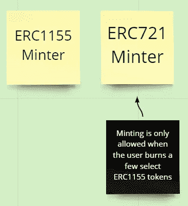
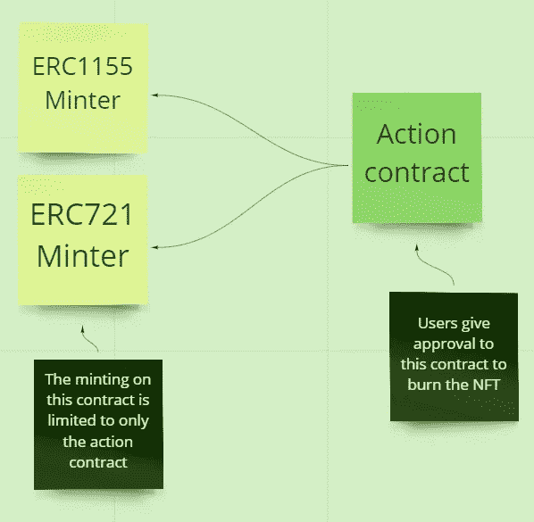
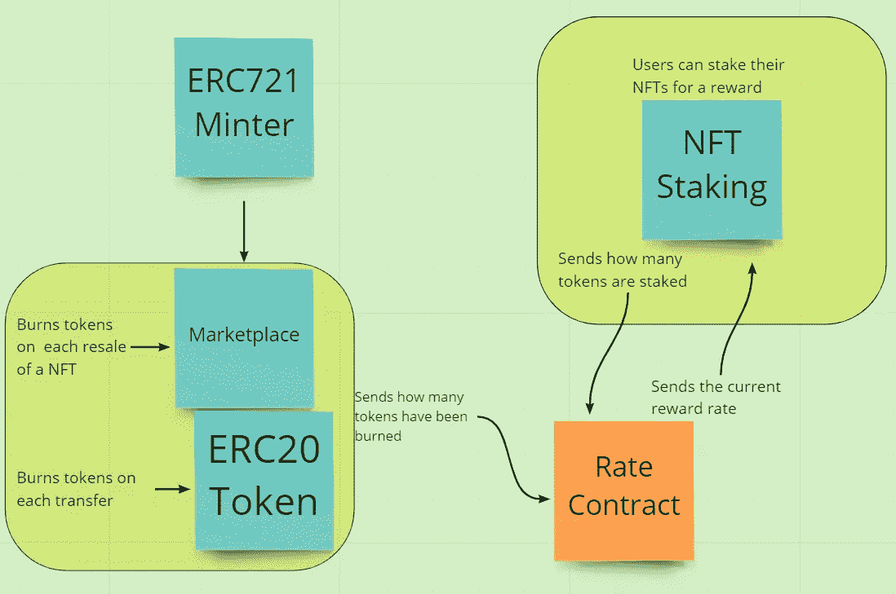

# 设计智能合约架构

> 原文：<https://medium.com/coinmonks/designing-smart-contract-architectures-924a8991dfe1?source=collection_archive---------6----------------------->

在设计建筑时，我使用 Miro 这款交互式白板应用进行协作。我发现它很容易使用&你可以轻松地制作任何你需要的像样的工作流/概述。我发现这有助于解决沟通问题，如果你正在经历这类问题，也许值得一试。

无论如何，当考虑你的合同将如何布局时，你需要记住合同大小的限制，试着将合同分解以减少单个合同中的代码。

您是否看到了我们可以分离并提取新合同的地方？

我们可以去掉 ERC721 minter 的刻录和铸造操作，给出以下架构。

好的，这是一个新的例子。

这里我们有以下合同:
-ERC 721 Minter
-ERC 20 Token
-NFT 市场
- NFT 赌注
-自动汇率

这里的想法是每次发生代币转让或 NFT 转售时更新费率合同。下注契约还会用当前下注了多少代币来更新费率契约&同时检索新的奖励费率。

但是等等，我们要达到什么目的？

如果我们知道如何实施以下架构，那么我们就可以在整个合同生态系统中使用多种燃烧机制的基础上实施紧缩机制。

我希望通过这篇文章，你已经学会了如何用额外的自动化工具来构建你的生态系统。

敬众多的第一个。

稳健发展研究小组—[https://discord.gg/KzbcGmrnfN](https://discord.gg/KzbcGmrnfN)

-多边形联盟—[https://www.polygonalliance.com/](https://www.polygonalliance.com/)

——多边形联盟不和—[https://discord.gg/kJKPCGQu66](https://discord.gg/kJKPCGQu66)

你喜欢这篇文章吗？想请我喝杯咖啡吗？
Polygon/Eth/Bsc—0x4a 581 E0 EAF 6b 71d 05905 e8e 6014 DC 0277 a1 b 10 ad

> *交易新手？试试* [*加密交易机器人*](/coinmonks/crypto-trading-bot-c2ffce8acb2a) *或* [*复制交易*](/coinmonks/top-10-crypto-copy-trading-platforms-for-beginners-d0c37c7d698c) *上* [*最好的加密交易*](/coinmonks/crypto-exchange-dd2f9d6f3769)

> 加入 Coinmonks [电报频道](https://t.me/coincodecap)和 [Youtube 频道](https://www.youtube.com/c/coinmonks/videos)获取每日[加密新闻](http://coincodecap.com/)

# 另外，阅读

*   [免费加密信号](/coinmonks/free-crypto-signals-48b25e61a8da) | [加密交易机器人](/coinmonks/crypto-trading-bot-c2ffce8acb2a)
*   [杠杆代币的终极指南](/coinmonks/leveraged-token-3f5257808b22)
*   [16 款最佳折叠电动自行车](/coinmonks/top-17-folding-electric-bikes-5e296f0918cb)
*   [28 款最佳电动自行车点评](/coinmonks/the-28-best-electric-bikes-review-and-buying-guide-in-2023-7bb3146cb403)
*   前三名[币安期货交易机器人](/coinmonks/top-3-binance-futures-trading-bots-e6031f84b3f9)