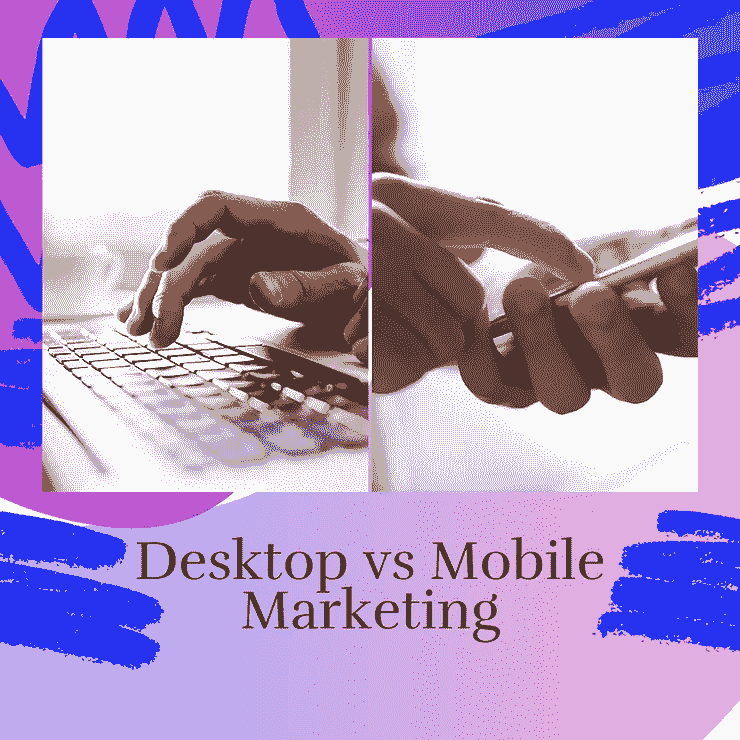
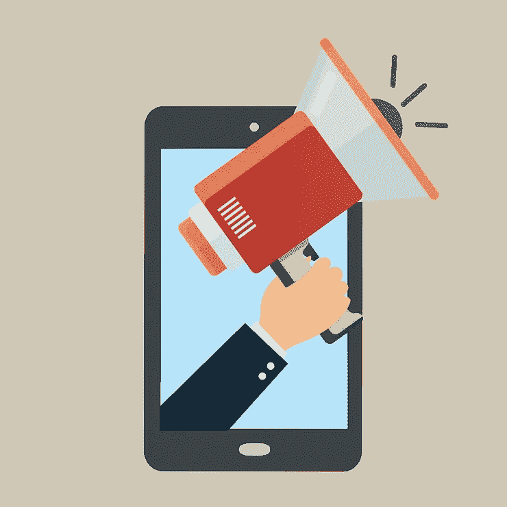
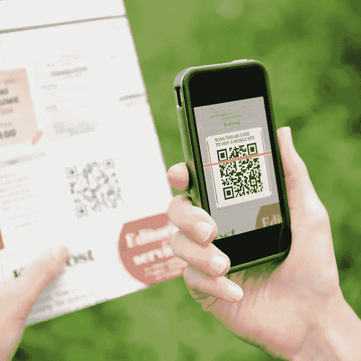

# 桌面营销与移动营销

> 原文：<https://medium.com/coinmonks/desktop-vs-mobile-marketing-f17167d81a1e?source=collection_archive---------53----------------------->

Desktop Vs. Mobile Marketing

为什么我应该关注移动广告，它与桌面广告有什么不同？近来，个人拥有手机或智能手机比拥有台式机更为普遍。最重要的是，他们的智能手机本质上是这些人的延伸，因此与不适合放在口袋里并且几乎不能在任何地方访问的台式机相比，它永远不会离开他们的身边。根据皮尤研究中心(皮尤研究中心 2019 年，第 100 段)。2)，“拥有智能手机的美国人比例现在是 81%”，相比之下，“近四分之三的美国成年人现在拥有台式电脑”。这些指标显示，智能手机的普及速度比之前预计的要快。营销人员注意到了这一变化，并相应地调整了他们的策略。

移动营销和桌面营销有什么不同？手机在广告方面有一些很大的优势，因为它有一些台式机所没有的功能，包括位置搜索，导致更多的本地意图，定位可以以更具时效性的方式进行，因为智能手机通常总是在个人身上，语音搜索，图像搜索，个性化，互动活动，以及一整套可用于广告的应用程序。

Mobile Marketing Megaphone

营销人员正在使用 GPS 定位，例如在谷歌地图上做广告，跟踪潜在客户与其位置的相关性，甚至在谷歌广告中重新定位。这使得营销人员可以更精确地将广告费花在最有吸引力的顾客身上。在阿肯色州为一家为海湾地区提供服务的加州本地企业做广告，不会有效利用广告费；然而，有了这些新功能，营销人员可以将目标锁定在尽可能靠近其服务区域的个人。

智能手机比台式机或台式机更小、更实惠、更方便，因此很容易理解为什么智能手机的增长率高于预期。这意味着移动广告不仅覆盖范围更广，而且更有可能在离购买点更近的地方看到这些广告，而不是在桌面上看到(尤其是对于实体商店)。这些个人设备通常不共享的事实也允许营销人员提供更有策划性和针对性的活动来获得他们寻找的受众，因此这些 GPS 定向广告可以在正确的时间和正确的地点提供给正确的受众。

Mobile Marketing Apps

应用构建的可用性也永远改变了营销，因为现在公司可以创建允许用户直接与企业互动的应用程序，并允许受欢迎的通知在他们的手机上弹出，拥有比以往任何时候都更个性化的体验。

互动营销不是一个新的景观；然而，智能手机的引入扩大了这一类别，允许更多创造性和技术驱动的创新。从游戏化比赛中的二维码到 Freestyle 应用程序“分享可乐”活动中的个性化可乐瓶，一切都变得越来越受欢迎，因为它们提供的结果不言自明。

Mobile Marketing QRC

我们可以看到手机越来越融入现代社会，我们必须适应不断变化的环境。作为营销人员，我们被期望跟上现代趋势，并试图预测未来趋势，以找到尚未被占领的蓝海。在注意力经济中，很明显，我们不仅要瞄准台式机，还要将新趋势和技术整合到我们的接触点列表中。

感谢你花时间和我一起踏上这段旅程，如果你喜欢内容，请点赞并订阅。如果你想了解更多关于这个话题的信息，请点击下面的链接。如果你有任何问题或意见，请在评论区分享，因为我希望听到你的意见！

参考资料:

皮尤研究 2019 年，*手机实况报道*，皮尤研究，2021 年 3 月 11 日查看。

Neal，C 2014，*分享一个可乐:都在一个名字里，*中，2021 年 3 月 11 日查看

> 交易新手？尝试[加密交易机器人](/coinmonks/crypto-trading-bot-c2ffce8acb2a)或[复制交易](/coinmonks/top-10-crypto-copy-trading-platforms-for-beginners-d0c37c7d698c)