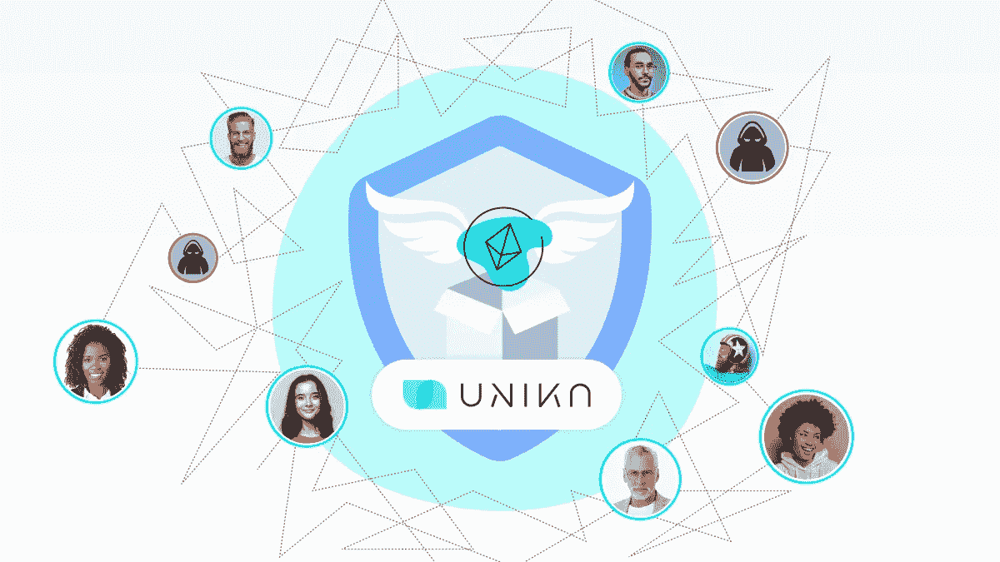

# 检测空投骗局#要点

> 原文：<https://medium.com/coinmonks/detecting-airdrop-scams-essentials-967e0655362f?source=collection_archive---------6----------------------->

how to fight airdrop scams?

骗子和诈骗犯一直是一个独立的群体，他们有自己的文化、语言和用来骗人的秘密方式。在互联网出现之前，甚至更早，在计算机发明之前，或者让我们更进一步，在欧洲技术突破之前，普通人都知道谁是骗子。在那个时候，秘密地做恶意的行为是困难的。

与我们现在看到的相反。网络诈骗犯和不良演员很难追踪。他们在伪装自己。如果我们谈论 Web2 欺诈，那么就有可能找到恶意的演员。有技术可以将互联网数据与个人联系起来，并确定他们的身份。然而，Web3 生态系统使欺诈匿名化，它自动将欺诈放在装有免费饼干的罐子旁边的低架子上，使其易于触及。这就是为什么很多倾向于诈骗的人行动自由，不受惩罚。

这一切给我们留下了什么？如果 Web3 中没有防止欺诈的保护措施，这意味着我们应该独立保护自己，保持警惕，尽量不要陷入骗子的网中。Web3 中的诈骗类型之一是空投诈骗。所以让我们深入研究一下，讨论一下我们可以保护自己免受其害的方法。

# 🏬什么是加密空投？

crypto 的免费分发叫做 **Airdrop** 。其中一种方法是发送一个新的或新兴项目的新密码，要求用户采取非常简单的行动。这些可以是在网上分享项目，放赞，或者只是在社交网络上谈论它，传播新闻。这种类型的网络 3 营销还有另一面。口碑传播带来更多用户，让项目家喻户晓。因此，加密分发的价值正在增长。这意味着以后我们可以将其兑换成其他加密货币或法定货币。Crypto Airdrop 被设计为一种强大的社区开发的手段，但是，不幸的是，它并不总是这样，否则，就不会有这个帖子的理由。

# 🦹‍♂️如何识别空投骗局？

有必要了解骗子主要通过两种方式使用空投。一种方法是通过向你发送恶意令牌来耗尽你钱包中的钱。有时，恶意用户可能会要求您提供您的私钥，这意味着任何人都可以访问您的钱包，所以不要想这么做。另一种方法是当坏人对这个项目或创造的密码不感兴趣时，利用空投作为一个更大的诈骗计划的舞台。他们想要得到的只是价值，如果你不小心，他们就会得到。系好安全带，让我们来看看目前已知的 5 种主要欺骗策略，这样你就可以警惕空投诈骗。

*   ***不明掉落到钱包里的***

不是所有免费的东西都是好东西。永远记住，当你在钱包里发现一些不知名的东西时。骗子这样做是希望引起你的注意。他们拿到后，需要你带着代币去交换。想都别想这么做，很有可能会激活恶意代码，你可能会失去钱包里的所有资产。

*   ***从假域名空投***

骗子通常会利用已知的域名，并轻轻改变品牌风格。他们实现了品牌相似性效应，并试图唤起你的兴奋，以获得免费的密码。不要轻信，也不要点击那些可疑邮件中的任何内容。

*   ***山寨社团***

一些诈骗犯甚至走得更远。他们在 Telegram 中创建了一个与合法的 Web3 服务提供商同名的虚假社区或团体。从实体的名称，他们运行加密空投，可能会欺骗你购买恶意加密。

*   ***钓鱼网站***

虚假空投有时会导致虚假网站。因为申请空投的做法因项目而异，有些要求你的钱包连接到实体网站，你应该格外小心。只要你给看似真实可信的网站提供了钱包钥匙，签了交易，很可能下一秒你的资产就被洗光了。请永远叫我 DYOR。

*   ***请求加密传输***

如果你发现自己处于空投要求你转移一些密码来激活免费令牌的情况，这很可能是一个假空投。合法的 Airdrops 通常在 coingecko.com 和 coinmarketcap.com 上市，绝不会要钱或任何种子期。

🚨当然，所有类型的空投骗局并不局限于我们讨论的那些。此外，空投的一个大问题是 Sybil 攻击。这种类型的骗局不仅影响 Web3 服务提供商，也影响 Web3 用户。有时，一个平台希望通过向用户发送密码来鼓励他们，但它不是将密码发送给唯一的用户，而是将资产发送给虚假账户，这些账户声称与真正的社区成员一起空投。如果 Sybil 攻击正在进行，那么欺诈的百分比将会很高。这意味着作为唯一用户的你很有可能会错过这个下载。你和其他用户可以投诉，这种情况以空投撤回而告终。在空投取消的情况下，谁都不高兴。该平台失去了它的声誉、信任和来自社区的支持。作为社区成员，你最终会被冷落，口袋里没有任何秘密。

为了防止这种情况，明智的做法是启动与 Web3 范式兼容且易于应用的识别机制。一种这样的方法是尤尼卡——一种分散的匿名识别协议。它将用户独特的生物特征与他们的区块链地址联系起来，一次只能让一个独特的用户接收一滴。

你可以在这里阅读更多关于这个项目的信息。保持链上和链下的安全！❤️