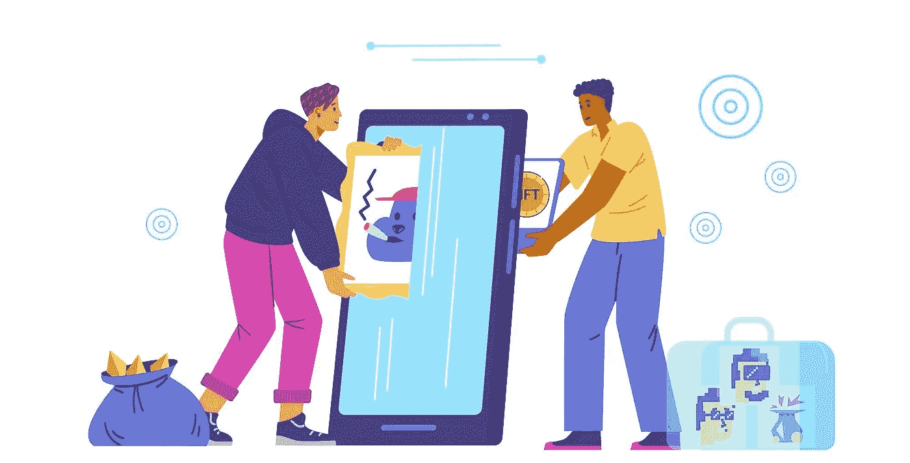

# 开发一个重要的基于智能合同的 NFT 市场——NFTs 和智能合同解释

> 原文：<https://medium.com/coinmonks/develop-a-significant-smart-contract-based-nft-marketplace-nfts-and-smart-contracts-explained-7774b0201513?source=collection_archive---------12----------------------->

区块链这一多用途的技术发展带来了数以百计的商业机会，这里不需要介绍。但是，对于那些初出茅庐的密码创业者来说，面对海量信息的轰炸，为了更好、更清晰地了解他们的业务，让我们把他们分成几个部分。

这篇博客将探讨两个概念，NFTs 和智能合同。此外，文章还将阐述雇佣一个运转良好的[**NFT 市场发展**](https://www.appdupe.com/nft-marketplace-development) **的关键因素。**

# **全球兴趣网简介 3**

在深入博客的细节之前，你对 web3 了解多少？

Web3 正成为全球关注的焦点，因为它能够挖掘出企业的真正潜力。也就是说，他们与生俱来的能力，建立在使用区块链技术的基础上，为所有的交易和交易提供了大量的去中心化。现在，这种 web3 技术的重要方面是，与将商业与股份带到桌面上的传统平台不同，他们高度可扩展的平台开发优先考虑创作者的工作，并建立自动化的工作系统。富裕的开发公司为加密企业家开发的一些 web3 应用程序主要基于 NFTs、加密交换、分散金融(DeFi)、分散应用程序(DApps)等等。

下一节将更详细地介绍在 web3 中成功运行去中心化商务的两个重要主题。它们是不可替代的代币和智能合约。

# **不可替换令牌(NFT)怎么样？**

不可替换的令牌，或者通俗地缩写为 NFTs，在 web3 中占据了很大的空间。这是因为它们的特点是给创作者提供他们应得的所有权以及从他们的创作中获得的全部利润。

重要的事情先来。加密世界中的这些 NFT 在技术上被定义为加密资产，允许数字空间为用户的每次选择提供完全独特和稀有的资产。例如，如果你去找一个 NFT A，你将找不到一个和以前的 NFT 一样的。为了开发这样的数字资产，开发者大多使用以太坊区块链的令牌标准 ERC-721 和 ERC-1155。现在，这种去中心化的技术可以涵盖哪些行业呢？

*   运动
*   艺术
*   比赛
*   音乐
*   元宇宙，还有更多。

对于这些多领域的令牌标准来说，要成为成熟的数字资产，它们必须被铸造到一个便于交易的平台上。

## 那么什么是智能合约呢？

我们不断地看到 web3 技术伴随着去中心化这个词。有没有想过是什么让他们如此？

为了让您更好地理解，智能合同是一种数字合同，其中编码了您的所有业务需求以及与基于 NFT 的平台相关的任何内容。这是一项创新，它抑制了密码平台操作中的任何人为错误，从而减少了大量资源。web3 中一个令人兴奋的新成员是元宇宙，在那里智能合约不仅仅是一个支持系统。

更进一步地说，智能合约是一种嵌入区块链技术更深的软件，催化用户端平台上的任何活动。随着智能合约集成到平台中，平台变得自动化，这也允许用户享受快速交易，鼓励更深入的参与。以下是关于智能合约的一些必须知道的信息。

## **智能合约驱动的 NFT 平台的优势**

对于一个想在 web3 领域做原创生意的密码爱好者来说，他们必须知道需要做些什么才能使他们的项目有利可图，成为相关的商业项目。然而，对于一个 [**NFT 市场开发**](https://www.appdupe.com/nft-marketplace-development) 来说，要成功获得其他密码爱好者的显著关注，他们必须知道让他们脱颖而出的关键点是什么——智能合同开发。

本节试图详细阐述同一问题，展示使用主干架构软件充分利用 NFTs 潜力的平台的优势。

*   智能合约的一个主要好处是，它们使平台工作没有任何中介或文书工作。
*   如果一个平台与智能合同相结合，用户就不会有麻烦了。也就是说，由于每个事务都是在满足编码的需求之后才自动化的，所以花费在交互上的时间减少了很多。
*   由于所有的要求和可能的活动都已经在平台中设置好了，用户可以享受一个同样具有成本效益的 swift 平台。
*   智能合约使得 web3 平台不可改变。
*   由于区块链网络技术，它们对用户是透明的。
*   这些数字合同可以以多种方式使用，因为它们是高度可定制的。
*   它们的适应能力允许它们以确定的方式完成任务。

为了了解更多关于在 2023 年 启动 NFT 市场的 [**，你需要对如何实施 NFTs 并使其成为一个真正好的投资机会有一个清晰的愿景。**](/coinmonks/white-label-nft-marketplace-development-steps-to-develop-your-crypto-startup-in-2023-7c92c165d4ff)

## **智能合约软件的用例场景**

*   使用智能合约验证合法性和所有权使用户能够访问关于 NFTs 所有权的信息。由于其基于区块链网络的架构，这些信息是可记录和可追踪的。例如，在教育部门，机构或其他教育设施可以为每一个其他学生提供一个 NFT，利用开放的区块链上的信息为他们提供就业机会。
*   NFT 许可证协助 NFT 持有者收集有关他们以前交易记录的信息。通过允许用户对他们的资产(可能来自任何域)拥有完全的访问和权限，它增加了平台的价值和吸引力。
*   正确使用它们可以避免欺诈活动或黑客攻击。因为它们也促进了平台的逻辑操作，它们将防止用户经历任何严重的差异。使用区块链上的智能合同开发，每一个其他凭证和其他活动都被打上时间戳以供验证，这可能是任何时候都需要的。在基于 NFT 的市场中使用智能合同的一些可追踪活动是加密钱包活动、艺术家/创作者的创意作品的所有权以及任何网络钓鱼或伪造文档等。，它们会被自动丢弃。

## **关闭思想！**

在你的 [**有利可图的 NFT 市场发展**](https://www.appdupe.com/nft-marketplace-development) 中，非功能性交易和智能合同携手并进。想象一下一个不提供所有权的 NFT 或者一个不使你的平台自动化的智能合同。难以想象对吧？

浏览可用的信息和许多资源，智能合同开发对于任何基于 web3 的企业来说都是不可避免的，以实现其核心目标。这意味着加密平台的三元悖论，或者如专家所说，可伸缩性、安全性和去中心化，只能通过智能合约来购买。如果你想开发一个美观的自动化 web3 项目，期待这个迷人组合的奇迹吧！

> 交易新手？尝试[加密交易机器人](/coinmonks/crypto-trading-bot-c2ffce8acb2a)或[复制交易](/coinmonks/top-10-crypto-copy-trading-platforms-for-beginners-d0c37c7d698c)