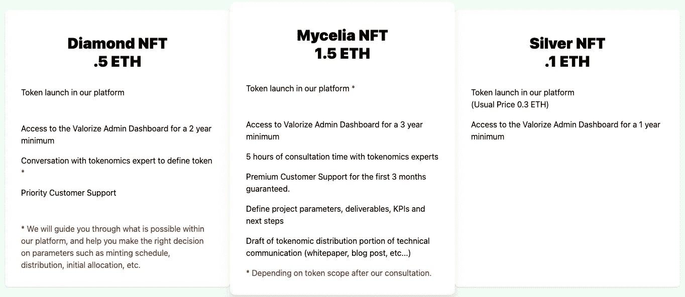
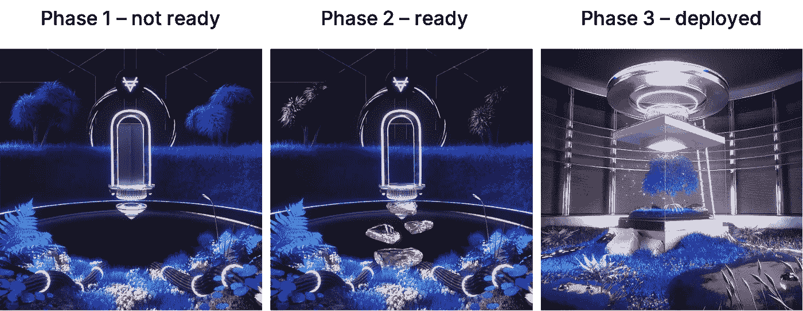
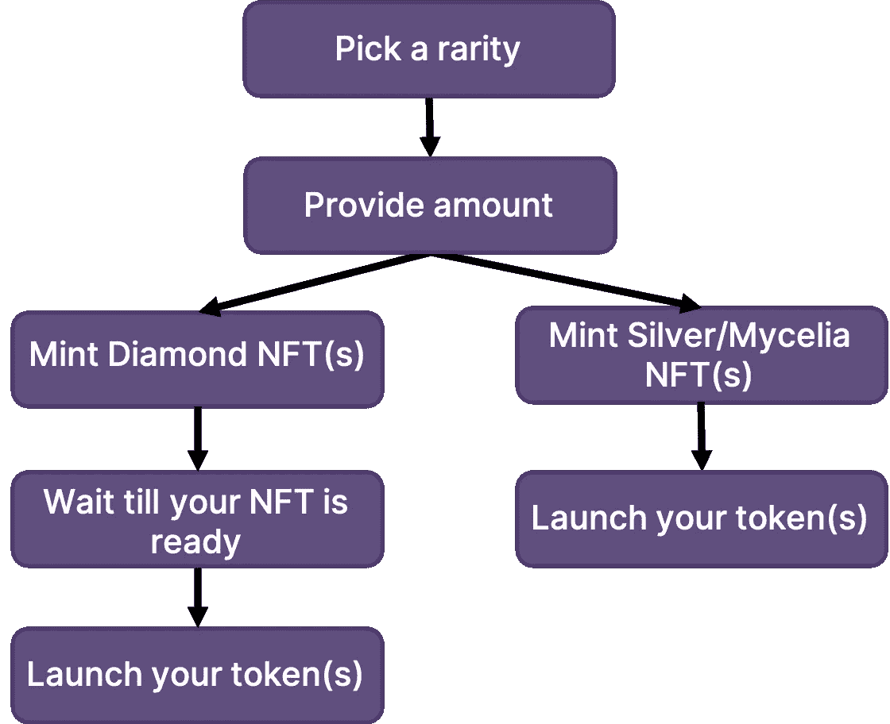

# 平价刀统一 NFT 的发展(一)——产品 NFT

> 原文：<https://medium.com/coinmonks/development-of-valorize-daos-unity-nft-part-1-product-nft-58c22de70a2?source=collection_archive---------24----------------------->

马可·休伯特

*我们的*[*Unity*](https://nft.valorize.app/)*项目包含了一个爱好者心中渴望的一切:一个充满激情的团队，对道作出贡献，13 名顶级艺术家创造非凡的艺术和经验丰富的智能合同开发人员创造定制的智能合同，以满足这个巨大的项目的需要。* ***隶属于 Unity NFT 的首个 NFT 项目——产品 NFT 项目，将于 2022 年 9 月 20 日启动。***

产品 NFT 项目的中心是使用 Valorize DAO 的产品:一个你可以一键启动你自己的令牌的应用程序。这是一个用户友好的 ERC20 令牌启动器，允许您创建符合您需求的令牌，包括可选的定时铸造和空投功能。发布后，该应用程序通过仪表板提供了简单的令牌管理，这进一步改善了以太坊网络上令牌使用的可访问性和用户体验。关于如何使用 Valorize DAO 的应用程序启动您的令牌的指南可以在[这里](/valorize-dao/how-to-launch-a-token-with-valorize-part-1-97348b4bb17c)找到。

**铸造和持有产品 NFT 的奖励**

产品 NFT 项目包含三种不同的稀有:菌丝体，钻石和银。所有 NFT 持有者将每月收到我们的过渡治理令牌$tVALOR，数量取决于您的 NFT 的稀有程度。除了空投治理令牌之外，铸造 NFT 产品将根据稀有程度为您提供额外的好处:

**产品 NFTs 的产品状态**

产品 NFT 的艺术随着产品的地位而变化。有三个阶段:未就绪、就绪和部署。白银和菌丝 NFT 可以在铸币后直接发射他们的令牌，所以当铸币后他们会被赋予就绪状态。在 NFT 准备好部署之前，钻石 NFT 有一个月的潜伏期，因此在 mint 上，钻石 NFT 的产品状态将被设置为未准备好。在此之后，钻石 NFT 将被授予就绪状态，持有者可以通过 valorize 应用程序启动令牌。请看下面，让我们先睹为快，看看每一个钻石 NFT 舞台的艺术。

**智能合同开发**

记住产品 NFT 项目的上述特征，我们可以开始开发这个智能合同。我们将使用 ERC1155 标准，因为与 ERC721 和 ERC721A 相比，它允许批量传输和许多其他有用的功能。智能合约代码可以在的 GitHub 上找到。

我们的自定义智能合约应包含以下实现:

*   菌丝体、钻石和银 NFT 的三种不同铸造功能。
*   在 mint 上设置产品状态的功能。
*   将产品状态从“未就绪”→“准备部署”和“准备部署”→“已部署”更改的功能。
*   返回 NFT 稀有度的外部函数。
*   实施 [EIP-2981](https://eips.ethereum.org/EIPS/eip-2981) 的版税。
*   缓慢铸造:继承了一个抽象的契约，允许 NFT 买家每回合只铸造少量的非功能性铸币。

**三稀铸造功能**

这些功能继承了 ERC1155 的批量铸造功能，允许用户填写数量并铸造该数量的 NFT。在 mint 时，每个 NFT 将有自己的令牌 Id，每个令牌 Id 都有产品状态集，并且将发出一个包含该信息的事件。薄荷后的任何时候，你都可以检查你的产品状态和 NFT 的稀有程度。

**通过产品 NFT 智能合约铸造 NFT 的工作流程**

**NFT 版税:EIP-2981 实现**

正如前面提到的[这里的](/valorize-dao/how-we-are-developing-a-smart-contract-to-manage-royalties-for-artists-of-our-nft-a3427f865b16)，我们已经创建了一个版税分销商智能合同，允许艺术家接收他们的版税，如果需要，可以更改接收这些版税的地址。但是，为了让智能合约接收和分配这些版税，我们需要在产品 NFT 智能合约中实现 EIP-2981 的 royaltyInfo 函数的接口函数。该函数返回帐户地址，以及 NFT 市场在每次交易后用于分配版税的以太网版税金额。

**NFT 的缓慢铸造**

为了确保我们能够有足够的时间为我们所有的 NFT 持有者提供最好的代币咨询，我们最初只想提供有限数量的 NFT。通过 slowMintable 抽象智能契约，我们可以设置每个稀有物可以铸造的代币数量。

***产品 NFT 项目将于 2022 年 9 月 20 日推出。***

加入我们的不和:[https://discord.gg/hrXRtb5A](https://discord.gg/hrXRtb5A)

请继续关注我们的会员 NFT 项目的第二部分！

欲了解更多关于团结 NFT 项目的信息，请访问我们的网站:[https://NFT . valorize . app](https://nft.valorize.app/)

> 交易新手？试试[加密交易机器人](/coinmonks/crypto-trading-bot-c2ffce8acb2a)或者[复制交易](/coinmonks/top-10-crypto-copy-trading-platforms-for-beginners-d0c37c7d698c)