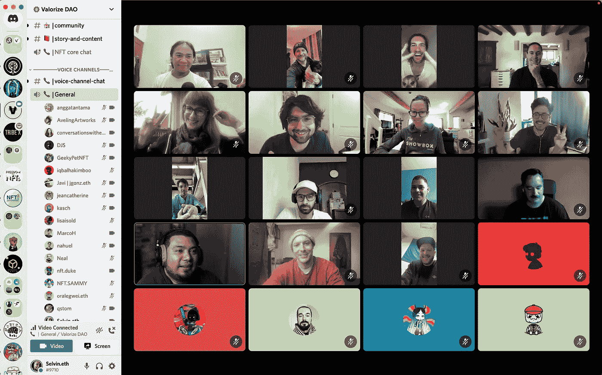
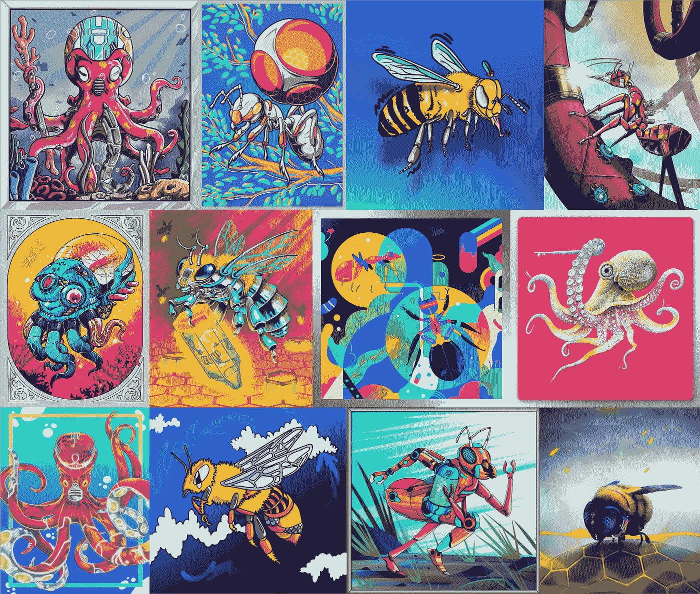
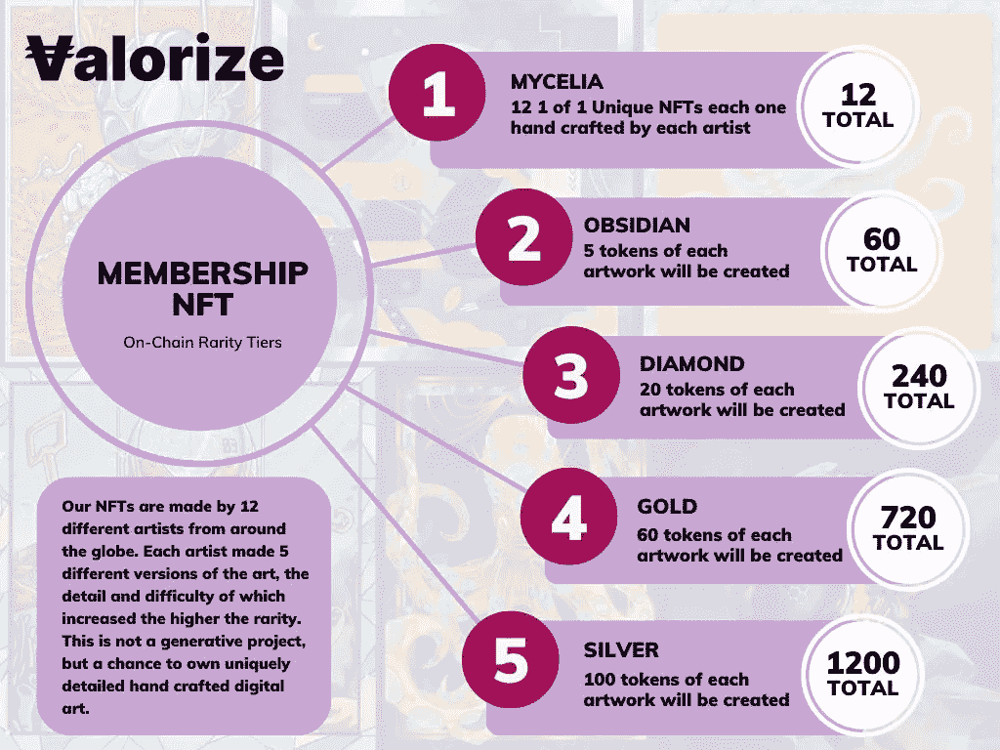
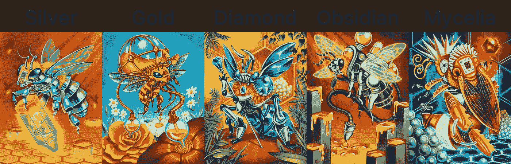

# 平定道统一的发展历程(二)——隶属(艺术)

> 原文：<https://medium.com/coinmonks/development-of-valorize-daos-unity-nft-part-2-membership-nft-art-74515c33d43a?source=collection_archive---------43----------------------->

马可·休伯特

*我们的* [*Unity NFT*](https://nft.valorize.app/) *的架构包含了 NFT 爱好者所渴望的一切:一个充满激情的团队，由估价道贡献者、多名顶级艺术家和经验丰富的精明合约开发者组成。我们共同打造了一个前所未有的系列，以反映 Web3 核心的多样性，并展现未来的太阳能朋克愿景。一部两部作品，* [*第一部:产品系列*](/coinmonks/development-of-valorize-daos-unity-nft-part-1-product-nft-58c22de70a2)*2022 年 9 月 20 日推出(现在直播)。* ***第二部:会员 NFT，2022 年 10 月 25 日上线。*** *继续阅读下面的内容，了解更多关于这个系列的信息，让我们的世界更加美好。* ***在这篇文章中，我们将谈论为这个 NFT 项目制作的艺术品。***

会员 NFT 的底价是 0.1 ETH。访问我们的网站来铸造你的 NFT:[**https://NFT . valorize . app**](https://nft.valorize.app)/

**什么是 NFT 会员，艺术是如何结合在一起的？**

ValorizeDAO 通过创建用户友好的无代码令牌启动平台来服务于人类并改善他们的协作。通过我们的乐观和目标，我们设想了一个太阳能朋克世界，在那里自然和人类和谐相处，这是人类高效合作的结果。考虑到这一点，我们邀请了 12 位世界知名的天才艺术家，包括设计网飞标志的艺术家，为这个庞大的 NFT 项目创作艺术作品。我们以 ValorizeDAO 团队、Karl Schulschenk(艺术总监)和所有艺术家之间的不和谐开始了这个精彩项目的旅程:

在卡尔的指导下，12 名艺术家每人创作了一只蜜蜂、章鱼或蚂蚁。这三种动物代表了培育一个太阳能朋克世界所需的一切:**努力工作、团队协作/合作、利他主义、聪明、耐心、繁荣和坚韧**。

**NFT 的稀有性和收藏价值**

每种动物都有五种不同的稀有元素:**银、金、钻石、黑曜石和菌丝体**，银的稀有程度最低，菌丝体最高。稀有程度取决于可用的非功能性食物的数量。例如，对于菌丝体的稀有性，只有 12 个独一无二的艺术杰作被创造出来，成为最高的稀有性。而对于银质稀有动物，每只动物可获得 100 NFTs，因此总共可获得 1200 NFTs，使其成为我们系列中最常见/最不稀有的 NFT。以下是为银器珍品创作的所有艺术作品的拼贴画:

以下是每个稀有品种可获得的 NFT 数量的概述:

随着稀有程度的增加，动物进化了，艺术也增加了复杂性，因为它获得了更多的特征，不同的颜色和更多的特权来获得 NFT 奖！当稀有度增加时，这是蜜蜂进化的一个秘密高峰:

艺术家们总共创造了 12 种不同的动物和 5 种不同的稀有动物，最终形成了一个美丽的收藏库，里面有 **60 件独特的艺术品供您收藏！**这是一个创建自己的数字艺术画廊的机会，如果你想把它们印在画布上，甚至可以创建一个真实的艺术画廊！**

非常感谢 Karl 和所有为 ValorizeDAO 创造了这个不可思议的数字艺术收藏的艺术家们！

> “看到每一个人对所获简介的诠释，以及他们如何将自己独特的风格和声音带入系列，真的很有趣。我认为这个系列真正突出的地方是，我们拥抱和探索一种统一的感觉。虽然生殖性 NFT 系列在这个领域肯定有自己的位置和价值，但这种特殊系列的方式更合适，也更符合 solarpunk 的愿景。通过这种方式，该系列让人更容易联想到传统艺术展。每位艺术家作品的风格和表现形式都不符合单一的格式。对我来说，UNITY NFT 系列代表了对多样性的赞美，以及对我们如何通过技术更好地与自然合作，为子孙后代创造更可持续的环境的乐观愿景。它是关于拥抱技术并塑造它，以帮助人类更可持续，并与周围的环境和生态系统和谐相处，为所有生物创造更光明的未来。”
> 
> —卡尔·舒尔申克，统一 NFT 系列的艺术总监。

想了解更多关于 NFT 的项目吗？访问我们的 [NFT 网站](http://nft.valorize.app)。

想看更多的统一 NFT 收藏艺术吗？去我们的 [Instagram](https://instagram.com/valorize.dao) 或者 [Spatial](https://spatial.io/s/ValorizeDAOs-NFT-Room-6353cdc3cb7acc000195e09d?share=4224888224031891209) 。

***会员制 NFT 项目将于 2022 年 10 月 25 日启动。***

*Valorize DAO 正在构建无代码工具，以帮助社区在未来 100 年甚至更长时间内进行大规模协调。我们主办了一个免费的双周令牌组学学院，帮助其他人了解令牌组学这门新兴科学。产品 NFT——我们 UNITY NFT 系列的第一部分——现已上线，网址为*[*https://NFT . valorize . app*](https://nft.valorize.app)/*；通过在*[*Twitter*](https://twitter.com/ValorizeDAO)*上关注我们来了解我们的社区，参与我们的* [*不和*](https://discord.gg/nRGpedFH) *，关注我们的*[*insta gram*](https://www.instagram.com/valorize.dao/)*，访问我们的* [*空间*](https://spatial.io/s/ValorizeDAOs-NFT-Room-6353cdc3cb7acc000195e09d?share=4224888224031891209) *或立即在* [*https 上推出您自己的代币/加密货币*](https://valorize.app.)

*   *该作品目前还不能用于商业用途，只允许个人使用。

> 交易新手？尝试[加密交易机器人](/coinmonks/crypto-trading-bot-c2ffce8acb2a)或[复制交易](/coinmonks/top-10-crypto-copy-trading-platforms-for-beginners-d0c37c7d698c)