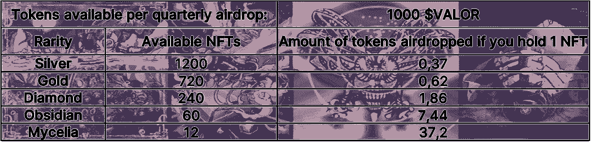

# 平准道统一的发展:第二部分——会员(额外津贴)

> 原文：<https://medium.com/coinmonks/development-of-valorize-daos-unity-nft-part-2-membership-nft-perks-8a643f64d2f?source=collection_archive---------25----------------------->

马可·休伯特

*我们的* [*Unity NFT*](https://nft.valorize.app/) *的架构包含了 NFT 爱好者所渴望的一切:一个充满激情的团队，由估价道贡献者、多名顶级艺术家和经验丰富的精明合约开发者组成。我们共同打造了一个前所未有的系列，以反映 Web3 核心的多样性，并展现未来的太阳能朋克愿景。一部两部作品，* [*第一部:产品系列*](/coinmonks/development-of-valorize-daos-unity-nft-part-1-product-nft-58c22de70a2)*2022 年 9 月 20 日推出(现在直播)。* ***第二部:会员 NFT，2022 年 10 月 25 日上线。请继续阅读下面的内容，了解更多关于这个系列的信息，让我们的世界变得更加美好。在这篇文章中，我们将讨论铸造和持有会员 NFT 的额外津贴。***

**NFT 会员的底价为 0.1 ETH。访问我们的网站铸造你的 NFT:**[**https://NFT . valorize . app**](https://nft.valorize.app)/

除了美丽的艺术品，你为什么想要获得并持有 NFT 会员资格？

持有 NFT 会员证有两大好处:

1.  免费参加我们即将推出的 Tokenomics 学院课程。 ValorizeDAO 努力收集了大量关于代币、不可替代代币、半可替代代币、账户绑定代币、去中心化金融(包括赌注、流动性池等)的信息。)，几层 1 区块链等许多话题。我们正致力于将这些信息汇编成一个令牌组学课程，每个主题都在 2 到 4 分钟的视频中进行讨论。该课程将很快推出。你可以利用这个课程**在投资加密领域时做出更明智的决定，并领先于其他人**！
2.  **进入 ValorizeDAO discord 的专属会员区。**一个只有 NFT 会员才能加入的地方，在这里他们可以交易会员资格的 NFT，与志同道合的人交谈，还可以直接接触 ValorizeDAO 核心团队。
3.  未来四个季度的$VALOR governance token 空投，作为持有 NFT 会员资格的红利。每 3 个月，你会收到$VALOR 治理令牌。这些目前还没有价值，但最先进的双令牌模型将于 2023 年在 Q1 实施。这个模型允许你用通货膨胀治理代币交换通货紧缩代币，称为$xVALOR，可以用来交换 ETH 或 USDT。以下是每个季度每个稀有度将空投的代币数量的概述:

这三项奖励，主动和被动奖励的组合，是你成为 ValorizeDAO 正式会员所需要的一切。这是一个参与运动的机会，这个运动为塑造一个人类可以充分发挥潜力的世界迈出了第一步。如果你和我们一样对未来乐观，那么这就是最适合你的 NFT！随着时间的推移，更多的额外津贴将被添加到会员 NFT。使得铸造、收集和保存这些非功能性食物变得更有价值！

**UNITY NFT =会员 NFT +产品 NFT:您加密之旅的终极开始！**

在 UNITY NFT 系列的第一篇文章中，我们介绍了[产品 NFT](/coinmonks/development-of-valorize-daos-unity-nft-part-1-product-nft-58c22de70a2) 。持有产品 NFT 可以让你免费使用我们的产品，一个无代码令牌发射器。拥有 NFT 会员资格可以让你通过 Tokenomics Academy 课程变得知识渊博。您将能够利用这些知识，通过[我们的平台](https://valorize.app)铸造产品 NFT，为您的社区/机构/公司推出最合适的令牌。这在 NFT 项目和这些 NFT 之间创造了协同效应，允许你启动你的公司进入加密空间！

***会员制 NFT 项目将于 2022 年 10 月 25 日启动。***

Valorize DAO 正在构建无代码工具，以帮助社区在未来 100 年甚至更长时间内进行大规模协调。我们主办了一个免费的双周令牌组学学院，帮助其他人了解令牌组学这门新兴科学。产品 NFT——我们的 UNITY NFT 系列的第一部分——现已在[*https://NFT . valorize . app*](https://nft.valorize.app)/*上线；通过在*[*Twitter*](https://twitter.com/ValorizeDAO)*上关注我们来了解我们的社区，参与我们的* [*不和*](https://discord.gg/nRGpedFH) *，关注我们的*[*insta gram*](https://www.instagram.com/valorize.dao/)*，访问我们的* [*空间*](https://spatial.io/s/ValorizeDAOs-NFT-Room-6353cdc3cb7acc000195e09d?share=4224888224031891209) *或立即在*[*https://推出您自己的代币/加密货币*](https://valorize.app.)

> 交易新手？尝试[加密交易机器人](/coinmonks/crypto-trading-bot-c2ffce8acb2a)或[复制交易](/coinmonks/top-10-crypto-copy-trading-platforms-for-beginners-d0c37c7d698c)