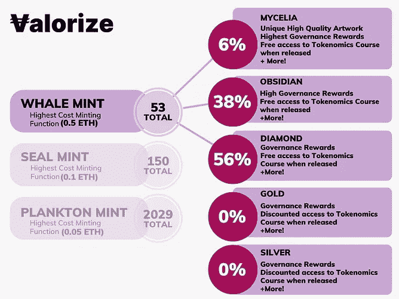
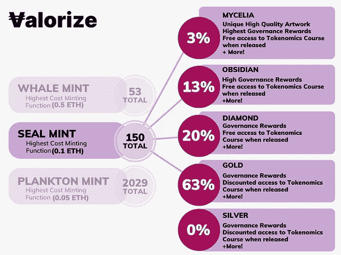
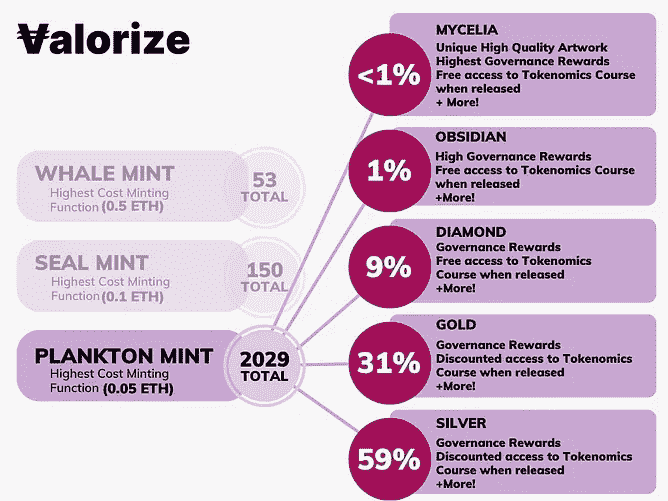

# 稳定道统一的发展:第二部分——会员(Smart 合同)

> 原文：<https://medium.com/coinmonks/development-of-valorize-daos-unity-nft-part-2-membership-nft-smart-contract-86f79a471990?source=collection_archive---------41----------------------->

马可·休伯特

*我们的* [*Unity NFT*](https://nft.valorize.app/) *的架构包含了 NFT 爱好者所渴望的一切:一个充满激情的团队，由估价道贡献者、多名顶级艺术家和经验丰富的精明合约开发者组成。我们共同打造了一个前所未有的系列，以反映 Web3 核心的多样性，并展现未来的太阳能朋克愿景。一部两部作品，* [*第一部:产品系列*](/coinmonks/development-of-valorize-daos-unity-nft-part-1-product-nft-58c22de70a2)*2022 年 9 月 20 日推出(现在直播)。* ***第二部:会员 NFT，2022 年 10 月 25 日上线。请继续阅读下面的内容，了解更多关于这个系列的信息，让我们的世界变得更加美好。在本文中，我们将讨论为会员 NFT 项目开发的智能合同。***

**NFT 会员的底价为 0.1 ETH。访问我们的网站铸造你的 NFT:**[**https://NFT . valorize . app**](https://nft.valorize.app)/

**会员 NFT 智能合同开发**

**防止稀罕物狙击**

NFT 项目的一个常见问题是，人们有一系列的技巧来找出下一个可以铸造的 NFT 珍品。通过这些技巧，他们希望铸造尽可能高的稀有度。如上所述，获得最高稀有度是最有回报的，因为它将具有最大的价值/效用，或者在 NFT 会员的情况下，获得更高数量的象征性空投。为了减少这种称为稀有性狙击的现象，并给每个人获得高稀有性 NFT 的机会，我们在智能合约中引入了(伪)随机性。智能合约代码可以在 Valorize DAO 的 GitHub 上找到。

**开发链上稀有的伪随机铸造函数**

为了使铸造游戏化，并防止稀有品种遭到狙击，我们使用 OpenZeppelin 的 ERC721 NFT 标准创建了三个铸造功能:鲸鱼、海豹和浮游生物铸造，因此您不会知道下一个铸造的稀有品种是什么。因此，当您单击铸造功能并确认交易时，将会发生以下情况:

1.  将产生一个(伪)随机数。
2.  这个数字决定了哪个稀有品种会被选中。
3.  所挑选的稀有物将被铸造，并且与该稀有物相关联的令牌 Id 将被发送给发起该交易的用户。

每个鲸鱼、海豹或浮游生物的铸造功能都让你有机会获得一定的稀有性。以下是一个概述:

**十二位艺术家的版税分配& EIP-2981 实施**

之前，我们创建了一个智能合同，允许向艺术家分配版税，这可以在[这里](/valorize-dao/how-we-are-developing-a-smart-contract-to-manage-royalties-for-artists-of-our-nft-a3427f865b16)找到。因为我们有 12 位艺术家只需要为他们创作的艺术收取版税，所以我们需要为每一位艺术家部署版税分配器。在 EIP-2981 实现之后，我们添加了 royaltyInfo 函数，当令牌 Id 被交易时，该函数将版税发送到一个已部署的版税分配器智能合同。

***会员制 NFT 项目将于 2022 年 10 月 25 日启动。***

*Valorize DAO 正在构建无代码工具，以帮助社区在未来 100 年甚至更长时间内进行大规模协调。我们主办了一个免费的双周令牌组学学院，帮助其他人了解令牌组学这门新兴科学。产品 NFT——我们 UNITY NFT 系列的第一部分——现已上线，网址为*[*https://NFT . valorize . app*](https://nft.valorize.app)/*；通过在*[*Twitter*](https://twitter.com/ValorizeDAO)*上关注我们来了解我们的社区，参与我们的* [*不和*](https://discord.gg/nRGpedFH) *，关注我们的*[*insta gram*](https://www.instagram.com/valorize.dao/)*，访问我们的* [*空间*](https://spatial.io/s/ValorizeDAOs-NFT-Room-6353cdc3cb7acc000195e09d?share=4224888224031891209) *或立即在* [*https 上推出您自己的代币/加密货币*](https://valorize.app.)

> 交易新手？尝试[加密交易机器人](/coinmonks/crypto-trading-bot-c2ffce8acb2a)或[复制交易](/coinmonks/top-10-crypto-copy-trading-platforms-for-beginners-d0c37c7d698c)