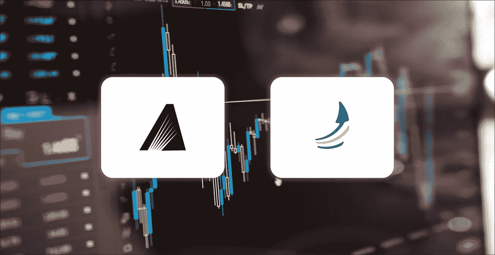
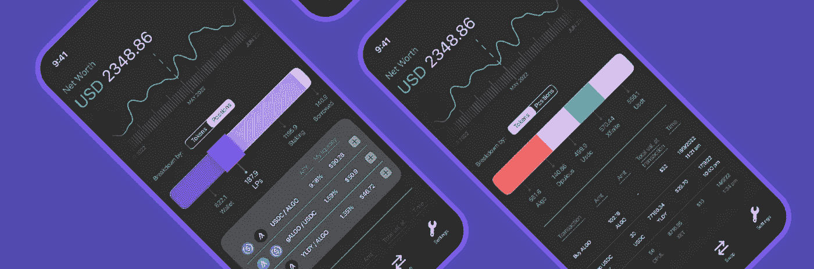

# DEX 聚合器:可能是 DeFi 中最有用的产品

> 原文：<https://medium.com/coinmonks/dex-aggregators-possibly-the-most-useful-product-in-defi-6e753bd0e1c8?source=collection_archive---------33----------------------->

*本文是数码收藏品，可在* [*Tokenblogs*](https://tokenblogs.app/listing/buynow/946227395) 拥有

Alammex & Upside Finance

> “我只和上次交换时一样忠诚，但自从使用了指数聚合器后，我就再也没去别的地方看过了。”

我一直在寻找阿尔格兰德所有分散交易所的最低转换率，以便在交易 ALGO/美元时多赚 2 美元。

当我要交换的基础资产如此不稳定时，为最小的保证金而烦恼是及时的，而且无可否认是无意义的。

我很不情愿地需要费力地在每个平台上点击 15 次来访问他们的智能合约，却发现他们提供了一个糟糕的价格。😞

因此，你可以想象当一个 DEX 聚合器进入 Algorand 生态系统时，我有多轻松。

# 新的希望

自 7 月份以来，用户已经能够以较高的利率兑换他们的加密货币，这要归功于 DEX aggregators 从所有 Algorand AMMs 的各种流动性来源中提取汇率，并只需点击几下鼠标就可以为您提供最佳价格。

聚合器甚至会将你的互换分解成多个指数的更小的互换，为你提供最佳的转换率。

*上图:显示我的 115 USDC 为给我 ALGO 而经历的旅程的交换细目*

我甚至不会用我 115 USDC 的 6%换回 ALGO，然后穿过 STBL 和 goBTC 去 ALGO。但是 DEX 的聚合器*做*。

*就个人而言，DEX Aggs 显示此信息的方式，即分解您的交换详细信息的方式，应该作为一个可选的下拉菜单提供——因为我花了一段时间才弄清楚我到底在看什么；但是仍然非常酷。*

# 🐐产品:Alammex

> [*Alammex*](https://www.alammex.com/) *，Algorand 上的一个* [*DEX 聚合器*](https://docs.alammex.com/how-does-alammex-work) *，可能是我虔诚使用的生态系统中最有用的应用。*

不仅是我一直在使用它，他们也有一个忠实的用户群，每个月他们都会回来，仅这个月就有创纪录的 200 万美元的交易。

只有 400 多个帐户和 175 的 MAU，很明显，其他 Algorand DeFi 用户只是不知道或不理解这一出色的产品？也许是显示大量交易的界面，或者是使用了一些流行的术语，让潜在用户望而却步？…

但现实是，许多用户没有参与提供流动性，无法理解复杂的流动性衍生产品是如何工作的，甚至不知道他们的 APY 来自哪里。

虽然 [Defly](https://defly.app/) 提供了移动交易和最佳互换路线，但对于用户交易 Algorand 资产的界面更友好的移动应用程序来说仍有差距。

# 我向你介绍上行金融

Upside Finance UI

该团队获得了令人垂涎的进入 [Algorand Miami Accelerator](https://www.algorand-miami-accelerator.com/upside-finance/) 的许可，获得了 Algo 基金会和无国界资本的早期支持，一直在开发生态系统所需的东西。

[Upside Finance](https://pilot.upsidefinance.io/) 是一款移动应用程序，提供了一套对零售 DeFi 增长至关重要的产品，例如向交易者突出显示最佳收益农业机会，一个 DEX 聚合器以及一个投资组合跟踪器。

Upside 的移动应用程序上的 DEX agg 将由 Alammex 提供支持。*一个加密创业伙伴关系的优质例子*。

提供一个无缝的用户界面和一系列令人印象深刻的产品，这可能是大规模零售 DeFi 在 Algorand 上的移动应用的桥梁，以与 Defly 等竞争吗？我确实看到了很多好的方面😏

# 我们想从 DeFi 那里得到什么？

> *一旦你使用了一个 DEX* ***聚合器*** *你就再也不会访问另一个 DEX 了。*

所有 DeFi 初创公司都将成为聚合者的附庸，向社区展示见证互换费用归零的竞赛，同时试图向流动性提供者提供尽可能高的回报并平衡安抚激励。

毫无疑问，我们需要这些东西📉📉

1.  掉期交易的低费用
2.  在获得*最优填充*的同时，尽可能快地将资产作为**交换**
3.  尽可能少点击**成为池中的 LP**
4.  用**我的本币**翻译投资组合和 LP 收益率的分析
5.  知道我的资金是 ***安全的***

不要误会我的意思，很多 dex 都这样做，但它可能会更好。

阿尔格兰德的分散金融仍处于起步阶段。主要市场参与者有限，流动性来源更少的 dex 屈指可数。

*How DEX interfaces look sometimes* 💀

有一个显示贷款利率、大量数字、货币和年利率的登录页面让我想起了核反应堆控制室，我立刻吓坏了，并立即跑回到铁皮人那里。

如果 DEX 聚合器能够正确地完成接口，并使术语在社交上简洁，他们会看到更广泛的采用。

# 关于 DeFi & DEX 聚合器中 UI/UX 的最终想法

> DEX 聚合器是否应该告诉你，基金经历了所有这些不同的 AMM，以及每种货币的百分比？

这很有趣，不要误会我的意思，但这不是我*需要*知道的信息。我只是想要一个便宜的交换。但是如果 AMM 不提供一点宣传，他们会阻止 DEX agg 使用他们的 API 吗？…不确定。

*谢谢你走了这么远。*

*本文是数字收藏品，可在* [*Tokenblogs*](https://tokenblogs.app/listing/buynow/946227395) 收藏

> 交易新手？在[最佳加密交易](/coinmonks/crypto-exchange-dd2f9d6f3769)上尝试[加密交易机器人](/coinmonks/crypto-trading-bot-c2ffce8acb2a)或[复制交易](/coinmonks/top-10-crypto-copy-trading-platforms-for-beginners-d0c37c7d698c)