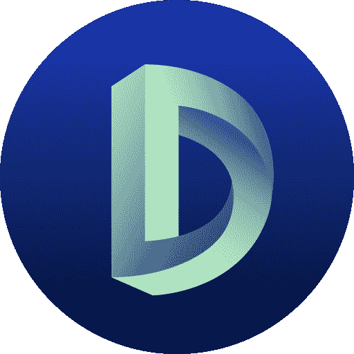
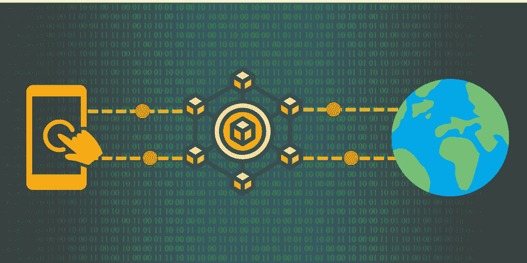
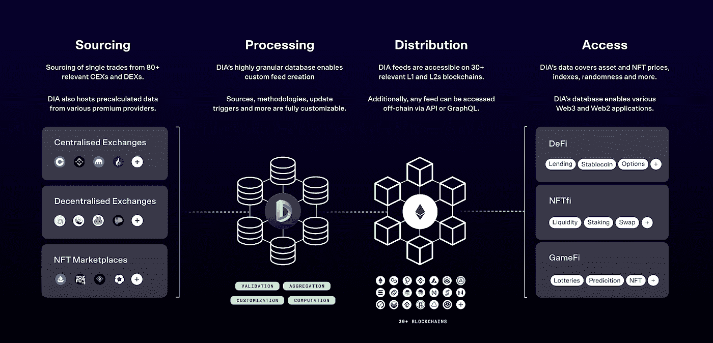
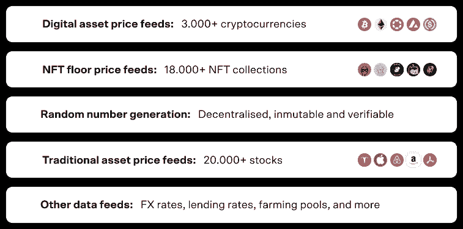
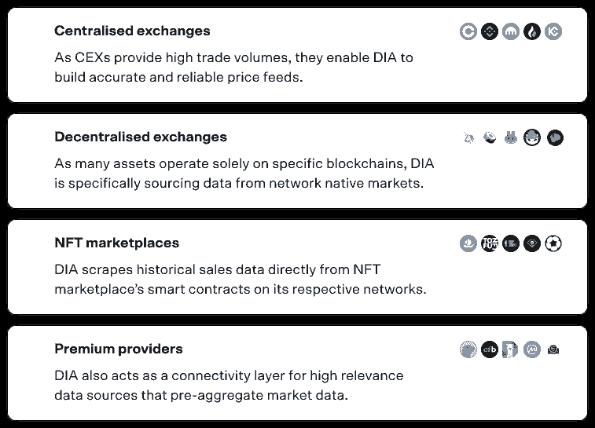

# 迪亚道

> 原文：<https://medium.com/coinmonks/dia-dao-5c0a6e6f76f6?source=collection_archive---------56----------------------->

**Oracles for Web3**

# 甲骨文问题

Web3 基础设施中最不为人知和重视的组件之一是区块链 oracle。没有智能合约可以看到外部世界，它们需要通过外部功能提供数据馈送。虽然许多智能合约能够基于内部逻辑运行，不需要链外数据，但更高级和复杂的合约需要这些数据才能运行。

> 从顶级交易者那里复制交易机器人。免费试用。

智能合约的一个限制是，当满足某些条件时，它们不能调用自己的函数，所有函数必须由钱包或另一个智能合约调用。这使得自动化事件触发器很难实现。

另一个限制是任何区块链都不能产生真正的随机数。这使得像游戏和赌博这样的 dApps 不可能在不基于有偏见的和可预测的随机数来源的情况下实现。

# 解决方案

输入神谕。Oracles 是以分散、公正的方式向智能合约提供链外数据的服务，用于以下用途:

*   加密货币的价格馈送
*   随机数发生
*   智能合同自动化

典型的 oracle 使用分散的网络节点，每个节点提供独立的数据馈送以换取支付令牌。Oracles 很快成为分散金融(DeFi)的支柱，因为大多数 DeFi dApps 需要价格反馈和真实世界的数据才能运行。

VRF(可验证的随机函数)生成公平和真实的随机数，允许加密赌场在没有“赌场边缘”的情况下运行，同时也支持许多玩赚即玩(P2E)游戏。这允许对基于由无偏见的、分散的来源生成的随机数具有正确赔率的用户更加公平。

甲骨文的另一个流行用途是用加密货币和 NFT 价格来定义借贷，这是触发清算电话所需的信息。还可以提供其他非加密的价格馈送和报告。

基于外部事件的智能合约自动化允许开发人员避免使用在集中式服务器上运行的机器人来执行简单的任务，例如在特定条件下触发智能合约。

虽然它们在后台工作，但 oracles 代表了 Web3 的一个重要组成部分，为智能合约提供了无偏见的数据、随机性和自动化。通过向区块链提供真实世界的数据，可以在其他不可能的场景中开发强大的应用和 dApps。

# 什么是 DIA？

## 介绍

DIA 的意思是开源生态系统中的财务数据。DIA 的目的是向 Web3 dApps 提供透明、准确和可验证的数据，汇集数据提供商、用户和社区成员。

DIA 代表**去中心化信息资产**，这是一个多链、端到端的开源平台，为整个 Web3 提供数据和 oracle 服务。这实现了传统和数字金融应用程序的数据源、验证和共享。DIA 提供机构级数据，涵盖资产价格、元宇宙数据和贷款利率。

## 国防情报局的数据

DIA 的数据来源于大量的链上和链下来源，允许 DIA feeds 在来源和方法的混合方面完全定制。结果是一个定制的、定制的、高弹性的提要，为 oracles 建立了一个新的范例。

谈到数据，DIA 使用几个不同的来源:

*   **开放贡献者** —一个开放的开发者社区通过 DIA 提供的开源平台构建刮刀来连接新的数据源。
*   **管理者和验证者** —令牌持有者讨论并投票决定改进平台和实施管理 DIA 协会的功能。
*   **离线处理** —原始数据经过净化，并基于透明的方法进行进一步处理，从而提供强大、可靠的数据。

每秒钟，来自链上和链下的数据源都在 DIA 平台上被聚合。这些来源包括 CEXes 和 DEXes、DeFi 项目、NFTs 和元宇宙。
新数据点通过专用 API 和 oracle smart contracts 交付。它们在超过 25 个第 1 层和第 2 层区块链网络中可供开发者使用。DIA 的 oracles 很容易集成到任何现有的智能合同中，并支持广泛的 DeFi 用例，如贷款、赌注和稳定资本。

## 种类

DIA 在数据来源方面采取的众包方法为该项目提供了一个独特的位置，利用了非常广泛的来源，确保最大限度地覆盖资产价格。任何可公开访问的数据馈送都可以获得，无论它是否在交易所上市或交易量如何——这意味着**不依赖第三方数据提供商**。

## ***来源***

凭借一个活跃的开发者社区和一个分布式节点网络，DIA 可以直接从许多链上来源或 CEX API 搜集、收集和最重要的是聚合数据，直到单个交易级别。

## 交付

DIA 允许用户选择他们接收数据的方式，基于强大的行业定义合作伙伴网络，为不断增长的 L1/L2 生态系统提供多种方法。DIA 的 xNode**on-chain delivery**Oracle 可以定制为基于以下内容触发更新:

*   **请求** —通过专用的智能合约或 API 调用触发更新。
*   **时间** —更新是在设定的预定时间间隔触发的。
*   **偏差**

任何愿意更多地参与 DIA 的人都可以自由地这样做，因为社区是他们快速扩张背后的主导力量。

## 社区

DIA 的社区由各种各样的个人组成，从开发人员和企业家到行业专业人士和对分散金融感兴趣的人。社区致力于创造一个更好的金融未来，并不断努力改善平台及其产品。

DIA DAO 有一个充满活力和活跃的社区，共同努力构建和维护该平台，并创造新的产品和服务，使每个人受益。

Discord 社区有许多称为公会的团体，允许成员以更有效的方式专注于处理不同的任务。例如，有专注于提高用户采用率的增长行会，专注于创建社交内容和改进文档的文案行会，甚至还有旨在构建和改进项目背后的复杂技术的技术行会。虽然有一个入门过程，但要求并不苛刻，这使你可以获得任务和奖金，并获得丰厚的回报。

我强烈建议你去看看他们，无论是在他们的不和谐还是他们的工作页面上。

[网站](https://www.diadata.org/) | [不和](https://discord.com/invite/zFmXtPFgQj) | [白皮书](https://docs.diadata.org/introduction/readme) | [媒体](https://medium.com/dia-insights) | [Github](https://github.com/diadata-org) | [推特](https://twitter.com/DIAdata_org) | [电报](https://t.me/DIAdata_org)

> 加入 Coinmonks [电报频道](https://t.me/coincodecap)和 [Youtube 频道](https://www.youtube.com/c/coinmonks/videos)获取每日[加密新闻](http://coincodecap.com/)

# 另外，阅读

*   [如何在印度购买比特币？](/coinmonks/buy-bitcoin-in-india-feb50ddfef94) | [瓦济克斯评论](/coinmonks/wazirx-review-5c811b074f5b)
*   [加密交易机器人](/coinmonks/crypto-trading-bot-c2ffce8acb2a) | [Probit 审查](https://coincodecap.com/probit-review)
*   [隐翅虫替代品](/coinmonks/cryptohopper-alternatives-d67287b16d27) | [HitBTC 审查](/coinmonks/hitbtc-review-c5143c5d53c2)
*   [CBET 点评](https://coincodecap.com/cbet-casino-review) | [库币 vs 比特币基地](https://coincodecap.com/kucoin-vs-coinbase)
*   [折叠 App 回顾](https://coincodecap.com/fold-app-review) | [Kucoin 交易机器人](/coinmonks/kucoin-trading-bot-automate-your-trades-8cf0ca2138e0)