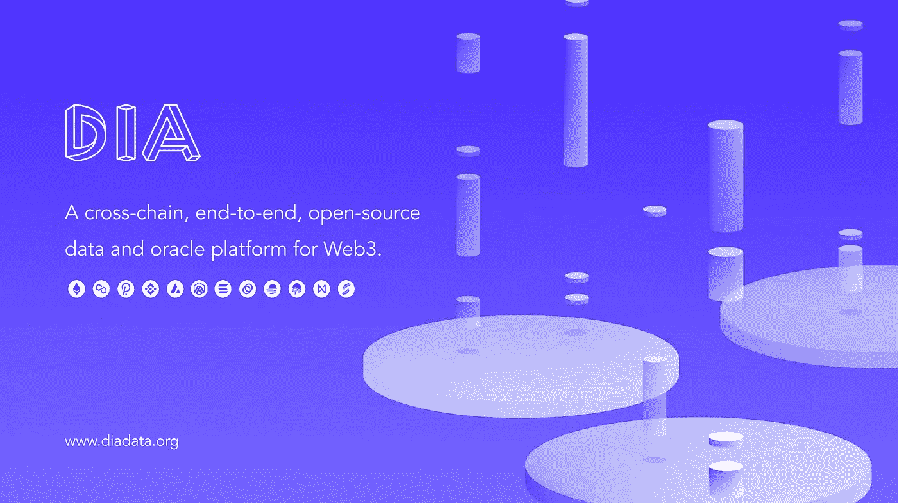
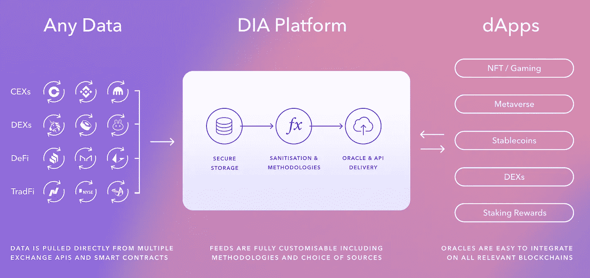

# DIA —针对 Web3 的开源 Oracles

> 原文：<https://medium.com/coinmonks/dia-open-source-oracles-for-web3-c873ddd46a50?source=collection_archive---------36----------------------->

# 国防情报局

了解将 web3 与各种任意的链外和链内数据连接起来的多链开源 oracles。

# 概观

DIA 是一个面向 Web3 的多链、端到端、开源数据和 oracle 平台，可以提供来自各种链上和链下来源的数据。

DIA 代表分散信息资产。它保护整个 Web3 的市场和智能合同。DIA 告诉智能合约“世界上的事情”，这样它们就可以执行现实世界的事件/结果。它从广泛的开源数据点获取数据，包括集中和分散的市场。

# 对神谕的需求

区块链互操作性是指不同生态系统之间无缝交换数据和传输相关信息的能力，而无需任何集中的实体/中介。实现互操作性至关重要，因为依赖 Web 2 时代的遗留架构或业务模型效率低、成本高且风险大，尤其是对于利用区块链技术希望向客户扩展和交付流畅高效的服务的企业而言。甲骨文是区块链基础设施的重要组成部分。它们以不可信的方式实现了外部世界和链上环境之间的顺畅通信。

金融智能合约需要真实世界的数据来触发执行，oracles 使这成为可能。Oracles 是第三方服务，为区块链智能合约提供离线数据访问，弥补了现有的信息差距。

> 交易新手？试试[加密交易机器人](/coinmonks/crypto-trading-bot-c2ffce8acb2a)或者[复制交易](/coinmonks/top-10-crypto-copy-trading-platforms-for-beginners-d0c37c7d698c)

区块链智能合约不具备访问链外数据的能力，这使得它们依赖 oracles 进行无信任执行。虽然 oracles 的存在是为了给区块链平台带来可靠和安全的离线数据，但它们也有某些缺点，包括集中化和操纵风险。

# 特征

DIA 是一个开源生态系统，旨在为 Web3 提供透明、准确和有效的数据。戴的各种重要特征包括

**开源&透明**

DIA 的代码库、源代码和方法都是开源的，可以公开获得。

**多链输送**

DIA oracles 具有不同的结构，可以在多个区块链上运行，包括 L1 和 L2。DIA 通过称为开发 Oracle 合同的智能合同，为不同区块链的相应 Mainnet 和 Testnets 上的现场测试提供了一系列选定的资产价格。

**多样化&定制数据馈送**

DIA 数据源是多种多样的，来自广泛的链上和链下来源，包括分散和集中的来源，包括 DEXes，CEXes，DeFi，NFT 市场等。数据通过 oracle feeds 和 API 端点交付，可由任何应用程序在所有可用的网络上使用。

DIA 可以提供定制的数据源，这些数据源可以根据数据源和方法进行定制。

**NFT 甲骨文支持** NFT 甲骨文包含有关 NFT 藏品底价的信息。DIA 收集区块链上所有 NFT 交易在综合区块链上的实时交易数据。数据直接来源于原产地，并允许精确的市场数据。

# 迪亚道

DIA 于 2018 年成立，长期使命是成为一个分散的组织，并自组织 DIA 的多样化技术劳动力。DIA DAO 是一个正式的框架，使社区能够支持 DIA 的增长和发展，并为此获得回报(ETH，XP)。

该计划奖励从运营到发展到增长的各个学科对 DIA 使命的贡献。最终目标是为 DIA 的利益相关者群体创造价值。道有六个帮会和三层角色结构。DIA 是使这成为可能的治理令牌。

加入迪亚不和投稿[https://discord.com/invite/HVvCvk4Ffg](https://discord.com/invite/HVvCvk4Ffg)

**一切区块链—** 追求简化元宇宙链的不同区块。

请考虑通过捐赠、推荐或在社交平台上关注来支持。

**下线**

[智囊团](https://app.usebraintrust.com/r/everything1/)，[预研](https://www.presearch.org/signup?rid=2491437)，[奥德赛](https://odysee.com/$/invite/@Cyekmyster:3)，[币安](https://accounts.binance.com/en/register?ref=12626399)，[库科恩](https://www.kucoin.com/ucenter/signup?rcode=rJCLFS2)

**社交**

[Substack](https://everythingblockchain.substack.com/account?utm_source=menu-dropdown) ， [Twitter](https://twitter.com/cyekmyster) ， [Youtube](https://www.youtube.com/channel/UCkcc6EceEAu1sMoi2dKczCQ) ， [Medium](/@everythingblockchain) ， [Reddit](https://www.reddit.com/user/cyekmyster)

本文提供的任何或所有信息仅用于教育目的，不得视为投资建议。在正确呈现任何信息方面的任何失误都是我们的责任。我们否认与使用此内容相关的任何责任。

> 加入 Coinmonks [电报频道](https://t.me/coincodecap)和 [Youtube 频道](https://www.youtube.com/c/coinmonks/videos)了解加密交易和投资

# 另外，阅读

*   [Bookmap 评论](https://coincodecap.com/bookmap-review-2021-best-trading-software) | [美国 5 大最佳加密交易所](https://coincodecap.com/crypto-exchange-usa)
*   [加密交易机器人](/coinmonks/crypto-trading-bot-c2ffce8acb2a) | [造币评论](https://coincodecap.com/coingate-review)
*   最佳加密[硬件钱包](/coinmonks/hardware-wallets-dfa1211730c6) | [Bitbns 评论](/coinmonks/bitbns-review-38256a07e161)
*   [新加坡十大最佳加密交易所](https://coincodecap.com/crypto-exchange-in-singapore) | [购买 AXS](https://coincodecap.com/buy-axs-token)
*   [红狗赌场评论](https://coincodecap.com/red-dog-casino-review) | [Swyftx 评论](https://coincodecap.com/swyftx-review)