# 钻石手交易机器人—第二部分

> 原文：<https://medium.com/coinmonks/diamond-hand-trading-bot-part-2-29facefd86f4?source=collection_archive---------8----------------------->

第一部分—[https://medium.com/p/47ab0a54c0c7](/p/47ab0a54c0c7)

好了，如果你还没有去看第一部分。这里有一些 Sequelize 的教程，Sequelize 是一个 ORM(对象关系管理器),用于与我们的数据库进行交互。我们使用它的原因是因为它简化了过程，我们不需要写任何 SQL，只需要 Javascript。如果你不知道我在说什么，或者你对所用的代码不是 100%了解，请查看一下。

续集——第一部——https://medium.com/p/f5caa9ceb30f

续集——第二部——https://medium.com/p/203b44cb7e95

好了，现在你已经用你的表建立了数据库&你已经准备好开始编写机器人了。

那计划是什么？

1/构建所需的对象(合同/钱包/提供商)

2/开始检查循环

3/检索 Matic 的价格，USDC 为 1 Matic

4/从数据库中检索最后的检查细节

5/检索钱包的当前 USDC 和自动余额

6/检查当前价格是否比 last_price 低 5%,如果是，用 USDC 余额的 5%购买 Matic，向订单表提交信息，销售价格比购买价格高 5%。更新上次行动价格。

7/从数据库中检索所有订单。

8/对于表中的每个未售出订单，检查订单的销售价格是否已达到，如果已达到该点，则出售 Matic，并将数据库中的记录更新为已售。更新上次行动价格。

9/如果最后行动价格等于 0，则将最后行动价格和最后价格都设置为当前价格，因为这必须是机器人第一次运行

10/如果当前价格比采取行动时的最后价格高 2.5%，则将最后价格设定为比上一行动价格高 2.5%。

首先创建一个. env 文件，把你的私钥放在里面，确保我们是安全的

属国

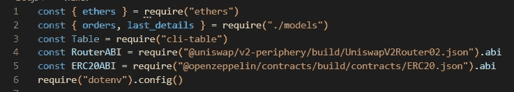

*   Ethers.js
*   我们数据库中的表格模型
*   cli 表格输出模块
*   uni swap v2-外围合同
*   @openzeppelin/contracts
*   Dotenv

运行以下命令

npm 安装 ethers CLI-table @ unis WAP/v2-peripheral @ open zeppelin/contracts dotenv

变量

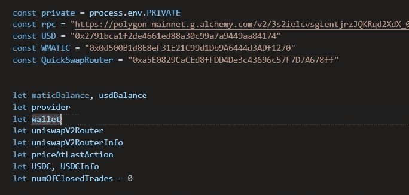

定义一些常量变量&一些正常变量的用法。

检索和输出订单

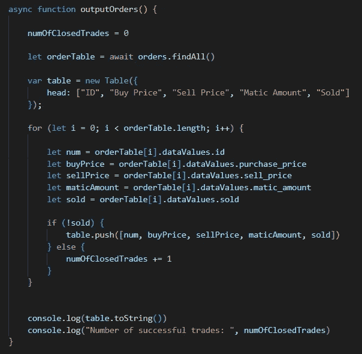

1/检索订单

2/定义我们要输出的表格

3/遍历订单

4/如果当前订单尚未售出，将详细信息添加到表格中，如果已经售出，则增加 ClosedTrades 的数量

5/输出表格和成功交易的数量

时间函数

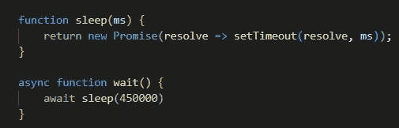

只是为了在整个使用过程中保持可读性

等待功能在两次检查之间等待 450 秒

检索价格

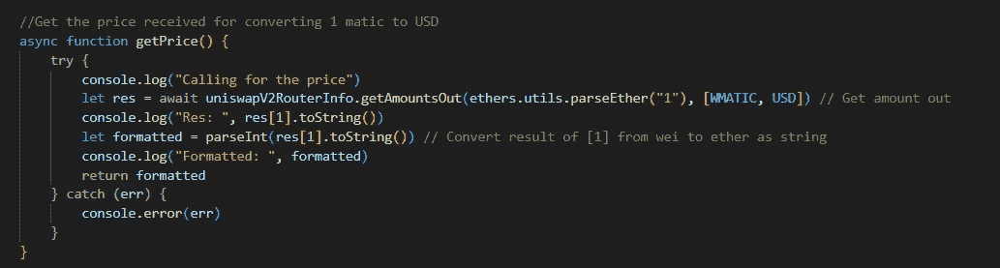

尝试检索 1 Matic 到 USDC 的价格。

购买

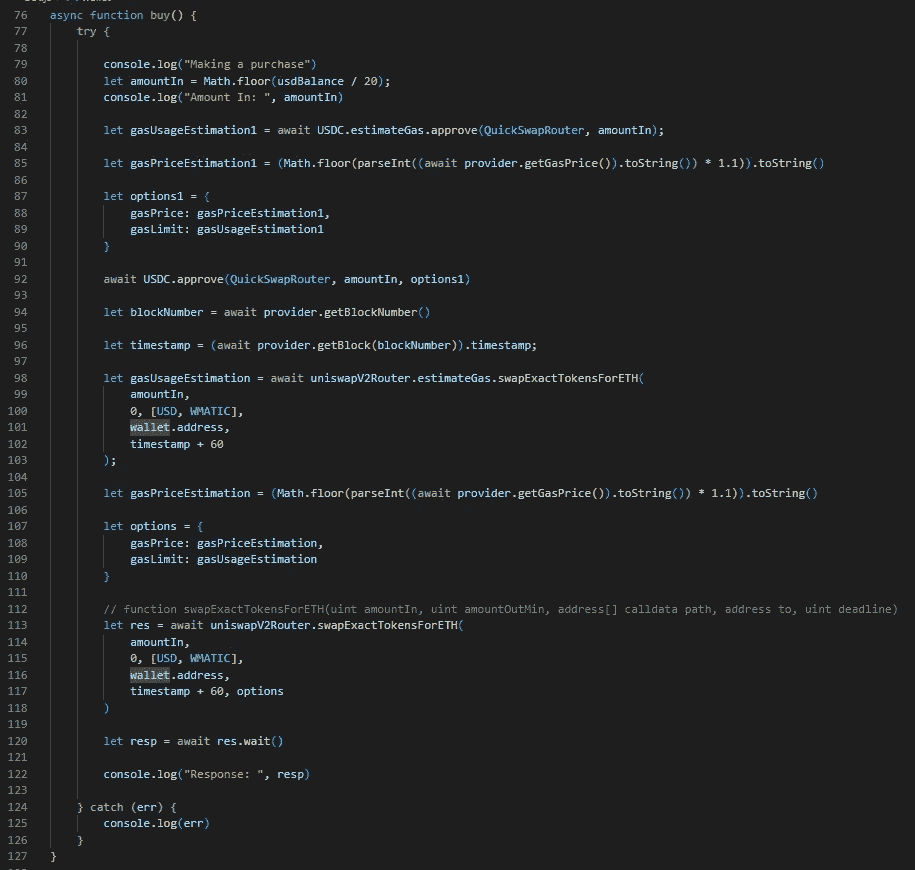

1/获得 USDC 余额的 5%

2/计算批准路由器进行转换所需的气体单位数量

3/检索当前的天然气价格，并加收 10%的费用，以确保我们的 tx 快速通过

4/批准路由器使用我们的 USDC

5/检索当前块信息和时间戳

6/计算进行转换所需的气体单位数量

7/检索当前的天然气价格，并加收 10%的费用，以确保我们的 tx 快速通过

8/进行转换

进行销售

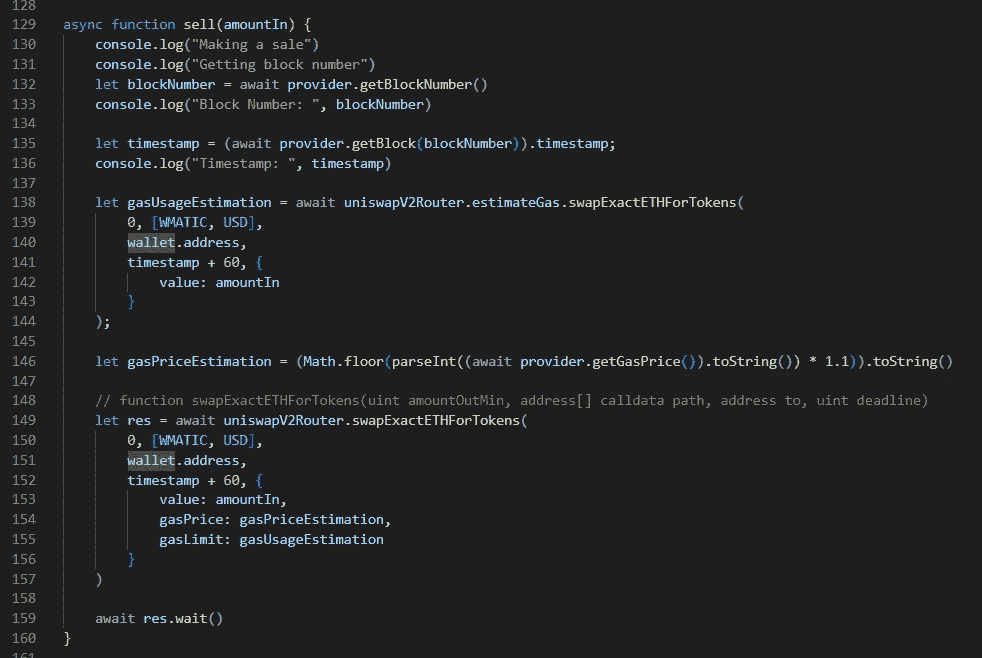

1/检索当前块信息和时间戳

2/计算执行交易所需的预期气体单位用量

3/检索当前的天然气价格并增加 10%

4/从 ETH 转换到 USDC

检索 ETH 余额

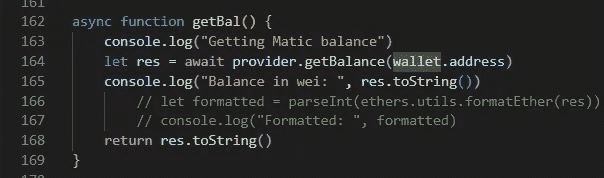

1/找回您钱包中的余额地址

2/将其转换为字符串并返回

主循环

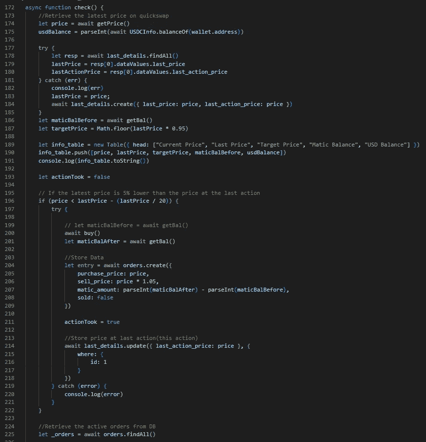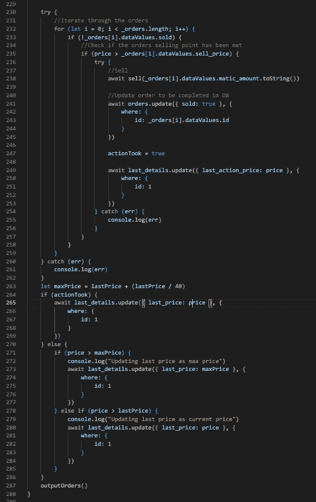

1/检索当前价格

2/取回 USDC 天平

3/尝试从数据库中检索最后的价格

4/如果失败，将最后的价格设置为当前价格，并在最后的细节表中创建一行

5/检索您钱包的当前自动余额

6/计算购买的目标价格

7/建立、设置和输出关于该检查的表格

8/如果我们的购买点已经满足，尝试执行步骤 9 至 12

9/进行购买，设置 actionTook 为 true

10/取回自动平衡

11/在订单表中创建一条记录

12/更新最后行动价格

13/如果步骤 9 至 12 失败，则输出错误

14/检索订单

15/尝试步骤 16 至 21

16/遍历每个订单

17 如果订单没有售出

18/如果已经达到销售价格

19/销售，设置动作将视为真实

20/将订单更新为已售

21/更新最后行动价格

22/计算我们将最后价格设定的最高价格(比最后行动价格高 2.5%)

23/如果采取了行动，则将最后价格设置为当前价格

24/如果当前价格高于最高价格，则将最高价格设置为最终价格

25/如果当前价格高于最终价格，但低于最高价格，则将当前价格设置为最终价格

26/输出控制台的命令

最终位

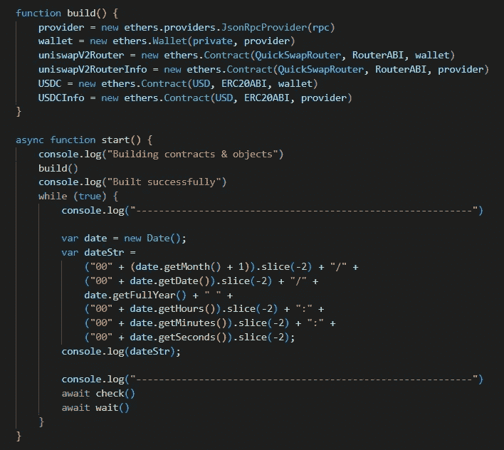

构建—用于构建所有必需对象的功能

开始

1/调用构建

2/永远迭代

3/输出当前日期和时间

4/呼叫检查

5/等待

好了，这是主要代码，这个检查的执行应该通过 cron 作业来完成，但这将在下一篇文章 xD 中讨论

如果你觉得这个有趣，那就看看这个吧！
[https://medium.com/p/9eda96d06973](/p/9eda96d06973)

坚实发展研究小组—[https://discord.gg/KzbcGmrnfN](https://discord.gg/KzbcGmrnfN)

-多边形联盟—[https://www.polygonalliance.com/](https://www.polygonalliance.com/)

——多边形联盟不和—[https://discord.gg/kJKPCGQu66](https://discord.gg/kJKPCGQu66)

你喜欢这篇文章吗？想请我喝杯咖啡吗？
Polygon/Eth/Bsc—0x4a 581 E0 EAF 6b 71d 05905 e8e 6014 DC 0277 a1 b 10 ad

> *交易新手？试试* [*加密交易机器人*](/coinmonks/crypto-trading-bot-c2ffce8acb2a) *或* [*复制交易*](/coinmonks/top-10-crypto-copy-trading-platforms-for-beginners-d0c37c7d698c) *上* [*最好的加密交易*](/coinmonks/crypto-exchange-dd2f9d6f3769)

> 加入 Coinmonks [电报频道](https://t.me/coincodecap)和 [Youtube 频道](https://www.youtube.com/c/coinmonks/videos)获取每日[加密新闻](http://coincodecap.com/)

# 另外，阅读

*   [免费加密信号](/coinmonks/free-crypto-signals-48b25e61a8da) | [加密交易机器人](/coinmonks/crypto-trading-bot-c2ffce8acb2a)
*   [杠杆代币](/coinmonks/leveraged-token-3f5257808b22)终极指南
*   [16 款最佳折叠电动自行车](/coinmonks/top-17-folding-electric-bikes-5e296f0918cb)
*   [28 款最佳电动自行车点评](/coinmonks/the-28-best-electric-bikes-review-and-buying-guide-in-2023-7bb3146cb403)
*   前三名[币安期货交易机器人](/coinmonks/top-3-binance-futures-trading-bots-e6031f84b3f9)