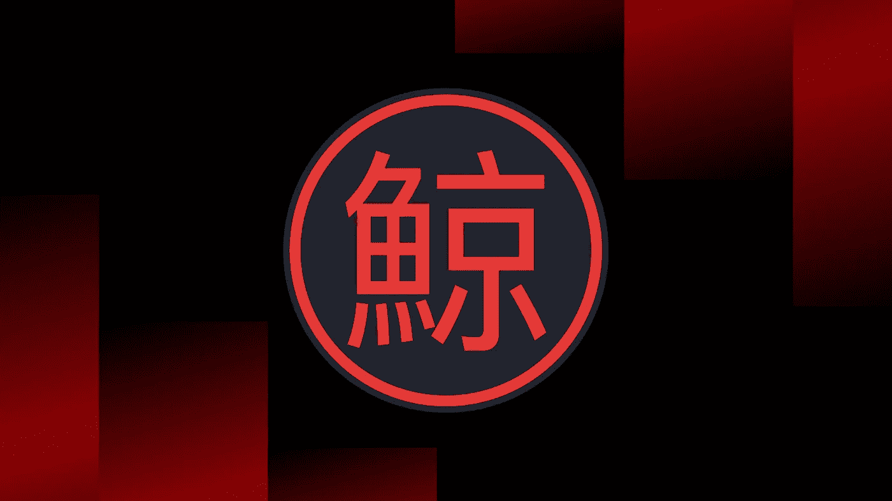
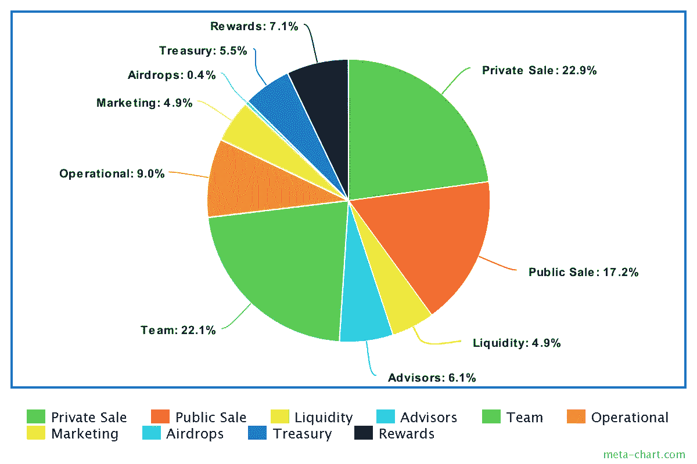
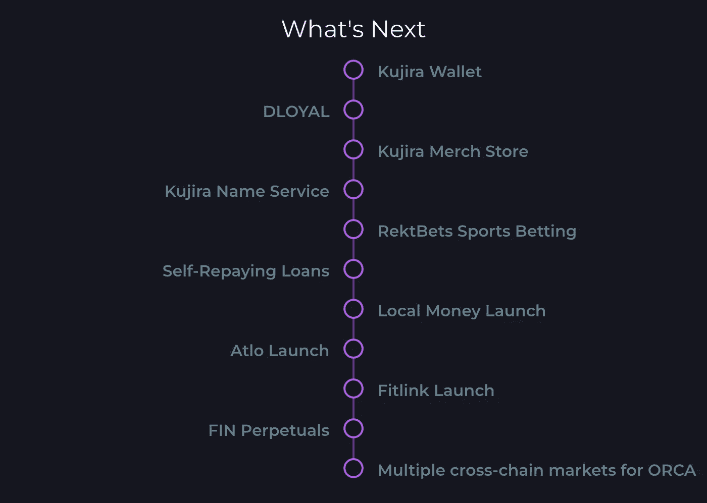
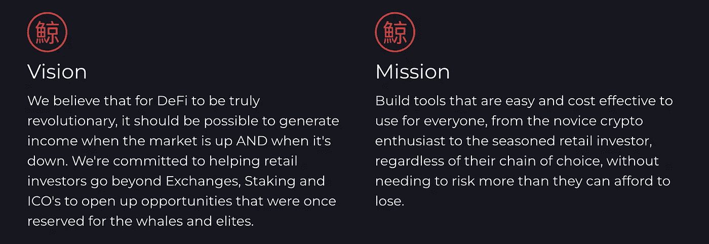

# 未经雕琢的钻石:鲸声优

> 原文：<https://medium.com/coinmonks/diamond-in-the-rough-kujira-e53951e2039f?source=collection_archive---------0----------------------->

我第一次遇见鲸声优是在泰拉还活着的时候。在早期，鲸声优被认为是熊市中表现最好的协议。其核心产品 Orca 是一个免费使用的清算引擎，允许投标人以折扣价购买清算抵押品，运行顺畅。这对于逢低买入和套利来说都很棒。然而，Terra 面临着它不可避免的命运，崩溃了，带来了本地协议。对鲸声优来说，这只是暂时的挫折。从 5 月份开始，这个团队一直在努力工作，推出了我在 Web 3 中从未见过的产品。通过这篇文章，我旨在唤起人们对鲸声优将创造的未来的期待。

# 目录

1.  [当下](#26c6)
2.  [不可否认的三位一体:鲸声优版](#4ae9)
3.  [令牌组学](#bc39)
4.  [用例](#a0ec)
5.  [交易:财务](#6f97)
6.  [流动性:BOW](#346d)
7.  [稳定清算:USK/奥卡](#2146)
8.  [前方的路](#0570)
9.  [结论](#e9a2)

# 现在

自从 Terra 崩溃以来，鲸声优不再是一个独立的协议，取而代之的是，已经扩展成为宇宙上的一个主权 L1。它的重点？

> 寻求可持续金融科技的协议、建设者和 web3 用户的分散生态系统。

简而言之，鲸声优现在是一个以 DeFi 为中心的 L1。为什么要建造自己的 L1，而不是搬到以太坊/索拉纳之类的地方？通过拥有自己的 L1，鲸声优的 DeFi 协议不需要面对成本的不确定性，这在单片链上经常是个问题。这个问题在 Delphi 的[文章](https://members.delphidigital.io/reports/finding-a-home-for-labs)中有概述。TLDR，在单片链上，DeFi 协议必须与其他协议竞争块空间。最近，以太坊上 XEN 的出现就说明了这一点，它造成了拥堵，并使汽油费上升到过高的水平。因此，建立在主权 L1 之上允许鲸声优上的协议具有更好的 UX，这是由于更低的费用，而不必与特别的活动竞争(例如，大量用户涌入制造 NFT)。

第二个原因，也可能是更重要的原因，拥有主权链允许对生态系统的核心令牌(在这种情况下是 KUJI)进行更强的价值累积。在以太坊这样的整体链上，由于 ETH 是唯一的 gas 令牌，费用收入会泄漏到底层。通过拥有主权链，鲸声优能够将来自其链上协议的所有费用收入导向 KUJI，这极大地加强了 KUJI 的令牌组学模型(更多内容将在令牌组学部分阐述)。

# 不可否认的三位一体:鲸声优版

不可否认的三位一体是我提出的一个框架，用来评估长期的加密投资。它由 3 点组成:

*   令牌组学
*   使用案例
*   社区

我已经详细解释了这三个方面的确切内容，并给出了好的和坏的例子。查看文章,了解如何判断一个加密项目是好是坏！现在，让我们继续看看鲸声优是如何不可否认地符合三位一体的(啊哈)。

## 令牌组学

按照今天的标准，KUJI 的象征经济学可以被认为是相当强大的。主要原因是 KUJI 的赌注模式。通过下注您的 KUJI 代币，您可以累积来自网络费用和本地应用程序费用的奖励。

> 等等…赌注年利率只有 1.73%？！

不幸的是，赌注的回报是微不足道的(截至撰写本文时)，目前。一个原因可能是赌注奖励不会导致通货膨胀。KUJI staking 不会凭空打印代币。但这也意味着鲸声优目前的收入很低。鲸声优还没有获得很大的牵引力，但在前面的部分，我将解决这是如何改变！

接下来，我们看看令牌分发。

Token Distribution for KUJI (Total: 122.4M)

坦率地说，代币发行并不是最分散的。乍一看，内部人员和团队确实拥有大量代币。下面列出了一份授权时间表:

> 私下销售 27.975M 12 个月归属
> 公开销售 21M 6 个月归属
> 流动性 6M
> 顾问 7.5M 12 个月归属
> 团队 27M 24 个月归属
> 运营 11.025M 24 个月归属
> 营销 6M 24 个月归属
> 空投 500K *烧后调整
> 国库 6.75M 24 个月归属
> 奖励 8.648M *烧后调整

从好的方面来看，授权开始于 2021 年 11 月，将于 2023 年 11 月 9 日结束，距离现在不到一年。MCap/FDV 比率为 0.8，比许多项目都好，大部分代币已经流通。因此，保证未来来自未锁定/已授予代币的卖出压力较小。

KUJI 也有不同的赌注等级:

*   第一层:500 库吉
*   第二层:5000 库吉
*   第三层:50000 库吉

关于它们的细节还没有公布，但是如果我没记错的话，在 Terra 上，持有更多的 KUJI 意味着使用 Orca 的费用更低。使用协议可能有好处(例如费用折扣),可以获得更多的 KUJI。这让投资者有更多理由继续持有 KUJI。

我喜欢 KUJI 的主要原因是，不仅是普通投资者，鲸声优协议的创造者也会受到激励，保持并努力实现 KUJI 和鲸声优的成功，因为 KUJI 令牌将从他们投入的辛勤工作中积累价值。这可以被视为生态系统整体利益的良好结合。由于持有的强烈动机和未来可能较低的抛售压力，我认为 KUJI 的 tokenomics 是强劲的。权力下放的因素也正在被解决，参议院很快就会有结果。

## 使用案例

对于一个真正成功的加密投资/项目，应该有强有力的用例。鲸声优的主要部分依赖于 DeFi 的论点。为什么 DeFi 是未来，为什么鲸声优会是领导 DeFi 的人？让我们现在回答这些问题。

金融服务的[规模](https://www.thebusinessresearchcompany.com/report/financial-services-global-market-report)(如借贷、卡&支付、经纪等。)到 2022 年，市场规模将达到惊人的 25.58 万亿美元。预计到 2026 年将达到 33.35 万亿美元。这对 DeFi 来说是一个巨大的市场，根据 [CoinGecko](https://www.coingecko.com/en/categories/decentralized-finance-defi) 的数据，目前该公司的市值仅为 352.5 亿美元。在金融服务全球[报告](https://www.thebusinessresearchcompany.com/report/financial-services-global-market-report)中，陈述了以下要点:

> 全球支付行业见证了 EMV 技术应用的快速增长。与传统磁条卡相比，EMV 芯片和 PIN 卡提供了更高级别的数据安全性，推动了这一增长。EMV 是各种支付卡的安全标准，包括借记卡、信用卡、签帐卡和预付卡
> 
> 银行和金融机构正在采用数字化来实现商业贷款业务的现代化。这一举措主要是由于银行之间的竞争加剧，以及对简化和快速商业贷款流程的需求不断增长。数字化提高了客户获得商业贷款的满意度，否则这将是一个复杂而缓慢的过程。

如上所述，越来越多的卡采用 EMV 技术，这表明需要更好的支付标准。EMV 技术实际上非常类似于链上交易，即每次购买都会生成一个唯一的交易代码(就像区块链哈希码一样)。EMV 使用率的增加也是因为大多数 EMV 卡和读卡器都带有近场通信(NFC)，允许非接触式支付。从这里，我们看到了两件事，安全和方便。尽管区块链支付每次都会生成独特的交易散列，但它们尚未被广泛采用。从你的加密钱包中花钱基本上是不可能的，因为像 MetaMask 这样的流行钱包不提供这样的服务。这让我们想到了 DeFi 的问题，这是一个不方便的障碍，将它与现实世界分隔开来。普通消费者很难接受 DeFi 服务，因为他们无法在现实世界中直接花钱购买 DeFi 服务。在链上或链外赚钱的经历可能很糟糕，甚至很危险。这导致 DeFi 主要只被那些不介意麻烦的精通密码的本地人采用。

鲸声优认识到这一点，并打算推出自己的钱包，专注于包括电子商务在内的现实世界支付。这个钱包也将与支持此类支付的鲸声优协议相集成。钱包的预告可以看[这里](https://twitter.com/TeamKujira/status/1585000273696546816)。支付也将以鲸声优的美元稳定货币 USK 完成，稍后我将详细介绍其机制。使用 USK 将允许在没有任何令人难以置信的会计处理的情况下进行加密支付，这可能会发生在不稳定的 T2 支付中。这种支付集成使用户能够在 DeFi 和现实世界的服务之间无缝切换，从而提高资本效率，有效降低准入门槛。

还有一个明显的趋势是流程的数字化，这是目前非常受欢迎的，因为实体流程会浪费更多的时间。这些都是 DeFi 可以轻松解决的痛点。DeFi 不仅有可能扰乱市场，还可能进一步扩大市场。DeFi 允许消费者仅通过互联网连接获得金融服务。此外，DeFi 的去中心化性质还允许低端消费者不受限制地享受金融服务(无 KYC/繁琐的信用评级)。DeFi 的恶劣性也表明了新的金融工具出现的巨大潜力，这进一步扩大了潜在的市场。有了鲸声优钱包，用户将能够从他们的手掌访问 DeFi 服务。原生钱包将允许更好的用户体验(UX)和与鲸声优的原生协议更深入的集成，进一步增加可用性。

## 交易:财务

现在让我们深入了解一下鲸声优的革命 DeFi 服务。第一个是 FIN，这是一个利用订单簿机制的分散式交易所(DEX)。这使得它成为一个真正的 DEX，能够与 CEXes 竞争。市价单和限价单可以随意下单。也没有像 AMM 那样的滑点，因为你的订单取决于买价和卖价。也可以观察交易流。更多关于 FIN 的细节可以在这里找到[。](/team-kujira/fin-a-dex-to-stand-the-test-of-time-6a311e040297)

Kujira [Roadmap](https://kujira.app/)

根据路线图，FIN perpetuals 也将推出。正如我之前在 GMX [的演讲](https://www.youtube.com/watch?v=4SvLsKgj924)中解释的那样，永久资产的 TAM 是巨大的，在 [2021](https://tokeninsight.com/en/research/reports/tokeninsight-2021-crypto-trading-annual-review) 永久资产的总交易量接近 57 万亿美元。这约占 2021 年总交易量的一半。随着 FTX 的衰落，我们看到了 DEXes 的强大叙事，永久协议等协议的日活跃用户数(DAU)在过去一个月增加了 93.8%。随着黑天鹅成为 DEX 采用的强大催化剂和巨大的永久市场，FIN 凭借其实用的机制成为夺取利润丰厚的市场份额的有力竞争者。

## 流动性:BOW

BOW 是一个鳍的自动做市商(AMM ),使其更具流动性，从而激励用户在鳍上交易。BOW 的酷之处在于，与其他 AMM 不同，流动性池(LP)可以由任何人或任何协议自愿激励。这样，鲸声优就不需要以通货膨胀的方式印刷债券来刺激有限合伙人。BOW 还保持了较高的资本效率，仅涵盖已过账的订单，而非整个系列。总体而言，BOW 为具有各种激励措施的流动性提供商创造了独特的收益机会，并改善了 FIN 的交易体验。

## 稳定清算:USK/奥卡

USK 是一种与美元挂钩的稳定货币，由鲸声优的债务抵押债券发行。简单地说，它的工作方式非常类似于戴(由 DAO 制造的 stablecoin)，用户抵押加密资产来铸造 stablecoin。目前，你可以在[蓝](https://blue.kujira.app/mint)上用 ATOM/DOT/ETH 铸造 USK，这是鲸声优治理、连接和铸造 USK 的地方。CDP 模型被采用是因为其迄今为止被证明的稳定性，戴没有观察到任何严重的 depeg 事件，即使在如此多的秘密黑天鹅之后。

那么是什么让 USK 与众不同呢？这将是由于只有分散的资产将被用作抵押品，这实际上允许 USK 成为不受审查的货币。USK 的用户不必担心他们的资产被冻结或被列入黑名单，如果他们使用 USDT 或 USDC，这种情况可能会发生。

接下来，我们有 ORCA，它使零售能够参与竞拍清算资产。回到 Terra，这是最具创新性的产品之一，即使在 UST·德佩格时期也能有效工作(我设法以 30%的折扣买了 bLUNA，lol)。ORCA 的实力进一步巩固了 USK 的挂钩地位，因为 ORCA 鼓励用户参与清算用于以折扣价铸造 USK 的抵押品。因此，这降低了 USK 因缺乏应清算的投标资产需求而产生坏账的可能性。因此，确保 USK 总是完全抵押。

清算市场规模巨大。如果我们看一看[迪菲拉马](https://defillama.com/liquidations/eth?stackBy=protocols)，每天都有数亿到数十亿美元的清算发生。如路线图所示，ORCA 有跨链扩张的计划。ORCA 对每一个成功的投标的撤回收取 0.5%的费用。如果 ORCA 占据了 10%的清算市场，它每天就能赚到 50 万美元的费用(按 1B 清算的日价值计算)。到目前为止，我还没有听说过其他协议对 ORCA 做了类似的事情(如果你知道的话，请告诉我！)，看起来 ORCA 将主宰这个市场。

## 前方的路

为了结束这一节，让我们看看鲸声优还有什么:

*   DLOYAL:Web 3 的绩效营销和销售 dApp
*   鲸声优域名服务:鲸声优的域名
*   RektBets:梦幻体育博彩
*   本地资金:分散的入口/出口匝道服务
*   Atlo:发射台
*   Fitlink:移动赢取

鲸声优的未来似乎是光明的，因为它的本地协议将满足每个人的需求。人们应该记住，在鲸声优建造平台的费用很可能将全部归 KUJI 股东所有。

# 结论

最后，我将简要提及鲸声优的强大社区。它仍然是活跃的，特别是如果你在电报聊天中闲逛，那是相当吸引人的。尽管 Terra 崩溃了，仍然有许多信徒。每周综述也在积极撰写中，官方推特也依然活跃。NFT 的项目，如 KUJIRANS，也有助于给鲸声优的支持者身份。

Kujira’s Vision and Mission

对我来说，我觉得要真正成为和 DeFi 的中心，这不是一个“如果”,而是一个“文”。团队前进的方向让人想起了对 Terra 的承诺，不包括脆弱性。鲸声优的目标不仅仅是取悦已经存在的德根，也包括普通人，并实现大规模采用。他们的愿景是美好的，他们的使命使其得以实现。就这样，我将以鲸声优的宣言作为结束。

> 每个人都值得成为一条鲸鱼。

*免责声明:本人持有 KUJI，本文仅包含个人观点。我不是在推荐投资 KUJI tokens，我只是在解释为什么我喜欢鲸声优。*

*更新:
-以前，下注更多 KUJI 意味着访问 ORCA 的 premium* [*仪表盘*](/team-kujira/orcas-premium-dashboard-everything-you-need-to-know-9468fc1bf3a6) *。
-注意，FIN 上的市场订单确实会出现滑点。
- KUJI 不需要为 BOW 打印代币，因为交易算法从价差交易中获得收入，就像 CEX/TradFi 上的传统做市商(MM)一样。同时，100%的 BOW (MM)交易收入被分配给流动性提供者(在池中复合)。*

> 交易新手？尝试[加密交易机器人](/coinmonks/crypto-trading-bot-c2ffce8acb2a)或[复制交易](/coinmonks/top-10-crypto-copy-trading-platforms-for-beginners-d0c37c7d698c)
> 
> 加入 Coinmonks [电报频道](https://t.me/coincodecap)和 [Youtube 频道](https://www.youtube.com/c/coinmonks/videos)获取每日[加密新闻](http://coincodecap.com/)

## 另外，阅读

*   [复制交易](/coinmonks/top-10-crypto-copy-trading-platforms-for-beginners-d0c37c7d698c) | [加密税务软件](/coinmonks/crypto-tax-software-ed4b4810e338)
*   [网格交易](https://coincodecap.com/grid-trading) | [加密硬件钱包](/coinmonks/the-best-cryptocurrency-hardware-wallets-of-2020-e28b1c124069)
*   [密码电报信号](/coinmonks/top-3-telegram-channels-for-crypto-traders-in-2021-8385f4411ff4) | [密码交易机器人](/coinmonks/crypto-trading-bot-c2ffce8acb2a)