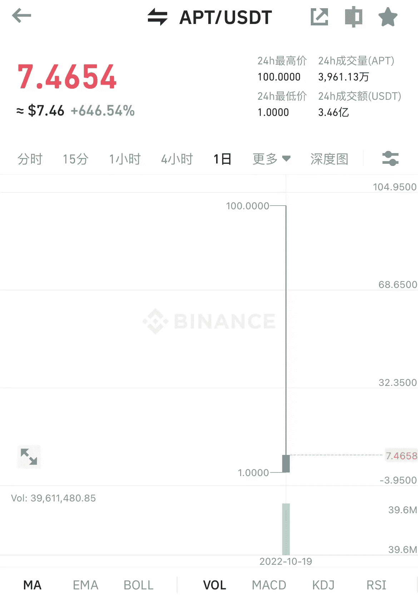
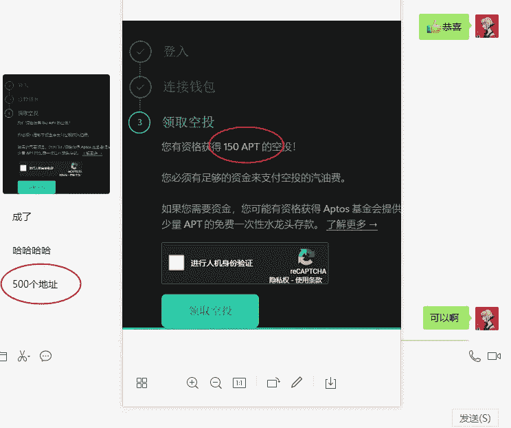
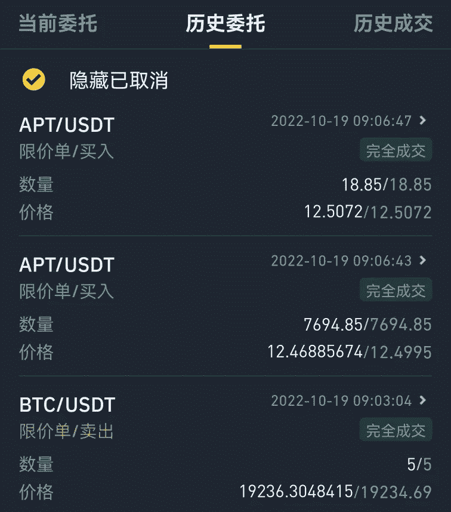
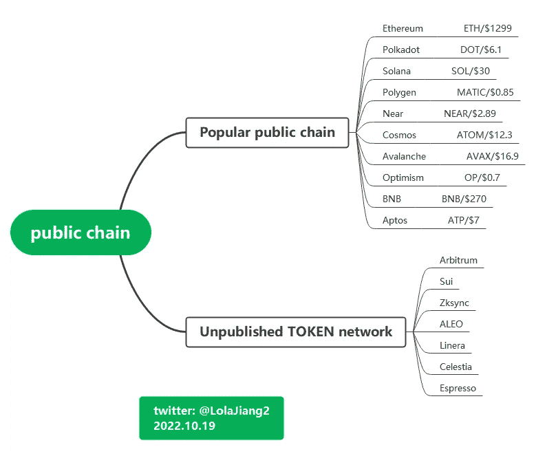
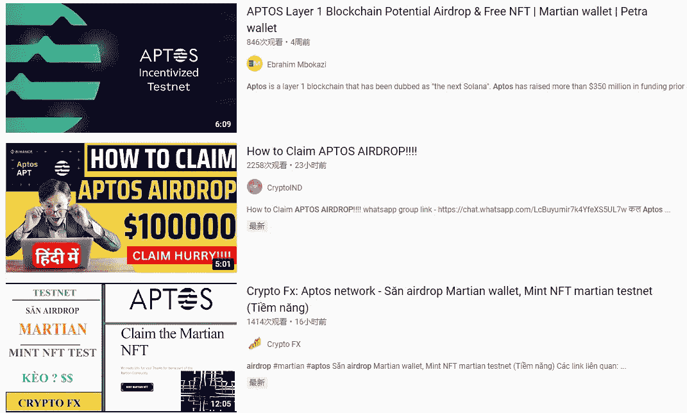
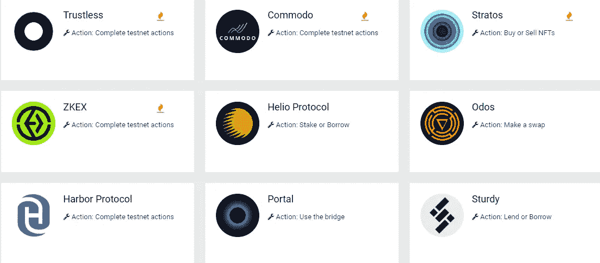

# 进行了 500 次 APTOS 互动测试，并获得了 50 万美元的空投

> 原文：<https://medium.com/coinmonks/did-500-aptos-interactive-tests-and-received-a-500k-airdrop-58d4a2993e8e?source=collection_archive---------7----------------------->

昨天 APTOS 发出空投，收到空投的人有一部分要自由离开圈子。

因为之前在 APTOS testnet 上互动，所以拿到了 APT 空投。

APT is online today

APTOS 的目标是构建一个可扩展、安全、可信、可升级的智能合约平台；这是一个新的公共链。该项目一上线就获得了 A16Z 等机构的 3.5 亿美元。R&D 队非常出色。

试验网是几个月前启动的，主网是昨天启动的。如今，与测试网有过互动的用户都空投了 APT，每个钱包可以收到 150 个左右的 APT。

按照目前 7u 的 APT 价格，每个互动钱包将赚 1050 美元左右。

一个专门做空投的朋友，一共操作了 500 个钱包，52 万美金，一波空投就赚了 360 多万，基本免费！

APT testnet made 500 aA big guy lost $40k by selling BTC to buy APTccounts

每一次空投，我都只看着那群朋友发财，羡慕不已。如果事先没有互动，就没有机会。空投发出后，再问去哪里取已经来不及了。

有人专门搞空投，埋伏各种新项目，做交互测试，希望项目上线就能收获空投。有的玩家会编程语言写脚本，批量注册互动账号。如果遇到空投，可能一夜暴富。

这次 APT 还是操作了 1000 个账户，也就是 100 万美金！一个真正的赢家。

当然也有很多项目不发空投，或者价值不大，或者气费太贵。有的项目互动了，投了燃气费，也有血本无归的。空投也有风险。

A big guy sells BTC to buy APT and lost $40k

很多新项目上线，预计会有更多人测试交互，获取流量和数据。官方也会发布互动教程，或者有一些专门做 airdrop 教程的博主，跟着教程走。

**1。什么是交互式测试？**

简单的理解就是登录体验一个项目的官网来体验它的基本功能。

在这个过程中，你需要有一个数字钱包、邮箱、社交账号等。证明你是一个真正的玩家。这些都是进入圈子的基本工具。你必须先自己去拿工具。如果不能解决这部分，就不需要继续玩空投了。

APTOS public chain

**2。哪些物品值得互动？**

这段时间各大新公链都很火爆，APTOS 已经发了空投，还有比较热门的 Sui，Zksync，Arbitrum 等等。这些项目很受欢迎，至今没有发空投。

想要埋伏空投，需要提前做足功课，通过前期的项目交互测试，埋伏好后期可能投放的空投。

Several public chains with high popularity

**3。哪里可以找到互动教程？**

一般谷歌“airdrop 教程”、“交互测试”、“airdrop”，或者各种流行的“项目名称+ airdrop”，都可以搜索到图片、文字或者视频的详细公链。

同一个项目，多搜几个教程，找一个自己能看懂的，跟着操作。如果没有找到 airdrop 教程，可以在后台私信“airdrop”获取一些项目交互教程。

热门的重大新公链、新项目、早期互动都有可能获得空投机会。

Various airdrop tutorials

楚小莲的这篇文章不是空投教程，没有操作步骤，只是告诉你，有一群玩家是专门搞空投的。

如果有技巧，可以批量制作互动账号；如果没有技巧，手动操作几个问题不大。

一般人 1、2 个教程就做不了，因为没有短期盈利，没有回报，需要大量的精力和一些资金投入，互动项目也不一定能空投。

就像这个 APTOS，在第一个五月的时候，很多社区发了互动教程，但是大部分只是看了一下，通过了 airdrop。

​Projects that may be airdropped

只有默默工作，操作好每一项测试的人，才会收获机会。每一次延迟满足的背后，都可能有更大的利益。

当然没有坚持做交互测试，今天只能羡慕别人。就这样吧，我先找个隋互动教程，先埋伏一下。

以上只是我个人观点，没有投资建议。我是楚小莲，我正在关注元宇宙和 web3。

> 交易新手？试试[密码交易机器人](/coinmonks/crypto-trading-bot-c2ffce8acb2a)或者[复制交易](/coinmonks/top-10-crypto-copy-trading-platforms-for-beginners-d0c37c7d698c)