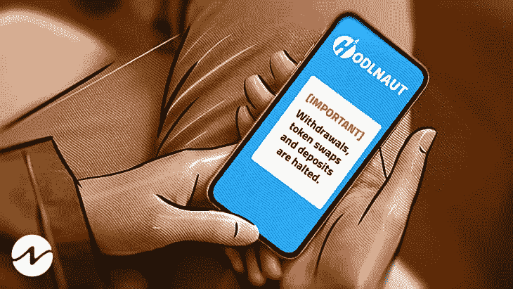
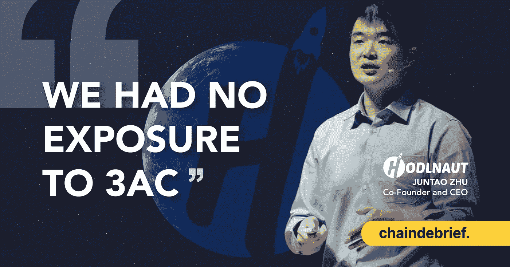
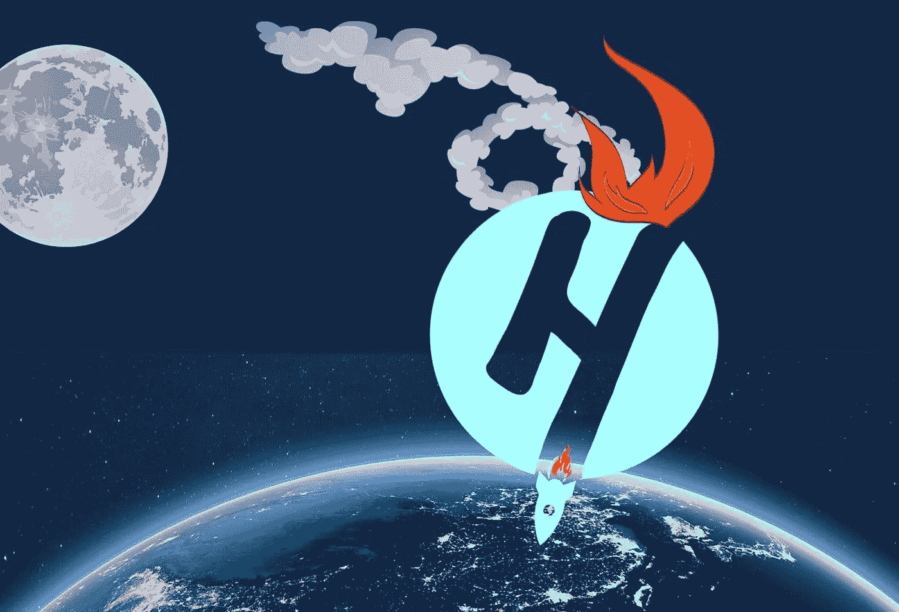

# 霍德诺特是否变得贪婪，高估了他们的实力？

> 原文：<https://medium.com/coinmonks/did-hodlnaut-got-greedy-and-overplayed-their-hands-104ce35cf310?source=collection_archive---------15----------------------->

Hodlnaut abruptly stops all its services and stunned its users.

我不想谈论它，因为它离家很近。

它不仅是一家新加坡公司，我还是霍德瑙特的忠实信徒。

Hodlnaut 本质上是一家为你的存款产生利息收益的网络银行。

你输入密码，他们会给你更多的密码。

至少理论上是这样的。

事实上，在 3AC 和 Terra/Luna 崩溃之间，BTC 崩溃，整个加密市场看起来像是《恰奇》中的血腥场景，产生收益并不那么容易。

显然，霍德瑙特在整个 UST 项目上投入了大量资金(将 UST 放在锚协议中，以产生 19%绝对多汁、令人垂涎的收益率)。

当被质问时，首席执行官祝俊涛声称他们没有损失任何钱，“霍德瑙特没有购买任何 UST”

CEO Juntao emphasized that Holdnaut had NO exposure to the 3AC fallout and did not buy any UST.

当 UST 崩溃时，他们的投资组合也崩溃了。

几个月后，余波终于泄露了。

如同晴天霹雳，霍德瑙特突然向所有用户宣布，他们将停止所有的取款、交换和存款。

他们甚至主动自愿地收回了他们 MAS 执照。

"霍德瑙特表示，此举是“由于最近的市场状况”，是“着眼于稳定我们的流动性和保护资产”。"

换句话说，他们变得贪婪，不知道如何负责任地管理用户的资金，烧掉了他们的风险管理账本，打错了牌。

哎哟。

有传言称，根据在线侦探挖掘出的链上交易，霍德瑙特在 Terra 崩溃中有 1.87 亿美元的风险敞口，甚至一度高达 2.37 亿美元。

他们在巅峰时期管理着高达 1B 美元的资产，这对于一家在加密热潮之前于 2019 年成立的初创公司来说，令人印象深刻。

Hodlnaut was a rising star that fell pretty hard and fast during the crypto winter.

对于那些不知道的人来说，霍德瑙特是新加坡加密界的宠儿之一。

他们是亚洲著名的创业孵化器项目“鹿角”的毕业生之一。

他们原则上获得了 MAS 的许可，并迅速扩大了用户群。

那时候，这是新加坡人进入相对不为人知的密码世界的一个绝妙方法。

他们对用户体验和增长的重视令人钦佩。

我试过了，使用他们的应用程序，看着你的加密货币一秒钟一秒钟地增长，真的很有趣。

他们在 4 月 6 日将露娜引入他们的平台，到 8 月 8 日，仅仅 4 个月后，他们就处于崩溃和不可挽回的死亡的边缘。

我很确定更多的人受到了 Terra/Luna 辐射尘的影响，这不会是最后一个坏消息。

Armed with an in-principle approval by MAS, lots of love from their users, a growing war chest and a bull run (back then), what could go wrong for Hodlnaut?

从 Celsius、3AC、Luna、Blockfi、Voyager 到现在的 Hodlnaut，有太多关于用户如何受到这场风暴伤害的故事。

我很好奇马斯会怎么做。

他们能对霍德诺特做什么？

他们能做些什么来帮助那些遭受霍德瑙特灾难的用户呢？

政府或当局应该做些什么吗？

毕竟，web3 是一个危险的空间，你需要睁大眼睛进入。

他们会对未来的加密玩家施加额外的压力，并冒着挤走整个市场的风险吗？

-

我们能避免霍德瑙特的情况吗？

-

# startups # business # startupx # growth # success # social media # culture # web 3 # strategy # eth # BTC # crypto # Hodlnaut # MAS # Singapore # crypto currency # celsius # terra luna # contagion # grifts

> 交易新手？试试[加密交易机器人](/coinmonks/crypto-trading-bot-c2ffce8acb2a)或者[复制交易](/coinmonks/top-10-crypto-copy-trading-platforms-for-beginners-d0c37c7d698c)