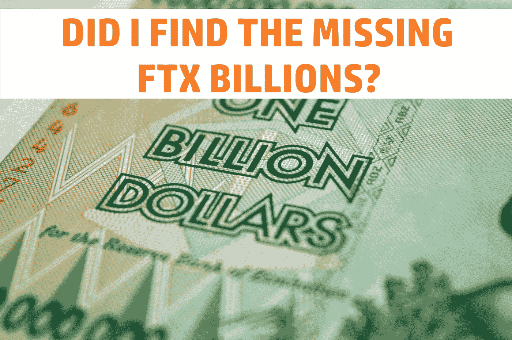
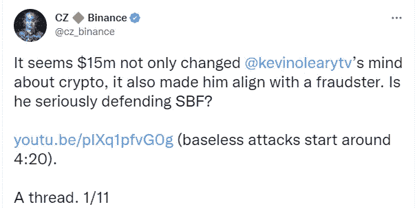
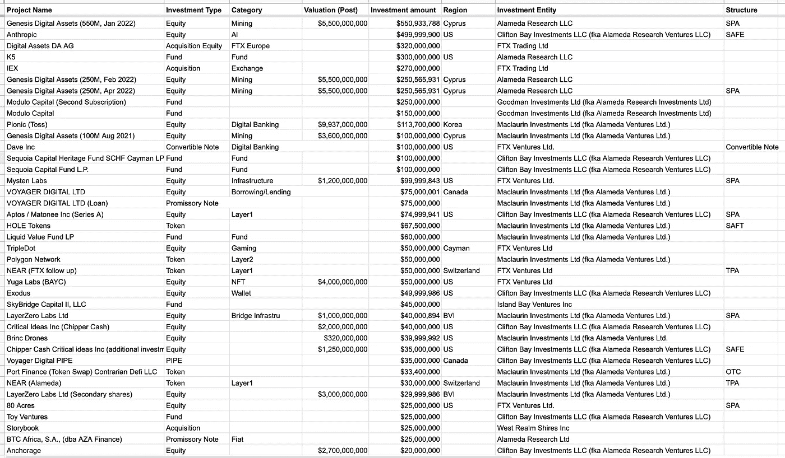

# 多亏了凯文·奥利里，我找到了 FTX 失踪的几十亿吗？

> 原文：<https://medium.com/coinmonks/did-i-find-the-missing-ftx-billions-all-thanks-to-kevin-oleary-bf70624cd571?source=collection_archive---------3----------------------->

凯文·奥利里两天前接受了美国消费者新闻与商业频道的采访，尽管很短，还是透露了很多有趣的东西。其中他回避了与 FTX 的问题，这些问题似乎源于他们与币安的关系。

# FTX 和币安

在采访中，凯文·奥利里提到他最近和 FTX 前首席执行官、他最好的朋友 SBF 聊过？然后他透露，在这些会谈中，SBF 提到了 FTX 一次又一次面临的所有监管障碍，这要感谢币安是这些障碍的早期投资者。这个项目以 SBF 似乎已经受够了，被迫买断币安而告终。耗资约 20 亿美元的收购。

当被问及 SBF 是否使用 FTX 基金收购币安时，凯文·奥利里似乎有所回避，而不是说他不知道。正如几乎所有人预料的那样，CZ 币安柜台和首席执行官并没有特别好地接受这些轻视。

# CZ 回应凯文·奥利里

无论这些指控是来自 SBF 还是凯文·奥利里，都只是基于 SBF 告诉他的事情的猜测，在这里真的无关紧要。特别是对 CZ，在一系列的推特上，与其说是剖析这些争论，不如说是拿起了一把大砍刀，我们的右翼对他们进行了杰森·沃赫斯式的攻击。似乎给了凯文·奥利里比他自己多的份额。

CZ 或多或少是在大声疾呼凯文是一个贪婪的叛徒。看他在一次又一次的采访中似乎仍在为 SBF 辩护。我有点同意 CZ 的观点。但是有一点我不得不称赞凯文，那就是至少他看起来是忠诚的。要么就是 SBF 有一些严重的丑闻。

[https://twitter.com/lawmaster/status/1600171286985965578](https://twitter.com/lawmaster/status/1600171286985965578)

CZ 继续说，并显示出问题中的收购发生在 2021 年。在那之后，FTX 在买下币安后继续投资约 53 亿美元。这将平息关于收购给 FTX 带来巨大财务压力的谣言。除非是买断让 SBF 开始用顾客的资金来买东西。这并不是说这是币安的错。

但如果在 53 亿美元的投资基础上再加上币安收购案中的 20 亿美元。如果我们再加上 FTX 花在高级职员私人住宅和度假屋的 3 亿美元。接近 80 亿美元，总收入为 76 亿美元。

FTX 的一名律师也呼吁对币安在 FTX 的股份出售进行调查。这是因为他们认为这也是失踪资金的起点吗？

# 凯文·奥利里和他的商业实践

我认为值得看一看凯文·奥利里在采访中透露的商业行为。我们经常在加密领域听到“自己做研究”的说法。那么，有谁比一位非常成功的百万富翁企业家更值得学习呢？在采访中，他简短地谈到了改变对加密的看法。据我所知，从字里行间可以看出，随着越来越多的人开始认真赚钱，他的变化随着 crypto 的发展而发生，而且它不会消失。

然后他看到了看起来像金鹅的东西，SBF 和 FTX。所以他想搭上淘金机。当被问及尽职调查时，DYOR 也是一样，但因为你有很多钱，所以必须有一个单独的名字。他承认只是相信其他富有的投资者已经做了尽职调查。

他还继续说，他或多或少被 SBF 是唯一的美国选择这一事实所束缚。所以这显然也有利于 SBF。我觉得特别有趣的是凯文来自加拿大。^^

谁知道千万富翁就像你我一样？没有人会因为想买 100 美元的 DOGE 币而去阅读白皮书和关注项目的创建者。你买了它，然后希望埃隆·斯坦克会在推特上发布相关消息，这样你就可以卖掉它。

如果你想看采访，你可以在这里找到。这仅仅是 5 龙敏，所以这并不是一个很大的承诺。=)

请分享你对这一切的想法。你认为我可能会对丢失的资金有所了解，还是我只是看到了相关性而不是因果关系？请在下面的评论区发表意见。如果你想支持我和我制作的内容，请考虑关注我，阅读我的其他帖子，或者为什么不两者都做。

网络上见！

图片提供:[https://unsplash.com/](https://unsplash.com/)

> 交易新手？试试[密码交易机器人](/coinmonks/crypto-trading-bot-c2ffce8acb2a)或者[复制交易](/coinmonks/top-10-crypto-copy-trading-platforms-for-beginners-d0c37c7d698c)