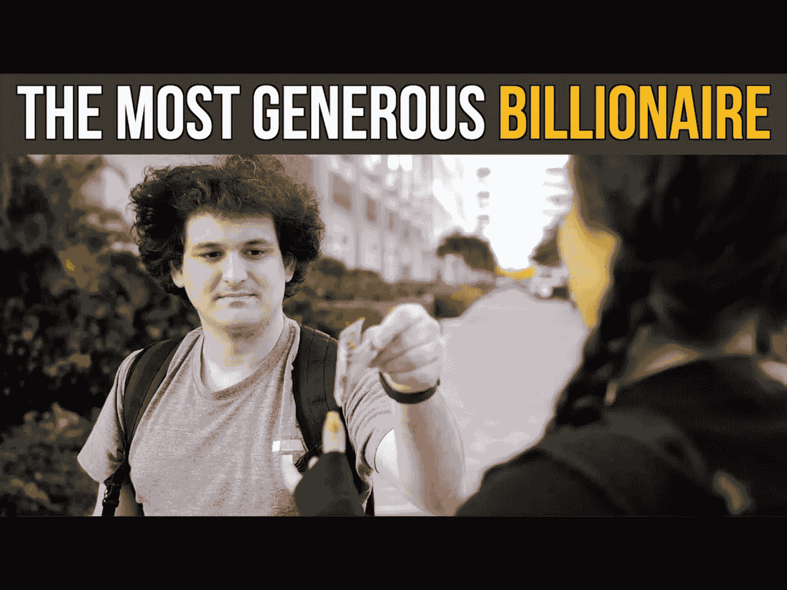
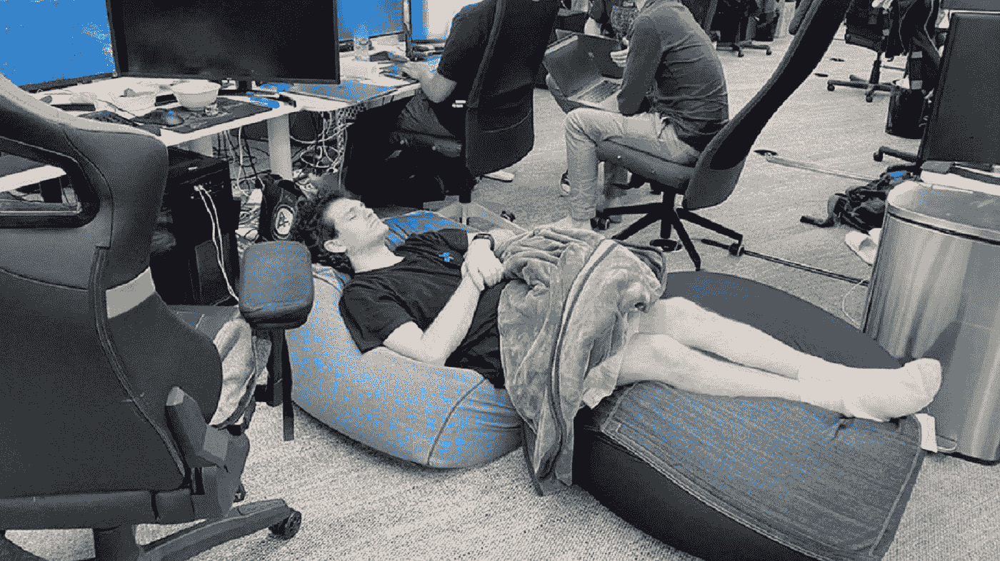
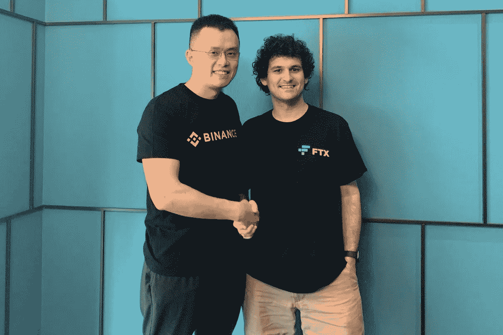

# 山姆·班克曼·弗里德是不是故意去诈骗别人？

> 原文：<https://medium.com/coinmonks/did-sam-bankman-fried-intentionally-set-out-to-defraud-people-7c32857d8678?source=collection_archive---------30----------------------->

SBF was well-known for his effective altruism, incredible wealth and atypical traits as a supposed billionaire. Was it all an intentional, elaborate lie?

读了这么多关于山姆·班克曼·弗里德的文章，你不得不怀疑:

他真的是一个学者还是一个土豆？

他是一个不守规矩的天才交易者，还是一个犯了诚实错误的吸毒少年？

还是他只是运气好，承受不了名利和权力？

这一切都是精心策划的吗？

发型、声音、顶层公寓、毒品、媒体马戏团以及他和他的联合创始人之间怪异的关系。

随着越来越多的事情被发现，我们开始看到事情变得有多奇怪和疯狂。

> 交易新手？在[最佳密码交易所](/coinmonks/crypto-exchange-dd2f9d6f3769)上尝试[密码交易机器人](/coinmonks/crypto-trading-bot-c2ffce8acb2a)或[复制交易](/coinmonks/top-10-crypto-copy-trading-platforms-for-beginners-d0c37c7d698c)

有些东西，你真的不能编造。

它既令人困惑又耐人寻味。

他资助了众议院的两党，民主党和共和党。

SBF was reportedly playing League of Legends while running FTX and even as the company burned to the ground.

他服用益智药来保持警觉和两耳之间的清爽。

然后吃安眠药只是为了睡着。

每天重复这句话，这就是他的生活方式。

他与 Alameda Research 的首席执行官卡罗琳·埃里森(Caroline Ellison)关系密切，他是该公司的联合创始人，并拥有该公司的大部分股份。

卡罗琳甚至公开表示，她日常工作中的风险管理和数学知识是多么少。

友情提示，那是一家做密码交易，管理着数十亿的公司的 CEO。

我是说，这是网飞剧本的一部分。

怎么可能是真的？

不管你对他有什么看法，他在应对媒体和吸引注意力方面都是大师级的。

FTX 以 1.3 亿美元买下了迈阿密体育场的冠名权。

FTX bought naming rights to the Miami Stadium and it barely stayed up for a few weeks before being removed.

他们为超级碗广告支付了 3000 万美元。

《福布斯》将他吹捧为密码专家。

《财富》称他为下一个沃伦·巴菲特。

加密推特无法满足他。

实际上，我很惊讶有人没有为他的巨型 fro 创建一个 Twitter 账户。

山姆实际上说服了一些非常聪明和有经验的投资者，如红杉和淡马锡，给他钱。

我的意思是，无论你怎么看，这都令人印象深刻。

去找一个知名投资者，证明你有实力、有数字、有销售能力和胆量来执行你的创业，这总是令人印象深刻的。

他在巴哈马群岛的顶层公寓经营着一家价值数十亿美元的国际公司。

他经营着 FTX，世界上最大的密码交易所之一，只有 25 个人。

CZ of Binance and SBF had a rocky relationship to the say the least, as both companies grew during the bull market and became titans of the industry.

他让币安看起来很虚弱。

他让所有 30 岁以上的人都觉得我们这辈子没做什么大事。

他在 FTX 的帝国下聚集了 130 多家公司，成为不仅仅是密码界的老大。

当山姆在“加密冬天”四处购物和购买不良资产时，每个人都称赞他是大救星。

我们不知道，他是真正的皇帝，没有穿衣服。

我是说，他甚至都懒得掩饰自己的行为。

是故意的还是偶然的？

-

山姆·班克曼·弗里德是不是故意去诈骗别人？

-

# startups # business # startupx # growth # success # social media # culture # entrepreneurs # strategy # eth # BTC # crypto # sbf # sambankmanfried # hated person 2022 # ftx # scam # ftt

> 加入 Coinmonks [电报频道](https://t.me/coincodecap)和 [Youtube 频道](https://www.youtube.com/c/coinmonks/videos)了解加密交易和投资

# 另外，阅读

*   [如何使用 Solidity 在以太坊上创建 DApp？](https://coincodecap.com/create-a-dapp-on-ethereum-using-solidity)
*   加密交易机器人 | [OKEx vs 币安](https://coincodecap.com/okex-vs-binance)
*   [币安 vs FTX](https://coincodecap.com/binance-vs-ftx) | [最佳(SOL)索拉纳钱包](https://coincodecap.com/solana-wallets)
*   [如何在 Uniswap 上交换加密？](https://coincodecap.com/swap-crypto-on-uniswap) | [A-Ads 审查](https://coincodecap.com/a-ads-review)
*   [加密货币储蓄账户](/coinmonks/cryptocurrency-savings-accounts-be3bc0feffbf) | [YoBit 评论](/coinmonks/yobit-review-175464162c62)
*   [Botsfolio vs nap bots vs Mudrex](/coinmonks/botsfolio-vs-napbots-vs-mudrex-c81344970c02)|[gate . io 交流回顾](/coinmonks/gate-io-exchange-review-61bf87b7078f)