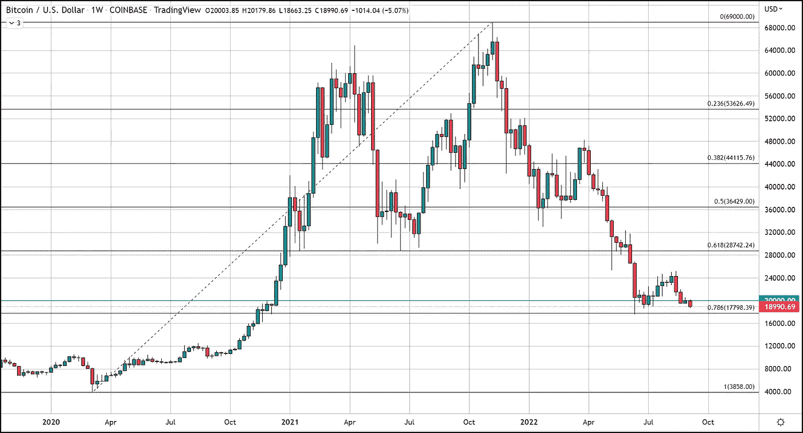
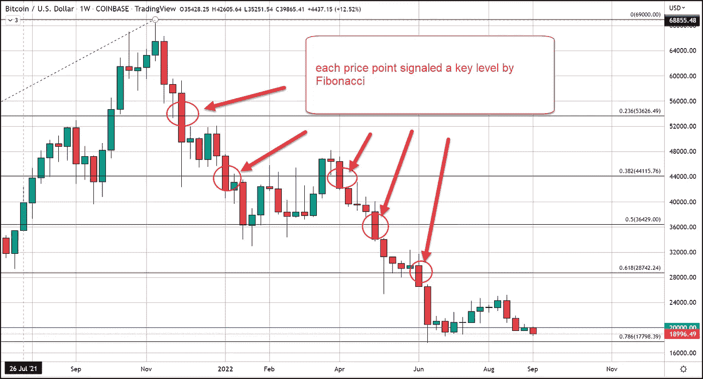

# 支持转变为阻力了吗？BTC 本周将何去何从？

> 原文：<https://medium.com/coinmonks/did-support-flip-to-resistance-where-could-btc-head-this-week-31d0b3035c71?source=collection_archive---------49----------------------->

在周末和劳动节之后，成交量紧张，波动不大，周二的交易是决定性的，并呈下行趋势。截至美国东部时间下午 5 点，比特币交易价格下跌近 800 美元，跌幅 4.4%。那么，随着 20，000 美元的支持成为可能的阻力，本周我们将何去何从？

# 比特币价格预测

给个尽可能简短的回答，17779 美元。现在我将详细说明为什么，为什么这只是一个暂时的目标。斐波那契数据在 69，000 美元时给了我们很大的鼓舞，今天仍然适用。

# 斐波那契和 BTC 的历史周期分析

我成功地标记了三重底部的 61.8%，在每个最普遍接受的斐波那契值，23.6，38.2，50，61.8 和 78.6(除了 78.6)到目前为止都正确地绘制了价格如果被剔除将会自由落体的点。这种命运下剩下的最后一个水平是 17，779 美元，这是 78.6%的斐波纳契回撤水平，使用 2020 年 3 月低点 3，858 美元至历史高点 69，000 美元的数据集。

6 月 13 日的一周，比特币一度触及 17779 美元的水平，这是自 2021 年 11 月创下历史新高以来的最低交易价格。此外，超过 78.6%水平的修正变得更难证明我们正在经历一次修正，而不是转向熊市。

然而，超过 78%的回调正是比特币之前所做的，只是为了恢复和再次反弹。我们正处于比特币长期周期的第五次修正阶段。这些周期的修正阶段通常比 78%更深，这就是为什么几个月前我说比特币将跌至的最低价格是 17，779 美元，最高价格大约是 13-14，000 美元。

这就是为什么 78%的回撤是我们本周可能看到的明确的短期价格目标。

任何对我们致力于比特币交易的免费服务感兴趣的人，只需点击这个[链接](https://www.thegoldforecast.com/bitcoin)。

【https://www.fxempire.com】最初发表于**。**

> *交易新手？尝试[加密交易机器人](/coinmonks/crypto-trading-bot-c2ffce8acb2a)或[复制交易](/coinmonks/top-10-crypto-copy-trading-platforms-for-beginners-d0c37c7d698c)*