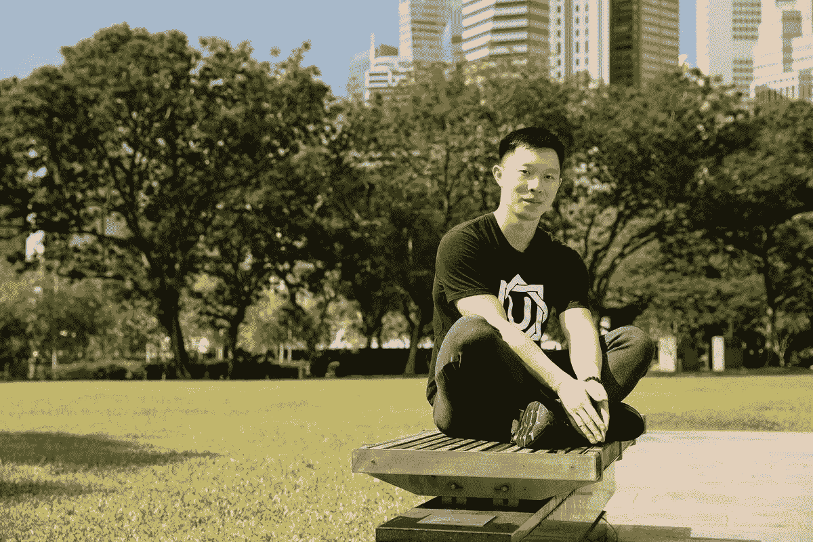
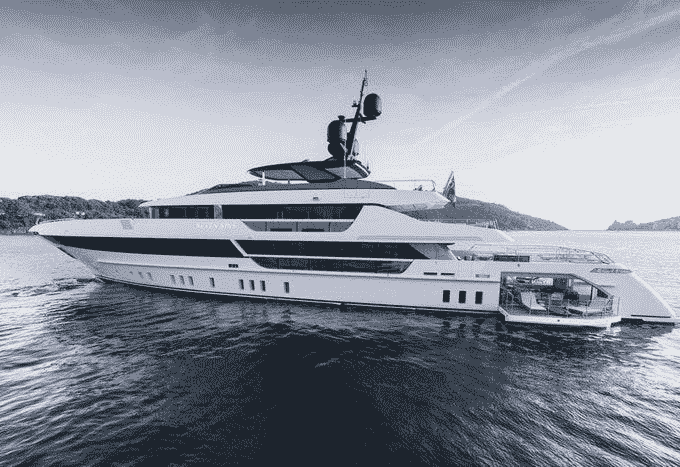
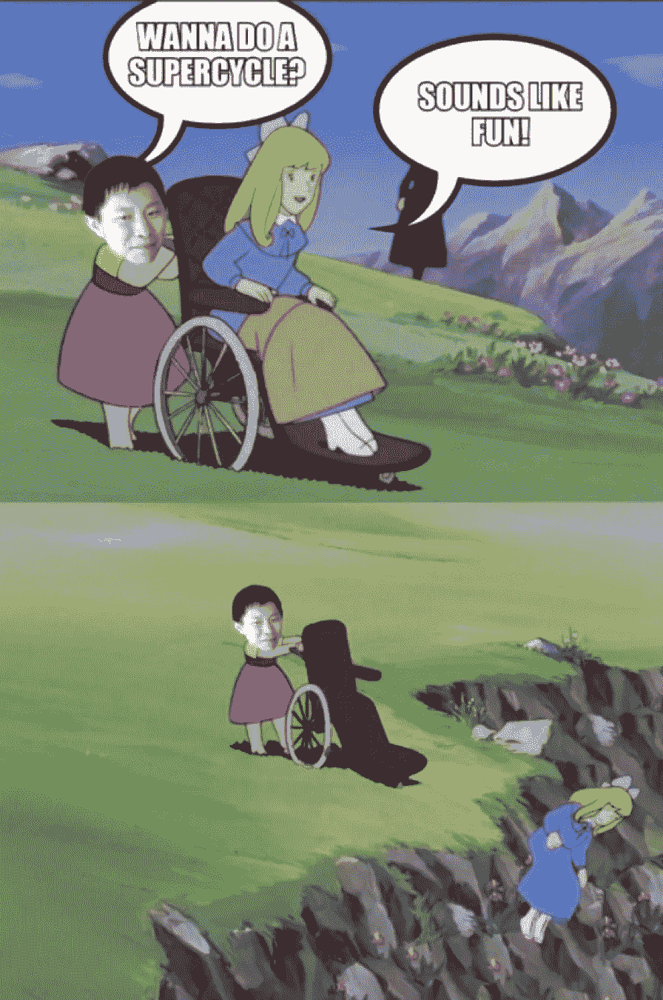
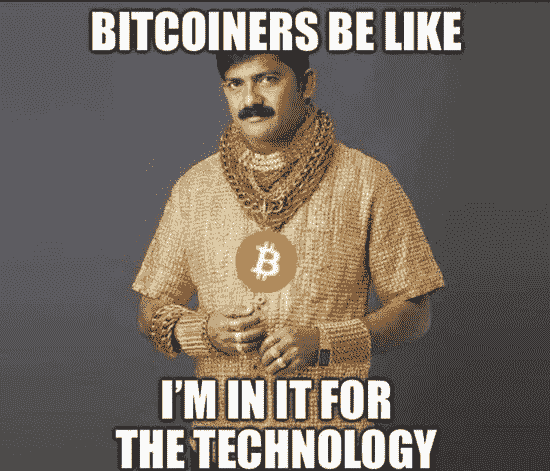

# 你知道苏铸曾经管理着 100 亿美元的资产吗？

> 原文：<https://medium.com/coinmonks/did-you-know-su-zhu-once-managed-10-billion-in-assets-aa6e012141a4?source=collection_archive---------27----------------------->

## 被误解的天才还是堕落的赌徒？

Did Su Zhu reach too far, too quickly and got burnt bad?

我怀着极大的兴趣关注着苏竹的故事。

我第一次听说他至少是在一年半前，当时我正在地下兔子洞。

他和其他许多人一样，有个人崇拜，就像一个军阀。

加密推特是他的战场。

男孩，他发动了战争，赢得了尊重。

聚集了近 50 万追随者，人们崇拜他。

当然了。

为什么不呢？

苏柱是世界上最大的加密对冲基金的先锋。

他有一份出色的简历，良好的记录和一大群支持他一举一动的铁杆粉丝。

他大胆预测，赚大钱，变魔术，真的。

This may not be the exact yacht Su Zhu bought, but you get the point.

苏铸是三箭资本的联合创始人、首席执行官和首席信息官。

“这两位交易者，苏竹和凯尔·戴维斯，是三箭资本的联合创始人，这家总部位于新加坡的基金曾经吹嘘拥有多达 100 亿美元的资产——几乎全部是数字货币、不可替代的代币等等。”

像道权，阿瑟·海耶斯，科比，埃隆，迈克尔·塞勒和其他许多人一样，苏竹在推特上很有娱乐性。

有时很暴躁，机智的复出并坚持自己的信念。

给出熊市中何时买入的建议。

在推特上告诉人们做什么。

在密码学中建立了一个超循环的理论，然后又说这是完全错误的。

Su Zhu’s supercycle theory was quite entertaining.

误导新加坡的监管者和金融管理局。

用现金购买价值 5000 万美元的巨型游艇。

他在新加坡价值 3500 万美元的高档平房，被转移到一家信托公司，留给他们 3 岁的孩子。

是的，他们的孩子有一个信托基金，里面有一个价值数百万美元的专属 GCB。

这就是我所说的“为生活而设定”。

和跆拳道走得太近了。

用他的对冲基金下了巨额超高风险的赌注。

他自信地发推说 Luna 崩溃不会影响 3AC。

像许多其他人一样，在卢娜解体之前，他一直咄咄逼人。

把一切都归咎于 BTC 价格暴跌。

你知道他们说得对。

仔细观察任何人足够长的时间，你会发现污垢。

重点是不要把苏竹或者任何人拉下水。

他们做了他们该做的，去得到他们想要的。

不知何故，我们被愚弄了，或者我们让像他这样的人有了机会。

Greed is universal.

因此，也许真的是我们，人民，听众，追随者，那些给这些军阀“想象的权力和力量”的人，真的要更有洞察力一点。

多一点体贴和感激。

当他们被废黜时，总会有另一个苏柱或道权来取代他们的位置。

你可以相信我。

在支持和做出不可逆转的决定之前，我们只需要对我们所消费和阅读的东西更加敏锐和聪明。

-

以后会有更多的苏竹和 Do Kwons 吗？

-

#创业#商业# startupx #成长#成功#社交媒体#文化#创业#战略# suzhu # meme # 3ac #垮台#教训# twitter # dokwon # ceo #金钱

> 交易新手？试试[加密交易机器人](/coinmonks/crypto-trading-bot-c2ffce8acb2a)或者[复制交易](/coinmonks/top-10-crypto-copy-trading-platforms-for-beginners-d0c37c7d698c)