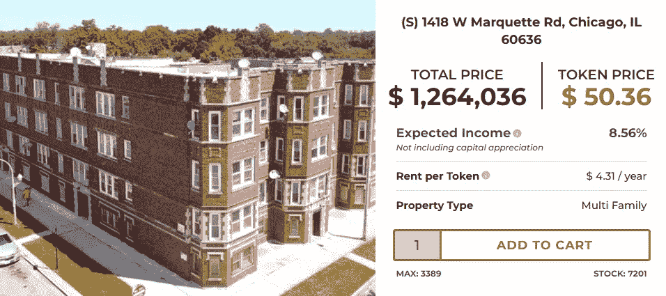
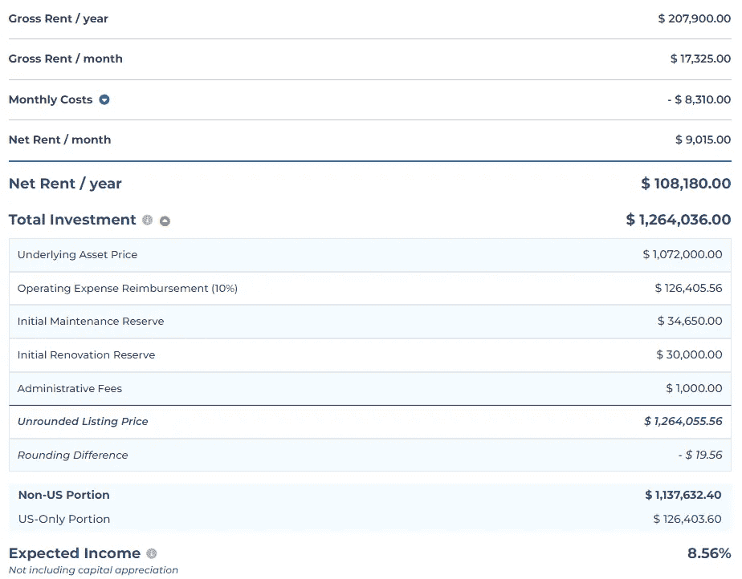
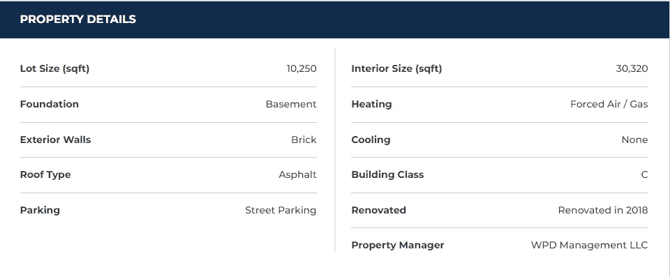
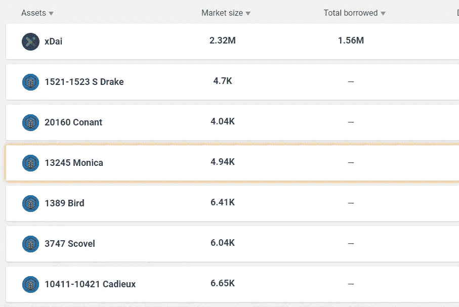

# 如何使用加密令牌投资房地产？

> 原文：<https://medium.com/coinmonks/did-you-know-you-can-invest-in-real-estate-using-crypto-1fb5dc397c10?source=collection_archive---------36----------------------->

我们很多人都知道多元化投资组合的好处。如果你拥有不同类型的资产，如股票、加密货币、债券和房地产，那么你所有资产的总价值在单一资产类别中不太容易出现波动。

虽然投资股票、加密货币或债券相对容易，但我发现投资房地产相当困难。尤其是如果你没有源源不断的现金。所以，直到最近，房地产还不是我投资组合的一部分。

# 投资房地产的好处和坏处

拥有房地产的好处是，你可以通过支付租金和增加房产价值来获得收入。

所以想象一下你正在买房。不是为了生活，而是为了增加你的投资组合。随着时间的推移，财产可以增加价值，你可以出售它获利。不过在等待涨价的同时，也可以出租房产，收取租金。

> 收租也是“减轻”熊市影响的一个好方法。因为当市场崩溃时，租金支付通常不会下降。毕竟，所有租户都受合同约束，每月租金是固定的。

然而，这种方法有一些缺点。购买房地产最初是非常昂贵的。因此，如果你不想贷款，而想将大部分投资组合投资于房地产，手头最好有一些现金。

此外，很少有人在投资前会考虑到经营一处房产的相关成本。我不想在这里赘述，尤其是投资一处(或多处)房产对我来说不是一个选项。

# 投资房地产，但不投入太多投资组合

所以我想投资房地产，但不是以经典的方式购买房子或公寓，然后出租。这涉及太多的成本和风险。那我有什么选择？

你们很多人都熟悉房地产投资信托基金。REIT 代表房地产投资信托。基本上，你把钱投资到一家公司，这家公司再把钱投资到房地产。

这种方法的好处是，你实际上是在一个由许多房地产组成的投资组合中投入了少量资金，这极大地分散了你的房地产投资组合。

法律还要求房地产投资信托基金将大部分利润支付给客户。所以你甚至不用担心因为支出太低而损失利润。

# 如何投资房产股票

对于房地产投资信托基金，你必须对公司投资的房地产类型进行大量研究。即使你喜欢这个投资组合，你也可能不喜欢所有的东西。但总的来说，房地产投资信托基金是一种很好的投资房地产的方式，而不需要投入太多的资金。

当我开始投资房地产时，我寻找的是一种实际投资特定房屋并向租户收取租金的方式。如果你不投资投资组合中的股票，而是投资单一资产的股票，那就太好了。比如只买一小部分比特币，因为你买不起一整枚比特币。

这就是加密的用武之地。创建加密令牌一点也不难。并且不是所有的代币都必须用于支付。

加密令牌可以链接到现实世界的资产，使得交易和共享这些资产比以往任何时候都更容易。以令牌化股票为例。当然，你可以投资交易所交易基金，这种基金可以让你用很少的钱投资股票组合。但是对于令牌化的股票，你实际上可以购买一只股票的一部分。想象一下，只买 0.1 股特斯拉股票..

> 房地产不也应该这样吗？

显然存在监管障碍。在我看来，花费的时间比预期的要长，但是解决这个问题的方法到处都在涌现。我说的不是元宇宙的房地产。“现实生活房地产”。

# 投资于象征性的财产并收取租金

有一家公司已经成功了，那就是 RealT T1。他们为你提供各种各样的财产，然后你可以选择投资。购买至少一个代币的价格通常在 50 美元左右。租金的预期收益率设定在 8-12%左右。

Latest property available on [RealT](https://realt.co/ref/oldschripp/)

我正在投资美国房地产市场。房租每周一付。

所以这种工作方式很简单:

*   你购买了一个代币，作为财产的一部分。
*   你钱包里的代币证明了你的所有权(谢谢你，区块链！)
*   每周一的租金会支付给每个代币持有者，直接到你的钱包里。(再次感谢！).

# 在购买之前，我可以获得哪些信息？

当然，你想知道你买的是什么，以及管理大楼的相关费用。管理权由[房地产](https://realt.co/ref/oldschripp/)公司接管。但是在你买之前，你总是可以看到你到底要赚多少。

Example costs for a property on [RealT](https://realt.co/ref/oldschripp/).

你也可以获得关于房产本身的信息。比如安装了什么类型的暖气？上次装修是什么时候？

请参见下面的示例摘录:

Property Details provided by RealT before buying.

# 与 RealT 复合

另一个赚钱的好方法是使用他们的“再投资”服务。在这里，你可以自动投资新的房产，而不是每周收取租金。这使得以低于 50 美元的价格购买股票成为可能。当然，你可以随时选择加入或退出再投资。

# 抵押？

想想吧。你拥有一处房产，并已成功偿还。如果你现在想从银行贷款，这个房产可能适合作为抵押。有了房地产，你实际上可以借钱用在别的地方。

用真币可能吗？恐怕你当地的银行不会接受它们作为抵押品。不幸的是。然而，德菲来救援。银行可能还没有注意到这一点，但我们真的不再需要它们了。也许对于传统资产来说是这样，但是对于像 RealT 这样的公司来说，这种目的似乎正在消失。

RealT 已经建立了一个平台，在这里你可以投入你的财产代币，并借出稳定的硬币。我不得不承认，这令人印象深刻。它为我们提供了第一个使用加密货币投资房地产的实物期权。他们的工具叫做 RMM。

Excerpt from RMM markets.

对我来说，这再一次表明了 crypto 的存在。不幸的是，许多人还没有意识到加密货币、加密代币和区块链在未来的许多应用。

# RealT 很严重吗？

当然，你永远无法确定。但是事情是这样的。我决定信任他们的原因如下:

*   有一个非常强大的 KYC 实现。因此它们符合监管要求。
*   他们有一个活跃的社区。
*   当购买一处房产时，他们会让你在购买协议上签字，协议中会明确说明你要投资什么，涉及哪些成本，以及他们计划如何在未来管理该房产。

在这里自己试试: [RealT](https://realt.co/ref/oldschripp/) 。

# 摘要

[RealT](https://realt.co/ref/oldschripp/) 提供了一个利用区块链技术直接投资房产的好方法。如果你投资一处房产，有可能通过三种不同的方式产生收入/投资组合增值:

1.  房产的价格增值
2.  租金收入
3.  以你的房地产股票为抵押借款，进行类似于 APY 套利的活动。

# 放弃

请注意，这不是财务建议。你必须自己做研究。只投资你力所能及、感觉舒服的。

如果你使用我的会员链接[https://realt.co/ref/oldschripp/](https://realt.co/ref/oldschripp/)，它将为你购买的每股赚取 2%的佣金。

> 交易新手？尝试[加密交易机器人](/coinmonks/crypto-trading-bot-c2ffce8acb2a)或[复制交易](/coinmonks/top-10-crypto-copy-trading-platforms-for-beginners-d0c37c7d698c)