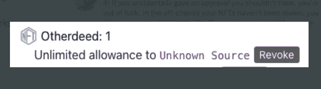

# 您是否设置了全部批准？

> 原文：<https://medium.com/coinmonks/did-you-set-approval-for-all-be848dff6be5?source=collection_archive---------0----------------------->

**0x01 预览**

最近我看到一些 NFT 的骗局变得疯狂，所以你可能会问 NFT 是如何从你的钱包中被盗的，你可以做些什么来避免在不知情的情况下签署恶意交易，以及**到底为所有人设置了什么审批？**

**0x02 Opensea 批准**

批准某人有权转让你收藏的 NFT，所以只要你批准，批准人就可以搬进来，随意搬出你的冰箱和电视，就好像你有你家大门的钥匙一样。当 Opensea 发出挂单时，相当于批准 Opensea 将您的 NFT 转让给他人。有人买的时候，Opensea 会把你的 NFT 转给他，然后他的钱转给你。虽然，Opensea 是一个正规的平台，如果你被钓鱼网站钩住，你会在床上哭。

**0x03 EIP-721**

默认情况下，NFT 只能由其所有者转让。然而，在 EIP-721 (NFT)标准中有两种方法允许其他人转移您的令牌:approve()和 setApprovalForAll()。

 [## EIP-721:不可替代的令牌标准

### 不可替换令牌的标准接口，也称为契约。以下标准允许实施…

eips.ethereum.org](https://eips.ethereum.org/EIPS/eip-721) 

*   每个符合 ERC-721 的合同都必须实现`ERC721`和`ERC165`接口
*   如果钱包/经纪人/拍卖应用程序要接受安全传输，它必须实现钱包接口。
*   元数据扩展对于 ERC-721 智能合同是可选的。这允许您的智能契约被询问其名称以及关于您的 NFT 所代表的资产的细节。
*   枚举扩展对于 ERC-721 智能合同是可选的。这允许您的合同发布其完整的 NFT 列表，并使它们可被发现。

**0x04 免费造币**

当我们遇到点击网站上的免费造币按钮时，可以看到钱包弹出一个交易请求，交易方式为设置全部批准。这时，如果你点击了 OK，就意味着你的 NFT 可以被其他人调用了，所以我们将免费为 mint 按钮绑定一个名为 setApprovalForAll 的触发事件。

approve()函数授予第三方传输单个令牌 id 的能力。setApprovalForAll()将授予第三方转移您拥有的给定集合的所有令牌的能力。

Opensea 等市场将使用该交易来批准您的任何 NFT 的销售。当你处理一个可信的站点时，这是可以的，但是当你批准一个恶意的站点时，这是非常危险的。(比如钓鱼网站)

> 交易新手？试试[加密交易机器人](/coinmonks/crypto-trading-bot-c2ffce8acb2a)或者[复制交易](/coinmonks/top-10-crypto-copy-trading-platforms-for-beginners-d0c37c7d698c)

如果你批准一个**不受欢迎的**第三方，他们有能力转移出你所拥有的属于你批准的收藏的任何 NFT。他们会找到你拥有的最贵的 NFT，然后骗你批准收藏。

**0x05 那么，如何避免批准恶意网站呢？**

1.  不要陷入黑客-不和-Twitter-薄荷骗局。任何时候 discord/twitter 被黑，黑客都会发布一些 mint 的链接。如果客户属于一个突出的项目(名词，BAYC 等)，那么他们不太可能做一个秘密的下降。
2.  如果你是铸造 NFT，尝试直接从合同铸造。对于你对项目团队知之甚少的免费薄荷糖来说尤其如此。尝试从网站上寻找信誉良好的项目，这些项目的团队被证明是合法的。
3.  有时你必须从网站上伪造(由于需要签名)。在这些情况下，请确保您没有签署调用 setApprovalForAll 或 approve 的 txn。几乎没有任何情况下铸币厂需要获得批准。此外，使用一次性钱包。
4.  如果你不小心给了一个你不应该给的批准，你可能就不走运了。万一你的 NFT 没有被盗，你可以使用 **revoke.cash** 来清除批准。如果您看到对如下非市场的批准，您应该单击撤销。

摘要:批准应该几乎总是限于市场。不要从可疑的网站上造币，但是如果你这样做了，确保没有调用 **setApprovalForAll** 。但只要骗局发生，我就会继续发帖。见过很多 **setApprovalForAll** 的骗局案例

参赛:https://twitter.com/cygaar_dev/status/1541832743448887296