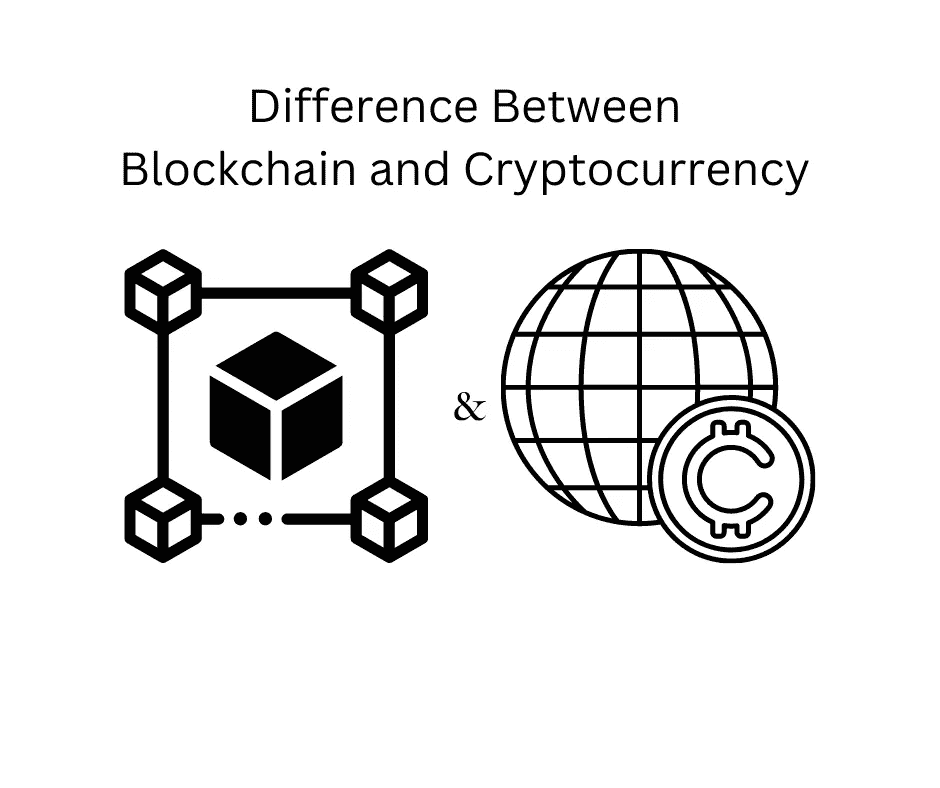

# 加密货币和区块链的区别

> 原文：<https://medium.com/coinmonks/difference-between-cryptocurrency-and-blockchain-8c057076ffb2?source=collection_archive---------34----------------------->

阅读后你将能够回答:“什么是加密货币，什么是区块链？”

“What is cryptocurrency, and what is blockchain?”

本文试图区分什么是加密货币，什么是区块链。读完之后，你将能够回答，“什么是加密货币，什么是区块链——这不是一回事吗？”

加密货币是一种数字代币。数字令牌可以有多种形式和使用情况，最常见的是支付令牌、实用令牌，有时是安全令牌。比特币，以太坊，系绳，还有一些例子。

区块链是一种分布式分类帐(数据库)对等技术。这意味着它不需要一个集中的第三方来工作，这就是为什么被称为点对点，个人之间直接互动。区块链是加密货币所基于的技术。

每种加密货币都与支持的区块链网络相关联。加密货币需要区块链网络才能工作，区块链需要加密货币才能顺利运行，但这不是一回事。

例如，比特币加密货币是许多人每天使用的支付令牌，包括像萨尔瓦多这样的国家。为了让比特币加密货币发挥作用，背后是一个被称为比特币区块链的区块链网络。这为网络上的参与者提供了安全透明地进行交易的能力。如果你想了解更多关于区块链是如何运作的，你可以参考我的另一篇文章[https://medium . com/@ pinadefi/what-is-区块链-3081224bd639](/@pinadefi/what-is-blockchain-3081224bd639)

以太坊加密货币运行在一个叫做以太坊的区块链网络上。类似于比特币，有一个原生代币，还有区块链。

相比之下，系绳加密货币没有自己的区块链，而是存在于区块链以太坊。多亏了区块链以太坊，所有发生的交易都被记录在那里。并非所有的加密货币都需要它们的原生区块链。

以太坊区块链旨在成为一个网络，灵活地托管许多其他加密令牌，并使用以太(本地令牌)支付汽油费和交易成本。

此外，区块链以太坊拥有市场上最受欢迎的不可替代代币，即 NFT。这是 ERC-20 令牌(这是网络中使用的以太坊标准令牌，这是下一篇文章的主题)，类似于加密货币硬币，但功能完全不同。主要区别在于，每个 NFT 代币都是独一无二的，它可以嵌入现实世界的实用程序，并可以在二级市场上交易。

我认为，随着市场的进一步成熟，我们将会看到更多关于区块链分布式技术在其他行业的应用，而不是加密货币。尤其是在当前损害是由中央实体造成的情况下(FTX、摄氏、3AC)。

区块链技术已经加入到供应链中，[沃尔玛](https://one.walmart.com/content/globaltechindia/en_in/Tech-insights/blog/Blockchain-in-the-food-supply-chain.html)做到了这一点。

区块链技术很有可能改变[房地产](https://www.investopedia.com/news/how-blockchain-technology-changing-real-estate/)行业。让人们可以选择以分散的方式和较低的成本进行网上交易。

总之，crypto 和区块链是相关联的。但这不是一回事。许多现在处于热门话题的加密货币可能无法实现，但分布式账本技术正在日益强大地进入我们的日常生活。

如果你喜欢阅读并学到了一些东西——关注更多！

你可以在推特上找到我——https://twitter.com/pinadefi

子栈—[https://pinadefi.substack.com/](https://pinadefi.substack.com/)

出版 0x—[https://www.publish0x.com/@Pina-DeFi](https://www.publish0x.com/@Pina-DeFi)

> *交易新手？试试* [*密码交易机器人*](/coinmonks/crypto-trading-bot-c2ffce8acb2a) *或* [*复制交易*](/coinmonks/top-10-crypto-copy-trading-platforms-for-beginners-d0c37c7d698c)
> 
> *分散加密持股，了解一下* [*币安的替代品*](https://coincodecap.com/binance-alternatives)
> 
> *加入 Coinmonks* [*电报频道*](https://t.me/coincodecap) *和* [*Youtube 频道*](https://www.youtube.com/c/coinmonks/videos) *获取每日* [*加密新闻*](http://coincodecap.com/)

# 另外，阅读

*   [复制交易](/coinmonks/top-10-crypto-copy-trading-platforms-for-beginners-d0c37c7d698c) | [加密税务软件](/coinmonks/crypto-tax-software-ed4b4810e338)
*   [电网交易](https://coincodecap.com/grid-trading) | [加密硬件钱包](/coinmonks/the-best-cryptocurrency-hardware-wallets-of-2020-e28b1c124069)
*   [密码电报信号](/coinmonks/top-3-telegram-channels-for-crypto-traders-in-2021-8385f4411ff4) | [密码交易机器人](/coinmonks/crypto-trading-bot-c2ffce8acb2a)
*   [最佳加密交易所](/coinmonks/crypto-exchange-dd2f9d6f3769) | [印度最佳加密交易所](/coinmonks/bitcoin-exchange-in-india-7f1fe79715c9)
*   [面向开发人员的最佳加密 API](/coinmonks/best-crypto-apis-for-developers-5efe3a597a9f)
*   最佳[密码借贷平台](/coinmonks/top-5-crypto-lending-platforms-in-2020-that-you-need-to-know-a1b675cec3fa)
*   [免费加密信号](/coinmonks/free-crypto-signals-48b25e61a8da) | [加密交易机器人](/coinmonks/crypto-trading-bot-c2ffce8acb2a)
*   杠杆炒股终极指南