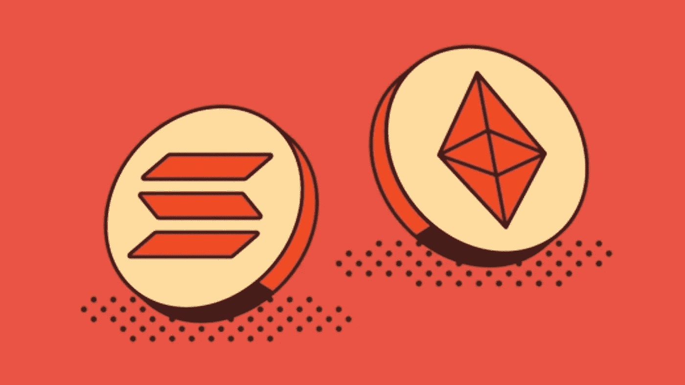
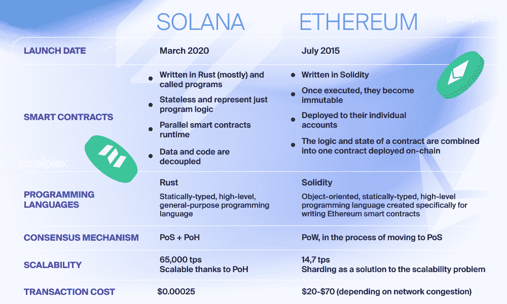
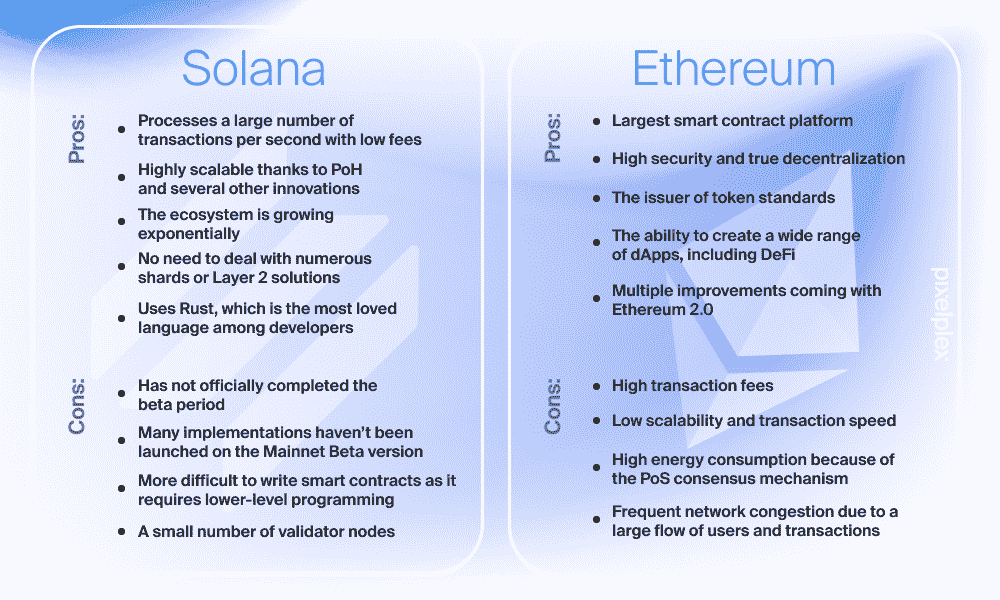

# 索拉纳和以太网的区别

> 原文：<https://medium.com/coinmonks/difference-between-solana-and-ethereum-network-3ddc8ce38ba?source=collection_archive---------11----------------------->

了解索拉纳(SOL)和以太坊(ETH)之间的区别可能会帮助你改善交易结果，更好地了解市场。这些项目为 dApp 开发人员提供了构建应用程序和令牌的通用编程环境。然而，当你仔细观察时，你会发现这两个项目有一些显著的差异。

# **什么是索拉纳(SOL)？**

索拉纳是为了解决以太坊的缺陷而创造的。例如，网络优先考虑事务吞吐量和可伸缩性。因此，它被认为是一款高性能的区块链。它还采用独一无二的多层共识机制来避免瓶颈和集中化。

Solana 的主要市场优势是自动化区块链交易分类流程。这就是协议能够达到如此高的每秒事务处理量(tps)的原因。此外，由于 Solana 项目是开源的，第三方开发者可以使用该平台来创建新产品。

# 以太坊(ETH)是什么？

以太坊是第一个去中心化的区块链平台。作为第一种第二代加密货币，它彻底改变了市场。此外，以太坊作为第一个用于智能合约的可编程区块链而闻名。因此，智能合同显著增加了区块链网络的运营，很难想象没有智能合同的区块链行业。

以太坊是地球上最大的 dAapp 和 DeFi 生态系统。它也是世界上第二大工作验证(PoW)网络。以太坊不是一种加密货币，但它经常被误认为是其实用令牌以太(ETH)，用于支持网络交易和智能合同执行。以太坊区块链支持这些 EVM(以太坊虚拟机)计算。

# 索拉纳(SOL)与以太坊(ETH)的发展

# 索拉纳的发射

索拉纳由阿纳托利·亚科文科在 2017 年加密牛市的顶峰时期创立。该平台的团队由一些知名的科技高管组成。例如，Solana 的首席技术官 Greg Fitzgerald 曾与高通、Dropbox 和其他知名系统合作。

索拉纳在 2018 年和 2019 年进行了几次众筹和私人融资。由于这些努力，该网络能够获得额外的 2000 万美元来发展生态系统。2020 年 3 月，索拉纳 mainnet 首次上线。Serum 是一个 DEX(分散式交易所),在 Solana 区块链推出后不久就建成了。

# 以太坊的推出

以太坊成立于 2013 年，当时加密货币领域还处于起步阶段。该项目的创始人 Vitalik Buterin 是比特币的长期用户。他看到了让协议在分散的网络中工作的价值，并希望这个过程尽可能简单。

以太坊推出的兴奋是显而易见的。当它在最大的 ico(首次硬币发行)之一中从+11，000 名投资者那里筹集了 1，800 万美元时，它成为了加密社区中最引人注目的项目之一。这将标志着以太坊崛起的开始。当以太坊在市场上推出 ERC-20 令牌标准时，2017 年的 ICO 热潮仅在四年后开始。

> 交易新手？试试[加密交易机器人](/coinmonks/crypto-trading-bot-c2ffce8acb2a)或者[复制交易](/coinmonks/top-10-crypto-copy-trading-platforms-for-beginners-d0c37c7d698c)

# 索拉纳(SOL)与以太坊(ETH)的用途

Solana 在设计时就考虑了高级 dApps，因此网络的设计者将可扩展性作为项目的重中之重，提高了响应能力和性能。因此，Solana 允许开发人员创建更多扩展的 dApps，并以更低的价格执行更重要的计算。

以太坊的目的是为 dApp 开发者提供一个安全可信的网络。此外，该协议为区块链添加了智能合约脚本功能，增强了加密货币的整体可用性。以太坊提供了广泛的编程语言。比如 Solidity、C++、Java、JavaScript、Python、Ruby 等编程语言都是开发者可以使用的。

# 索拉纳(SOL) vs 以太坊(ETH)共识

索拉纳的多层共识体系是其显著特点之一。Solana 使用利害关系证明(PoS)来验证区块链的状态。用户可以因作为验证者参与该系统而获得奖励。验证者是通过随机选择从顶级令牌持有者中挑选出来的。

该系统与历史证明(POH)机制相结合，使用时间戳系统来提高性能。对于区块链事件，时间戳充当时钟。这种时序增加了系统的整体安全性，使得黑客修改数据更加困难。

# 工作证明

Ethash 算法是以太坊使用的一种工作验证(PoW)方法。与网络节点竞争向分类账添加块的方式一样，这种方法类似于比特币。

值得注意的是，布特林认为，开发一种新的算法以避免比特币采矿业目前的集中化状态是势在必行的。这种方法最初工作得很好，因为它大大减少了网络上 ASIC 挖掘器的数量。然而，以太坊 ASIC 芯片很快在市场上出现，因此 ETH 现在以每年大约 1800 万的速度被开采。

有趣的是，以太坊目前正在进行重大升级。在接下来的几个月里，该网络的共识流程将升级为利害关系证明(POS)系统。ETH 2.0 验证器已经押上了它们的货币。你必须下注 32 ETH 或加入赌注池才能成为以太坊验证者。

# Solana (SOL)与以太坊(ETH)的可扩展性

索拉纳是目前最快的区块链之一。该协议已经以每秒 29，171 次(每秒事务)的速度进行了基准测试。每 2.34 秒，Solana 网络处理一个块。另一方面，以太坊的事务速率大约是每秒 15 个事务，大约每 13 秒确认一个块。

# 硬币

Solana 网络本地令牌已解决。您可以使用代币下注来获得被动奖励。在 Solana 网络的整个生命周期中，计划发放 489 份 sol。由于稀缺性，索拉纳给了 HODL 用户一个可靠的价值储存库。

以太坊协议的原生令牌是以太(ETH)。这个令牌的主要用途是为 EVM 计算提供动力。在密码市场中，ETH 是使用最广泛的令牌。ETH 可以参与几乎所有的 ico，并得到几乎所有交易所的支持。特别是令牌，它有无限的供应来保证 EVM 继续运行。

# 索拉纳(SOL) vs 以太坊(ETH)——速度 vs 经验

索拉纳和以太坊是市场上两个著名的区块链。此外，Solana 的开发团队完成了他们的目标，建立了一个快速可靠的区块链，可以比以太坊更快地处理成千上万的交易。相比之下，以太坊仍然是市场上表现最好的网络，没有放缓的迹象。因此，在你的投资组合中保留这两种硬币可能是个好主意。

> 加入 Coinmonks [电报频道](https://t.me/coincodecap)和 [Youtube 频道](https://www.youtube.com/c/coinmonks/videos)了解加密交易和投资

# 另外，阅读

*   [如何使用 Solidity 在以太坊上创建 DApp？](https://coincodecap.com/create-a-dapp-on-ethereum-using-solidity)
*   加密交易机器人 | [OKEx vs 币安](https://coincodecap.com/okex-vs-binance)
*   [币安 vs FTX](https://coincodecap.com/binance-vs-ftx) | [最佳(SOL)索拉纳钱包](https://coincodecap.com/solana-wallets)
*   [如何在 Uniswap 上交换加密？](https://coincodecap.com/swap-crypto-on-uniswap) | [A-Ads 审查](https://coincodecap.com/a-ads-review)
*   [加密货币储蓄账户](/coinmonks/cryptocurrency-savings-accounts-be3bc0feffbf) | [YoBit 评论](/coinmonks/yobit-review-175464162c62)