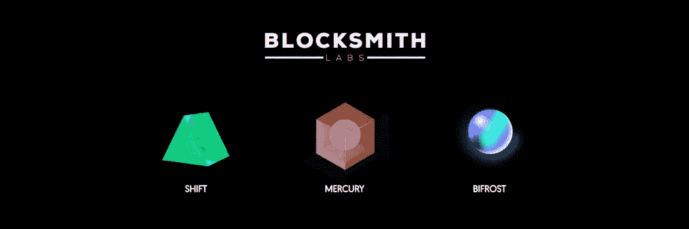
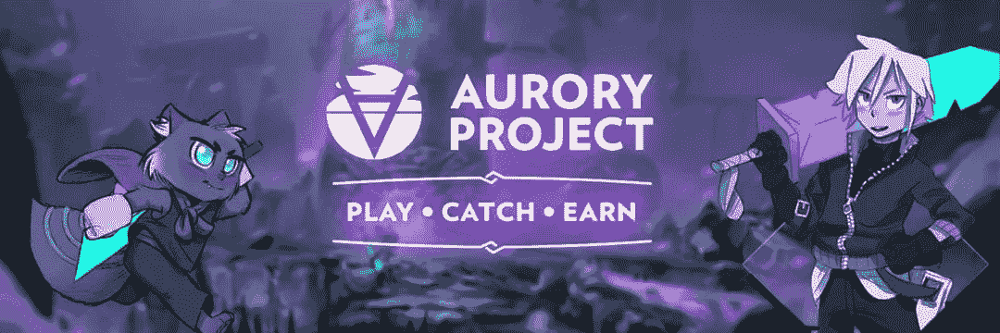

# 不同类别的 NFT 项目

> 原文：<https://medium.com/coinmonks/different-categories-of-nft-projects-f0f46a619bdc?source=collection_archive---------29----------------------->

在整个 NFT 空间，项目有许多不同的形式。在这些不同的形式中，NFT 及其背后的技术被以各种方式使用。这有时会让理解 NFT 项目背后的价值或目的变得非常棘手，因为它们很少适合单一的模式或类别。事实上，许多非功能性测试可以归入多个或所有类别，而其他的可能根本不属于任何类别。以下不同 NFT 类别的分类旨在为创作者和投资者提供一个通用指南，以了解 NFT 空间正在建设什么。

> ***品牌项目***

可以说，NFT 空间中最常见的项目类别是品牌项目。这些项目的目标是创建一个能够吸引全球关注的品牌。属于这一类别的项目通常非常注重创建一个吸引人的社区，让人们相信该品牌有能力成为我们文化的一部分。大多数 NFT 的项目都属于这一类，几乎所有的项目都在某种程度上建立了自己的品牌。但是，并不是所有的品牌项目都一样。许多较小的品牌项目本质上只是由 Twitter 炒作推动的泵和转储，缺乏真正的价值。顶级品牌项目与其他项目的区别在于，它们能够有效地创建一个吸引人的社区，作为一个品牌，它们能够向这个社区回报价值。

Solana NFT project Okay Bears

> ***1/1 艺术***

1/1 艺术是人们比较容易理解的类别之一，因为它相当简单。就像有人可能会购买一幅实物画一样，人们购买 NFT 仅仅是为了他们的艺术。从投资的角度来看，购买 1/1 艺术 NFT 也与购买实物画非常相似。这类非传统艺术通常被视为对艺术家的投资。1/1 艺术品投资者的期望不是快速转手，而是购买艺术品，并愿意保留其真正的美，并支持艺术家。反过来，随着艺术家的成长和变得更加成熟，投资者可能会在更长的时间内从 1/1 艺术作品中获得极大的收益。

1/1 Solana NFT by artist John Lê

> ***工具***

随着 NFT 空间和加密生态系统作为一个整体的增长，许多致力于支持生态系统和改善用户体验的 NFT 项目已经出现。这些工具项目中的许多都有一个特定的目的，即改善或帮助 NFT 和加密货币交易体验。这些工具的一些例子包括狙击和铸造机器人，投资组合管理器和追踪器，白名单工具和税务软件。这些项目为他们的投资者提供了某种内在的效用，因为它们允许他们访问、使用或拥有软件或程序的某种形式的所有权。其他工具项目包括那些提供基础设施来帮助运行生态系统的项目，如节点、API、DeFi 和 launchpads。工具 NFT 项目的设置和运行方式各不相同。然而，他们有一个共同的目的，那就是为他们的投资者提供生态系统中某种公用事业的使用权。

Solana NFT project Blocksmith Labs

> ***道斯***

虽然“道”的概念可以在任何 NFT 项目或初创企业中实施，但也有某些 NFT 项目完全是围绕“道”的创建而构建的。通常，持有其中一个项目的 NFT 可以让投资者接触到 DAO。这些 Dao 倾向于作为网络和投资团体，让少数个人走到一起。人们经常在共同的兴趣上形成 Dao，比如艺术、投资或简单的生活。DAO 项目通常将出售其 NFT 的部分资金集中起来，用于共同投资。这笔钱如何使用由各种方式决定，从正式和有约束力的 DAO 投票到项目投资者和领导人之间的简单对话。

道项目的类别相当广泛，因为有许多道 NFT 项目。低端项目本质上是阿尔法小组，更大的群体聚在一起讨论投资和交易。而高端 DAO 则专注于管理一个由技术娴熟、知识渊博、志同道合的个人组成的小型社区，他们将共同努力在该空间内提高 DAO 的知名度。

Solana NFT project Boogle

> ***游戏***

大量的 NFT 项目都是围绕着一款游戏创建的，或者被整合到了一款游戏中，因为在游戏内资产和非功能性游戏之间有着天然的联系。一些游戏 NFT 的推出是为了筹集游戏创作的资金，而不是通过传统的视频游戏工作室。这些项目倾向于通过创建以 NFT 为特色的游戏内资产市场来回报持有者的价值。其他游戏 NFT 是用区块链和 NFT 的技术整合到游戏中构建的，目的是为投资者和玩家创建一个游戏赚取系统。此外，还有许多 NFT 项目提供赌博和博彩游戏。这些 NFT 项目中的许多从每场游戏中收取费用，并将由此产生的收入分配给他们的非功能性游戏持有者。

Solana NFT project Aurory

虽然这不是 NFT 所有不同类别项目的综合列表，但这一分类提供了对 NFT 空间内正在建设的内容的洞察。可能很难将 NFT 项目归入这些盒子中的一个，因为每个项目的不同方面和分支可能在项目的整个生命周期中分散到不同的类别中。然而，在创建或寻求投资一个 NFT 项目时，你必须清楚你要进入的是 NFT 市场的哪个领域。

> 交易新手？试试[加密交易机器人](/coinmonks/crypto-trading-bot-c2ffce8acb2a)或者[复制交易](/coinmonks/top-10-crypto-copy-trading-platforms-for-beginners-d0c37c7d698c)