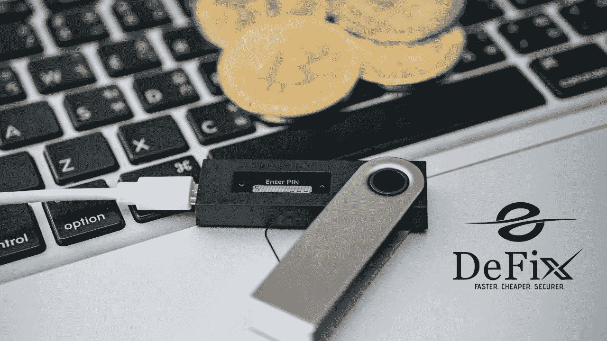
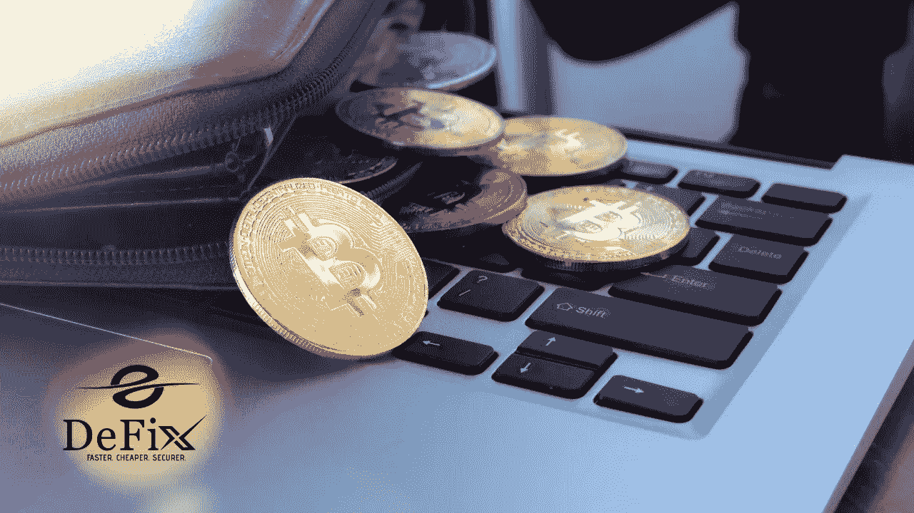

# 不同类型的加密钱包:利弊

> 原文：<https://medium.com/coinmonks/different-types-of-crypto-wallets-pros-cons-baf71fd14882?source=collection_archive---------33----------------------->

在加密生态系统中有不同类型的加密钱包。这些钱包使加密投资者能够安全地存储他们的数字资产。虽然各种钱包都有类似的储物功能，但它们都有不同的功能和安全标准。

与可以在网上和物理位置轻松访问的法定货币不同，加密货币只能在线访问。这就是为什么一个有效的网上钱包是至关重要的，在保护您的密码财产。

这里有一些关键钱包，你可以用它来保护你的密码财产！

## **冷钱包与热钱包**

这些钱包之间的主要区别是，一个连接到互联网，另一个可以通过软件离线操作。

## **冰冷的钱包**

冷钱包用于在冷库中存放加密货币。这意味着您的加密令牌是离线存储的。在这种情况下，它们比其他钱包更安全，就像一个保险库，你可以在那里进行日常的加密货币交易。

## **热门钱包**

另一方面，热钱包需要互联网连接才能运行，因此不如冷钱包安全。这些钱包比冷钱包更丰富，因为通过互联网访问更容易，但仍然容易受到欺诈者的攻击。

## **其他类型的加密货币钱包**

大约有五种不同的加密货币钱包。它们都提供不同的功能和安全级别来保护您的私钥。它们包括硬件(冷钱包)、桌面、纸质、在线和移动钱包。

让我们浏览一下每种方法的优缺点。

## **硬件钱包(冷钱包)**

硬件钱包是典型的冷藏钱包。您可以让您的加密货币资产离线，远离网络犯罪分子。

## **优点**

*   高度安全
*   存储、发送和接收密码
*   您可以控制自己的私钥

## **缺点**

*   如果你丢失了你的硬件钱包，你的加密货币就永远消失了
*   一些硬件钱包可能很贵

## **纸质钱包**

纸钱包仅仅是一张写有你私人钥匙的纸。您可以将包含您的私钥的这张纸放在保险库或任何安全的地方。在某种程度上，它们被认为是存储您的私钥的最佳方式。

## **优点**

*   你保管你的私人钥匙
*   存储、发送和接收密码

## **缺点**

*   一旦钱包丢失，就没有办法获取你的比特币

## **手机钱包**

手机钱包可以在你的智能手机上使用，可以用来发送和接收加密货币。它们兼容 IOS 和 Android。

## **优点**

*   存储您的私钥
*   存储、发送和接收密码
*   可以随时随地访问您的加密钱包

## **缺点**

*   如果您的手机丢失，您可能会丢失您的加密货币
*   一个人可以进入你的手机，偷走你的代币

## **在线钱包**

在线钱包是最受欢迎的一种钱包。它们也被称为保管钱包，由第三方为你保管你的私人钥匙。

## **优点**

*   加密货币钱包最受欢迎的形式
*   存储、发送和接收加密
*   访问大多数加密货币
*   良好的用户界面

## **缺点**

*   网上钱包可以被黑
*   您无权使用您的私钥

## **桌面钱包**

桌面钱包安装在你的桌面上，让你完全控制你的钱包。它充当存储您的密码的地址。此外，你还可以用它来发送和接收加密货币。

## **优点**

*   存储、发送和接收加密
*   你保管你的私人钥匙

## **缺点**

*   网络攻击是可能的
*   如果你的桌面崩溃，如果你不备份你的加密就会丢失

## **结论**

有多种加密钱包可供选择。根据你钱包的选择，你可以选择一个有更好用户界面的钱包或者一个提供更好安全功能的钱包。无论哪种方式，您都可以选择任何适合您需求的方式。或者，您可以选择两者都使用，只要它们有效地服务于预期的目的。

> 交易新手？尝试[加密交易机器人](/coinmonks/crypto-trading-bot-c2ffce8acb2a)或[复制交易](/coinmonks/top-10-crypto-copy-trading-platforms-for-beginners-d0c37c7d698c)