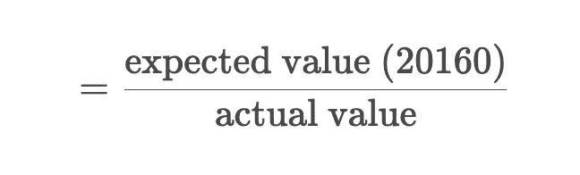
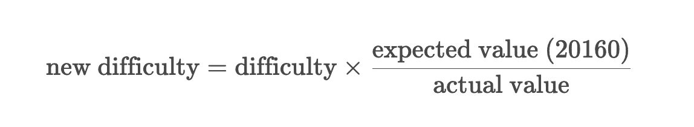
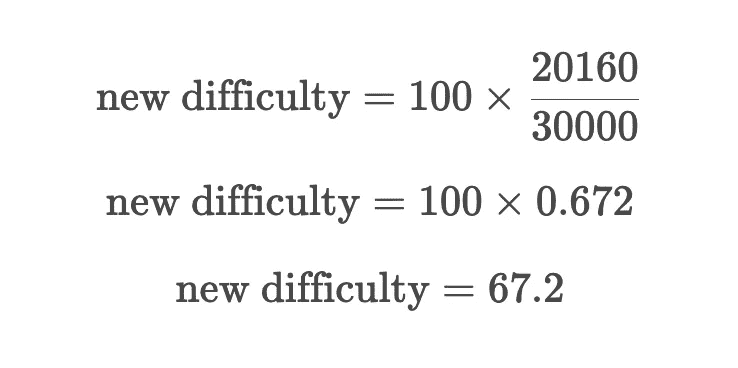
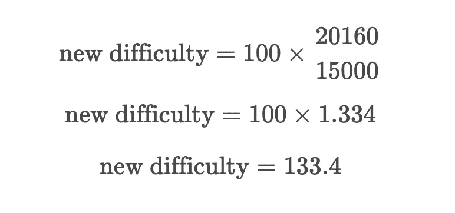
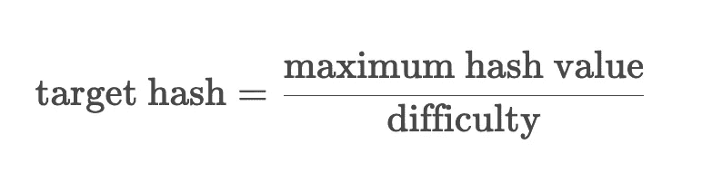
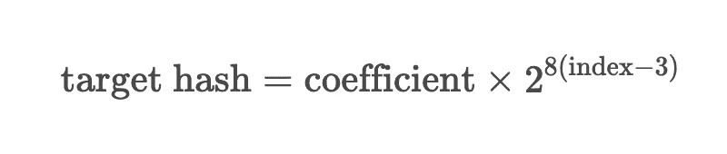
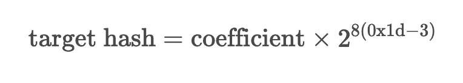

# 区块链的难度调整

> 原文：<https://medium.com/coinmonks/difficulty-adjustment-in-blockchain-d52c8bef0b3f?source=collection_archive---------20----------------------->

## 区块链

我们在上一篇文章中看到了工作验证算法[，在本文中，我们将看看如何根据难度值调整目标散列以保持事务时间不变。](https://www.thearmchaircritic.org/mansplainings/how-proof-of-work-is-used-to-establish-consensus-in-blockchain)

首先，我们根据难度值计算目标散列。我们调整这个难度值，以保持产生一个事务所需的时间不变。让我们看看如何调整这个难度值。

比特币每 2016 年交易调整一次难度值(实际上是区块，我们后面会讨论区块)。比特币预计每笔交易(区块)需要大约 10 分钟的时间。所以实际上，比特币每 20160 分钟调整一次难度值，等于两周。为了确保事务平均花费 10 分钟，我们需要测量每个事务花费的时间。

所以，我们给每笔交易都打上时间戳。时间戳是自 Unix 纪元(1970 年 1 月 00:00:00 01)以来经过的毫秒数。我们可以找到当前批次中第 2016 个块的时间戳与上一批次的第 2016 个块的时间戳之差，从而得出完成这 2016 个事务所用的总时间。

> 交易新手？在[最佳加密交易](/coinmonks/crypto-exchange-dd2f9d6f3769)上尝试[加密交易机器人](/coinmonks/crypto-trading-bot-c2ffce8acb2a)或[复制交易](/coinmonks/top-10-crypto-copy-trading-platforms-for-beginners-d0c37c7d698c)

# 计算难度

一旦我们有了这个值，我们就可以将它与期望值(20160 分钟)进行比较，用期望值除以实际值。如果两个值相同，我们将得到值 1。如果交易发生得更快，那么结果将大于 1。类似地，如果事务花费的时间更长，我们将得到小于 1 的值。

然后我们可以用这个值来计算难度。如果交易更快，那么这意味着我们应该增加难度。我们已经看到，如果交易更快，通过将期望值除以实际值，我们会得到大于 1 的值。因此，如果我们将这个值乘以现有的难度，我们将得到一个更高的难度值。

现在，让我们看几个例子。假设实际值是 30，000，难度值是 100，让我们看看新的难度值是多少。

正如你所看到的，难度值已经下降了，因为交易时间变长了。

再举一个实际值为 15000，难度值为 100 的例子:

由于交易速度加快，难度值上升了。

# 基于难度计算目标哈希

现在让我们看看如何根据难度值计算目标散列。我们已经看到理论上的最大哈希值是 2 255。但实际上，最大哈希值被设置为:

0x 000000000 ffff 0000000000000000000000000000000000000000000000000000000000

我们通过将这个最大散列值除以难度值来获得目标散列值。

当区块链网络被接受时，目标散列将是最大散列值。因此，难度值将为 1。因此，难度值永远不会低于 1，因为较低的难度值意味着目标散列将高于最大散列值。

随着越来越多的计算机加入网络，或者随着现有计算机处理能力的提高，目标哈希变得越来越小。这增加了解谜的难度，并因此确保了解谜所花费的时间保持在 10 分钟。

# 存储目标哈希

然而，我们并没有将目标散列作为 256 位散列存储在块中(我们将在后面学习块。目前，将块视为与事务相同。).为了节省空间，我们将其存储为一个 32 位(4 字节)的整数值。比如最大可能哈希定义为 *486604799* ，十六进制格式为*0x 100 ffff*。这个整数叫做比特。

让我们看看这些位是如何被转换回散列格式的。首先，将位的值转换为十六进制格式，即 *0x1d00ffff* 。如上所述，这是一个 4 字节的数字。这个( *0x1d* )的最高有效字节称为索引。其中的 3 个最低有效字节( *0x00ffff* )称为系数。现在，我们可以使用下面的公式找出目标哈希值。

让我们尝试将系数和索引插入到这个公式中，以获得目标散列。

这将产生以下输出

0x fffeffd 1 a3 a 429 BF BCB 8 a 4188 e 09 da 06491 a 6841 f 00000000000000

我们可以把这个四舍五入到

0x ffff 000000000000000000000000000000000000000000000000000

请注意，它只有 224 位。为了使它成为 256 位，我们可以在前面加零。

0x 000000000 ffff 0000000000000000000000000000000000000000000000000000000000

这是计算出的目标哈希。

# 计算目标散列的另一种方法

然而，有一个更简单的方法来计算这个。将索引视为字节数，将系数视为前缀。在我们的例子中，索引是 *0x1d* ，转换成十进制是 29。因此，计算出的值应该有 29 个字节。前缀 *0x00ffff* 只有 3 个字节。因此，在前缀后添加 52 个零，以获得剩余的 26 个字节。然后在这个值前面加零，得到一个 256 位的散列。

还应该记住，最大散列值*0x 000000000 ffff 00000000000000000000000000000000000000000*不适用于池挖掘者(我们将在后面详细讨论池挖掘)。池挖掘器使用最大哈希值*0x 000000000 fffffffffffffffffffffffffffffffffffffffffffffffffffffffffff*。

所以，由矿工计算的难度值会和其他人计算的不同。由池矿工计算的难度值称为 pdiff，而由其他人计算的难度值称为 bdiff。

现在我们已经了解了如何调整目标哈希值，让我们在下一篇文章中看看如何从事务中创建块。

*原载于 2022 年 12 月 16 日***。**