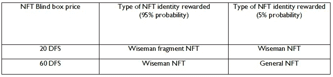
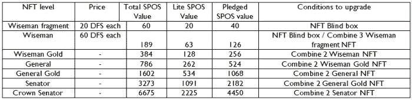
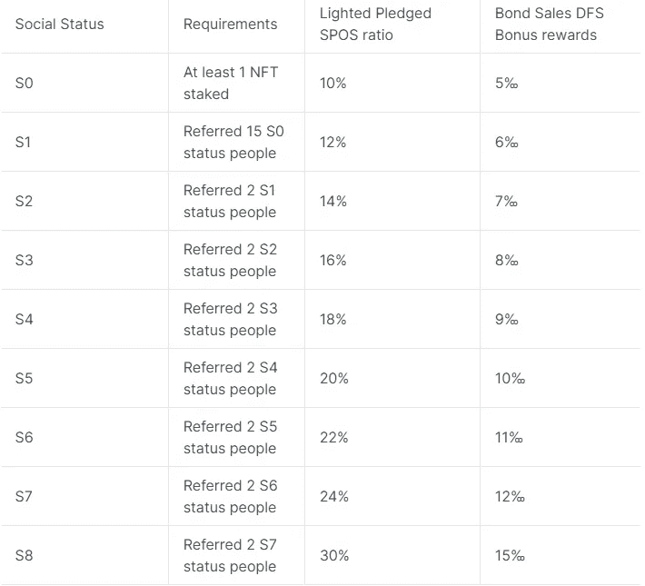

# 扩散金融:Web3.0 金融系统的新世界

> 原文：<https://medium.com/coinmonks/diffusionmetafi-the-new-world-of-web3-0-financial-system-157d76a05eaf?source=collection_archive---------23----------------------->

经过一年多的 R&D 和营销我们的产品，我们终于迎来了扩散岛的第一个也是最重要的生态系统——扩散 MetaFi，一个不断扩散的元宇宙金融中心，这是我们在 Web 3.0 中开始的，也是打开多元宇宙的第一步。我们创建了一个数字资产发行系统，由一个分散的 DAO 组织来形成、操作和维护。以此为基础，道组织的影响力会不断扩大，进而引导道组织发展或进入其他类型的元宇宙。最后，创建一个新的共治空间，并使空间中所有有价值的数字资产都属于创造者。这才是 Web 3.0 的真正意义。我们已经在推动其他多元宇宙的发射。2023 年，我们将看到更复杂的元宇宙空间。现在，让我们正式进入一个新的时代，即 DiffusionMetaFi，抓住它并参与其中，你将获得超乎想象的回报！

扩散道认为，NFT 应该承担更有目的的使命，因此，我们首先推出的是我们的核心宇宙:扩散金属(元宇宙金融)，它结合了 NFT+ Web 3.0 +玩法，这无疑将不仅是 Web 3.0 的新世界秩序，也是 Web 3.0 金融。

扩散岛元菲是扩散岛元宇宙的中心。MetaFi 是一个复杂而科学的模型，它将在传统金融学中得到验证的科学严谨的 DSGE 模型与区块链相结合，以实现其承诺下的最优货币政策，使每一个 DFS 都得到内在价值资产的支持。因此，参与生态系统的用户风险有限，利润无限，因此，扩散道生态系统可以健康、可持续地发展。我们前期的首要目标是铸造尽可能多的 df，让生态系统有很强的风险管理能力。接下来，我们将介绍 DiffusionDAO MetaFi 的组件，包括我们的核心令牌 DFS、中央金融协议、债券、社交 NFT、社会等级、硬币罐和 NFT 市场。

接下来，我们将一步步为您分析扩散道的优势和特点。

# 1: DFS 令牌——扩散到元宇宙的核心令牌

DFS 铸币——DFS 是中央财政协议通过出售债券来铸币，通过债券购买可以享受一定的市场价格折扣。中央金融协议只有在获得 USDT 等无风险资产或由 USDT 和 DFS 组成的 LP 时，才会铸造新的 DFS。这样做的目的是为每个 DFS 的发布提供有价值的支持，具有逻辑性和科学性。

DFS 的核心优势:

● DFS 无预采，无抛售压力。

●每个 DFS 的 mintint 背后都有宝贵的资产；

●高流动性使得 DFS 可以很容易地与其他资产交换；

●从中长期来看，资产的增值率要远远超过系统的通货膨胀率，才能让每一个 DFS 车主保持强大的购买力；

●购买的 DFS 有最低价值支持，具有可靠、低风险的优势，能够鼓励用户大量购买；

● DFS 是扩散道疯狂多元宇宙的核心令牌，未来将连接更多生态系统，应用场景丰富。

# 2:中央财政协议

《中央财政协议》是《扩散道·元菲》健康持续发展的核心协议。

1.  通过 DSGE 模型控制债券贴现和生态系统年复利 APY，使生态系统保持健康状态，是保证用户资产承诺下最优货币政策的关键。
2.  出售债券的利润由中央财政协议控制，并加入流动性池。不能减少流动性，以确保生态系统不会缺乏流动性。

# 3:债券

用户可以通过购买 USDT 的债券以折扣价获得 DFS。购买后，他们将获得债券证书。根据证书中的 DFS 数量，10 天左右会打入用户账户，打入后可以自由流通。折扣由 DSGE 模型根据各种生态系统指标控制，折扣范围为 1%-3%。所有资产将作为外勤支助部的价值储备。未来，我们将开辟更多购买债券的渠道。

# 4:社交 NFT

我们生活在一个充满联系的世界，不可能每个人都独立存在。因此，我们相信在加密领域也是如此。我们首次提出了社会 NFT 的概念，提出了社会公平价值(SPOS 价值)的概念，以智能合约的形式在 MetaFi 中拯救你的社会关系。我们很高兴看到更多的人参与到生态系统中来。所以，如果你为传播道做出了努力，你应该得到相应的回报，让你的社会关系变得有价值。我们提出的 SPOS 价值概念的社会属性是衡量你所建立的社会网络的价值。

# I:如何参与？

用户可以使用 DFS 和债券支付来打开社交 NFT 盲盒。开启后，如果需要合成，可以将 NFT 合成为更高级别的 NFT，获得 SPOS 值加成。赌注 NFT 获得相应的 SPOS 价值相对于社会 NFT，拥有 SPOS 价值，你将拥有每秒钟免费铸造 DFS 的权利..利率由中央金融协议的 DSGE 模式控制。

# 二:社会 NFT 盲盒

a)NFT 盲盒有两种选择，第一种是造价 20 DFS 的**基本型** NFT 盲盒，第二种是造价 60 DFS 的高级 NFT 盲盒。

b)相应的奖励可以参考下表

c)获取方法:

使用 DFS 或债券证书打开社会 NFT 盲盒(对于尚未记入账户的 DFS)。

# 三:SPOS 价值

社会公平价值或 SPOS 价值是我们的第一个概念。社会公平价值反映了具有特定价值的社会关系。这是社交 NFT 系统中一个非常重要的值，它决定了你在 DiffusionMetaFi 中获得免费 DFS 的速度

SPOS 价值的作用:拥有 SPOS 价值，你将拥有每秒钟免费铸造 DFS 的权利。

SPOS 价值分类:有效 SPOS 价值和锁定 SPOS 价值。

有效的 SPOS 价值是有效的 SPOS 价值，您将继续拥有免费铸造 DFS 的权利

锁定的 SPOS 价值需要建立一个社交网络:锁定的 SPOS 价值需要成员在社交网络下赌注社交 NFT，以解锁锁定的 SPOS 价值，只有这样才能累积锁定的 SPOS 价值。

SPOS 价值获取方法:

-通过赌注社会 NFT 获得

-在社交网络中，当成员下注 NFT 时，锁定的 SPOS 值被激活。

# III: NFT 身份证种类

无论何时购买 NFT 盲盒，都会发放一个身份 NFT。

在标桩 NFT 时，会有一个 SPOS 值。

NFT 身份分为 7 个级别，详情如下:

四:社会 NFT 身份综合

●怀斯曼 NFT: 3 个怀斯曼碎片 NFT 可以组合成一个怀斯曼 NFT，社会权益价值加成 5%

●怀斯曼黄金 NFT: 2 个怀斯曼 NFT 可以合并成 1 个怀斯曼黄金 NFT，社会权益价值加成 2%

NFTs 将军:2 个怀斯曼黄金 NFT 可以组合成 1 个 NFT 将军，社会权益值加成 2%

●通用黄金 NFT: 2 个通用 NFT 可以合并成一个通用黄金 NFT，社会权益值加成 2%

●参议员 NFT: 2 个一般黄金 NFT 可以组合成 1 个参议员 NFT，社会公平值加成 2%

●皇冠参议员 NFT: 2 个参议员 NFT 可以组合成一个皇冠参议员 NFT，社会公平值加成 2%

五:社交 NFT 交易

我们提供一个 NFT 交易市场。没有股份的 NFT 可以在 NFT 市场交易，并以 DFS 作为计量货币出售。

提示:如果处于锁定状态的 NFT 被解除锁定，相应的 SPOS 值将被没收。

# 5:社会等级

在 MetaFi 的社交网络中，你的社交能力越强，你的影响力越大，你的努力越大，你对整个生态系统的贡献越大，那么你的影响力就必须与更丰厚的回报相匹配。所以我们量化了你的社会影响力，提出了社会等级分类的概念。在我们的社会等级机制中，我们相信人人平等，你的社会影响力不会受到他人的制约。

**奖励计划**

债券奖励:影响他人购买债券，并按购买 DFS 债券数量的百分比获得奖励。

SPOS 价值奖励:影响他人下注社交 NFT，增加您获得的锁定 SPOS 价值奖励(提示:以有效的 NFT SPOS 价值为计算基础)。

**奖励描述**

1.  奖励比例是你能从你的社交网络下直接影响参与的人那里得到的奖励的比例。如果不是你直接指的人参与到生态系统中，你就可以获得社会等级之间的报酬差异。
2.  你的关系网中有人买了债券，你会得到相应的 DFS 作为奖励。

例如:

你的社交水平是 S5。在你的影响下，当你增加一个购买价值 1000 DFS 债券的新玩家时。你能得到的 DFS 量是:1000*10‰=10。

你的社交等级是 S7，你的人脉下一个 S5 会员直接加一个买 1000 DFS 价值债券的玩家。你能得到的 DFS 量是:1000*(12‰-10‰)=2。

1.  当你的社交网络中有人参与到社交 NFT 中时，你将会释放锁定的 SPOS 价值。

例如:

你的社交水平是 S5。在你的影响下，你增加了一个新的玩家，赌注是皇冠参议员 NFT。你能点亮的 SPOS 值是:2225*20%=445。

你的社交等级是 S7，你网络下的 S5 直接加了一个发誓要押皇冠参议员 NFT 的玩家。你可以点亮的 SPOS 值是 2225*(24%-20%)=89。

1.  当你的网络下用户的社交等级等于或高于你的社交等级时，你就不能获得网络下的奖励，直到你的社交等级大于你的社交关系下用户的社交等级，奖励才可以收回。
2.  当你的关系网渗透到过去 10 代时，你将无法获得奖励。

# 6:硬币罐系统

硬币罐是一种金融产品，可以在扩散道 MetaFi 中随时存入和取出。它具有高度的灵活性。对于打算用钱做稳健投资的用户来说是最好的选择。

如何玩:

用户可以通过下注将自己的 DFS 余额放入硬币罐中。你入股 DFS 后，他们会以 1:1 的比例获得 SDF。利息将每 8 小时计算一次，利率将由 DSGE 模型控制。

sDFS:

sDFS 是硬币罐系统的记帐令牌。与 DFS 的关系是 1:1。当你入股 DFS 时，你将获得等量的 SDF。当您取消股份时，sDFS 将向 DFS 兑换相同的金额。

sDFS 不能执行传输和交易操作。它需要被转换成 DFS 以进行转移和交易操作。

sDFS 由智能合约控制，可以随时 1:1 交换 DFS，可以在 BSC block explorer 中交换。

奖励描述:

硬币罐系统的利率受 DSGE 模型控制，利率低于社会 NFT 系统。

硬币罐系统不为社会关系提供任何奖励。

# 7: NFT 市场

为了更好地促进扩散岛生态系统的发展，我们为自己开发了一个 NFT 交易市场。不仅扩散岛的 NFT 可以在这个 NFT 市场交易，其他生态系统的 NFT 也可以在这个 NFT 市场上市，为扩散岛生态系统带来更多流量。

以上是对扩散道核心宇宙扩散道 MetaFi 的介绍。扩散道 MetaFi 的金融资产将迅速丰富和多样化，如债券、储蓄、社会 NFT、股权 NFT、LP 农场等。同时，我们将完成 NFT 交易市场的启动。

扩散道鼓励更多的道组织和社区参与进来，建立自己的创收渠道，也就是说，扩散道 MetaFi 中的个人或组织可以通过推广生态系统来获得利益，即使你没有自己的道或社区，但在这种情况下你可以很容易地获得宇宙中的财富，因为在我们生态系统的初始阶段，储量的快速增长会使你的资产快速增长。

未来，我们将发射更多的次级宇宙。扩散道 MetaFi 为二次元宇宙提供各种金融服务。当然，我们也欢迎其他生态系统元物种进驻我们的扩散岛生态系统。与此同时，扩散岛生态系统的每个公民在未来都可以这样做。今天就开始提议创造你自己的第二宇宙吧！