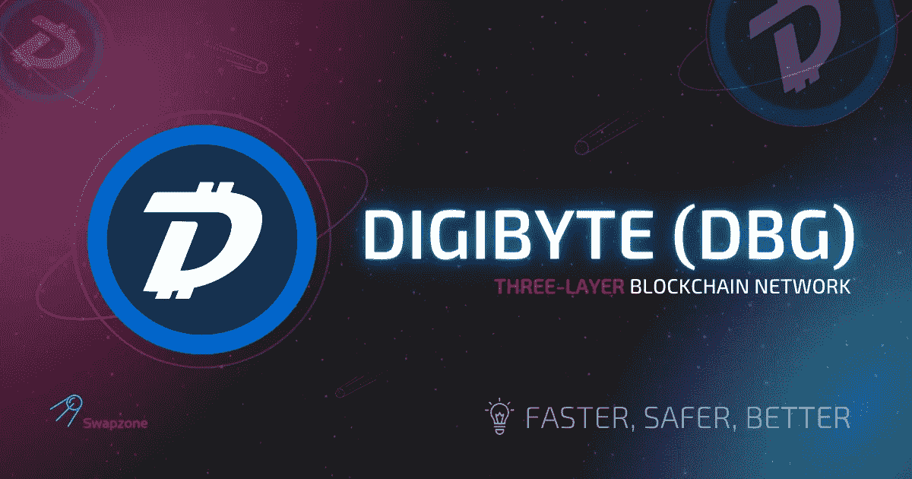

# DigiByte:更快、更安全、更好

> 原文：<https://medium.com/coinmonks/digibyte-faster-safer-and-better-71ad9cc9618?source=collection_archive---------25----------------------->

比特币和以太坊显然是当今的市场领导者，但竞争非常激烈，开发人员正在研究各种替代方案，以改善现有的顶级加密货币。然而，在可伸缩性、安全性、法规政策和遵从性、客户支持、功能等方面，大多数替代方案都没有达到用户的期望。然而，有一种特定的加密货币公开声称比特币和以太坊不够安全或可扩展性不够，这种货币更好——DigiByte。DigiByte 不仅仅是另一个加密硬币，它是一个完整的三层区块链网络，它的硬币——DGB 硬币——就是建立在这个网络上的。让我们了解一下 DigiByte 的关键之处，以及如何以最佳速率交换 DigiByte。

# 起源和特征

Jared Tate 于 2013 年创立了 DigiByte 项目，随后于 2014 年发布。该代码松散地基于比特币的代码，但从 DigiByte 区块链大小到安全和其他功能，许多方面都有所不同。

就像以太坊一样，DigiByte 是为了压制比特币的弊端而产生的。该网络总共有三层，据说是高度分散的。计划是创建一个完全分散的应用程序和令牌，运行在网络之上。这三层功能不同，相互依存。

# 第一层

最顶层是智能合约可以在网络上开发的原因。这些智能合约可以针对 Dapps 和令牌进行设计。所有用户都可以访问该层来处理和访问 dApps。它也被称为应用层。

# 第二层

这一层是公共分类账所在。这意味着所有交易的本地令牌 DGB 硬币都存储在这里。这一层也允许矿工管理每个 DGB 硬币的释放，以获得采矿奖励。你也可以称之为共识层。

# 第三层

这是负责客户端软件集成、节点支持等的基础层。它定义了操作协议。这一层也称为网络层。

DigiByte 拥有更好的安全性和每秒更快的交易速度。当它宣布它将是有史以来第一个在网络上集成 SegWit 的令牌时，它的市场声誉得到了显著提升。这确保了 DGB 的交易速度远远高于其竞争对手。比特币在 DigiByte 之后实现了 SegWit。

虽然 DigiByte 声称是比特币和以太坊的更好版本，但它确实与这两者有一些共同的特质。例如，从区块链中最多可以开采出 210 亿枚 DGB 硬币。另一方面，比特币更好的一个方面是节点数量。

比特币在全球有 11，000 个节点，相比之下有 10，000 个 DigiByte 节点——这不是一个很大的差异，尽管比特币毫无疑问是一个优势。DigiByte 还利用了一些有趣的概念，如补充 DBG 硬币的 Digiassets 和 Digi-ID。

# 更快、更安全、更好，但是怎么做呢？

与 BTC 类似，DigiByte 也在一种 PoW(工作证明)机制下工作，在这种机制下，计算机被用来保护和验证交易，并挖掘新的 DigiByte 货币。不过，DGB 最大的优势在于，用户可以使用我们通常使用的消费级计算机，这和比特币不同，比特币要求必须使用高端的专用系统。

以上只是简单介绍，DGB 币的具体情况可能会让你想知道，为什么之前没有遇到这种货币。这些就是它的安全性和效率方面以及突出的特点。

# 安全方面

## 大范围扩张增强了权力下放

区块链网络遍布全球 10，000 多台服务器，因此您可以期望 DGB 费率始终实时更新，无论您身在何处都可以使用。这些服务器存在于几个设备上，从计算机和显示器到电话和节点，所有这些都包含在网络中。这就确保了 DGB 币的交易以及为所有人提供智能合约和 dApps。

## 比特币的五种挖掘算法

比特币只使用一种算法，所以当区块链使用五种挖掘算法时，你就有了值得期待的东西。他们为分散采矿流程做出了巨大努力，为各种类型的采矿者提供了平等机会，因此不受硬件或软件配置的限制。所用的算法为:

1.  Scrypt
2.  SHA-256
3.  一群
4.  量子位
5.  Groestl

## 世界级的稳定性

难度稳定性是保护网络和账本中的每一枚 DGB 币免受黑客攻击的一个方面。DigiByte 通过 DigiShield 和 MultiShield 实现这一点。这是迄今为止世界上最先进的难度稳定。

# 效率方面

## 1)首先实施隔离证人制度

简而言之，SegWit 是一个从 DGB 块中移除不必要数据的过程。这使得用户能够利用速度和效率进行创新，如跨链和单一确认转移。

## 2)全球最快的区块速度

每个新的比特币区块大约每 10 分钟出现一次。如果你读过 DGB 的 DigiByte 新闻，你就会知道它以速度著称——每一个新的 DGB 区块都是在 10 秒内生成的。与 BTC 区块相比，这个数字要低得多。

## 3)有限扩张

DBG 区块的规模和范围有限，以确保高安全标准和保持效率。

# 突出特点

## 1)物联网集成

数字字节 DGB 或许是一种广为人知的加密货币，但它也是最具未来主义色彩的数字货币之一。未来是光明的，用户将来可以利用 DigiByte 安全性来保护和集成他们自己的物联网设备。

## 2)行业领先的交易时间

DGB 交易的交易速度和 DigiByte 区块链上的其他功能使其成为您可以选择的最快选项之一。

## 3)全球最长的区块链

数字字节是世界上最长的区块链。客观地看，世界上第一种主要加密货币比特币拥有超过 683，000 个区块，而大约六年后推出的 DigiByte 已经生产了 500 万个区块。

# 为什么 Swapzone 是交换 DigiByte 的最佳地点？

如果你像大多数人一样，你可能会想从 BTC 搬到 DGB，因为你已经意识到了一些事实。很有可能，你已经拥有比特币，需要寻找一个安全、可靠的比特币到数字字节的互换。Swapzone 是一个世界级的、非托管的交易聚合器，它使加密到加密的交易变得平稳和安全。

它有一个自动聚合器来帮助你选择最佳的 DGB 费率，而且没有服务费，这是最实惠、最安全、最值得信赖的平台之一。Swapzone 的一些主要特征是:

*   通过电子邮件和实时聊天提供全天候客户支持
*   500 多枚硬币可供选择
*   详细的指南和博客，包含评论、过程解释、关于加密货币世界的大量信息、最新的 DGB DigiByte 新闻等。
*   促进内部交换的服务 API。
*   按价格、ETA、评级等对报价进行排序。应用过滤器并获得关于最佳报价、固定费率报价等的建议。
*   有固定利率和浮动利率可供选择。
*   简单的过程适合初学者和高级用户。

# 一锤定音

当你听说 DigiByte 时，你会想，尽管它提供了所有的东西，但它仍然落后于以太坊和比特币之类的东西。答案很简单——声誉先于业绩。毫无疑问，技术、安全以及介于两者之间的一切使 DigiByte 成为世界级的加密货币，甚至可能是世界上最好的。因此，现在是时候了——在人们还在了解这个平台的时候投资，因为一旦他们了解了，DGB 利率可能会大幅飙升。

# 转换数字字节的常用线对

[DGB 到 BTC](https://swapzone.io/exchange/dgb/btc)
[DGB 到 ETH](https://swapzone.io/exchange/dgb/eth)
[DGB 到 LTC](https://swapzone.io/exchange/dgb/ltc)
[DGB 到 BNB](https://swapzone.io/exchange/dgb/bnb)
[DGB 到 BCH](https://swapzone.io/exchange/dgb/bch)
[DGB 到 USDT](https://swapzone.io/exchange/dgb/usdt)
[DGB 到 THETA](https://swapzone.io/exchange/dgb/theta)
[DGB 到 XMR](https://swapzone.io/exchange/dgb/xmr) [DGB 到 TRX](https://swapzone.io/exchange/dgb/trx)
[DGB 到](https://swapzone.io/exchange/dgb/bsv)

> 交易新手？尝试[加密交易机器人](/coinmonks/crypto-trading-bot-c2ffce8acb2a)或[复制交易](/coinmonks/top-10-crypto-copy-trading-platforms-for-beginners-d0c37c7d698c)