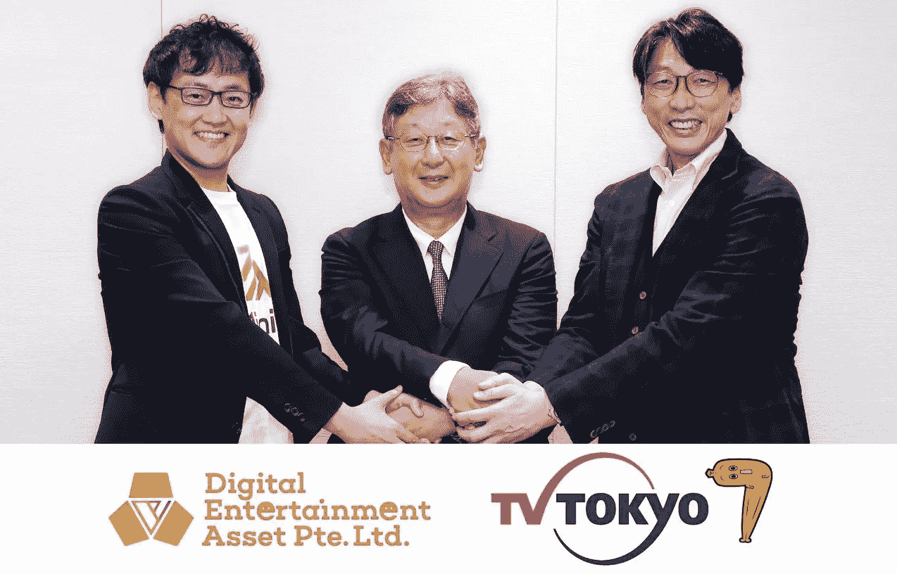

# 数字娱乐资产(DEA)与东京电视公司合作，将 Web3 媒体带给日本公众

> 原文：<https://medium.com/coinmonks/digital-entertainment-asset-dea-collaborates-with-tv-tokyo-corp-to-bring-web3-media-to-the-fa1d803151ac?source=collection_archive---------35----------------------->

*新加坡，2022 年 11 月 17 日* — [数字娱乐资产](https://dea.sg/jp/) (DEA)，一家总部位于新加坡、运营 [PlayMining](https://playmining.com) NFT 游戏平台的全球网络 3 娱乐公司，宣布与[东京电视公司](https://www.tv-tokyo.co.jp.e.ck.hp.transer.com/kaisha/index.html)建立业务联盟。

东京电视台的运营商东京电视台公司已经同意与药品管理局合作开发下一代 NFT/GameFi 电视内容和 Web3 计划。东京电视台是日本主要的国家电视台，专门播放动漫等内容。

> *“东京电视台”制作各种类型的节目和内容，如新闻、动画、电视剧、各种节目、体育等。东京电视台总裁兼代表总监石川一郎说:“我们想学习最新的数字技术‘网络 3.0’，比如 NFTs，让内容对每个人来说都更有用、更有趣。”。“我们将与 DEA 的合作视为朝着这个方向迈出的第一步，并打算以此为突破口，积极开拓新的业务领域。”*

[Kozo Yamada](https://www.linkedin.com/in/kozo-yamada-14a56391/?originalSubdomain=jp) 是美国药品管理局(DEA)的联合创始人兼联合首席执行官，他的职业生涯始于东京电视台，此前他在东京电视台做过 15 年的电视制片人。山田也是日本 NFT 地区的 Youtube 和网络媒体的影响者。

> *“我们与东京电视台签署了商业联盟，这一事实让我深受感动，这家公司为我的职业生涯奠定了基础，”山田说。“我感谢东京电视台，很高兴能够继续合作，为日本主流观众创作原创网络 3 内容。我们还将为各公司提供联合网络 3 战略咨询，并开发可通过网络 3 在全球传播的新知识产权内容。”*

**将网络 3 带入主流**

DEA 的 PlayMining 平台以日本动漫和视频游戏中一些最热门的名字为特色。该公司有自己的代币，DEAPcoin ( [$DEP](https://coinmarketcap.com/currencies/deapcoin/) )，这是第一种也是目前唯一一种由日本金融厅正式批准的 P2E 代币。PlayMining 平台还提供了一个游戏赚钱(P2E)的 NFT 游戏目录，包括[职业部落](https://jobtribes.playmining.com/en/)、[烹饪汉堡](https://www.cookinburger.com/en/)、[门亚龙拉面](https://dragonramen.flypenguin-games.com/en/)，以及[最近](https://www.yahoo.com/news/playmining-web3-entertainment-platform-launches-090300922.html)推出的[涂鸦赛车](https://graffitiracer.playmining.com/en/)，为与其合作的第三方游戏工作室提供 IP 货币化机会。许多其他游戏和元宇宙倡议也正在建设中。

DEA 与东京电视公司的协议的一部分是合作创建教育内容，向公众传播有关 Web3 发展的准确信息，以努力培养对 Web3 内容的更大兴趣和采用。山田作为电视制片人和 NFT 影响者的长期经验将有助于 DEA 通过东京电视台接触主流。

> *“推动主流采用 Web3 的最佳方式是提高公众意识，营造一个竞争的 Web3 公司能够成功发展的环境。GameFi 领域的更多竞争对商业来说是好事，因为这将有助于引入越来越多的人玩游戏赚钱，”DEA 的另一位联合创始人兼联合首席执行官*[*nao hito Yoshida*](https://www.linkedin.com/in/naohito-yoshida-47498836/)*说。“我们的目标是让 DEA 成为全球顶尖的 Web3 公司，而教育主流人士了解 Web3 是实现这一目标的重要一步。”*

**关于数字娱乐资产**

数字娱乐资产有限公司。Ltd. (DEA)是一家总部位于新加坡的 Web3 娱乐公司，拥有名为 PlayMining 的全球 GameFi 和元宇宙平台，成立于 2018 年 8 月。DEA 是游戏赚取游戏的开发商，还运营着 PlayMining 游戏平台、PlayMining NFT 市场、PlayMining Verse 元宇宙项目和 DEAPcoin，这是目前唯一由日本金融厅批准的 P2E 代币。该团队由两位联合首席执行官领导——Naohito“Goro”Yoshida 和 Kozo Yamada——他们共同带来了数十年的成功创业经验(nao hito 有 3 次 IPO ),创造了热门视频游戏，制作了网络电视节目，并对 NFT 游戏有着深刻的理解。

**关于 PlayMining**

PlayMining 是一个 Web3 娱乐平台，它赋予创作者权力，否则他们在传统的知识产权创作行业中几乎不会受益。PlayMining 平台是一种新的内容创作商业模式，以 PlayMining DEAPcoin 为动力的 NFT 市场为特色，与 NFT 游戏和元宇宙平台相结合，既有内部游戏，也有第三方项目，它们拥有自己的原生令牌，允许创作者捕捉他们创造的价值。PlayMining 平台拥有 250 万用户和一系列游戏，包括 Job Tribes、Cookin ' Burger、Menya Dragon Ramen 和 Graffiti Racer。

**关于东京电视台**

东京电视台公司自 1951 年开始营业，在东京电视台提供各种节目。该公司是广播控股公司东京电视台控股公司的子公司，东京电视台是日经公司的子公司，东京电视台是 TX 网络的旗舰台，专门播放动漫。

**官方渠道**

PlayMining 网站:[https://playmining.com](https://playmining.com)

play mining Discord:[https://discord.com/invite/xWeHGdt](https://discord.com/invite/xWeHGdt)

PlayMining 推特:[https://twitter.com/PlayMining_SG](https://twitter.com/PlayMining_SG)

https://www.facebook.com/PlayMining/脸书采矿公司:

play mining Youtube:[https://www.youtube.com/channel/UCGWmK0RLV4SB_PSXpj2j6dw](https://www.youtube.com/channel/UCGWmK0RLV4SB_PSXpj2j6dw)

PlayMining LinkedIn:

[https://www . LinkedIn . com/company/数字娱乐资产/](https://www.linkedin.com/company/digital-entertainment-asset/)

PlayMining 媒体:

[https://playmining.medium.com](https://playmining.medium.com)

DEA 网址: [https://dea.sg](https://dea.sg/jp/)

> 交易新手？试试[密码交易机器人](/coinmonks/crypto-trading-bot-c2ffce8acb2a)或者[复制交易](/coinmonks/top-10-crypto-copy-trading-platforms-for-beginners-d0c37c7d698c)