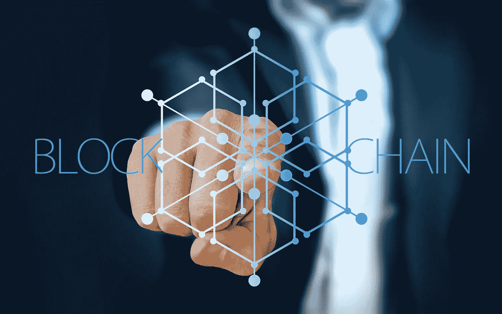

# web3 中的数字营销:有所不同！

> 原文：<https://medium.com/coinmonks/digital-marketing-in-web3-theres-a-difference-8a7ba77b1fcd?source=collection_archive---------9----------------------->

*深入探讨 web3 和区块链组织特有的数字化方法。*

新技术和创新带来了兴奋、期待，但也带来了恐惧和不确定性。在我看来，当我想到区块链技术和加密货币的诞生时，情况肯定是这样的。加密空间内仍然很少监管，这在过去导致了许多骗局，导致一些传统营销渠道禁止区块链和加密相关的广告。

过去几年，加密项目不得不绕开限制，包括谷歌、脸书、Twitter 和 YouTube 屏蔽广告，以及不利的算法使项目难以被发现。这最终导致替代营销渠道的建立，并用于达到目标受众。

除了营销渠道，加密项目的受众与其他技术行业有些不同，这是走向市场时常见的误解。在加密领域，不同的受众需要不同的推广和定位方式。

在这里，我探讨了 crypto 和传统公司在数字营销方面的主要区别，包括渠道、受众和营销策略，以及现有项目和为 ICO 做准备的项目。

# 区块链和密码的历史

在我们深入研究加密市场和传统市场之间的数字差异之前，我们最好快速回顾一下我们是如何走到这一步的(加密爱好者可以随意跳过这一部分！)

回到起点

好吧，区块链是在 2008 年由化名的开发者中本聪开发的，实现了区块链的白皮书并构思了比特币。自那以后，区块链席卷了数字世界，从彻底改变交易记录方式，到成为加密货币发展的基础。

区块链技术已经对世界各地的行业产生了影响，但它仍处于早期阶段，许多人认为它有可能在未来十年颠覆每个行业。由于比特币，近年来我们看到了以太坊和数以千计的替代硬币(替代硬币)之类的东西，它们有不同的使用案例，也有不同的成功。

**不止比特币……**

当然，我们知道比特币是加密的主要参与者，至少在市值和主流曝光率方面是如此。然而，在区块链和加密空间中有如此多的其他部门，远远超出了作为交换媒介和支付方式的范围。

有智能合约(想想以太坊)，集中交易(比特币基地，币安)，分散金融，包括分散交易，借贷协议等等，还有 stablecoins(想想卢娜和 UST…或者可能没有)，NFTs，等等。

每个部门和项目都使用区块链技术，有能力渗透到主流。正如我在另一篇关于 NFTs 的 [**文章中所讨论的，区块链技术有潜力取代商业中的现有流程，比如供应链，这只是其中之一。**](https://www.linkedin.com/pulse/nfts-within-business-place-non-fungible-tokens-dominic-fewster/)

# 区块链理工的崛起！

在过去的几年中，我们看到了加密和其他区块链相关资产(如 NFTs)的急剧增长。这是一个全新的领域，前所未有的需求需要新的、更清晰的、了解行业的推广策略。

加密项目背后的目标或驱动力类似于技术或其他领域的传统公司，即发展数据驱动的品牌意识，并向客户或客户提供有价值的产品或服务。

**有什么区别？**

Crypto 很容易被定型为另一种“技术产品或服务”,因此营销人员可能会决定部署传统的数字营销策略来推广区块链或 crypto 相关项目，就像他们会推广另一家技术公司一样。

这将是一个错误——尽管表面上看，crypto 项目和其他科技公司之间可能有一些相似之处，但也有许多不同之处，因此需要探索不同的营销策略。

那么从哪里开始呢？我将深入探讨受众、渠道和最适合这个行业的策略，以及 SEO 发挥作用的地方。

# 网络 3、区块链和加密受众

正如传统组织迎合 B2B(企业对企业)和 B2C(企业对客户)以及生活在其中的特定受众(从 IT 领导者到零售买家)一样，区块链和密码行业也有自己的目标受众。

智能合同项目(如以太坊)可能希望通过吸引和加入分散式交易所、借贷或支付协议等 defi 项目来使用其技术并成为其生态系统的一部分，从而发展其生态系统。而分散的交易所和借贷项目可能是为了吸引散户投资者。

实际上，我们可以从两个方面来看待目标受众或最终用户——传统用户和加密用户。让我们把这两个观众分解一下。

**传统观众**

如前所述，区块链技术在加密和 NFT 领域之外也有影响力，并且已经在许多行业得到应用，我们预计这一趋势将在未来几年继续增长。在这种情况下，加密项目可能需要为传统(非加密)受众定制消息传递。

例如，一个常规的企业可能是一个利用来自加密项目的区块链技术的企业，也可能是一个与 Vechain 合作记录和验证供应链数据的纺织品供应商。如果我们将 Vechain 的营销团队向一家跨国纺织公司的高管传达服务、功能和优势的方式与他们向同样在区块链行业的潜在“客户”传达技术的方式进行比较，结果会大不相同。

当我们考虑传统用户如何可能发现区块链技术解决方案时，这尤其不同，这些解决方案通常是在 LinkedIn 等传统社交媒体渠道上发现的。他们还会寻找以传统方式呈现的熟悉内容，如白皮书和网络研讨会，这些内容用通俗易懂的语言描述，并附有他们可以联系到的使用案例。

**加密受众**

另一方面，如果你是以太坊这样的第 1 层区块链，你的客户定义了 Uniswap 和 Compound 等项目，或者基本上是我们讨论过的任何需要使用以太坊智能联系人来构建的加密领域。关键是这些“客户”对区块链技术有非常专业的理解，因此营销是不同的。在某些情况下，使用的通道甚至可能不同，我们将在后面讨论这一点。

**买家角色**

当涉及到购买者角色和开发这两个客户的过程时，这对区块链和加密项目来说是一个非常重要的练习。将这两个用户群分开，并考虑不同的需求、兴趣、动机、渠道和人口统计数据，将使 crypto 项目能够针对正确的客户制定高度个性化的数字营销策略。

# 区块链的数字营销渠道和加密

传统的，正规的，常规的，主流的营销渠道，随便你怎么称呼！在数码行业工作多年，除了一些例外，你可以肯定无论你在哪个领域工作，从 IT 到电子商务，都有一些营销渠道是主要的。

这些行业标准渠道包括 LinkedIn、twitter、YouTube 和脸书。在区块链和加密项目中，这些通道仍然大量存在，但它们不是唯一使用的工具。让我们来看看项目可以用来接触他们的观众的最有用的渠道。

*   **Twitter —** 好的，这仍然是区块链和加密项目的主要渠道！重要的项目仍然投资于他们的公司页面和 feed，回复问题并参与社区。这个渠道对于品牌定位、公告和思想领导力非常重要。
*   **YouTube —** 这又是一个传统的营销渠道，但在加密项目的视频内容方面仍然是一条大鱼。项目应该将它视为一种可视化的、易于使用的方式来描述白皮书中的一些技术含量高的内容。视频内容对高质量的搜索引擎排名非常重要。

# 更“分散”的营销渠道

尽管 Twitter 和 YouTube 在区块链和加密领域仍然是受欢迎的营销渠道，但还有许多不太为人知的渠道被大量使用。很多不为主流所知。

让我们来讨论前 4 名:

1.  **电报—** WhatsApp for crypto right？嗯，不。Telegram 是排名第一的消息和社区管理应用程序，是所有加密应用程序的首选。如今，大多数区块链和加密项目通过电报管理他们的社区。社区为王是加密，该应用程序允许项目添加机器人和社区管理人员进行双向交流。
2.  **不和谐—** 但是有竞争！Discord 提供了与 Telegram 相同的功能，但垃圾邮件较少。最近一段时间，加密项目发生了从 Telegram 到 Discord 的巨大转变。社区经验使这一点更加明显，项目能够投入更多的时间来交谈和回答问题，而不仅仅是删除垃圾邮件。
3.  Reddit — 在加密营销中，你必须跟随大众。Reddit 上有成千上万甚至数百万的加密社区，项目需要注意这一点，并将其作为营销策略的一部分。现在许多项目在 Reddit 上都有自己的专门小组。
4.  **中型—** 最大的加密博客网站。如今很难找到一个不使用博客、思想领袖和新闻发布媒介的项目。尽管传统行业可能会使用 WordPress 或 HubSpot，但在区块链中，这是一种媒介。

我只列举了几个备选方案，很多读到这里的人会奇怪为什么我没有列出更多。名单很长。那么为什么有这么多呢？

# 加密:被迫探索新的渠道

让我们回到过去！加密在 2017 年牛市期间的突出表现为骗子提供了滋生的土壤，他们利用谷歌和社交媒体推广虚假项目(出售梦想)，欺骗散户投资者，并进行“拉地毯”——带着他们的钱逃跑。

2018 年，数十亿美元被盗，这导致脸书等大型营销渠道打击其所有网站上广告的 ico(首次发行硬币)。

这使得所有真正的加密项目基本上被禁止使用高调的营销渠道，并引发了探索替代广告方式的需求。营销团队从脸书和 Instagram 等传统渠道转移到 Discord 和 Reddit 等更分散的平台。

**永久转移…**

脸书不时软化其对加密的立场，但自从决定转向替代渠道，就没有回头路了！Telegram、Discord 和 Reddit 至今仍是区块链营销活动的支柱。一个惊人的事实是，许多数字营销人员可能没有听说过这些渠道！

# “区块链营销”不是数字营销

在过去的一年左右的时间里，我看到区块链营销这个词出现得越来越多，但并非没有充分的理由。它不是一个吸引人的名字或时尚，而是区块链和加密项目的一种新的思维方式。区块链营销诞生于支持来自区块链的不断增长和不断发展的技术和应用的需求，例如来自加密项目的技术和应用。

我们必须承认，企业对企业(B2B)和企业对客户(B2C)仍然存在于区块链营销。然而，这两个概念并没有涵盖区块链的所有方面，这让我想到了社区对客户(C2C)！

**社区对客户(C2C)营销**

这是一个有趣的模型。社区在区块链和加密领域是如此重要，那么加密项目如何以及如何将这种能量用于推广目的呢？

使用播客或视频流，加密项目可以与他们的创始人、营销团队、开发人员以及他们生态系统内的合作伙伴、相关项目和顾问一起举办活动，讨论区块链国内的话题，并与他们各自的观众联系。这才是真正的社区对客户(C2C)。

这个模型的另一种工作方式是通过治理令牌的持有者。我们经常在 reddit 或 discord 上的特定加密小组中看到成千上万的令牌持有者热情地推广加密项目。本质上，社区把潜在客户变成了社区！

在这两种情况下，我对区块链的 C2C 营销概念非常感兴趣。

# 网络 3 和区块链营销策略

当谈到确定正确的受众和正确的推广渠道时，实施正确的策略是最后一块拼图。

当一个新的加密项目要进行 ICO 时，这是最重要的。首次公开募股(ICO)与首次公开募股(IPO)非常相似，本质上是加密版本。加密项目通常在寻求融资时进行 ICO，使公共和私人投资者都能购买一定比例的治理令牌。

让我们看看进行 ICO 的项目和现有项目的 10 个基本策略

1.  **社交媒体营销**——一旦一个项目确定了他们的买家角色和渠道，他们需要建立一个社区。作为一个成功的加密项目，意味着在社交媒体上很好地营销自己，与社区保持一致，提供更新，通过选择的渠道产生轰动。无论是 Twitter，Reddit，Discord，Medium 等。
2.  影响者营销(Influencer marketing)——这绝对是一个新时代的策略，在区块链的许多项目中取得了良好的回报。与 YouTube、twitter 和加密特定营销渠道上的加密影响者建立和维护牢固的关系非常重要。这使得项目可以开展影响者营销活动，以获得消息，建立宣传，更重要的是，建立信任。
3.  **空投战役**——这是一项重要的任务。无论是加密项目还是 NFT 项目想要获得更多的关注，空投免费代币或 NFT 都是激励和建立社区的好方法。然而，这也可能对品牌造成损害，并建立一个虚假的社区，由只是寻找免费赠品的人组成。
4.  **电子邮件营销**——一种久经考验的传统营销策略，适用于区块链和加密领域。项目可以利用这种策略，使用目标电子邮件和直接信息向潜在投资者和客户介绍品牌、目标、路线图，并让他们注册简讯。
5.  我不相信很多加密项目会对公共关系给予足够的重视。通过与加密和传统媒体中的许多加密和技术特定记者和编辑联系，项目可以接触到传统和加密受众。
6.  **活动&会议** —举办活动(在线或面对面)是联系受众的好方法。这可以成为项目 C2C 营销策略的一部分，与区块链创始人、相关项目和顾问一起举办活动，分享见解并与社区建立联系。
7.  **思想领导力** —在社交渠道上大肆宣传很重要，但为了获得信任，项目还需要坐下来写博客和文章，并被视为该领域的思想领袖。利用像 Medium 这样的渠道将允许项目深入他们的品牌和路线图。内容才是王道！
8.  **战略合作伙伴关系** —人多力量大！与其他区块链项目、内容创建者和媒体合作或合伙可以为项目带来更多的增长。它向潜在的投资者或客户提供了一个信号，表明项目是可信的，更重要的是，项目正在成长。
9.  私人机构投资者对 ICO 的项目来说非常重要。与风投交谈并理解交易是如何构成的，应该是项目更广泛的营销策略的一部分。这将有助于项目理解如何在其内容计划中向特定投资者营销。
10.  **付费广告** —在我们看 SEO 之前，让我们考虑付费搜索的重要性。项目也不需要在谷歌或传统渠道上回复。有许多专门的加密媒体网站有付费广告结构。利用这一点可能是区块链项目的另一个目标，以达到正确的观众。

# web3 和区块链项目的搜索引擎优化

我们知道，通过谷歌进行付费广告并非没有挑战，之前为了保护天真的投资者，谷歌禁止了 ICO 广告。对我来说，这意味着拥有一个伟大的搜索引擎优化策略比以往任何时候都更重要，要被搜索引擎视为“值得信赖”，并推动内容的有机流量。

为了做到这一点，项目需要在传统的数字营销框架内采用区块链搜索引擎优化策略。关键词研究、内容优化、权威建设和分析是任何 SEO 计划的基石，无论是加密还是不加密。

我们一个一个来看这些。

*   **关键词研究—** 无论哪个行业，每个企业都应该这样做。关键词研究是提高有机流量的第一步。通过了解目标受众在搜索服务或产品时使用的关键字，crypto 项目将能够专门针对这一市场。
*   **内容(为王)——**这应该属于一个加密项目的整体营销策略，但在这里提到这一点很重要，因为没有匹配的内容，进行可靠的关键词研究是毫无意义的。强大的思想领导内容，而不是塞满关键词、单薄的内容或点击诱饵。
*   **权威建立** —加密项目可以通过建立链接来提高其域的可信度和权威。连接强大的区块链网站，让他们链接到自己的网站，可以让项目有良好的声誉。不幸的是，骗局只在加密领域发展，所以信任就是一切。
*   **分析** —加密空间是敏捷且不断变化的，项目也需要如此。通过敏捷的 SEO 策略，项目可以评估进度。分析有助于项目了解哪些渠道参与度最高，哪些渠道推动了高质量的流量和跟踪排名。

当然，这只是触及了 SEO 的表面，还有许多深入的技术可以用来提高在线可见性。然而，我只是想给一个品尝者，并强调 SEO 在加密领域的重要性，这是许多项目都忘记的。

# 总结事情！

数字营销是一份全职工作，我知道这一点，因为这是我的全职工作！SEO，PR 等等也可以这么说。如果团队试图承担过多的工作，他们可能会变得捉襟见肘，营销策略变得淡化，内容计划的不确定性，在渠道上发布的差距，与受众的互动下降，搜索引擎优化进入垃圾箱(垃圾)，裂缝开始出现。

在像区块链这样的新兴行业，许多项目都是拥有出色技术的初创企业，但团队非常小，这并不奇怪。随着过去几年许多加密和 NFT 项目的出现，优秀的初创企业可能会“迷失在噪音中”，因此投资数字或“区块链”营销和 SEO 比以往任何时候都更重要。

谁在支持区块链的项目，为正确的频道制作针对正确受众的正确内容？

嗯，有许多数字机构“声称”能够提供支持，我不会直接说出他们的名字，但在阅读他们的服务时，很明显他们只是重复了现有的策略，并将其应用于区块链公司。我们已经讨论了为什么这不会有效地工作。

不要误会我的意思，有一些数字机构在那里生活和呼吸加密，甚至在加密工作。他们合理地提供了从咨询、GTM 战略到 SEO 的出色支持。我的观点是他们很少。区块链的市场营销可能与传统市场大相径庭。一语双关！

**不同的市场=不同的方法**

我想写这篇文章，因为我开始看到一种趋势。区块链技术创新，转向 web3 和更分散的渠道，但数字营销战略仍停滞不前。这两者应该携手并进，不断变化，共同成长。

看到区块链项目的创新被扼杀是可耻的，因为他们将资金和信任投入到数字和搜索引擎优化代理中，这些代理对“现有或传统”的营销方法缺乏研究和过度自信，并以错误的方式接近数字——错过了目标，没有达到预期的受众。

同样可以说，项目保持他们的营销和搜索引擎优化的房子，不同的市场，不同的营销需要是最重要的。

**最后的想法**

无论一个项目是刚刚起步，有一个网站和不和谐，为 ICO 做好准备，还是建立智能合同以铸造 NFT 的，成为“智能”和精明的区块链营销策略将大有帮助。这从教育和熟悉不断变化的市场开始。这将有助于通过营销机构或公司内部做出决策。

web3 和加密项目的数字营销:不同的市场=不同的方法。

> 交易新手？尝试[加密交易机器人](/coinmonks/crypto-trading-bot-c2ffce8acb2a)或[复制交易](/coinmonks/top-10-crypto-copy-trading-platforms-for-beginners-d0c37c7d698c)