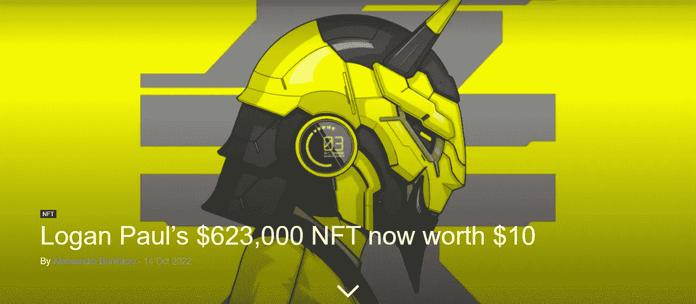
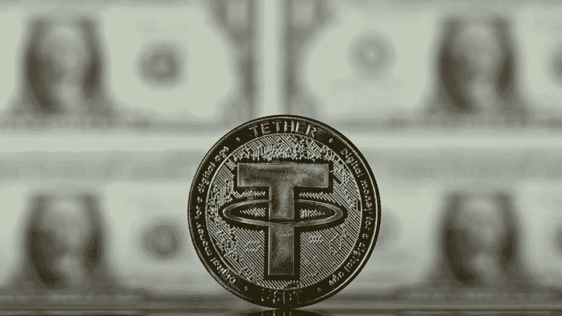

# 数字人民币测试和与美国国债的关系再平衡

> 原文：<https://medium.com/coinmonks/digital-yuan-tests-and-tether-rebalancing-with-us-treasury-bills-4375cac98488?source=collection_archive---------25----------------------->

两个主要的经济大国已经成为本周的新闻。第一个拥有数字人民币的中国。
读书快乐！

 [## 万事达卡希望制造加密货币作为日常支付方式

### 支付巨头万事达卡认为加密资产有潜力改变金融基础设施。

cryptonews.com](https://cryptonews.com/news/mastercard-looking-make-cryptocurrencies-everyday-way-pay.htm) 

万事达卡正在更深入地进入传统支付系统，日复一日地在更多的电路上集成加密货币。

[https://en.cryptonomist.ch/2022/10/14/thud-logan-pauls-nft/](https://en.cryptonomist.ch/2022/10/14/thud-logan-pauls-nft/)

不要过分炒作。总是检查你买的东西的实用性。此外，NFT 和象征性贬值也会产生重大影响。

 [## 你现在可以谷歌以太坊地址的余额-解密

### 谷歌现在通过其搜索引擎提供以太坊地址的数据。世界上最大的网站现在告诉你如何…

decrypt.co](https://decrypt.co/111667/ethereum-addresses-now-searchable-on-google) 

现在寻找以太坊地址是可能的，只需在谷歌搜索引擎中搜索地址字符串。有用还是没用？嗯，你仍然可以简单地去以太网扫描，并在那里寻找地址。

 [## 中国银行:数字人民币交易额突破 140 亿美元大关

### 中国央行数字货币(CBDC)项目已经达到接近 140 亿美元，即 1000.4 亿美元的大关…

cointelegraph.com](https://cointelegraph.com/news/bank-of-china-digital-yuan-transactions-volume-crossed-14b-mark) 

数字人民币将很快进入市场，这可能是 CBDCs 进入市场的第一次大规模测试。做好准备，因为金钱(自由)的完全透明(控制)将很快完全数字化(集中)。

[https://www . CNBC . com/2022/10/13/tether-worlds-bigs-stable coin-cuts-commercial-paper-to-zero . htm](https://www.cnbc.com/2022/10/13/tether-worlds-biggest-stablecoin-cuts-commercial-paper-to-zero.html)

Tether 正在将其支持从商业票据(企业发行的短期无担保债务)转换为美国国债，在美国国债中的比例从 43.5%升至 58.1%。
这一举措旨在增加他们季度报告的透明度。但是，根据这些最新的世界形势和持续的通货膨胀，美元将持续多久？

 [## OpenSea NFT 市场推出雪崩区块链

### 主要的不可替代令牌(NFT)市场 OpenSea 已经在第 1 层区块链雪崩(AVAX)上启动。的…

cryptonews.com](https://cryptonews.com/news/opensea-nft-marketplace-launches-avalanche-blockchain.htm) 

在索拉纳之后，尽管过去 10 个月 Opensea 的首席财务官布莱恩·罗伯茨辞职，但 Opensea 在网络中增加了雪崩，增加了其在市场中的存在。

> 交易新手？尝试[加密交易机器人](/coinmonks/crypto-trading-bot-c2ffce8acb2a)或[复制交易](/coinmonks/top-10-crypto-copy-trading-platforms-for-beginners-d0c37c7d698c)