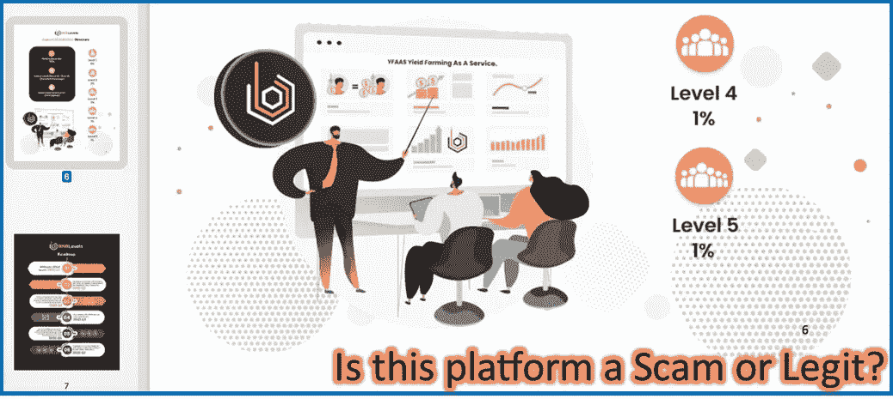
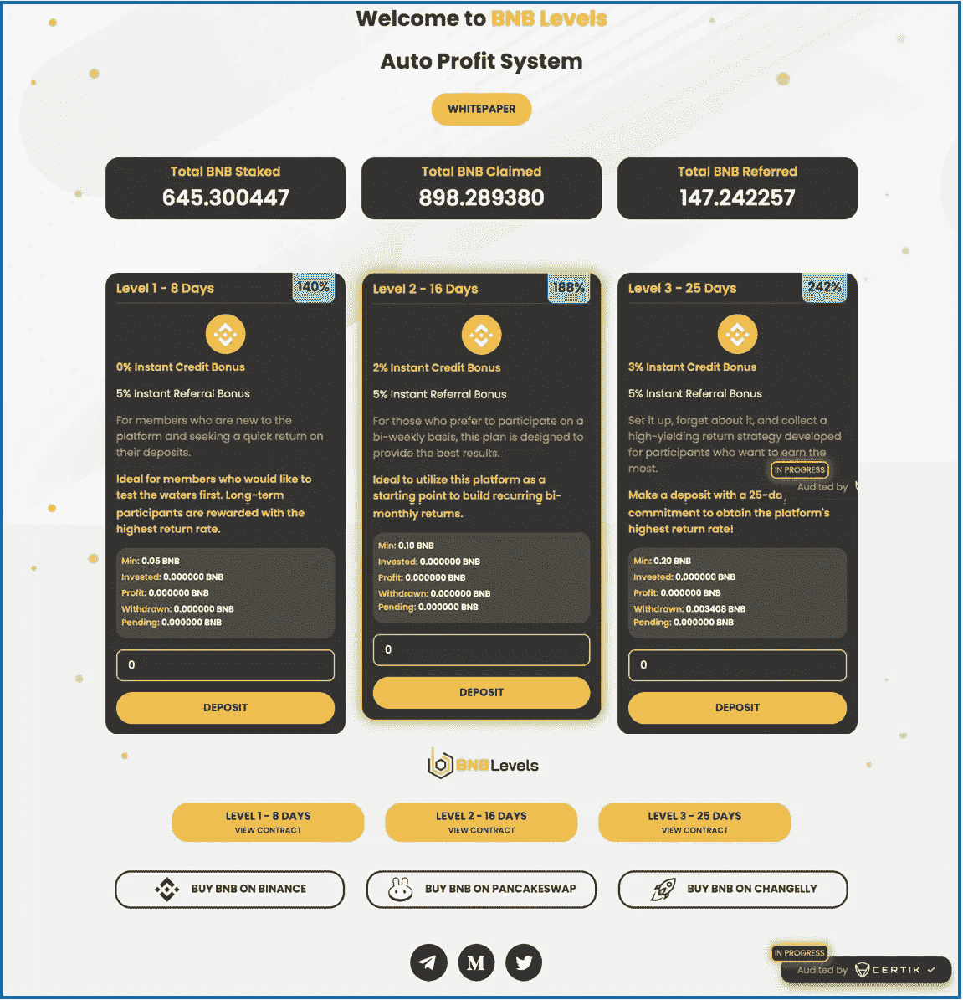
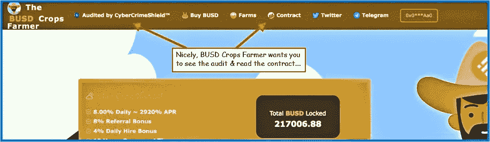
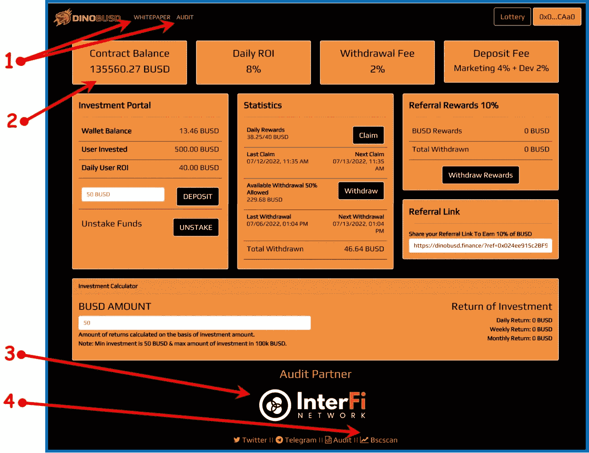
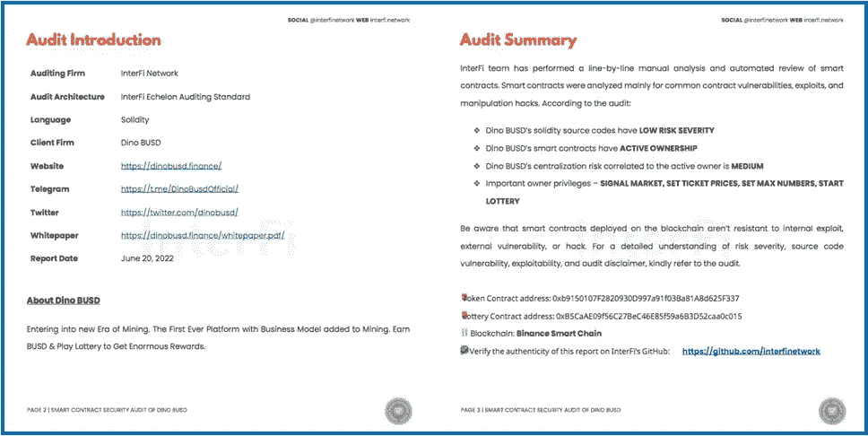
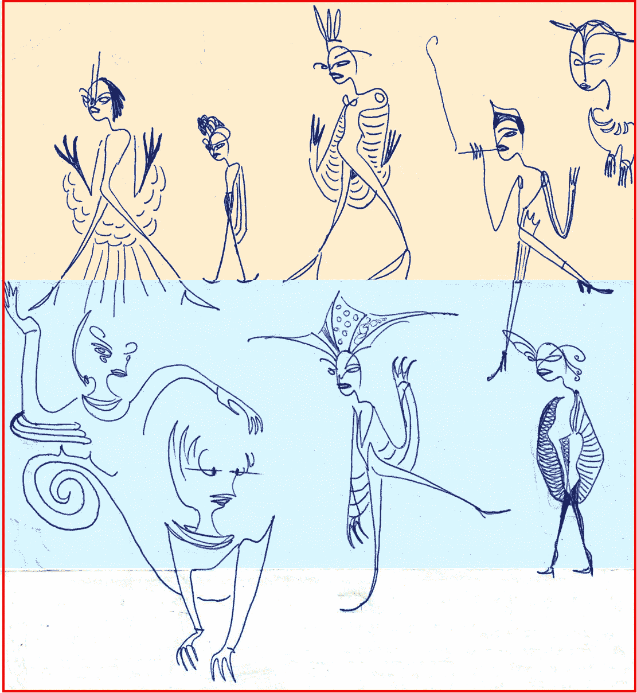

# 涉足 Crypto 的零钱下注平台

> 原文：<https://medium.com/coinmonks/dipping-a-toe-into-cryptos-pocket-change-miners-398f2995c61d?source=collection_archive---------11----------------------->

寻找危险信号:核实/审计的合同

Some research would have discovered that it was a scam…

在把我梳妆台上的零钱投资到任何在线投资平台之前，我想知道它是否合法。显然，制作一个吸引渴望赚取额外被动收入的投资者的浮华金融门户网站很容易。

那些注定失败的网站是捕蝇草。他们吸引那些没有戒心的人，那些可能有点钱花不完的人&对一些风险不太反感。

> 幸运的是，这些不可靠的网站经常会有许多危险信号。如果一个人知道在哪里可以找到信息，就可以节省很多时间和辛苦赚来的零花钱。

最明显的危险信号之一是一个项目没有外部审计。

> 摘自 [Cointelegraph](https://cointelegraph.com/explained/crypto-rug-pulls-what-is-a-rug-pull-in-crypto-and-6-ways-to-spot-it) 一篇关于地毯的文章:
> 
> *“现在，新加密货币的标准做法是接受由知名第三方进行的正式代码审核流程。一个臭名昭著的例子是泰瑟(*[*【USDT】*](https://cointelegraph.com/tether-price-index)*)，一家中央集权的稳定银行，其团队未能披露其持有非菲亚特支持的资产。审计尤其适用于分散币种，其中* [*默认审计 DeFi 项目*](https://cointelegraph.com/news/default-auditing-for-defi-projects-is-a-must-for-growing-the-industry) *是必须的。然而，潜在的投资者不应该简单地相信开发团队已经进行了审计的话。审计应该可以由第三方验证，并显示在代码中没有发现任何恶意代码。*

我研究过未经验证的加密矿工项目，这些项目是精心策划的骗局:在投资者复合到特定金额后，一点秘密代码会限制或停止所有卖单，大幅减少或基本上关闭账户——人们可以继续复合，但永远不会获得资金。经过第三方验证的审计会发现错误/漏洞并将其消除。第二次经过验证的审计可以证实第一次…下面是这种类型的一个例子。

What’s missing here? What does **In Progress** mean?

## 它叫做 BNB 关卡&看起来相当复杂…

白皮书中的一页是顶部的第一张图片。被动收入平台承诺了多种投资方式；它有一份详细的白皮书；它显示了必要的社会联系；它提供了购买在平台中用作货币的 bnb 的方法；一个**总 BNB 赌注**标签继续增加，就像它应该的那样；它甚至可以让你在 BscScan 查看智能合同。相当完整…

> 缺少的是一份经过核实的合同。你可以在上面的登陆页面的右下角看到:**由 CERTIK** 审核，除了它不是……你可能注意到了，在审核标志的上方有一个小小的**进行中**标签。该网站刚上线 4 周，人们就开始收回投资。从来没有经过核实的审计…

如果你找不到合同，你随时可以尝试在这里搜索:【dappradar.com 或[dapp.com](http://dapp.com)；这是两个最大的 dApp 数据库站点。对于他们两个，找到您正在研究的 dApp&向下滚动到提到智能合同的链接。如果您仍然找不到智能合同链接，请继续其他项目…

在哪里发现已验证的审计链接？希望在 dApp 登录页面上，他们很容易找到。查看以下两个示例位置…

Good while it lasted…The BUSD Crops Farmer platform started over 3 months ago & seems to be slowing. The protocol was successful, providing a few thousand investors with a great return-on-their-investment. As it slowly winds down, it is producing a residual diminished daily income, for those who still stick around…

上面的 DinoBusd.finance 是另一个针对零花钱投资的固定日息项目。我已经研究了一个月，现在&它检查我所有的箱子。您需要检查:

1.  [易于查找的白皮书](/@jebalucas/dipping-a-toe-into-defis-pocket-change-miner-protocols-e5fece2fcc77) &审计。可以从登录页面的三个位置访问审计；该平台的白皮书相对复杂&描述了深入的未来路线图。
2.  契约平衡——每天关注这个。它会随着许多因素而波动；然而，我们希望它总体上向上攀升。
3.  审计。再次，链接到一个声誉良好的智能合同审计公司；下面是由 [Interfi Network](https://www.interfi.network) 进行的 DinoBusd 审计的两页样本。
4.  [BscScan 链接](https://bscscan.com)。核实审计后，下一步是前往币安智能连锁区块链，看看我们还能发现什么…

## 到目前为止，一切顺利。

有许多合法的加密口袋改变矿工平台——[bnb miner . finance](https://bnbminer.finance?ref=0x2c38B81a649ff4bF4F515Cef7216d52834B30d63)只是一个著名的例子——&越来越多的平台正在被创建。我在 BNBMiner 投资了几个月，现在已经收回了投资回报，还多了不少。[目前看 BNBMiner.finance](/@jebalucas/what-the-heck-is-happening-with-bnbminer-finance-82a6d98f857f) 。

除了定位验证/审计，还有其他方法来发现这些 ROI 项目中的危险信号。

> [阅读白皮书](/@jebalucas/dipping-a-toe-into-defis-pocket-change-miner-protocols-e5fece2fcc77)。
> 
> 检查已核实/审计的项目报告。
> 
> 找到智能合同，找到开始日期，并记录 TVL。
> 
> 研究分析，尤其是投资者的客流量。
> 
> 理解事务活动图。
> 
> 你能成功撤军吗？

*我将继续深入研究这些话题。只玩不需要的。Thx 阅读。*

## 不要脸的塞。

上面提到的 DinoBUSD crypto miner 协议最近发布了，我已经连续四周每天都在跟踪它。它有一个强大的白皮书&审计。另一个测试:在它运行的一个月里，我成功地退出了几次。我一直在关注分析图表和客流量电子表格，寻找放缓或麻烦的迹象……你可以点击 [DinoBusd.finance](https://dinobusd.finance/?ref=0x66ab1C0978Df3AC4c9cfa0b9e8bd6EcE4B57Ee9d) 来探索这个平台。

## 如果你去…

查看上图中的 TVL，拍摄于今天(135，560 美元)，当前的 TVL 在你面前的登录页面上。如果 TVL 上升了，那就是我微笑的原因…

> 我探索和剖析新的口袋零钱加密矿工。我要么把它们撕成碎片，要么决定在协议上投资，鼓励它们长寿。

我只投资我已经研究过的项目&写起来感觉舒服的项目。我爱链接；有些附属于协议&我喜欢与之共事的公司；点击它们给我带来了很少的金钱利益。

谢谢你走到这一步。我希望你能在这篇关于我们生活的疯狂的密码世界的文章中找到一些有价值的东西。总是很高兴有你跟着我…再次感谢！

我哥们什么都画！我称之为他的账本系列。我喜欢下面的场景…

Office party…

> 加入 Coinmonks [电报频道](https://t.me/coincodecap)和 [Youtube 频道](https://www.youtube.com/c/coinmonks/videos)了解加密交易和投资

# 另外，阅读

*   [加密套利](/coinmonks/crypto-arbitrage-guide-how-to-make-money-as-a-beginner-62bfe5c868f6)指南| [如何做空比特币](/coinmonks/how-to-short-bitcoin-568a2d0b4ae5)
*   [加密交易机器人](/coinmonks/crypto-trading-bot-c2ffce8acb2a)|[P2E NFT 15 大游戏](https://coincodecap.com/p2e-nft-games)
*   [币安期货交易](https://coincodecap.com/binance-futures-trading)|[3 commas vs Mudrex vs eToro](https://coincodecap.com/mudrex-3commas-etoro)
*   [如何购买 Monero](https://coincodecap.com/buy-monero) | [IDEX 评论](https://coincodecap.com/idex-review) | [BitKan 交易机器人](https://coincodecap.com/bitkan-trading-bot)
*   [尤霍德勒 vs 科恩洛 vs 霍德诺特](/coinmonks/youhodler-vs-coinloan-vs-hodlnaut-b1050acde55a) | [Cryptohopper vs 哈斯博特](https://coincodecap.com/cryptohopper-vs-haasbot)