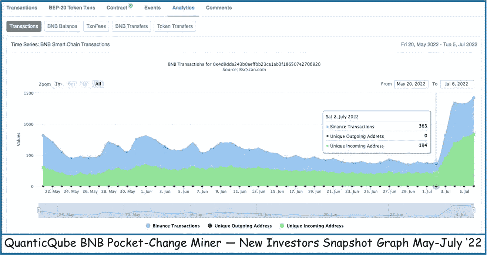

# 尝试一下 DeFi 的零钱加密协议

> 原文：<https://medium.com/coinmonks/dipping-a-toe-into-defis-pocket-change-miner-protocols-e5fece2fcc77?source=collection_archive---------21----------------------->

阅读白皮书:你会把挣来的零花钱投入这些投资平台吗？

Crypto platforms Amoeba, PixelFairy & BNB Game United are financial Venus Fly-Traps. Reading the Whitepapers would tell you that…

在我把我的闲钱投入任何 ROI 锁定流动性池开采协议之前，我想知道该项目的相对强度和严重性。这些在线复利 dApps 是迷你投资平台。如果研究充分、把握好时机，再加上耐心，他们可以提供数倍于最初零花钱投资的回报……例如，见 [BNB 矿工财经](https://bnbminer.finance?ref=0x2c38B81a649ff4bF4F515Cef7216d52834B30d63)。

> *或者，如果你不小心，这些骗子会从你的口袋里榨干每一分钱。*
> 
> *只玩你不需要的东西。*

## 什么是白皮书？

它是突出项目特征的公共视图文档。该组织正在全力以赴。有些可能读起来像广告；然而，他们只希望呈现事实和成就。白皮书可能很长，目的是说服我们他们的特定项目值得我们花费时间和金钱。包含未来计划的路线图总是值得赞赏的。

我为我投资的每个项目寻找白皮书，但我也收集它们作为娱乐和信息——它们告诉了很多关于项目的信息，好的和坏的。这是第一个寻找可能的陷阱的地方。这份报告有多严重？有许多拼写错误吗？这说明了这个项目的严重性。我们都来自世界各地&有语言障碍；但是，马虎不得。

白皮书解释的内容有意义吗？一个很好的例子是来自 Amoeba miner 平台的太短的 3 页白皮书，在上面图像的最左边。除了拼写错误(挑剔，我知道)，他们借用了类似矿工的文字，但混淆了他们，谈论采矿&重新烘焙&重新打桩。该文件给了我基本的，但如果你从来没有去过口袋里的变化加密矿工平台之前，你可能会迷路。

下面是两页来自短命的 BNB 游戏联合 dApp 的白皮书。我会让你仔细阅读这些信息，自己决定是否愿意把辛苦赚来的零花钱交给这个网站…

## 数字讲述了一个故事

这两个捕蝇草可能都不是为了长寿而创造的。下图记录了快速上升，然后快速下降。然后，随着投资者每天撤出逐渐减少的美元，在不知情的人们仍然停下来玩的支持下，缓慢的日落下跌…

> 在撰写本文时，这些仍然是活跃的网站，人们仍然可以减轻自己的钱。

This is no Bell Curve…These crypto pocket-change miner platforms never stood a chance. The chart shows the TVL, or total amount of locked assets, decreasing exponentially then incrementally, until the smart contract will ultimately come to a somewhat natural end.

## 并非所有的 miner 协议都是平等的。

一些白皮书是严肃的&真正地展示了他们是如何以及为什么来到这里的；他们提供了关于项目的详细信息&指出了我们可能会忽略的有益方面。希望他们也能讨论他们对项目可持续性的未来计划。

QuanticQube doesn’t play around. You won’t find Fairy Pixel dust at this pocket-change crypto miner…

一个很好的例子是 [QuanticQube](https://quanticqube.app?ref=0x66ab1C0978Df3AC4c9cfa0b9e8bd6EcE4B57Ee9d) 。Quantic 在另一篇关注验证审计的文章中被简单提及。Quantic 白皮书不在 dApp 登录页面上，但嵌入在他们的主网站 Quantic.finance 上。

> 交易新手？试试[密码交易机器人](/coinmonks/crypto-trading-bot-c2ffce8acb2a)或者[复制交易](/coinmonks/top-10-crypto-copy-trading-platforms-for-beginners-d0c37c7d698c)

## [阅读白皮书](https://solidity.finance/audits/Quantic/)

这是一篇全面的金融文章，有几个不同的平台&有一个很好的路线图计划。坦率地说，细节是一个很大的消化…

> *路线图中的一个示例:*
> 
> 在 Pancakeswap 上启动，锁定 12 个月的流动性，启动营销，Solidity Finance 的智能合同审计，KYC 与 House of Obsidian、Hotbit 和 BitMart 的智能合同审计，网站改造，Youtube 营销活动(正在进行)，社交媒体营销活动(正在进行)，Coingecko 上市，Coinmarketcap 上市，DappRadar 上市，国际语言社区和网站/文档，Certik 的智能合同审计，CEX 上市:Hotbit、BitMart，CEX 上市 1 级交易所，Quantic 商品销售等。

不同的方法…下图是 Quantic 成立以来的情况。市场力量打击了加密矿工；然而，它似乎继续有增无减；自从人们从 7 月 2 日开始发现这个项目(唯一的接收地址)以来，活动似乎有所增加。

Many new bnb transactions & new “Unique Incoming Addresses” — new investors — started increasing July 2nd. New social influencers making the rounds may be the answer. I’ll be watching…

QuanticQube doesn’t play around. You won’t find Fairy Pixel dust at this pocket-change crypto miner…

## 投资了。不要脸的塞…

Quantic 检查了我单子上的所有标记，所以我投资了这个协议。市场不景气，QuanticQube 的回报率也不景气。然而，我仍然每周收到一份回报……白皮书描述了当价值下降时，项目如何保持可持续性&到目前为止，看起来他们是按照剧本进行的。同样，请阅读白皮书。如果你想看的话，我可以链接上去。

与此同时，在投资任何一个加密零钱项目之前，阅读白皮书只是众多项目中的一个。检查 **BscScan 区块链**数据库中的**审计&开始日期**，了解 **TVL** ，访问&读取**交易散列信息**，包括**每小时的客流量** &记录**投资活动**的任何增加或减少。

还有很多要知道的，接下来…谢谢阅读。

## 口袋变密码门户深潜:

深入了解 [BNBMiner.finance](/@jebalucas/what-the-heck-is-happening-with-bnbminer-finance-82a6d98f857f) …

在这里深入了解 [PixelFairy 协议](/@jebalucas/pixelfairy-deep-dive-concerning-roi-pocket-change-crypto-miner-run-away-83c06f3775c8) …

*还是那句话，只玩不需要的。*

我探索和剖析新的口袋零钱加密矿工。我要么把它们撕成碎片，要么决定在协议上投资，鼓励它们长寿。

我只投资我已经研究过的项目&写起来感觉舒服的项目。我喜欢链接。我的一些链接隶属于我喜欢合作的协议和公司；点击它们会给我带来一点金钱上的好处。

谢谢你走到这一步。我希望你能在这篇关于我们生活的疯狂的密码世界的文章中找到一些有价值的东西。总是很高兴有你跟着我…再次感谢！

我哥们什么都画！我称之为他的账本系列。我喜欢下面的场景…

Good months…

> 加入 Coinmonks [电报频道](https://t.me/coincodecap)和 [Youtube 频道](https://www.youtube.com/c/coinmonks/videos)了解加密交易和投资

# 另外，阅读

*   [Bookmap 评论](https://coincodecap.com/bookmap-review-2021-best-trading-software) | [美国 5 大最佳加密交易所](https://coincodecap.com/crypto-exchange-usa)
*   [加密交易机器人](/coinmonks/crypto-trading-bot-c2ffce8acb2a) | [造币评论](https://coincodecap.com/coingate-review)
*   最佳加密[硬件钱包](/coinmonks/hardware-wallets-dfa1211730c6) | [Bitbns 评论](/coinmonks/bitbns-review-38256a07e161)
*   [新加坡十大最佳加密交易所](https://coincodecap.com/crypto-exchange-in-singapore) | [收购 AXS](https://coincodecap.com/buy-axs-token)
*   [红狗赌场评论](https://coincodecap.com/red-dog-casino-review) | [Swyftx 评论](https://coincodecap.com/swyftx-review)