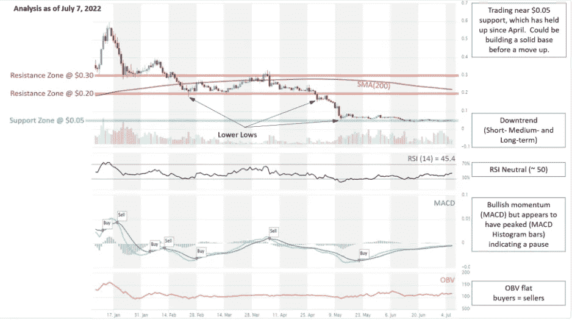

# 用 altFINS 发现加密交易的想法

> 原文：<https://medium.com/coinmonks/discover-crypto-trading-ideas-with-altfins-2953194fc1d?source=collection_archive---------22----------------------->

回顾几个[策划的图表](https://platform.altfins.com/curatedCharts)以及带有[早期看涨势头拐点的硬币。](https://platform.altfins.com/)

**观看** [**视频**](https://youtu.be/RjkvzwnAMMI) **其中 altFINS CEO Richard Fetyko 讲解了币的技术分析:** [**玫瑰、DOGE、沙子和链接**](https://platform.altfins.com/curatedCharts)

# [技术分析](https://platform.altfins.com/curatedCharts) 08.07.2022

**多边形的 TA(MATIC):**自 6 月低点~ 0.30 美元上涨 60%，刚刚创出更高低点……趋势反转的早期迹象？

MATIC price analysis

**绿洲网络的 TA(ROSE):**在 0.05 美元附近横盘近 2 个月……为上涨构筑基础？

Rose price analysis

**Doge Coin(Doge)TA:**在通道向下突破的边缘……关注与通道阻力趋势线一致的 0.07 美元水平阻力位。

DOGE price analysis

**沙盒(沙子)的 TA:**下跌楔形的看涨突破。近期趋势转为看涨。可能达到 1.50 美元的阻力(突破后上涨 50%)，但这是一个僵硬的水平。如果突破这一点，这将是趋势反转的信号。

> 交易新手？尝试[加密交易机器人](/coinmonks/crypto-trading-bot-c2ffce8acb2a)或[复制交易](/coinmonks/top-10-crypto-copy-trading-platforms-for-beginners-d0c37c7d698c)

SAND price analysis

**chain LINK 的 TA(LINK):**处于从下跌楔形形态中突破的边缘，这可能是趋势反转的信号，并可能将价格移动到 8 美元的阻力位。

LINK price analysis

**恒星(XLM)的 TA:**到达下降三角形的顶点。通常，这种模式导致下跌突破(熊市)，这意味着低于 0.10 美元。让我们拭目以待。

XLM price analysis

**AAVE 的 TA:**交易呈楔形下降，接近顶点。因此，突破(看涨或看跌)即将来临。看涨突破可能标志着趋势反转，并将价格推高至 100 美元左右。

AAVE price analysis

你喜欢我们的文章吗？在 Medium 和 YouTube 频道上关注我们！