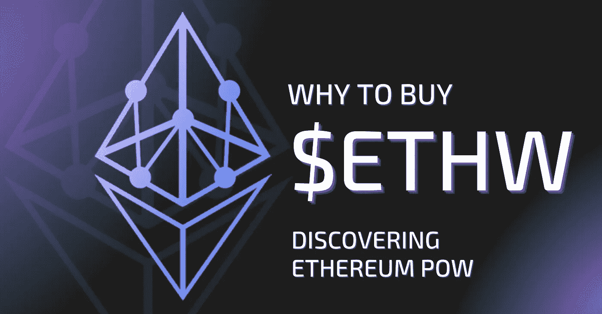

# 发现 ETHW:合并后还剩下什么？

> 原文：<https://medium.com/coinmonks/discovering-ethw-whats-left-after-the-merge-56448172cd1a?source=collection_archive---------33----------------------->

在合并之前，以太坊过渡到了利害关系证明共识机制，以太坊最初采用了工作证明(PoW)机制。*那么，什么是工作证明以太坊？*以太坊合并启动后，一些矿工选择留下来支持工作证明共识。于是就产生了以太坊的新分支，推出了以太坊工作证明(ETHW) mainnet。以太坊电力区块链公司在合并前保持工作证明共识。

下面看看 PoW 机制以及 ETHW 区块链如何使用它。

# 什么是权力？

去中心化是最初加密货币愿景的关键组成部分。为此，需要一种独立于金融机构的交易确认方法。这个问题的第一个解决方案是开发一个系统，该系统能够在加密网络的所有计算机之间就哪些交易是有效的达成一致意见。这个系统被称为工作证明(PoW)。

工作证明(PoW)是一种加密共识机制，用于确保数字交易的有效性。该算法用于验证和跟踪发生在区块链上的新加密硬币的生产。为了验证和记录加密货币交易，工作证明共识机制需要网络参与者努力解决高度复杂的数学方程。为了求解这些方程，网络需要大量的处理能力，因此被称为“工作证明”

工作证明和挖掘是密切相关的概念。PoW 的算法决定了区块链上采矿作业的规则和难度。另一方面，挖掘是实际的“工作”这是将合法块添加到链中的过程。

# 以太坊的工作证明是如何工作的？

以太坊电力交易的处理导致阻塞。*工作验证以太坊*协议中的每个模块包含:

**区块难度**:区块难度是一个应用于加密货币挖掘的指标。它衡量求解复杂的密码方程来创建一个块的难度。网络上矿工的数量决定了格挡难度。矿工人数越多，就越难找到矿块。

Nonce : Nonce 是一种在以太坊区块链上分组和安排交易的方法。以太坊 PoW 算法上的每个事务都有一个随机数。随机数是从特定地址发送的所有交易的总和。来自一个地址的每个事务都被分配了一个连续的编号，第一个事务从 0 开始。需要 nonce 来跟踪来自同一地址的多个交易。

**mixHash** : mixHash 是一个 128 字节中间哈希值，由 *nonce* 在执行以太坊能量挖掘计算时创建。如果块用错误或恶意的现时值请求功率计算，则网络可能遭受类似于拒绝服务(DoS)攻击的攻击。因此，mixHash 通过几个中间步骤进行计算，通过计算工作证明来确保没有问题。

# 工作证明中的工作

区块链，由交易块组成的开放分类账，存在于每一种加密货币中。电力加密货币每个交易块具有特定的散列。在这种情况下，“*工作”*正在产生对应于当前块的目标散列的散列。为了确认该块，加密挖掘器必须创建小于或等于该块的散列的目标散列。在*合并*之前，Ethash 是以太坊的工作证明挖掘算法。对于矿工来说，找到区块的随机数是一场艰难的比赛。因此，只有具有有效 nonce 的块被添加到 ETHW 链中。

一名矿工使用能够快速执行计算的采矿设备，因为他们竞争创建一个区块。目标是成为匹配块的目标散列的第一个挖掘器。实现这一点将允许矿工更新区块链并获得加密货币奖励。找到目标散列很有挑战性，但验证它很简单，这就是为什么加密货币中的工作证明很有效。这个程序很难防止交易记录被篡改。然而，一旦定位了目标散列，其他挖掘者就很容易验证了。

# 工作证明和安全性

工作证明协议的高计算资源要求创建了一个安全的加密货币网络。工作证明协议使得几乎不可能添加新的块，这将删除现有的事务，添加虚构的事务，或者在 ETHW mainnet 上生成第二个链。这是因为恶意挖掘者必须始终比其他挖掘者更快地解决块随机数。一个恶意的挖掘者需要超过 51%的网络计算能力才能胜过所有其他挖掘者，并产生持续的负面但合法的块。完成这些“工作”需要大量昂贵的计算能力，而且消耗的能量可能会超过收益。

# 工作证明经济学

PoW 机制还负责向系统中发行新的加密硬币，并为成功创建区块的矿工提供奖励。成功的区块挖掘者将获得新创建的以太坊 PoW (ETHW)令牌和一部分交易费作为支付。

# 想找个地方买以太坊工作证明(ETHW)？

你可以在 [Swapzone](https://swapzone.io/) 上购买以太币粉末和各种其他加密货币。Swapzone 是一个非托管、快速的加密到加密交换聚合器，帮助用户在交易加密资产时做出明智的决策。它收集有关交易所提供商的信息，提供比较参数，汇总和排列可用交易，并提供使用提供商的 API all-in-one 接口进行互换的能力。

# 流行的成对转换

[埃思托 BTC](https://swapzone.io/exchange/ethw/btc) [埃思托 ETH](https://swapzone.io/exchange/ethw/eth) [埃思托 LTC](https://swapzone.io/exchange/ethw/ltc) [埃思托 BNB](https://swapzone.io/exchange/ethw/bnb) [埃思托 BCH](https://swapzone.io/exchange/ethw/bch) [埃思托 USDT](https://swapzone.io/exchange/ethw/usdt) [埃思托θ](https://swapzone.io/exchange/ethw/theta)[埃思托 XMR](https://swapzone.io/exchange/ethw/xmr) [埃思托 TRX](https://swapzone.io/exchange/ethw/trx) [埃思托 BSV](https://swapzone.io/exchange/ethw/bsv) [埃思托到破折号](https://swapzone.io/exchange/ethw/dash)

> 交易新手？尝试[加密交易机器人](/coinmonks/crypto-trading-bot-c2ffce8acb2a)或[复制交易](/coinmonks/top-10-crypto-copy-trading-platforms-for-beginners-d0c37c7d698c)