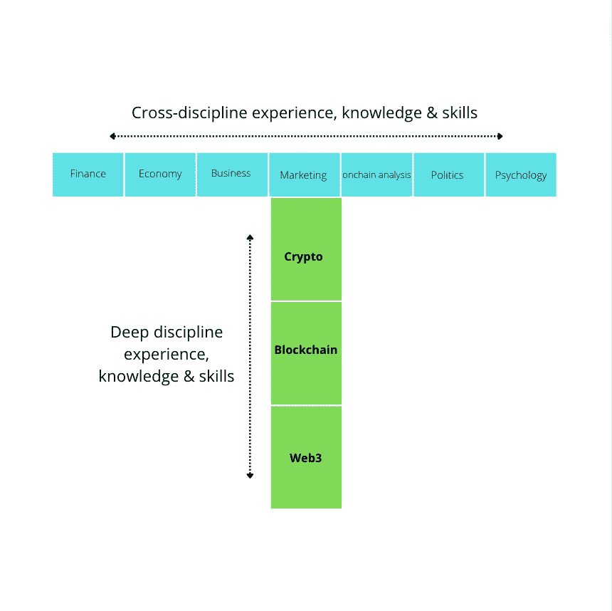
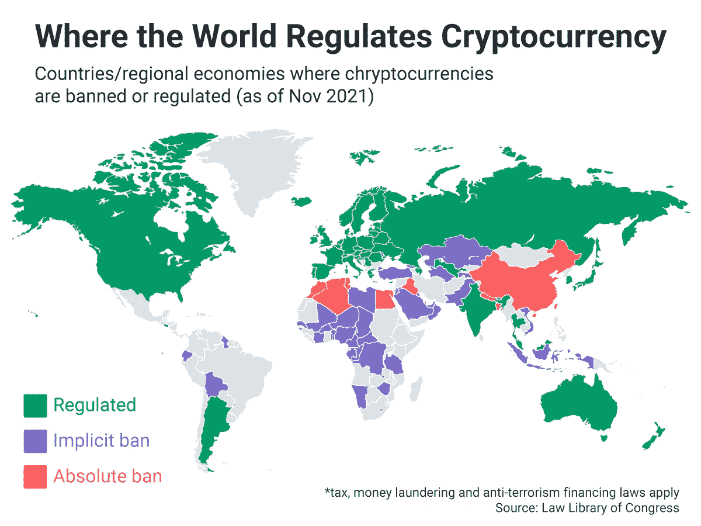

# 发现 T 形秘密投资者档案！

> 原文：<https://medium.com/coinmonks/discovering-the-t-shape-crypto-investor-profile-4a3b5bc9b64b?source=collection_archive---------50----------------------->

从我个人的经验来看，crypto 可能非常容易上瘾。一旦你开始理解大多数用例，获得你的第一个 ROI(投资回报)&开始看到可以释放的潜力，你可能会花很多时间研究这个主题。但是重点是:不要太狭隘地整天学习密码！加密之外还有许多领域可以帮助你成为更好的分析师。
试着看到大图景，以及加密项目和现实世界使用之间的联系。

# 变成 T 型轮廓！

T 型的人是指在某个特定领域拥有专业知识和技能，同时有跨越不同学科建立联系的愿望和能力的人。

让我们深入了解下面这个 T 形密码分析师简介。

我们已经分析了具体的加密技术和知识，作为一个加密投资者，你需要做出自己的决定。如果你渴望得到提醒，请点击以下链接:[https://robin-quinones . medium . com/do-your-own-research-in-crypto-from-beginner-to-advanced-a-list-of-topics-to-master-b44d 052 fc 392](https://robin-quinones.medium.com/do-your-own-research-in-crypto-from-beginner-to-advanced-a-list-of-topics-to-master-b44d052fc392)

现在，让我们来关注与加密世界相关的不同跨学科专业知识，它们深刻影响着加密市场的波动和区块链的采用。

## 金融

不管你喜不喜欢，金融*(定义为资金管理，包括投资、借款、贷款、预算、储蓄和预测等活动)*几乎控制了我们的世界，而 crypto(还)没有准备好领先！

虽然 DeFi 正在蓬勃发展 *(DeFi 是一种不需要银行、经纪公司或交易所等传统中介的金融形式。通常由这些机构处理的所有工作都由技术解决方案执行，包括智能合同和区块链)，*加密市场的总市值仅为 13，000 亿美元，而全球金融服务市场的价值为 233，195.2 亿美元。

为了更好地理解和评估加密和区块链金融机会，你需要对传统金融有一个最低限度的了解。

## 经济学

经济学是一门复杂的学科，充满了许多令人困惑的术语和细节，然而，毫无疑问，它影响着我们的日常生活。我喜欢把经济学定义为研究人们和群体如何使用他们的资源。

在我们这个领域，研究与货币和市场相关的经济学很有趣。人们愿意为什么东西付钱？一个行业比另一个行业做得好吗？经济前景如何？这些都是重要的问题，可以通过研究来更好地理解破坏性的 web3 用例，如 NFTs、Play to Earn 或 DeFi。另外，了解一下供求机制可能有助于理解金融市场。

## 商业

有些人把商业定义为一门科学，也是一门艺术。我更倾向于认为商业是一种需要培养的精神状态。

拥有商业知识和经验可能有助于你:
-发展特定技能(销售、网络、沟通、情商、分析、财务)
-发展实践思维，让你在被算计的同时做出明智的决定
-快速识别并理解作为投资机会的卓越商业战略

## 营销

营销吸引社区成员，建立信任，并使品牌独一无二。在加密领域有效的营销策略可以有所作为，就像一个糟糕的策略可以破坏一个项目。能够快速确定一个伟大的创新营销策略可能会帮助你选择正确的投资项目。
同样，社交媒体伴随着营销而来，你在这一领域的经验应该提醒你落入骗局或依赖有影响力的人。

## 链上分析

目前市场上的绝大多数加密货币都使用公共区块链来验证和记录数据。正因为如此，数据在“链上”可供世界上任何地方的任何人随时查看。

连锁分析是指利用区块链分类账中的信息来判断市场情绪的方法。更具体地说，它涉及到查看交易数据和加密钱包余额，这两样东西在试图决定是否进行投资时很有用。例如，如果一个代币没有被任何人交易，并且其绝大部分流通供应被少数大持有者(鲸鱼)控制，那么投资它可能不是一个好主意。

## 政治

自从在 2008 年的白皮书中推出以来，比特币推动了加密经济，与此同时，世界各国政府正在寻求“平衡的监管”，萨尔瓦多等其他国家已经将其作为货币。政治和政府能以多种方式影响密码的价格。例如，他们可以参与制定严格的法规，这将不可避免地导致成本增加。地缘政治形势，如战争或疫情封锁，也会对加密产生重大影响。关注世界各地的政治，尤其是在未来几个月/几年政府稳定货币激增的情况下，将是明智之举。

Cryptocurrency world map regulation

## 心理学

密码市场一年 365 天，每天 24 小时开放！你需要一个强大的心态来远离下滑，如 FOMO(害怕错过机会)，极度波动或恐惧，贪婪的感觉。如果你有时容易受影响，你可能想学习一些交易心理学，以便更好地理解秘密投资中出现的心理挑战。

> *在未来的一篇文章中，我将关注六个具体的标准，你应该看看，以评估一个加密项目。如果你打算加入 web3 生态系统，这个评估可能会有所帮助。不是所有的项目都以同样的方式构建和管理，尤其是在加密生态系统中！*

来源:【https://www.highspeedtraining.co.uk/hub/t-shaped-employee[https://corporatefinancisininstitute . com/resources/careers/soft-skills/t 形-skills/](https://corporatefinanceinstitute.com/resources/careers/soft-skills/t-shaped-skills/)
[https://www . coin desk . com/learn/what-is-crypto-on-chain-analysis-and-how-do-you-use-it/](https://www.coindesk.com/learn/what-is-crypto-on-chain-analysis-and-how-do-you-use-it/)
[https://www . make use of . com/trading-psychology-and-its-effect-crypto-trading/](https://www.makeuseof.com/trading-psychology-and-its-effect-crypto-trading/)

> 交易新手？尝试[加密交易机器人](/coinmonks/crypto-trading-bot-c2ffce8acb2a)或[复制交易](/coinmonks/top-10-crypto-copy-trading-platforms-for-beginners-d0c37c7d698c)