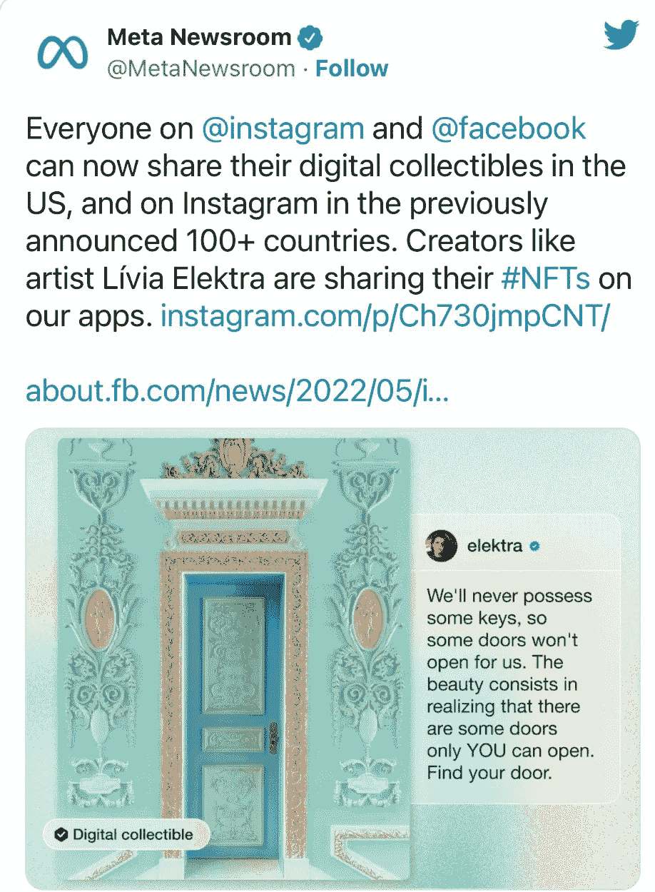
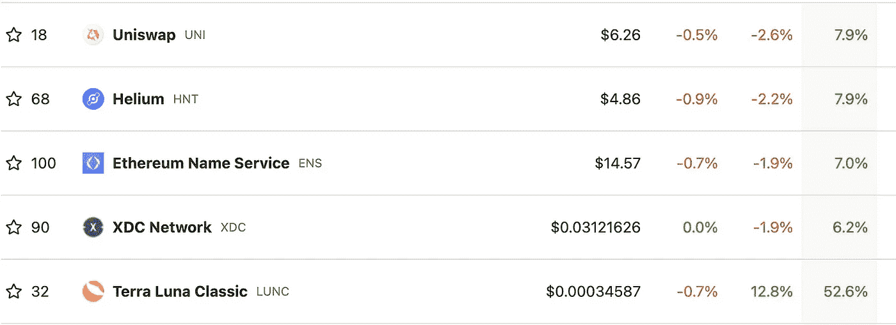
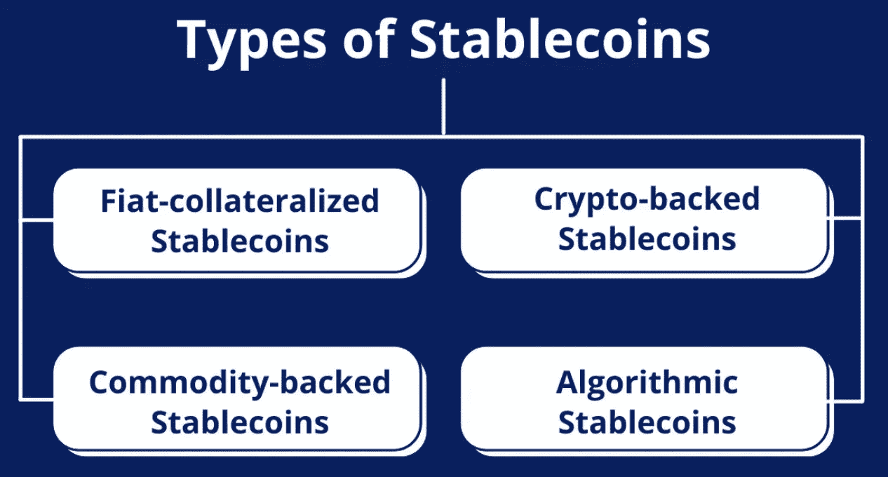

# 🐰迪士尼大胆进军元宇宙。

> 原文：<https://medium.com/coinmonks/disney-makes-bold-metaverse-moves-bccb3e22a0ef?source=collection_archive---------19----------------------->

# 内容(3 分钟阅读):

*   🖌️:现在我们可以在 Facebook 和 IG 上分享 NFT 了？
*   🐰迪士尼大胆进军元宇宙
*   👨‍👩‍👧‍👧Startupy——社区管理的搜索引擎
*   📈本周表现最佳的前五名
*   📙稳定硬币快速指南
*   📰热门阅读
*   🙏🏻感激…

# 🖌️:现在我们可以在 Facebook 和 IG 上分享 NFT 了？

Meta 允许任何人连接他们的加密钱包，并与朋友和追随者分享他们的以太坊、流和多边形 NFT。

> ****不可替代令牌****(****【NFT】****)是不可复制、不可替代、不可细分的唯一数字标识，记录在区块链中，用于证明真实性和所有权。NFT 的所有权记录在区块链，所有者可以转让，允许非森林交易。任何人都可以创建 NFT，只需要很少或不需要编码技能。NFT 通常包含对数字文件的引用，如照片、视频和音频。因为 NFT 是唯一可识别的资产，不同于* [*加密货币*](https://en.wikipedia.org/wiki/Cryptocurrencies) *，后者是* [*可替代*](https://en.wikipedia.org/wiki/Fungibility) *。**

*继续其最近的首次亮相，科技巨头 Meta 今天宣布其 [NFT](https://decrypt.co/resources/non-fungible-tokens-nfts-explained-guide-learn-blockchain) 收藏品支持现在[对美国所有脸书和 Instagram 用户](https://about.fb.com/news/2022/05/introducing-digital-collectibles-to-showcase-nfts-instagram/)开放。*

**

*Meta 于 5 月开始在 Instagram 平台上启用 NFT 支持，随后于 6 月增加了脸书支持。在这两种情况下，该公司开始时用户数量有限，但随着时间的推移逐渐扩大了用户群。*

*[捐赠订阅](https://yarocelis.substack.com/subscribe?&donate=true)*

*现在，美国的任何人都可以展示他们的 NFTs，加入亚太、非洲、中东和美洲约 100 个其他国家的用户。*

*脸书和 Instagram 支持钱包连接 [MetaMask](https://decrypt.co/resources/metamask) ，Dapper Wallet，比特币基地钱包，[彩虹](https://decrypt.co/92997/rainbow-ethereum-wallet-raises-18m-led-by-reddit-co-founder-ohanian)，TrustWallet。这两个移动应用程序的“设置”中的“数字收藏品”选项卡都提供了该功能。*

# *🐰迪士尼大胆进军元宇宙*

**

*[**迪士尼的**](http://disney.com/) 首席执行官透露，他们正在继续探索和发展他们的元宇宙计划。在迪士尼两年一度的 D23 博览会粉丝大会上，华特·迪士尼公司首席执行官鲍勃·查派克描述了这家有 98 年历史的公司将如何利用这项技术向前发展。*

*[获得团体订阅](https://yarocelis.substack.com/subscribe?group=true)*

*今年早些时候，迪士尼聘请麦克·怀特领导新成立的部门。此外，他们还聘请了马克博松为他们的元宇宙创意策略。值得注意的是，在加入迪士尼之前，马克在科技巨头苹果公司工作了 12 年。该公司计划继续大举招聘，以加速其 web3 计划。*

*首席执行官表示，迪士尼希望利用现实和数字世界的数据来推动其元宇宙政策。主题公园游客和消费者流习惯的数据是迪士尼在元宇宙战略中考虑的两个领域。*

*迪士尼将他们的元宇宙愿景描述为“下一代讲故事”*

*此外，迪士尼在 NFT 也很活跃。他们与 NFT 商场 VeVe 合作，推出了“黄金时刻”系列。这包括蜘蛛侠，米老鼠，漫威，皮克斯收藏，等等。*

*[**Startupy**](https://beta.startupy.world/membership/?ref=yarocelis)*

> *我很高兴地宣布，我已经成为 Startupy 的策展人和会员。一个社区管理的搜索引擎。零 SEO BS。 [***我邀请你加入这个为漫游、研究和思考而设计的知识和见解的令人愉快的图书馆。***](https://beta.startupy.world/membership/?ref=yarocelis)*

# *📈本周顶级密码搬运工*

**

*[Uniswap](http://uniswap.org/) 是一种加密货币交易所，使用分散式网络协议。uni WAP 也是最初建立 uni WAP 协议的公司的名称。它通过使用智能合约，促进了[以太坊](http://ycobitcoin.com/) [区块链](https://en.wikipedia.org/wiki/Blockchain)的加密货币代币之间的自动化交易。截至 2020 年 10 月，Uniswap 估计是最大的分散式交易所，按日交易量计算是第四大加密货币交易所。*

# *📙稳定硬币快速指南*

*稳定货币只是加密货币，其价值与一些“稳定”资产挂钩，如贵金属或法定货币，如美元。(是的，我们知道，美元和其他货币不那么稳定，但也不像大多数加密货币那样不稳定)。*

*不同的稳定币种类基本上表明了支持它们的资产。对不同类型的 stablecoins 的详细了解可以帮助您建立关于 stablecoins 的基础知识。*

**

*101 区块链*

*   *[**菲亚特**](https://101blockchains.com/what-is-fiat/)**——抵押稳定债券**是你会遇到的最重要的稳定债券变体。他们有法定货币的支持，如欧元、英镑或美元。法定抵押稳定币是最简单的稳定币类型，配给比例为 1:1。1:1 的比例意味着一个稳定的硬币等于一个货币单位，如一美元或一欧元。101 区块链。*
*   *“什么是不同类型的稳定硬币？”答案中的第二个条目在商品支持的稳定债券上引人注目。顾名思义，商品支持的稳定债券拥有不同类型的可互换资产的支持，如贵金属。作为商品担保债券的抵押品，最常见的商品是黄金。*
*   *加密货币的波动性呢？你怎么能指望得到加密货币支持的稳定货币保持稳定？事实上，**秘密抵押的稳定债券**比法定抵押的稳定债券提供了更好的[分散化。此外，作为抵押品，稳定债券通常被过度抵押以吸收价格波动。](https://101blockchains.com/blockchain-for-government/)*
*   *稳定硬币类别中的最后一项将把我们带到**非抵押或算法稳定硬币。**非抵押或算法稳定债券没有任何资产或抵押品支持它们。那么，当算法 stablecoins 没有任何支持它们的抵押品时，它们是如何被归类为 stablecoins 的呢？*
*   *非抵押或算法稳定币遵循控制稳定币供应的算法。这种方法也被称为铸币税份额。随着需求的增加，新的稳定商品将会产生，从而使价格降到正常水平。在硬币交易量相当低的情况下，市场上的硬币被全部购买，以减少流通供应量。*

# *📰热门阅读*

*   *[秘密亿万富翁正在消失:熊市的牺牲品](https://beincrypto.com/crypto-billionaires-disappearing-casualties-bear-market/)*
*   *[随着币安焚烧数不清的代币，Terra 的月神经典收益大增](https://decrypt.co/111070/terras-luna-classic-gains-big-as-binance-burns-untold-tokens)*
*   *[FTX 以 14 亿美元收购航海家数码公司的资产](https://bravenewcoin.com/insights/ftx-to-pick-up-voyager-digitals-assets-for-usd1-4-billion)*
*   *[9 月份菲亚特交易所交易量连续第五个月下降](https://www.theblock.co/post/174327/fiat-exchange-volumes-fell-for-the-fifth-month-in-a-row-in-september?utm_source=cryptopanic&utm_medium=rss)*
*   *[音乐是将听众转化为社区的强大工具](https://cointelegraph.com/news/music-nfts-a-powerful-tool-to-transform-an-audience-into-a-community)*
*   *[罗宾汉之下——多边形的更新对 MATIC 意味着什么](https://ambcrypto.com/under-the-robinhood-what-polygons-updates-mean-for-matic/)*
*   *[美国参议员提出法案保护加密交易所免受 SEC 越权](https://dailyhodl.com/2022/10/02/us-senator-introduces-bill-to-protect-crypto-exchanges-from-sec-overreach/)*
*   *[前首席执行官马辛斯基在 Celsius 破产前提取了 1000 万美元](https://www.theblock.co/post/174332/ex-ceo-mashinsky-withdrew-10-million-before-celsius-bankruptcy-ft?utm_source=cryptopanic&utm_medium=rss)*

> *交易新手？试试[加密交易机器人](/coinmonks/crypto-trading-bot-c2ffce8acb2a)或者[复制交易](/coinmonks/top-10-crypto-copy-trading-platforms-for-beginners-d0c37c7d698c)*