# 剖析以太坊网络堆栈:节点发现

> 原文：<https://medium.com/coinmonks/dissecting-the-ethereum-networking-stack-node-discovery-4b3f7895f83f?source=collection_archive---------3----------------------->

在过去的几天里，我有机会使用一些传统的(咳咳！)tcpdump 等工具。我从这个练习中学到的一件事是，Eth n/w 堆栈正在不断地工作和升级，有许多 EIP(改进建议)在四处流动。

如您所知，最近的“合并”实际上并不意味着部署新的 Eth 网络。这纯粹是以前 Eth n/w 的升级。换句话说，Eth1 现在被称为智能合同和 n/w 协议驻留和运行的“执行层”，而 Eth2 被称为“共识层”，它确保 n/w 的参与者按照激励结构和共识规则(PoW to PoS)行事。

在这篇博客中，我们将关注三件事

*   以太网网络堆栈的快速概述
*   基于 devp2p 的以太坊节点/对等体发现
*   Tcpdump 跟踪以观察数据包级别的详细信息并验证堆栈行为

所以基本上，一个以太坊客户端(例如 geth)有两个位于同一节点的主要层/客户端，每个都有自己的网络堆栈和子协议。

1.  执行层
2.  共识层

**执行层发生了什么？**

*   这是 EVM 居住的地方
*   负责事务构建、执行和状态管理
*   还通过对等体之间的加密通信在 p2p 网络上发送“八卦”交易

**共识层发生了什么？**

*   负责维护共识链(信标链)并处理从其他对等方接收的共识块(信标块)和证明

**现在，这两个层面何时/如何相互作用？**

*   每个信标块包含一个执行有效载荷。该负载包含执行和验证负载所需的事务和其他数据的列表
*   为了检查这个有效性条件，共识层通过本地 RPC 连接将有效负载发送到执行层
*   执行层组装执行块、验证前置条件、执行事务和验证后置条件。结果被发送回共识层
*   执行层将验证数据传递回共识层，即现在被视为已验证的块(本地 RPC 连接)
*   共识层将块添加到其自己的区块链的头部，并对其进行证明，通过网络广播证明(共识 p2p)

我喜欢官方[以太坊文档](https://ethereum.org/en/developers/docs/networking-layer/)中对这一流程的如下表述

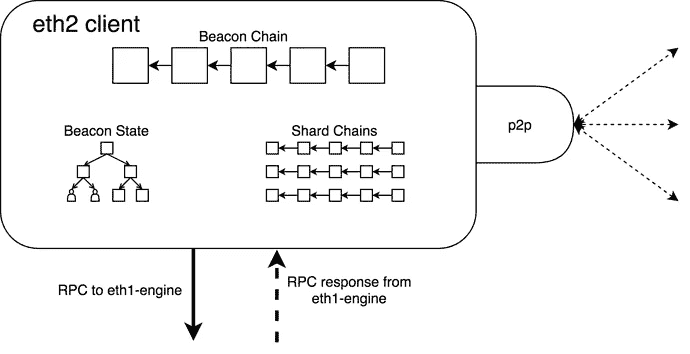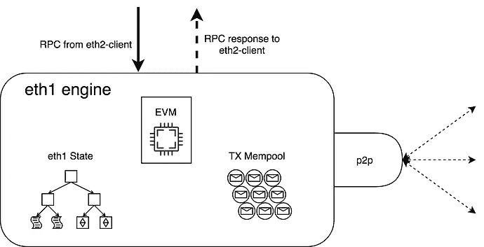

现在，执行层 n/w 协议分为两个堆栈，这两个堆栈并行运行

1.  节点发现—允许新节点通过 UDP 找到要连接的对等节点
2.  信息交换—使节点能够通过以下方式交换信息

这是高级硬件架构的样子

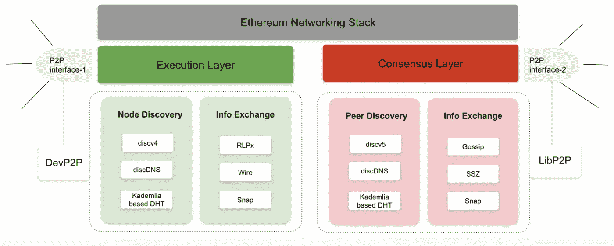

The Eth client (node) sits on top of this stack

在这篇博客中，我们将详细研究“discv4 节点发现”

**什么是“节点发现”,我们为什么需要它？**

*   在 n/w 中寻找其他对等体进行数据交换和通信的过程。它是由运行在 p2p 网络上的客户端软件实现的。在我们的例子中，它是 Eth 客户机之一(下面的例子中使用了 gETh)
*   客户端使用引导机制连接到一小组 bootnodes，这些 bootnodes 被硬编码到客户端中
*   Bootnode 的唯一职责是向一组对等体引入一个新节点。它不参与同步链之类的链任务。仅在客户端首次启动时使用

**探索是如何在幕后进行的？**

*   使用了修改形式的 [Kademlia](/coinmonks/a-brief-overview-of-kademlia-and-its-use-in-various-decentralized-platforms-da08a7f72b8f) ，其中每个节点共享分布式哈希表中的节点列表
*   每个节点在其表中都有一个最近节点的列表。这种接近度不是“地理上的”，而是由节点 ID 的相似性定义的(使用 XOR 来确定接近度。更多详情[此处](/coinmonks/a-brief-overview-of-kademlia-and-its-use-in-various-decentralized-platforms-da08a7f72b8f)
*   发现过程通过 UDP 进行。与 TCP 不同，UDP 没有任何额外的开销，如错误检查、重新传输等。这使得发现很快。
*   在较高的层次上，该过程从客户端使用 bootnode 执行 PING/PONG 开始。一旦连接，它从该节点获得节点/邻居列表，并继续遍历该列表，直到足够数量的对等体被添加到对等体列表中
*   启动客户端→连接到 bootnode (Ping/Pong ) →绑定到 bootnode (Ping/Pong) →查找邻居(FindNode) →绑定到邻居->交换信息

让我们现在一步一步地打破这整个过程。我使用了最新的 gth 客户端和 wireshark 来捕捉这些痕迹。此外，您必须在 wireshark 上安装这个[以太坊剖析器插件](https://github.com/bcsecorg/ethereum_devp2p_wireshark_dissector)来解码 devp2p 流量

1.  一旦客户机启动，bootnodes 就会从硬编码列表中识别出来。因为我是在 goerli 测试网上运行 gEth 的，所以这里列出了与 goerli 相关的引导节点。你可以在这里找到完整的列表

```
// GoerliBootnodes are the enode URLs of the P2P bootstrap nodes running on the // Görli test network.var GoerliBootnodes = []string{// Upstream bootnodes  "enode://011f758e6552d105183b1761c5e2dea0111bc20fd5f6422bc7f91e0fabbec9a6595caf6239b37feb773dddd3f87240d99d859431891e4a642cf2a0a9e6cbb98a@51.141.78.53:30303",  "enode://176b9417f511d05b6b2cf3e34b756cf0a7096b3094572a8f6ef4cdcb9d1f9d00683bf0f83347eebdf3b81c3521c2332086d9592802230bf528eaf606a1d9677b@13.93.54.137:30303",  "enode://46add44b9f13965f7b9875ac6b85f016f341012d84f975377573800a863526f4da19ae2c620ec73d11591fa9510e992ecc03ad0751f53cc02f7c7ed6d55c7291@94.237.54.114:30313",  "enode://b5948a2d3e9d486c4d75bf32713221c2bd6cf86463302339299bd227dc2e276cd5a1c7ca4f43a0e9122fe9af884efed563bd2a1fd28661f3b5f5ad7bf1de5949@18.218.250.66:30303",// Ethereum Foundation bootnode  "enode://a61215641fb8714a373c80edbfa0ea8878243193f57c96eeb44d0bc019ef295abd4e044fd619bfc4c59731a73fb79afe84e9ab6da0c743ceb479cbb6d263fa91@3.11.147.67:30303",// Goerli Initiative bootnodes  "enode://d4f764a48ec2a8ecf883735776fdefe0a3949eb0ca476bd7bc8d0954a9defe8fea15ae5da7d40b5d2d59ce9524a99daedadf6da6283fca492cc80b53689fb3b3@46.4.99.122:32109",  "enode://d2b720352e8216c9efc470091aa91ddafc53e222b32780f505c817ceef69e01d5b0b0797b69db254c586f493872352f5a022b4d8479a00fc92ec55f9ad46a27e@88.99.70.182:30303",}
```

2.我们的节点尝试连接到 bootnodes，但是只从其中两个节点得到响应

**启动节点—94.237.53.114**

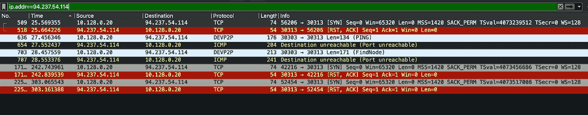

PING 和 FindNode UDP 请求以 ICMP 目的地不可达响应结束。路由器/代理显然阻止了这种流量。代理还会重置端口 30303 上的 TCP SYN 请求。

**启动节点—51.141.78.53**

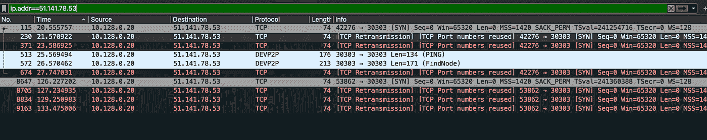

所有的 TCP SYNs 都在北/w 的某个地方被丢弃。我们的节点一直在重新传输 SYN 数据包，运气不好

【13.93.54.137 Bootnode——T3

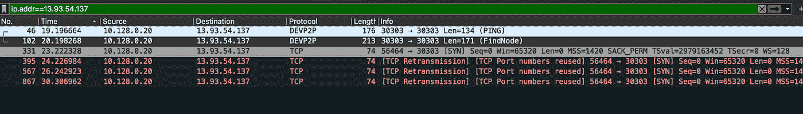

对 Devp2p 的 PING 和 FindNode UDP 请求没有响应。路由器/代理显然阻止了这种流量。所有 TCP SYNs 也在北 w 的某个地方被丢弃。继续。

【3.11.147.67 boot nodes

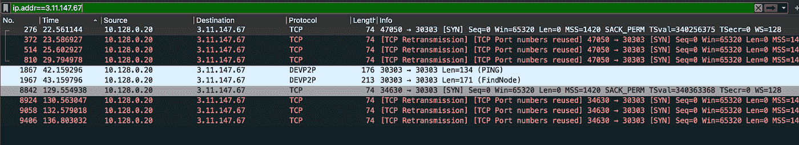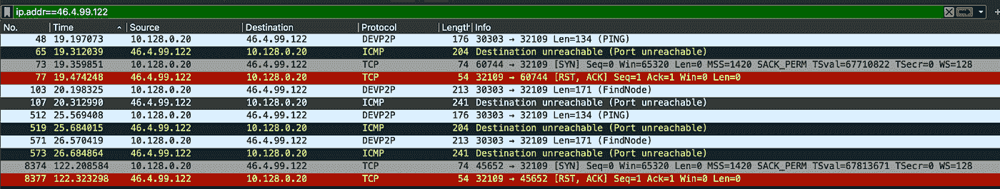

很明显，同样的问题。

**启动节点——18.218.250.66 和 88.99.70.182**

最后，我们可以看到我们的节点是如何连接到 n/w 中的对等节点的。

启动客户端→连接到 bootnode (Ping/Pong ) →绑定到 bootnode (Ping/Pong) →查找邻居(FindNode) →绑定到邻居

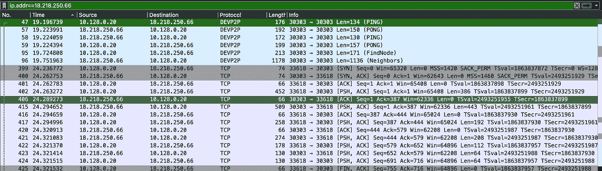

客户端(geth)将通过遵循相同的机制(connect/bond/find_neighbors)继续搜索节点，直到所有传出的对等槽都被填满。

注意

*   使用以下公式计算这些插槽的数量: *maxpeers * dialRatio。maxpeers 和 dial ratio 的*默认值分别为 25 和 13。
*   当达到期望的对等体数量时，geth 将停止查找。但是，仍然会有发现流量。这是因为发现系统需要维护才能保持工作。此外，节点也可能失去对等连接，然后需要重新填充该插槽。有关插槽和超时的具体值的更多详细信息，请查看这里的 go 代码

现在，让我们更进一步。在发现过程中到底交换了什么？

我们举个工作例子。我们的节点能够从 bootnode 中识别出一个邻居列表(如上面最后的截图所示)。现在，它试图绑定到一个邻居(143.244.60.51)并获得另一个邻居列表(它不断迭代，直到达到最大对等点)

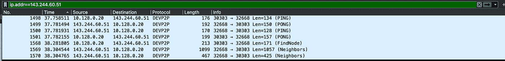

放大有效载荷和字段

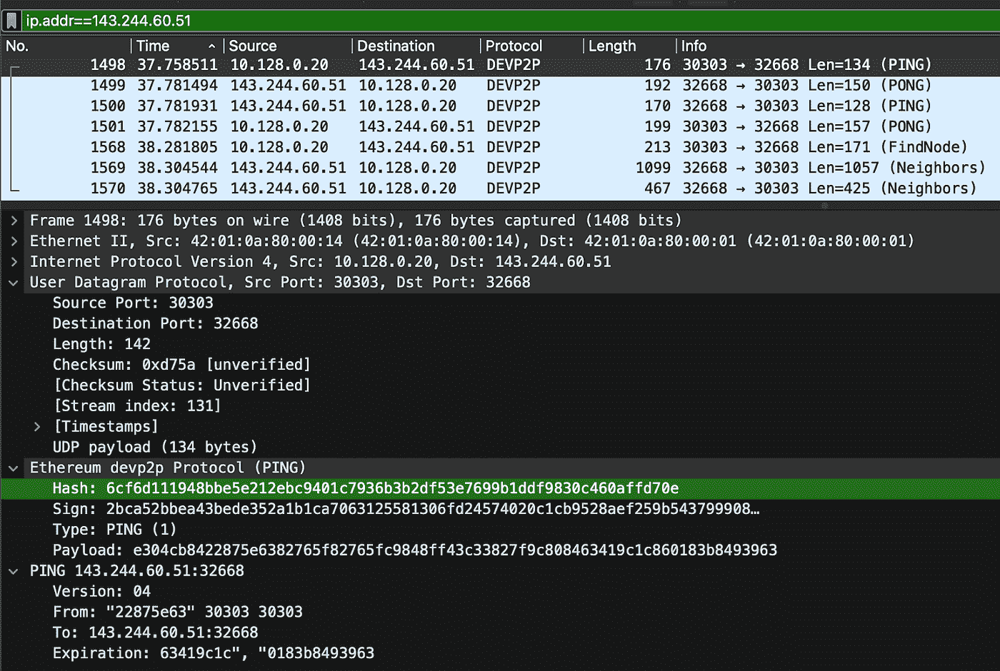

*   我们可以清楚地看到，从我们的节点 10.128.0.20 向启动节点 143.244.60.51 发送了 PING 命令。该 PING 包括关于新节点、启动节点和到期时间戳的散列信息

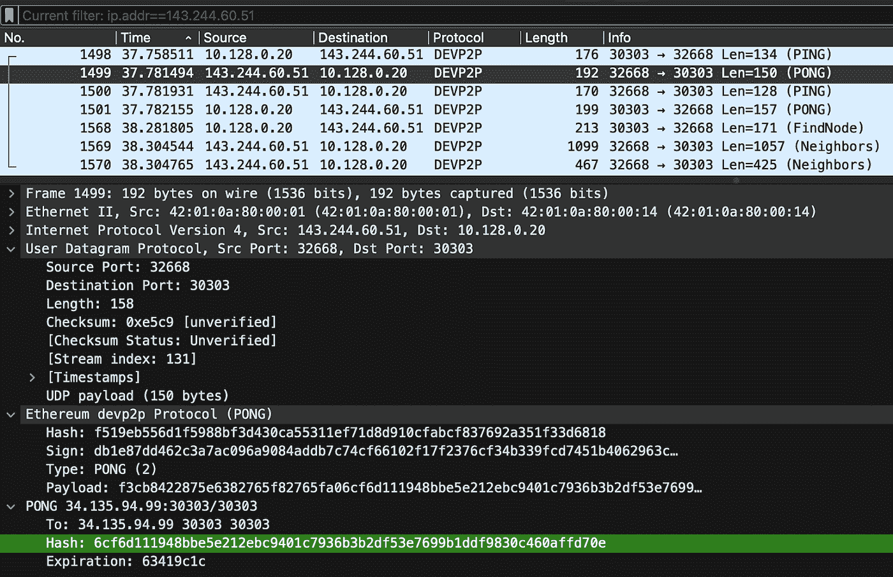

*   bootnode 143.244.60.51 向我们的节点 10.128.0.20 发送回了一个包含 PING 哈希(6 cf 6d 111948 bbe 5 e 212 ebc 9401 c 7936 B3 B2 df 53 e 7699 B1 ddf 9830 c 460 affd 70 e)的^乒乓。

由于 PING 和 PONG 散列已经匹配，我们的节点和对等体之间的连接被验证，它们被称为“绑定”。

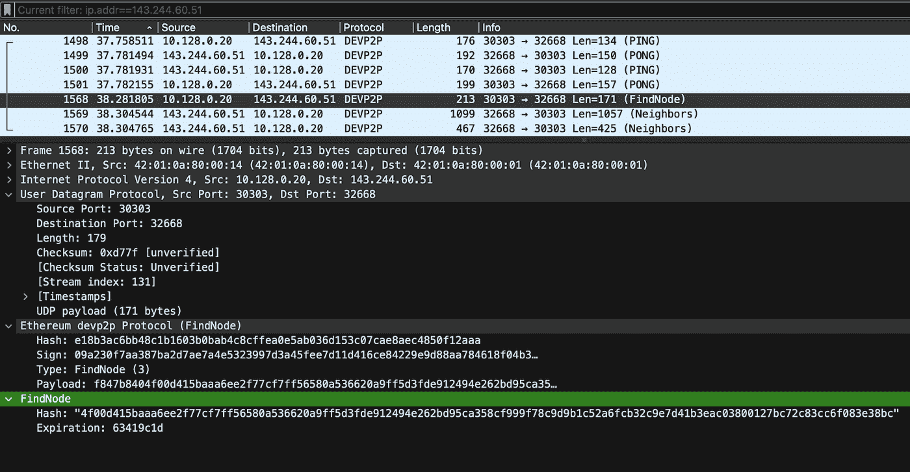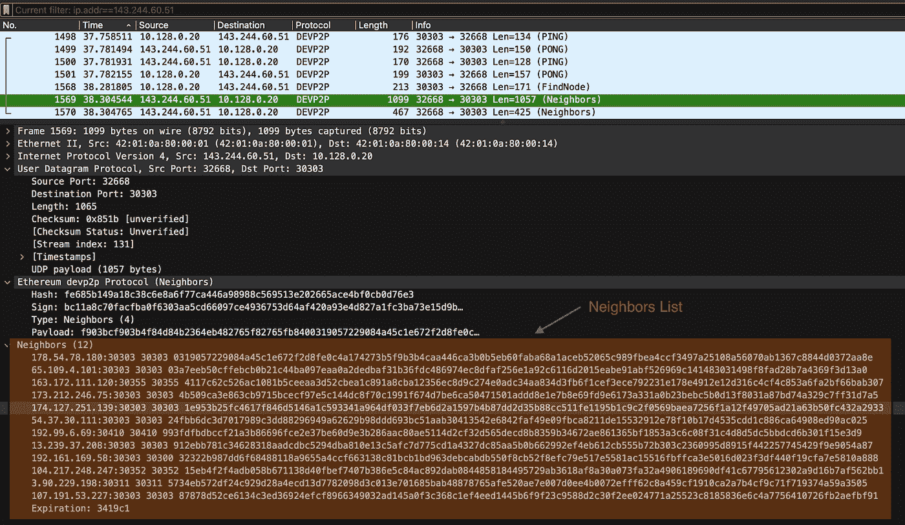

一旦绑定，我们的节点向 143.244.60.51 发送一个查找节点请求。143.244.60.51 返回的数据包括我们的节点可以进一步连接的对等体列表。数据被截断成两个 UDP 数据包。一个包含 14 个邻居，另一个包含 4 个。

现在，我们的节点开始与它们中的每一个进行乒乓交换。成功的乒乓将我们的节点与其邻居联系在一起，实现了消息交换。同样，这种情况会一直发生，直到达到 maxpeer*dial_ratio 限制。此外，如果这些邻居之一离线，对等插槽需要被填满。所以这个过程又重复了一遍。

然后，客户端开始通过端口 30303 启动与相应节点的 TCP 连接，并交换状态信息。关于这一点和节点寻址方案的更多信息将在以后的文章中讨论。

现在回到探索号上来，有一些未解的问题

*   为什么 geth 试图通过发送 FIND_NODE 和启动陈旧的 TCP 连接来连接节点，而它显然没有得到任何初始 ping 的响应。这不会让北/w 变得不必要的多嘴多舌吗？
*   UDP 数据包似乎超过 1000 字节。我知道有一个 1280 字节的最大数据包大小的固定限制，到目前为止，它在所有测试的网络中都工作正常。然而，互联网上的许多传统路由器仍然不能很好地处理较大的 UDP 数据包。通常，最安全的选项是 512 字节。然而，现代路由器可以处理更大的数据包。

最后，有趣的是，这还不是全部。Eth 客户端基于 [EIP-1459](https://eips.ethereum.org/EIPS/eip-1459) 执行另一个基于 DNS 的并行发现过程。这是一种备份发现机制，客户端可以利用这种机制，尤其是在限制性网络策略可能使基于 discv4 的节点失败并阻止节点加入 DHT 的情况下。更多关于这一点和以太坊节点寻址方案(ENR)在一个单独的职位。

> 交易新手？试试[密码交易机器人](/coinmonks/crypto-trading-bot-c2ffce8acb2a)或者[复制交易](/coinmonks/top-10-crypto-copy-trading-platforms-for-beginners-d0c37c7d698c)