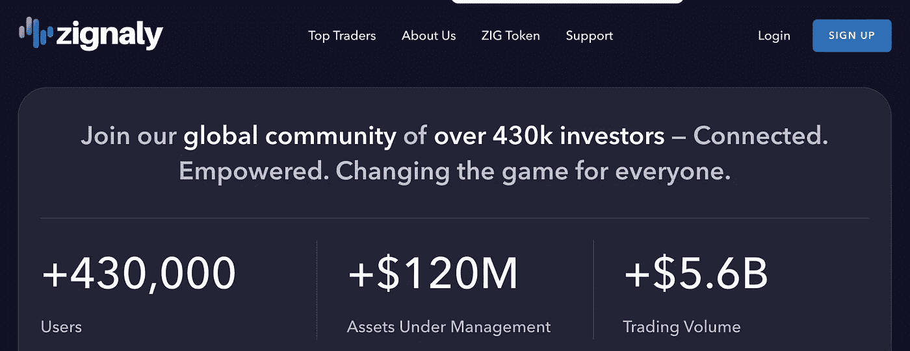

# 多元化——控股公司还是经理人？

> 原文：<https://medium.com/coinmonks/diversify-holdings-or-managers-2793d45f5a8d?source=collection_archive---------28----------------------->

Photo by [Chris Liverani](https://unsplash.com/@chrisliverani?utm_source=medium&utm_medium=referral) on [Unsplash](https://unsplash.com?utm_source=medium&utm_medium=referral)

多样化本质上对你的投资组合有好处，这一观点深深植根于金融理论，并得到了经验证据的支持。这里的多样化意味着持有足够多样化的资产组合——比如说股票。相关性越低，你的股票组合就越能经受住风暴。在宏观层面上，投资组合在资产类别之间寻找同样低的相关性，以实现一定程度的隔离。

随着人类复制他们所知道的东西，难怪这一想法从传统金融领域扩展到了密码领域。然而，以我的拙见，我不认为一个像加密这样新生的行业仅仅从控股的角度就能真正实现多元化。

以 FTX /阿拉米达崩盘为例，看看最近的市场下跌趋势，或者回到从 Terra-Luna 开始的蔓延趋势。整个市场都在流血&没有哪个子行业是因为与破产实体没有关联，或者对整个生态系统的运行非常重要而不受影响的。

浏览一下过去 5 年的价格数据&你会发现，当 BTC 美元上涨时，市场的其他部分也会上涨。当它下跌时，市场的其他部分也会跟着下跌。同样，以太坊和索拉纳作为两个拥有大部分生态系统的著名区块链，在危机时刻不会坚守阵地&这并不是说当$BTC 暴跌时，DeFi 协议会报告更高的 TVL，或者神谕对价格没有影响，因为嘿，每个人都使用它们&它们是如此重要！

# 你的观点？

这里的中心思想是，加密市场不是股票市场，仅仅从持股中寻找多样化的好处并不是一个有效的策略。原因是，至少在今天，$BTC 和 ALT 市场之间的相关性相当高，加上局外人的观点是所有这些硬币都是一样的。Crypto 被视为一个集体空间，而不是每个硬币/项目都根据其自身的价值和在生态系统中的作用来评判。

# 同意但是我能做什么？

那么，作为加密市场的投资者，你能做些什么来克服这一挑战呢？我认为，答案不仅在于分散投资，还在于分散经理人。我提出了支持这一解决方案的两个理由:

1.  在你的投资组合中保持一个健康的$BTC 对 ALT 的比率是必要的，因为我们看到 ALT 的市场收益高于$BTC 的收益。在金融术语中，这意味着由于强正相关导致潜在的比$BTC 更高的提款，低价竞标也有机会获得更高的回报。所以你不一定要错过这个机会。
2.  分散投资于不同的经理可以让你从每个经理可能有的不同策略中获得 alpha 值。如果你独自交易，你只会从你自己的技术水平和知识中受益，并暴露在你自己的行为和情绪基础下。另一方面，当在经理中分散你的投资组合时，你会受益于更多的技能和知识，以及多元化的行为和情感池。

# 我在哪里可以找到这些经理？

虽然有很多平台，但我个人推荐[zig analy](https://zignaly.com/)的唯一原因是他们有一个目标一致的解决方案。具体来说，不管交易表现/结果如何，大多数经理都会向你收取基本费用。[这意味着你最终会为那些实际上损失了你的钱的人买单。](/coinmonks/is-zignaly-fair-finance-for-all-2fb50bdae9b0)

另一方面，Zignaly 有一个利润分享机制。你的经理被称为服务提供商，他是一个专业的交易者，投入自己的资金，你实际上是在和他共同投资。如果他盈利了，他会向你收取成功费。如果他亏损，你不用支付任何费用，他的损失和作为共同投资者的你一样。

> 你对 Zignaly 的利润分成服务感兴趣吗？快来报名参加这个[环节](https://zignaly.com/app/signup/?invite=ahmedzig-)。最精彩的部分？没有最低金额限制！

我喜欢 Zignaly 的另一点是，他们有一个庞大的交易专家群体(150 多人),可以攻击不同的策略。例如，Green Lion Social Capital 交易币安 ETF，而 Trade for Impact 运营着 12 项服务，每项服务都专注于一种独立的主要货币。

> 你对 NFT 的 DeFi 拍卖感兴趣吗？如果是这样，请访问 [ZIGBids](http://www.zigbids.zignaly.com) 网站，连接您的 metamask 钱包&输入兑换代码“AHMEDZIGBIDS”以加载高达 10，000 美元的 ZIG。

# **结论**

加密市场确实是一个独一无二的市场，我相信这是一个千载难逢的机会。不要错过这个机会，把你传统的想法带到游戏中来。这里的关键是随机应变&当我们迟早克服当前的传染时，最好是做好准备，以便我们能够利用优势。

> 声明:帖子中的观点仅代表作者个人观点，不代表其雇主的观点，也不代表财务建议。在投资或使用帖子中提到的任何产品之前，请做好自己的研究。作者可能会也可能不会投资于任何特定的产品。

> 交易新手？试试[加密交易机器人](/coinmonks/crypto-trading-bot-c2ffce8acb2a)或者[复制交易](/coinmonks/top-10-crypto-copy-trading-platforms-for-beginners-d0c37c7d698c)