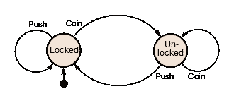
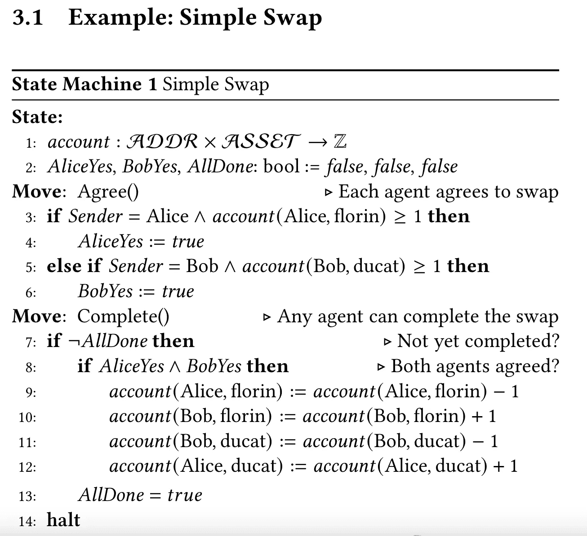

# DLT 互操作性和更多⛓️#8 ⛓️ —跨链状态机复制

> 原文：<https://medium.com/coinmonks/dlt-interoperability-and-more-%EF%B8%8F-8-%EF%B8%8F-cross-chain-state-machine-replication-16fd60446f37?source=collection_archive---------16----------------------->

在本系列中，我们分析了关于区块链和互操作性(以及两者)的论文。

这个版本包括一篇关于状态机复制的最近的论文。

Source: [https://upload.wikimedia.org/wikipedia/commons/thumb/9/9e/Turnstile_state_machine_colored.svg/330px-Turnstile_state_machine_colored.svg.png](https://upload.wikimedia.org/wikipedia/commons/thumb/9/9e/Turnstile_state_machine_colored.svg/330px-Turnstile_state_machine_colored.svg.png)

➡️ **标题**:跨链状态机复制
、**作者**:薛英杰、莫里斯·赫利希

➡️ **论文来源:** [跨链状态机复制](https://arxiv.org/pdf/2206.07042.pdf)

➡️ **背景:**

状态机复制(SMR)是分布式系统研究领域的基本课题之一。我们有一门免费的区块链课程，在第一节课中提供对 SMR 的概述。

型号:

“这个系统由一组通信自动机组成。自动机要么是主动的、不可信的代理，要么是被动的、可信的副本。一个代理自动机模拟一个区块链客户，如一个人或一个组织。代理是不可信的，因为它们模拟不可信的区块链客户端。一个复制自动机模拟一个智能契约(或合同)，一个处理分类帐状态的连锁驻留程序。契约代码和状态是公开的，代码由验证者可靠地执行，验证者在每个调用上都达成一致。副本是可信的，因为它们对可信契约进行建模。反映了当今区块链的局限性，代理只与副本通信(客户端只能调用契约函数)，副本不与其他副本通信(不同链上的契约不能通信)。只有当某个代理明确通知𝐴𝐵's 的新状态时，复制品𝐴才能在复制品𝐵处获知状态变化。当然，𝐴必须确定那个特工说的是不是真话。"

在本文中，跨链掉期等应用被构造为多步协议，代理人轮流将资产转入和转出托管账户。因此，在本文中，状态机被构造为一个多代理博弈。

➡️ **投稿:**

*   作者提出了一种新的跨链状态的状态机复制协议。作者的动机是:“传统的 SMR 采用分布来使服务容错。相比之下，单个区块链已经具有容错能力。相反，跨链 SMR 是由跨多个独立链的互操作性需求驱动的。”

💪**优点:**

*   SMR 的背景及其对跨链场景的适用性是优雅的。

😞**限制:**

*   该系统考虑同步网络，其中通信由δ参数来限制。然而，对于不同时钟以不同速率运行的多个分布式系统来说，这是否是最好的模型还不清楚。全球时钟的概念，一个“时钟中的时钟”，作为跨区块链州同步的单位，在这种情况下有意义吗？

🔥**兴趣点:**

*   使用来自不同研究领域的项目来形式化所提出的概念。跨链场景作为游戏引入，用决策树表示。使用过程伪代码来表示执行每个状态机的规范。互换的一个例子:

本文还包含一个 DAO 状态机的示例。

🚀**它与我们在里斯本电信、INESC-ID 和 Blockdaemon 的工作有什么关系？(观点是我自己的，不一定反映我雇主的意见)**

*   实现安全、可扩展的互操作性是我们 Blockdaemon 工作的重要组成部分。研究执行原子交换的更便宜的方法对于支持不断增长的区块链生态系统是有意义的，该生态系统将互操作性作为一个重要因素。

🚀**这对我们的工作有什么启示？**

*   当我们定义相关的概念时，这项工作把我们自己的工作放在一个角度。
*   所有现存的[专用互用性解决方案都证明了需要一个具有清晰结构的构造，能够说明通用互用性，并且很难进行比较](https://www.techrxiv.org/articles/preprint/Do_You_Need_a_Distributed_Ledger_Technology_Interoperability_Solution_/18786527/1)。

> 交易新手？尝试[加密交易机器人](/coinmonks/crypto-trading-bot-c2ffce8acb2a)或[复制交易](/coinmonks/top-10-crypto-copy-trading-platforms-for-beginners-d0c37c7d698c)